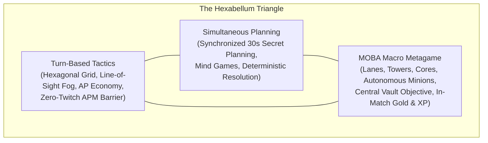
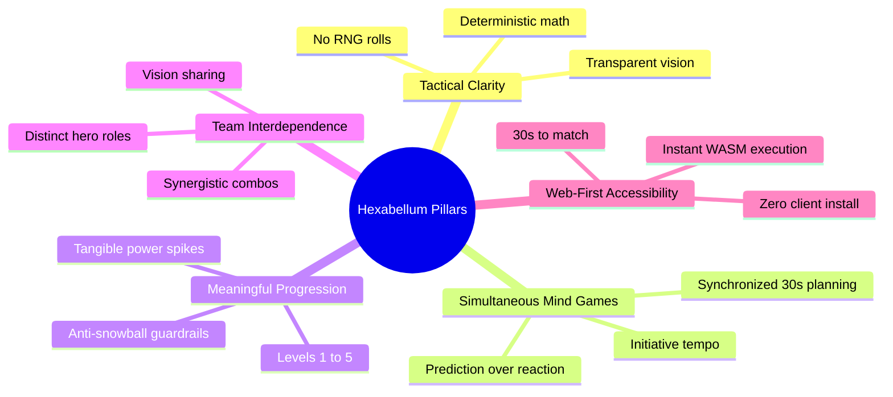
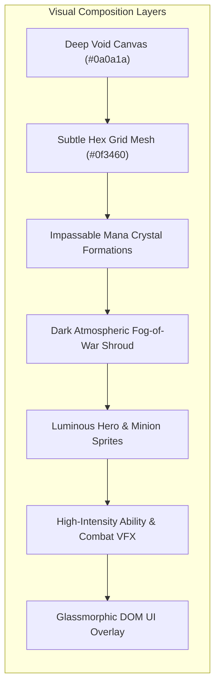
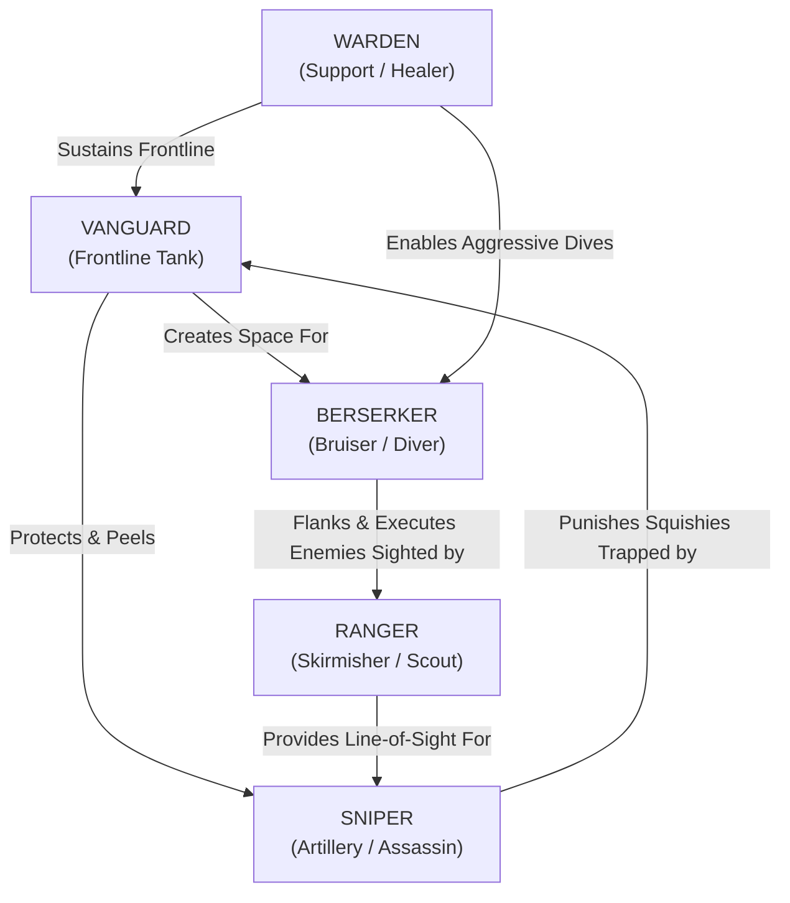
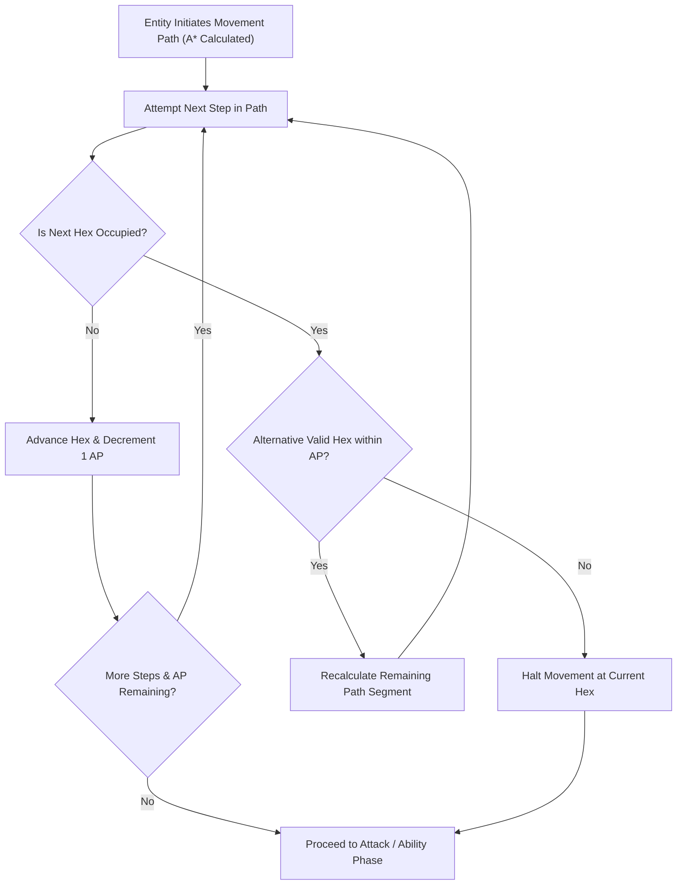
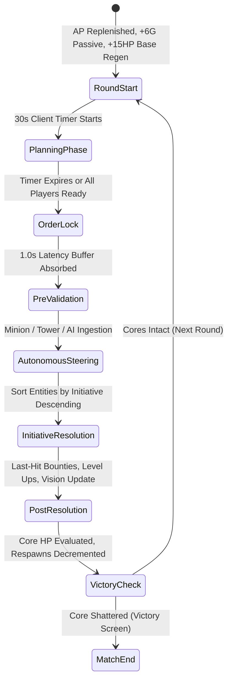
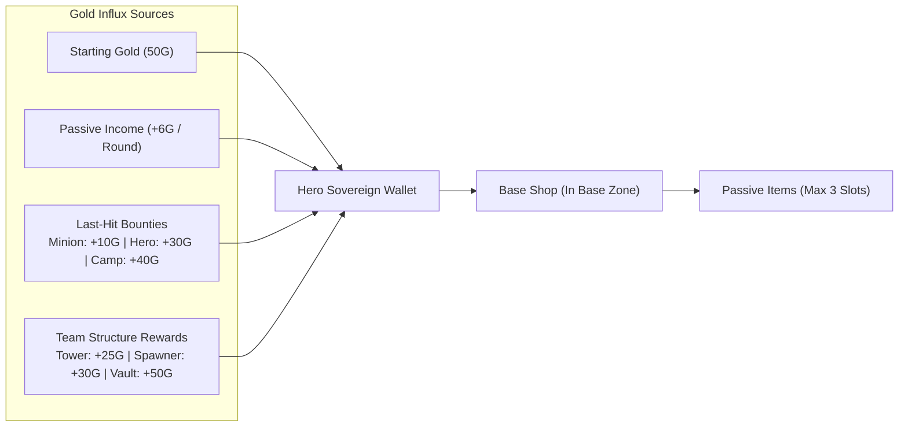
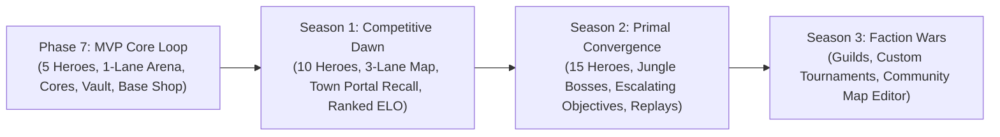

# HEXABELLUM

## Game Design Document — Master Gameplay, Identity & Systems Specification

---

## Document Version
`GDD v2.0 — Fully Aligned with Architecture v2.0, Phase 7 MOBA Macro Specification, UX v1.0, and DevOps v1.0`

---

## 1. Executive Summary & Game Overview

### 1.1 High Concept & Identity
**HEXABELLUM** is a **turn-based tactical MOBA** played on contested hexagonal arenas. Two teams of five heroes clash in simultaneous planning rounds, commanding movement, basic attacks, spells, itemization, and macro positioning before an authoritative simulation engine resolves each round deterministically. The ultimate objective is to breach the enemy defenses, contest neutral objectives, and shatter the enemy sovereign **Core**.

> *"Six sides of war. One victor."*



### 1.2 Elevator Pitch
Hexabellum removes the physical APM barrier from competitive MOBAs while preserving their macro depth, character diversity, and thrilling team-fight coordination. By transposing 5v5 MOBA warfare onto a discrete hexagonal grid resolved in simultaneous 30-second secret turns, Hexabellum transforms mechanical twitch competition into a high-stakes psychological chess match. Every round is a duel of prediction, resource calculation, and spatial dominance.

### 1.3 Genre & Platform
- **Genre**: Turn-Based Strategy (TBS) / Multiplayer Online Battle Arena (MOBA) / Tactical PvP
- **Target Platform**: Modern Web Browsers (Chrome, Firefox, Safari, Edge) via WebAssembly (WASM) and PixiJS WebGL
- **Multiplayer Architecture**: Authoritative Rust server (`hexabellum-server`) with WebSocket protocol and Tokio actor concurrency
- **Single-Player Support**: Fully supported via client-side WebAssembly execution with deterministic heuristic AI bot opponents

### 1.4 Target Audience & Market Positioning
1. **Tactical Strategy Enthusiasts** (*Into the Breach*, *Final Fantasy Tactics*, *Fire Emblem*, *Civilization*): Players seeking rich spatial and positional decision-making without real-time action pressure.
2. **Ex-MOBA & Strategy Veterans** (*League of Legends*, *Dota 2*): Players who love MOBA hero synergies, laning, itemization, and objective control, but no longer desire or possess the 300+ APM mechanical reflexes needed to compete in real-time MOBAs.
3. **Competitive Board Game Players** (*Gloomhaven*, *Mage Knight*, *Chess*): Players who relish simultaneous blind commitment, reading opponent psychology, and punishing positional overextension.
4. **Session Length Target**: 15–25 minutes (15–25 discrete rounds). Fast enough for a lunch break; deep enough for competitive ranked tournaments.

### 1.5 The Core Player Fantasy
> *"I am not an acrobat with a keyboard; I am a battlefield general. I win because I anticipated your flanking path, starved your vision, baited your burst ability, and collapsed on your Core three steps before you realized you were doomed."*

---

## 2. Core Design Pillars & Game Philosophy

Every mechanic, stat balance, and system in Hexabellum serves five inviolable design pillars:



### Pillar 1: Tactical Clarity
- **Zero Hidden Randomness**: Damage, range, vision, and movement costs are pure deterministic integer math. There are no critical strike rolls, evasion percentages, or accuracy dice.
- **Why It Matters**: When a player loses a hero or a match, they must clearly understand *why* they lost. The failure was a tactical mistake in judgment or prediction, never a bad dice roll.
- **In Practice**: All calculations are visible in hover tooltips and combat previews prior to locking in orders.

### Pillar 2: Simultaneous Mind Games
- **Predictive Depth**: Both teams formulate and submit their orders in secret during a synchronized 30-second window. Tension does not stem from clicking faster than the enemy, but from correctly predicting enemy movement paths, ability targets, and objective rotations.
- **The Psychological Duel**: Do you target the hex the enemy hero occupies right now, or the hex they are likely to retreat to? Do you spend AP advancing toward their tower, or turtle behind your Vanguard anticipating an enemy burst?

### Pillar 3: Meaningful Progression
- **Pacing with Impact**: Gold, experience, leveling (1–5), and passive item purchases create tangible power spikes that reshape tactical options. A Level 3 Ranger with a Longblade commands far greater zone threat than a Level 1 rookie.
- **Anti-Snowballing**: Progression accelerates match conclusion without creating insurmountable stat deficits. Trailing teams leverage defensive base regeneration, structure bounties, and central objective steals to orchestrate decisive comebacks.

### Pillar 4: Team Interdependence
- **No Solo Carry**: Hexabellum is strictly balanced around 5v5 team synergy. A Vanguard cannot kill enemies without backline damage; a Sniper is instantly overwhelmed without frontline peel; a Berserker cannot dive without Warden sustain.
- **Shared Vision & Macro Coordination**: Vision is unified across all living allied heroes, structures, and minions. Scouting enemy rotations via line-of-sight raycasting is as vital as dealing damage.

### Pillar 5: Web-First Accessibility
- **Zero Friction**: The game runs instantly inside any modern web browser tab. No multi-gigabyte downloads, third-party launchers, or hardware gating. A player can join a match within 30 seconds of opening a URL.

---

## 3. World, Lore & Narrative Universe

### 3.1 Cosmological Origin: The Convergence
At the seam where six elemental dimensions intersect lies **The Convergence** — a realm where physical space crystallizes into geometric hexagonal matrices. In this realm, the raw ether of existence is channeled along rigid hexagonal ley-lines. Unchecked, the convergence of these primal energies would rupture reality.

To maintain equilibrium, the ancient architects constructed the **Bellum Sextum** (The Six-Sided Conflict) — a sacred, ritualized tactical trial in which rival sovereign factions channel champions to dispute dominion over the ley-lines.

```
       [Force]              [Clarity]
           \                  /
            \                /
  [Decay] ─── THE CONVERGENCE ─── [Radiance]
            /                \
           /                  \
      [Shadow]             [Catalyst]
```

### 3.2 The Six Primal Forces
1. **Force**: The kinetic fury of impact and destruction. Manifested in martial strength, heavy armor, and close-quarters shock combat.
2. **Clarity**: The geometric perfection of light and mathematics. Manifested in long-range precision, projectile physics, and calculated suppression.
3. **Radiance**: The restoring grace of pure life ether. Manifested in mending fields, structural reconstitution, and team sustain.
4. **Decay**: The inexorable erosion of stone and bone. Manifested in siege attrition, shattered barriers, and the inevitable fall of fortifications.
5. **Shadow**: The veiled veil of obscured sight. Manifested in fog-of-war manipulation, line-of-sight deception, and sudden ambush.
6. **Catalyst**: The spark of sudden metamorphosis. Manifested in volatile berserk rages, sudden power spikes, and explosive turnarounds.

### 3.3 The Rival Factions
In the current era of the Bellum Sextum, two primary philosophical orders contest the Convergence:

#### Team Azure (Order & Geometry)
- **Faction Ethos**: The Archons of the Azure Array believe reality is a mathematical equation to be balanced. Their strategies emphasize disciplined battle lines, defensive perimeters, and systematic territorial control.
- **Visual Motif**: Crystalline cyan, polished silver armor, geometric runes, and cold, radiant blue light.
- **Sovereign Base**: Positioned at the western pole of the Meridian `(-7, 0)`, defended by deep-sapphire resonating towers.

#### Team Crimson (Ferocity & Momentum)
- **Faction Ethos**: The Scions of the Crimson Crucible believe the Convergence must be purged of stagnation through kinetic upheaval and unrelenting pressure. They value bold initiative, explosive skirmishing, and aggressive flanking.
- **Visual Motif**: Volcanic obsidian, ember orange, jagged runic edges, and smoldering red energy arcs.
- **Sovereign Base**: Positioned at the eastern pole of the Meridian `(7, 0)`, defended by smoldering ruby obelisks.

### 3.4 The Battlefield: The Fractured Meridian
The canonical 5v5 battle arena is **The Fractured Meridian**, a consecrated expanse of radius $R = 8$ (217 total hexagonal tiles). 

- **The Sovereign Sanctuaries**: At opposing ends lie the sovereign team base zones, each anchored by a towering, pulsing **Core** — the crystalline anchor that tethers the faction to physical existence.
- **The Lane Corridor**: A paved central highway where autonomous clockwork constructs (minions) march toward the opposing fortifications.
- **The Jungle Pockets**: Shadowed side alcoves flanked by impassable mana crystal formations, home to ancient dormant Guardian Sentinels.
- **The Ancient Vault**: An enigmatic hexagonal vault resting at the exact center of the arena `(0, 0)`, sealing away primal combat ether that both factions desperately seek to unlock.

---

## 4. Visual, Audio & Sensory Identity (Art Bible)

### 4.1 Art Direction & Aesthetic Style
Hexabellum utilizes a **stylized, high-contrast, cyberpunk-crystalline 2D aesthetic** viewed from a top-down isometric perspective. 

- **Visual Contrast**: Deep dark-space navy voids (`#0a0a1a`) ensure that unit silhouettes, range rings, and glowing neon ability effects pop with luminous intensity.
- **Clarity Above All**: The visual presentation takes inspiration from *Into the Breach* and *Tron: Legacy*. The hex grid lines are crisp yet unobtrusive. Every unit's orientation, life state, and team alignment is readable at a single glance even at maximum zoom-out.



### 4.2 Semantic Color Palette & Design Tokens

| Semantic Token | Color Name | Hex Code | Purpose & Application |
|---|---|---|---|
| `canvas-bg` | Deep Space Navy | `#0a0a1a` | Master battlefield background |
| `hex-border` | Subtle Cyan-Navy | `#0f3460` | Passive hex grid borders (30% alpha) |
| `hex-walkable` | Dark Slate | `#16213e` | Valid walkable terrain fill |
| `obstacle-fill` | Mana Obsidian | `#2d2d44` | Impassable terrain and vision-blocking walls |
| `team-azure` | Luminous Cyan | `#4fc3f7` | Team 0 heroes, minions, towers, Core glow |
| `team-crimson` | Ember Crimson | `#ef5350` | Team 1 heroes, minions, towers, Core glow |
| `objective-gold` | Resonant Amber | `#ffc107` | Neutral Vault, Guardian camps, gold counters |
| `range-move` | Emerald Glow | `#00e676` | Valid movement destination hexes and paths |
| `range-attack` | Hostile Scarlet | `#ff1744` | Valid basic attack target outlines and range rings |
| `range-spell` | Arcane Violet | `#d500f9` | Ability targeting reticles and splash radii |
| `fog-unexplored`| Stygian Black | `#05050b` | Completely unexplored hex shroud (100% opacity) |
| `fog-memory` | Desaturated Slate| `#0a0f1d` | Explored memory fog (60% darkness desaturation) |
| `hp-healthy` | Vibrant Green | `#4caf50` | Unit health $> 50\%$ |
| `hp-critical` | Blazing Amber | `#ff9800` | Unit health $\le 50\%$ |
| `ap-energy` | Sunlight Yellow | `#ffeb3b` | AP pips, energy bars, and level-up bursts |

### 4.3 Unit Visual Language & Silhouettes

```
     HERO               MINION               TOWER               CORE
   ╭──────╮              ▲                  ┌──────┐             ▲
  │  (★)  │             ╱ ╲                 │ [::] │            ╱ ╲
   ╰──────╯            ─────                └──────┘           ◄   ►
Large Circle +       Compact Triangle    Heavy Square +        Large Glowing
Team Ring + Class     + Team Color        Turret Barrel        Runic Crystal
```

- **Heroes**: Distinct 48px circular avatars bordered by a bold team-colored ring, equipped with unique inner class glyphs and overhead segmented HP/Energy bars.
- **Minions**: Compact 24px triangular mechanical constructs pulsing with team energy.
- **Towers / Sentinels**: Monumental 64px square fortifications featuring rotating turret barrels that actively track nearby enemy units.
- **Sovereign Cores**: Massive 96px multi-faceted floating crystals that pulse rhythmically, cracking and shedding glowing shards as their HP declines.
- **The Ancient Vault**: An ornate, runic stone vault situated at the exact origin `(0, 0)`, bound by glowing amber chains that shatter when destroyed.

### 4.4 Visual Effects Choreography (VFX)
- **Movement Trajectory**: While planning, a glowing dashed spline connects the hero to the target hex. During resolution, the unit glides smoothly along the path with a fading motion blur trail.
- **Melee Strikes**: A swift, crisp crescent slash in team color accompanied by camera micro-shake.
- **Ranged Projectiles**: High-velocity tracer beams (Ranger's azure bolt, Sniper's incandescent railgun streak) that arc or snap from origin to target.
- **Floating Combat Text**: Animated numerical combat indicators:
  - Damage dealt: Red text floating upward and fading (`-18`, `-30`).
  - Health restored: Emerald green text with a cross icon (`+20 HP`).
  - Gold earned: Radiant golden text with coin glyph (`+10G`, `+30G`, `+50G`).
  - Level-Up: Ascending golden light column with an expanding radial shockwave (`LEVEL UP!`).
- **Core Shatter**: Upon reaching 0 HP, time briefly dilates, the screen shakes violently, the Core crystal detonates into dozens of spinning crystalline shards, and a dramatic Victory/Defeat banner drops.

### 4.5 Audio Direction & Soundscape
The audio landscape combines **cinematic electronic tension with heavy orchestral weight**:

- **Dynamic Soundtrack**:
  - *Lobby & Hero Select*: Ambient synth pads, low sub-bass hum, rising anticipation.
  - *Planning Phase (Early Rounds)*: Measured, rhythmic electronic pulses; ticking mechanical metronome in the final 5 seconds.
  - *Resolution Phase*: Dramatic brass swell and explosive percussion that hits on the first combat impact.
  - *Late-Game Base Siege*: High-tempo string ostinatos, urgent synth arpeggios, and resonating choir.
- **Audio Feedback Priority (Game-Critical Cues)**:
  - Every player action has distinct acoustic feedback: selecting a hex emits a crisp glass click; locking orders triggers a heavy metallic latch; low-timer warning emits urgent spatial pings.
  - Off-screen audio filtering: Allied combat sounds outside the player's immediate camera view are spatialized and filtered, ensuring situational awareness without audio mud.

---

## 5. Complete Hero Roster & Archetype Design

Hexabellum launches with 5 meticulously balanced champion archetypes. Each champion fulfills a vital strategic role within a 5v5 team draft:



---

### 5.1 VANGUARD — The Unbreakable Wall

> *"Stand behind me. The line holds here."*

```
     ROLE: Frontline Tank / Area Denial / Peeler
  BASE HP: 140 (Highest in game)
  BASE AP: 3
INITIATIVE: 3 (Average)
ATK DAMAGE: 18 (Melee, Range 1)
   VISION: 3 hexes
   ENERGY: 5 Base (+1 Regen per round)
```

#### Visual & Thematic Identity
A towering armored monolith clad in reinforced hexagonal bastion plate. Vanguard carries an energy tower shield that anchors into the ground when braced. Vanguard moves with deliberate, thunderous momentum.

#### Signature Ability: CLEAVE
- **AP Cost**: 1 AP
- **Energy Cost**: 3 Energy
- **Cooldown**: 3 Rounds
- **Targeting**: Immediate Area of Effect (AOE)
- **Effect**: Swings a massive energized polearm in a 360-degree sweep, dealing **15 damage** to **all adjacent enemy units and structures** (Range 1 radius).
- **Tactical Utility**: Cleave makes Vanguard a nightmare for enemy minion waves and clustered melee divers. In tight chokepoints or tower dives, a single Cleave can hit 3–4 targets simultaneously.

#### Gameplay Strategy & Positioning
- **The Anchor**: Vanguard positions at the apex of team formations, absorbing enemy ranged harassment and controlling chokepoints.
- **Body Blocking**: Vanguard's physical tile occupancy blocks enemy melee champions from reaching squishy backliners (Sniper, Ranger).
- **Core Synergies**: Warden's `Mend` turns Vanguard into a near-immortal damage sponge. Plate Armor item enhances this synergy exponentially.
- **Weaknesses**: Vulnerable to long-range kiting from Sniper and Ranger; slow mobility prevents rapid cross-map rotations.

---

### 5.2 RANGER — The Watchful Eye

> *"I see them through the mist. Aim true, strike clean."*

```
     ROLE: Skirmisher / Scout / Line-of-Sight Controller
  BASE HP: 90
  BASE AP: 3
INITIATIVE: 4 (Fast)
ATK DAMAGE: 16 (Ranged, Range 2)
   VISION: 4 hexes (High)
   ENERGY: 5 Base (+1 Regen per round)
```

#### Visual & Thematic Identity
An agile, cloaked scout carrying an advanced recurve energy bow. Ranger wears a specialized ocular visor that glints with team color, projecting subtle scan-lines across the terrain.

#### Signature Ability: BOLT
- **AP Cost**: 1 AP
- **Energy Cost**: 2 Energy
- **Cooldown**: 2 Rounds
- **Targeting**: Single Target, Range 3 (Requires Line of Sight)
- **Effect**: Releases a hyper-concentrated photon beam that deals **25 damage** to a single enemy unit or structure.
- **Tactical Utility**: Low cooldown and high single-target burst allow Ranger to execute low-health targets attempting to retreat into the fog.

#### Gameplay Strategy & Positioning
- **Information Advantage**: With a native vision radius of 4 hexes, Ranger dispels the fog of war for the entire team, revealing enemy ambushes and scouting jungle camps.
- **Kiting & Harassment**: Range 2 basic attacks and Range 3 Bolt enable Ranger to safely whittle down enemy tanks without entering melee retaliatory range.
- **Core Synergies**: Ranger's vision directly enables Sniper to fire `Longshot` at maximum range into previously obscured territory. Scout Lens item expands Ranger's vision to an unmatched 5 hexes.
- **Weaknesses**: Fragile health pool (90 HP); can be instantly deleted if ambushed by Berserker in melee range.

---

### 5.3 WARDEN — The Mending Light

> *"No soul is forsaken while the crystal endures."*

```
     ROLE: Combat Support / Healer / Base Defense Anchor
  BASE HP: 100
  BASE AP: 3
INITIATIVE: 2 (Slow)
ATK DAMAGE: 12 (Melee, Range 1)
   VISION: 4 hexes
   ENERGY: 6 Base (+1 Regen per round)
```

#### Visual & Thematic Identity
An ethereal sage garbed in flowing tactical robes inscribed with runic circuitry. Warden hovers inches above the ground, wielding a floating focus crystal that emanates soothing emerald light.

#### Signature Ability: MEND
- **AP Cost**: 1 AP
- **Energy Cost**: 2 Energy
- **Cooldown**: 2 Rounds
- **Targeting**: Allied Hero, Range 2 (Requires Line of Sight)
- **Effect**: Channels restorative ley-line energy into an allied champion, restoring **20 HP** (cannot exceed target's `max_hp`).
- **Tactical Utility**: In a game where damage is permanent until returning to base, Mend provides invaluable sustain during prolonged lane sieges.

#### Gameplay Strategy & Positioning
- **The Lifeblood**: Warden must stay tethered to the frontline without exposing themselves to enemy artillery. Losing Warden early in a round eliminates the team's recovery engine.
- **Structure Maintenance**: With 3 AP, Warden can reposition, cast `Mend` on an ally, and utilize remaining AP to execute the `Repair` action on an allied tower.
- **Core Synergies**: Pairs exquisitely with Vanguard (creating an unkillable frontline wall) and Berserker (topping off health after aggressive dives). Focus Charm item ensures continuous ability casts.
- **Weaknesses**: Lowest base damage in the game (12 DMG); low initiative (2) means Warden heals *after* most enemies have already attacked during a round.

---

### 5.4 SNIPER — The Distant Thunder

> *"Trajectory calculated. Windage zero. Goodbye."*

```
     ROLE: Long-Range Artillery / Area Denial / Pick Assassin
  BASE HP: 80 (Lowest in game)
  BASE AP: 3
INITIATIVE: 4 (Fast)
ATK DAMAGE: 14 (Ranged, Range 3)
   VISION: 5 hexes (Maximum natural vision)
   ENERGY: 5 Base (+1 Regen per round)
```

#### Visual & Thematic Identity
A slender, calculating marksman equipped with an anti-material rail rifle nearly as long as their body. Sniper kneels to brace for shots, deploying stabilizing magnetic bipods.

#### Signature Ability: LONGSHOT
- **AP Cost**: 1 AP
- **Energy Cost**: 3 Energy
- **Cooldown**: 3 Rounds
- **Targeting**: Single Target, Range 4, **Minimum Range 2** (Requires Line of Sight)
- **Effect**: Fires a devastating hyper-velocity kinetic penetrator that inflicts **30 damage** to a distant enemy unit or structure.
- **Tactical Constraint**: Cannot target adjacent tiles (Range 1 blind spot).
- **Tactical Utility**: Longshot is the single highest burst ability in Hexabellum. It allows Sniper to eliminate squishy targets from complete safety or execute a wounded enemy fleeing toward their base.

#### Gameplay Strategy & Positioning
- **The Backline Threat**: Sniper dictates enemy movement. Enemies cannot enter Sniper's 4-hex engagement cone without risking half their health bar.
- **Minimum Range Vulnerability**: If an enemy reaches adjacent melee range, Sniper cannot use Longshot and deals minimal basic attack damage. Sniper relies completely on Vanguard to peel.
- **Core Synergies**: Longblade item increases basic attack damage to 20; paired with Ranger scouting, Sniper can assassinate enemies from beyond their sightline.
- **Weaknesses**: Lowest HP pool (80 HP); a single Berserker combo or coordinated flank will eliminate Sniper in one round.

---

### 5.5 BERSERKER — The Unchained Fury

> *"Break their line! Spill their ether! Leave nothing standing!"*

```
     ROLE: Melee Bruiser / Diver / High-Tempo Assassin
  BASE HP: 120
  BASE AP: 3
INITIATIVE: 3 (Average)
ATK DAMAGE: 20 (Highest base melee damage, Range 1)
   VISION: 3 hexes
   ENERGY: 5 Base (+1 Regen per round)
```

#### Visual & Thematic Identity
A fierce, battle-scarred warrior armed with twin jagged cleavers that ignite with incandescent amber flames during battle. Berserker moves with explosive, predatory lunges.

#### Signature Ability: FURY
- **AP Cost**: 1 AP
- **Energy Cost**: 2 Energy
- **Cooldown**: 3 Rounds
- **Targeting**: Self-Buff
- **Effect**: Unleashes raw internal fury, applying a status effect granting **+8 Attack Damage** for **2 rounds**.
- **Tactical Utility**: With Fury active, Berserker's basic attack inflicts a monstrous **28 damage** per swing (34 damage if holding a Longblade).

#### Gameplay Strategy & Positioning
- **Flank and Destroy**: Berserker utilizes side jungle pockets and vision-blocking walls to approach enemy backlines undetected before pouncing on Sniper or Warden.
- **High-Risk Tower Diver**: High base HP (120) permits Berserker to tank tower retaliations during coordinated base breaches.
- **Core Synergies**: Warden's healing allows Berserker to sustain through aggressive trades; Plate Armor makes Berserker an unstoppable juggernaut.
- **Weaknesses**: Range 1 lock means Berserker must spend AP closing distances; susceptible to kiting if enemies predict movement and retreat.

---

### 5.6 Hero Matchup & Synergy Matrix

| Champion | Strong Against | Vulnerable To | Primary Synergistic Partner | Optimal First Item |
|---|---|---|---|---|
| **Vanguard** | Clustered Minions, Berserker | Sniper (Kiting), Ranger | **Warden** (Infinite sustain loop) | `Plate Armor` |
| **Ranger** | Low-HP Skirmishers, Vanguard | Berserker (Ambush), Longshot | **Sniper** (Provides vision for kills) | `Longblade` or `Scout Lens` |
| **Warden** | Attrition comps, Poke damage | Burst Assassination, Sniper | **Vanguard** (Safe healing target) | `Focus Charm` |
| **Sniper** | Static defenses, Low-HP backline | Melee Divers, Berserker | **Ranger** (Vision spotter) | `Longblade` |
| **Berserker** | Isolated backliners, Squishies | Vanguard (Peel/Cleave), Kiting | **Warden** (Post-dive recovery) | `Longblade` or `Plate Armor` |

---

## 6. Tactical Hex Grid & Spatial Rules

### 6.1 Pointy-Topped Hexagonal Mathematics
The Hexabellum battlefield uses a **pointy-topped hexagonal coordinate system**. Space is tracked using both **Axial Coordinates `(q, r)`** for memory efficiency and **Cube Coordinates `(x, y, z)`** for spatial transformations:

$$\text{Cube Coordinate Invariant: } x + y + z = 0, \quad \text{where } x = q, \quad z = r, \quad y = -q - r$$

```
               ( 0,-1)         (+1,-1)
                 Northwest      Northeast
                     \            /
                      \          /
       (-1, 0) West ─── ( 0, 0) ─── (+1, 0) East
                      /          \
                     /            \
                 Southwest      Southeast
               (-1,+1)         ( 0,+1)
```

#### Hexagonal Distance Formula
Distance between any two coordinates $A$ and $B$ is calculated using the integer Manhattan cube metric:
$$\text{Distance}(A, B) = \frac{|A.x - B.x| + |A.y - B.y| + |A.z - B.z|}{2}$$

### 6.2 Movement Rules & The 3 AP Budget
- Every living hero receives exactly **3 Action Points (AP)** at the beginning of each round.
- Traversing a single adjacent hex consumes **1 AP**.
- A hero may move up to 3 hexes in a single round if no other actions are taken.
- **Tile Occupancy Rule**: Living entities (both friendly and hostile) permanently block hex traversal. Units cannot move through or end movement on an occupied tile.
- **Base Gate Barrier**: Allied base zones reject traversal by opposing team heroes and minions. Enemy units cannot step inside an opposing base zone while its Core stands.

#### Dynamic Path Re-Calculation
Because movement resolves sequentially by initiative order, a path planned during the 30-second window may become obstructed if an earlier unit moved into the trajectory. The simulation engine dynamically re-paths the remaining steps; if no valid alternative path exists within remaining AP, movement halts early at the last valid hex without penalty.



### 6.3 Line-of-Sight Raycasting & Fog of War
Hexabellum enforces strict **information asymmetry**. Players only perceive what their team's combined line of sight illuminates:

#### Raycast Formula
To determine line-of-sight between observer $A$ and target $B$, the engine performs discrete cube linear interpolation across all intermediate points:
$$P(t) = \text{cube\_round}\Big(A \cdot (1 - t) + B \cdot t\Big), \quad \text{for } t \in \left[\frac{1}{2N}, \frac{2N-1}{2N}\right]$$
If any intermediate hex contains an impassable obstacle (crystallized mana rock) or an enemy structure, the ray is occluded and line-of-sight fails.

#### The 3 Visibility States
1. **Actively Visible (Lit)**: Illuminated by an allied unit, tower, minion, or Core. Units and health bars render in full fidelity.
2. **Explored Memory (Greyed Shroud)**: Terrain and static structures remain visible at their last-known state. Dynamic entities (heroes, minions) are completely masked.
3. **Unexplored (Stygian Black)**: Pitch-black void. Terrain, structures, and units are completely hidden.

---

## 7. Simultaneous Turn Lifecycle & 8-Stage Resolution Engine

### 7.1 The Player Turn Experience: 30-Second Planning Window
1. **Synchronized Countdown**: Every round begins with a 30-second timer shared across all 10 players.
2. **Secret Drafting**: Players command their individual assigned hero:
   - Left-click destination hex to assign movement path (AP cost previewed).
   - Right-click enemy unit to assign basic attack or select signature ability button `[Q]` and click target.
   - If positioned in Base Zone, press `[B]` to open Base Shop and purchase passive items (0 AP cost).
3. **Fluid Modification**: Orders can be modified, re-routed, or cleared at any point until the timer expires or all players click "READY".
4. **Latency Grace Period**: When the timer reaches 0, a 1.0-second network buffer absorbs inflight client packets before the server locks state.



---

### 7.2 The 8-Stage Resolution Pipeline

| Stage | Name | Timing & Game Design Functionality |
|---|---|---|
| **1** | **RoundStart** | - AP replenished to 3 for all living heroes.<br/>- Cooldowns decremented by 1.<br/>- Passive gold income (+6G) awarded to all living heroes.<br/>- Base regeneration (+15 HP) applied to living heroes inside their allied Base Zone.<br/>- Minion wave spawn counter evaluated (spawns 2 minions per active spawner every 2 rounds).<br/>- Sanitized snapshot broadcast to all clients. |
| **2** | **PlanningPhase** | - 30-second secret draft window.<br/>- Players select move paths, attacks, abilities, and execute Base Shop purchases.<br/>- Disconnected players run background AI fallback. |
| **3** | **OrderLock & Grace** | - Server locks client order submissions.<br/>- 1.0-second network grace period absorbs late packets.<br/>- Any hero lacking orders assigned to `TimeoutFallbackAI`. |
| **4** | **Pre-Validation** | - Validates AP budgets ($\text{MoveCost} + \text{ActionCost} \le 3$).<br/>- Checks range, energy sufficiency, cooldown readiness, and line of sight from planned destination.<br/>- Validates Base Shop constraints (alive, inside base zone, funds). |
| **5** | **Autonomous Steering** | - Minions compute A* pathing along corridor waypoints toward opposing Core.<br/>- Towers acquire highest priority targets (Minion $\to$ Hero $\to$ Other).<br/>- Neutral Guardians evaluate leash boundaries and aggro.<br/>- Bot backfill heroes plan purchases and actions. |
| **6** | **Initiative Resolution** | - All entities sorted by **Initiative descending** (ties broken deterministically by seeded PRNG, then stable `UnitId`).<br/>- Each entity executes sequentially: movement first, followed by combat action.<br/>- **Death-Before-Acting Invariant**: If a unit reaches 0 HP before its turn in initiative order, all pending orders are canceled. |
| **7** | **Post-Resolution** | - Fatal blow last-attacker processed.<br/>- Kill rewards awarded: Minion (+10G/+10XP), Hero (+30G/+30XP), Guardian (+40G/+25XP).<br/>- Global structure destruction payouts applied to living teammates.<br/>- Level-up thresholds evaluated; stat boosts applied immediately.<br/>- Line of sight maps updated across all teams. |
| **8** | **Macro & Victory** | - Dead heroes decrement respawn countdown timers; heroes reaching 0 respawn at base.<br/>- Sovereign Core HP checked: if Azure Core $\le 0 \implies$ Crimson Wins; if Crimson Core $\le 0 \implies$ Azure Wins.<br/>- Emits `RoundResolved` event queue and BLAKE3 verification hash. |

---

### 7.3 Combat Rules & The "Death-Before-Acting" Invariant
- **Initiative Order Priority**: Entities act in order of their `initiative` stat (e.g., Ranger & Sniper at 4, Vanguard & Berserker at 3, Warden at 2, Minions at 1).
- **The Invariant**: If Unit $A$ with Initiative 4 attacks and kills Unit $B$ with Initiative 2, Unit $B$ dies immediately. When Unit $B$'s turn arrives, its orders are null and void.
- **Strategic Impact**: Initiative is a lethal stat. High-initiative heroes (Sniper, Ranger) can eliminate aggressive divers before they can execute their strikes.

---

## 8. Macro Battlefield Systems & Sovereign Structures

### 8.1 Arena Anatomy: The Fractured Meridian (Radius $R = 8$)

```
                  [Crimson Spawner (6,-1)] ── [Crimson Tower (4,-1)]
                 /                                                  \
[Crimson Base] ── [Crimson Core (7,0)]                              [The Vault (0,0)]
                 \                                                  /
                  [Crimson Spawner (6, 1)] ── [Crimson Tower (4, 1)]
                                   │
                      [Guardian Camp (0, 4)]
                                   │
                  [Azure Spawner (-6,-1)] ── [Azure Tower (-4,-1)]
                 /                                                  \
 [Azure Base] ─── [Azure Core (-7,0)]                               [The Vault (0,0)]
                 \                                                  /
                  [Azure Spawner (-6, 1)] ── [Azure Tower (-4, 1)]
```

### 8.2 Macro Structure Specifications

| Structure | Position (Azure / Crimson) | HP | Vision | Attacking? | Repairable? | Strategic Role & Payout |
|---|---|---|---|---|---|---|
| **Sovereign Core** | `(-7, 0)` / `(7, 0)` | **700** | 5 hexes | No | **No** | Primary win condition. Destruction triggers instant match loss. Non-repairable true sight beacon. |
| **Defensive Tower** | `(-4, ±1)` / `(4, ±1)` | **100** | 5 hexes | **Yes** (25 DMG, Rng 3) | **Yes** (+25 HP / 1 AP) | Defends lane approach. Prioritizes Minions $\to$ Heroes. Destruction awards +25G / +20XP to team. |
| **Minion Spawner** | `(-6, ±1)` / `(6, ±1)` | **150** | 5 hexes | No | **Yes** (+25 HP / 1 AP) | Spawns 2 minions every 2 rounds. Destruction awards +30G / +25XP to team and disables lane spawn. |
| **The Ancient Vault** | `(0, 0)` (Center) | **250** | 3 hexes | No | **No** | Neutral objective. Contested last-hit awards +50G / +40XP to team, plus a 5-round +5 Attack Damage buff. |
| **Guardian Sentinel** | `(0, -4)` / `(0, 4)` | **60** | 3 hexes | **Yes** (15 DMG, Rng 1) | **No** | Neutral jungle camp. 2-hex leash. Last-hit awards +40G / +25XP to killer. |

### 8.3 The Base Zone & Sanctuary Mechanics
Each team possesses an axial **Radius 2 Base Zone (19 hexes)** centered on their Sovereign Core:
1. **Sanctuary Regeneration**: Living allied heroes resting inside their base zone at round start restore **+15 HP** (clamped to max HP).
2. **Base-Only Shop Access**: Items may only be purchased while physically located inside the allied base zone during the `Planning` phase.
3. **Territorial Gate**: Opposing heroes and minions cannot traverse into an enemy base zone while its Core stands.

### 8.4 Hero Death & Respawn Lifecycle
When a hero drops to 0 HP:
- They transition to `LifeState::DeadAwaitingRespawn` with a **3-round countdown timer**.
- They are cleared from board tile occupancy, active status effects, and vision contributions.
- All accumulated gold, XP, levels, and items are **100% preserved**.
- At round start, when the counter reaches 0, the hero respawns at an available base hex closest to their Core with **100% HP, AP, and Energy**, and cooldowns reset to 0.

---

## 9. In-Match Economy & Progression Systems

### 9.1 Economic Pacing & Gold Flow
Hexabellum balances competitive rewards to avoid snowballs while rewarding disciplined last-hitting:



### 9.2 Experience & Level Progression (Levels 1–5)
Experience is earned through combat participation and objective destruction. Reaching an XP threshold triggers an immediate level-up bonus:

$$\text{XP Milestones: } \text{L1 } (0\text{ XP}) \longrightarrow \text{L2 } (50\text{ XP}) \longrightarrow \text{L3 } (120\text{ XP}) \longrightarrow \text{L4 } (220\text{ XP}) \longrightarrow \text{L5 } (350\text{ XP})$$

#### Stat Bonus per Level
- **Max Health**: $+12\text{ HP}$ (accompanied by an instant $+12\text{ HP}$ heal).
- **Attack Damage**: $+3\text{ Damage}$.
- **Max Energy**: $+1\text{ Max Energy}$.
- *AP (3) and Vision Range remain fixed to prevent mobility and sight inflation.*

---

### 9.3 The Base Shop & The 4 Canonical Passive Items
Heroes possess **3 item slots**. Items are passive only, purchase-only (no selling in MVP), and no duplicates are permitted:

| Item Name | Gold Cost | Stat Modifiers | Recommended Champions | Strategic Synergies |
|---|---|---|---|---|
| **Longblade** | **100G** | $+6\text{ Attack Damage}$ | Berserker, Sniper, Ranger | Essential for hitting last-hit thresholds and amplifying burst damage. |
| **Plate Armor** | **120G** | $+35\text{ Max HP}$, $+35\text{ Instant Heal}$ | Vanguard, Berserker | Massive survival spike. Instant heal can save a critically injured hero returning to base. |
| **Scout Lens** | **80G** | $+1\text{ Vision Radius}$ | Ranger, Warden | Pierces fog of war. Extends sight over obstacles, denying enemy flanking ambushes. |
| **Focus Charm**| **100G** | $+1\text{ Energy Regen / Round}$ | Warden, Vanguard, Sniper | Increases energy regen from $+1$ to $+2$ per round, doubling active ability cast frequency. |

---

## 10. Game Pacing, Macro Phases & Strategic Playbook

A standard 5v5 match of Hexabellum unfolds across three distinct operational phases:

```mermaid
timeline
    title The Arc of a Hexabellum Match
    section Phase I: The Early Skirmish (Rounds 1–5)
      Round 1 : Initial deployment, minion wave clash
      Round 3 : First minion kills, camp farming, scouting
      Round 5 : First item purchases (Longblade / Plate Armor), Level 2 reached
    section Phase II: Mid-Game Contests (Rounds 6–12)
      Round 7 : Outer tower sieges, Warden healing sustain
      Round 9 : The Ancient Vault contest, Level 3 abilities active
      Round 11 : Decisive 5v5 team clashes, Vault combat buff push
    section Phase III: The Base Siege (Rounds 13–20+)
      Round 14 : Breaching enemy base perimeter, Spawner destruction
      Round 17 : 3-round respawn punishment windows exploited
      Round 20 : Shattering the Sovereign Core, Match Victory
```

### 10.1 Phase I: The Early Skirmish (Rounds 1–5)
- **Primary Focus**: Laning discipline, minion wave management, and initial camp clears.
- **Tactical Decisions**: Who takes the jungle camp? Does Ranger push for early lane vision or guard the flank?
- **Economic Milestone**: Reaching 100G–120G for the first item power spike.

### 10.2 Phase II: Mid-Game Objective Contests (Rounds 6–12)
- **Primary Focus**: Outer tower sieging, vision control around the river, and contesting **The Ancient Vault**.
- **Tactical Decisions**: Committing to the Vault is dangerous — its 250 HP requires multiple attacks. If the enemy ambushes while you strike the Vault, you may lose heroes. Securing the Vault grants a team-wide $+5\text{ AD}$ buff for 5 rounds, creating an overwhelming push advantage.
- **Power Spikes**: Level 3 champions have enough energy and stats to execute coordinated combo kills.

### 10.3 Phase III: The Base Siege & Core Shatter (Rounds 13–20+)
- **Primary Focus**: Breaching the enemy base zone, destroying minion spawners, and battering the 700 HP Core.
- **The Respawn Window**: With a 3-round respawn delay, eliminating 2–3 enemy heroes creates a massive window of superiority. The attacking team can ignore minions and focus all fire directly onto the Core.

### 10.4 Strategic Playbook: 4 Core Team Strategies
1. **The 5-Man Deathball**: Vanguard and Warden lead a tight cluster through the main lane, absorbing tower fire while Sniper and Ranger dismantle defenders from safety.
2. **The Vault Ambush & Steal**: Bait the enemy team into damaging the Vault down to low HP, then use Sniper's Longshot or Ranger's Bolt to secure the last-hit bounty and counter-engage with the $+5\text{ AD}$ buff.
3. **The Flank & Divide**: Vanguard holds the central lane while Berserker and Ranger sweep through the side jungle pockets, eliminating the enemy backline from behind.
4. **The High-Ground Turtle**: A trailing team retreats to their allied Base Zone, utilizing the $+15\text{ HP}$ per round regeneration and tower support to withstand enemy pushes until the attackers overextend.

---

## 11. Balance Philosophy, Tuning Knots & Anti-Frustration Design

### 11.1 The Designer's Tuning Knots
When balancing Hexabellum, designers adjust explicit scalar parameters rather than changing core mechanics:

```
  ┌────────────────────────────────────────────────────────┐
  │              DESIGNER TUNING KNOTS                     │
  ├────────────────────────────────────────────────────────┤
  │  Core HP (700)           ──  Lengthens / shortens game │
  │  Tower Retaliation (25)  ──  Deterrence to early dives │
  │  Passive Income (6G)     ──  Base economic baseline    │
  │  Respawn Duration (3)    ──  Lethality of late deaths  │
  │  Vault Buff (+5 AD, 5R)  ──  Reward for mid-map contest│
  │  XP Thresholds (50..350) ──  Pacing of hero power spikes│
  └────────────────────────────────────────────────────────┘
```

### 11.2 Anti-Frustration Guardrails
1. **Zero Mechanical Execution Failure**: In Hexabellum, you never miss a skillshot because your mouse slipped. If you targeted the hex, the ability fires deterministically.
2. **Full Order Flexibility in Planning**: A player can change, test, and cancel their orders as many times as they want during the 30-second window. Nothing is locked until the timer expires or the player confirms.
3. **No Perma-Death**: Hero deaths are punishing (3 rounds out of combat), but progression is never lost. Reconnecting or dead players rejoin the fray with their levels and items intact.
4. **Transparent Combat Previews**: Hovering over an attack target displays guaranteed damage numbers, remaining enemy HP after impact, and line-of-sight confirmation.

---

## 12. Future Post-Launch Roadmap (Seasons 1–3)

While the MVP (Phase 7) delivers a complete, exhilarating 5v5 competitive experience, the architecture is built to support a thriving live-service game:



### Season 1: Competitive Dawn
- **Roster Expansion**: 5 new champions (introducing Summoner, Assassin, and Shaper archetypes).
- **Standard 3-Lane Map**: Expanded hexagonal battlefield with Top, Mid, and Bot corridors separated by dense jungle.
- **Town Portal / Recall**: 1-round channeled ability allowing heroes to return to base without walking.
- **Ranked Matchmaking**: ELO rating, placement matches, and competitive leaderboards.

### Season 2: Primal Convergence
- **Epic Jungle Bosses**: Multi-phase neutral monsters in side pits that award permanent team elemental buffs.
- **Dynamic Objective Vaults**: Central vault that resets every 6 rounds with escalating rewards.
- **Spectator & Replay System**: Full BLAKE3 event playback engine with timeline scrubbing and fog toggles.

### Season 3: Faction Wars
- **Guild & Clan System**: Clan leaderboards, shared cosmetic banners, and organized 5v5 team tournaments.
- **Custom Game Modifiers**: Turn timer sliders (15s blitz vs 60s chess), draft pick/ban phases.
- **Community Hex Map Editor**: Player-created tactical maps and challenge scenarios.

---

## 13. Terminology, UI Copy & Voiceover Bible

### 13.1 Glossary of Terms

| Term | In-Game Meaning |
|---|---|
| **The Convergence** | The sacred hexagonal battlefield realm. |
| **Bellum Sextum** | The ritual six-sided tactical conflict. |
| **Sovereign Core** | The 700 HP crystal heart of a team's base; destroying it wins the match. |
| **Base Zone** | The 19-hex sanctuary around a Core providing +15 HP regen and Base Shop access. |
| **The Ancient Vault**| The 250 HP central neutral objective granting +50G / +40XP and +5 AD buff. |
| **Sentinel / Tower** | Automated defensive turret dealing 25 retaliatory damage. |
| **Spawner** | Barracks structure spawning waves of 2 minions every 2 rounds. |
| **Minion** | Clockwork construct that pushes the lane toward the enemy Core. |
| **Round** | A single complete cycle: 30s Planning Phase + Authoritative Resolution. |
| **AP (Action Points)** | Movement and action resource (3 AP per hero per round). |
| **Initiative** | The sequence order in which units execute actions during resolution. |
| **LifeState** | The condition of a hero (`Alive`, `DeadAwaitingRespawn`, `PermanentlyRemoved`). |

### 13.2 System Voice & UI Copy Examples

| Context | Display Banner / Combat Log Copy |
|---|---|
| **Round Start** | `ROUND 8 — 30 SECONDS TO PLAN YOUR ORDERS` |
| **Timer Warning** | `5 SECONDS REMAINING — LOCK IN YOUR ORDERS` |
| **Orders Locked** | `ORDERS LOCKED — RESOLVING BATTLEFIELD` |
| **Hero Defeated** | `☠ Vanguard was eliminated by Sniper! Respawning in 3 rounds.` |
| **Hero Respawned**| `⚡ Vanguard has respawned at the Azure Base.` |
| **Tower Fallen** | `⚔ Team Crimson's North Tower has collapsed! (+25G to Azure)` |
| **Vault Unlocked** | `★ Team Azure unlocked The Ancient Vault! (+50G, +40XP, +5 AD Buff)` |
| **Core Damaged** | `⚠ WARNING: Your Sovereign Core is under attack!` |
| **Victory** | `VICTORY! The Crimson Core has shattered! Glory to the Azure Array!` |
| **Defeat** | `DEFEAT. Your Sovereign Core has been destroyed.` |
| **Shop Guard** | `Cannot purchase items: You must be inside your allied Base Zone.` |
| **No Line of Sight**| `Action invalid: Target is obscured by line-of-sight obstruction.` |

---

## 14. Cross-Document Sitemap & Reference Index

To cross-reference game design concepts with system architecture, UI/UX designs, and infrastructure blueprints, navigate the complete documentation suite:

### Core Architectural & System Blueprints
- **System Architecture & Technical Master Plan**: [`docs/overview.md`](file:///home/user/Code/garnizeh/hexabellum/docs/overview.md)
- **Game Design Document (This Document)**: [`docs/gdd.md`](file:///home/user/Code/garnizeh/hexabellum/docs/gdd.md)
- **UI/UX Blueprint (Interaction Design & Screen Layouts)**: [`docs/ui-ux.md`](file:///home/user/Code/garnizeh/hexabellum/docs/ui-ux.md)
- **DevOps & Infrastructure Guide (Docker, Cloud & CI/CD)**: [`docs/devops.md`](file:///home/user/Code/garnizeh/hexabellum/docs/devops.md)

### Vertical Slice Phase Specifications
- **Phase 0 — Foundation / First Playable Browser Slice**: [`docs/phase-0.md`](file:///home/user/Code/garnizeh/hexabellum/docs/phase-0.md)
- **Phase 1 — Tactical Combat & AI Opponent**: [`docs/phase-1.md`](file:///home/user/Code/garnizeh/hexabellum/docs/phase-1.md)
- **Phase 2 — MOBA Autonomous Entities & Fog of War**: [`docs/phase-2.md`](file:///home/user/Code/garnizeh/hexabellum/docs/phase-2.md)
- **Phase 3 — Authoritative Rust Server & WebSocket Synchronization**: [`docs/phase-3.md`](file:///home/user/Code/garnizeh/hexabellum/docs/phase-3.md)
- **Phase 4 — Hero Abilities, Status Effects & Micro-Macro Tactics**: [`docs/phase-4.md`](file:///home/user/Code/garnizeh/hexabellum/docs/phase-4.md)
- **Phase 5 — 5v5 Scale & True Multi-Avatar Multiplayer**: [`docs/phase-5.md`](file:///home/user/Code/garnizeh/hexabellum/docs/phase-5.md)
- **Phase 6 — In-Match Progression & Item Economy**: [`docs/phase-6.md`](file:///home/user/Code/garnizeh/hexabellum/docs/phase-6.md)
- **Phase 7 — MOBA Macro Loop, Base Zones, Respawn & Core Destruction Victory**: [`docs/phase-7.md`](file:///home/user/Code/garnizeh/hexabellum/docs/phase-7.md)

---

## Document History

| Version | Date | Key Architectural & Design Upgrades |
|---|---|---|
| `1.0` | Initial | Initial draft outlining high-level theme, base stats, and turn outline. |
| `2.0` | Current | Complete overhaul: Comprehensive game design specification synchronized with Architecture v2.0, Phase 7 Macro Specification, exact hero stats/abilities, 8-stage resolution pipeline, Base Zones, Ancient Vault, 4 passive items, economy formulas, combat rules, art bible, audio direction, and 3-season roadmap. |

---

*HEXABELLUM — Six sides of war. One victor.*