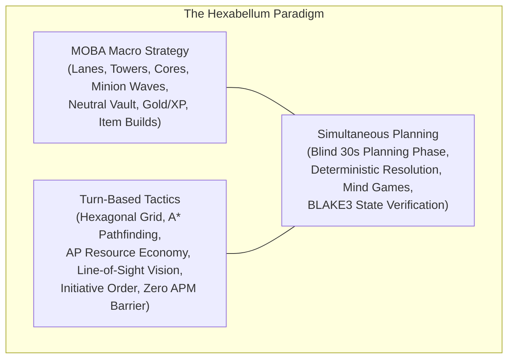
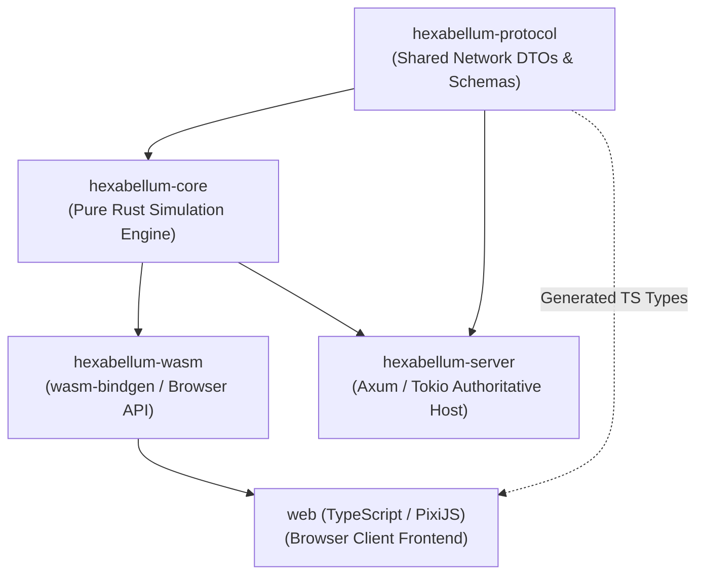
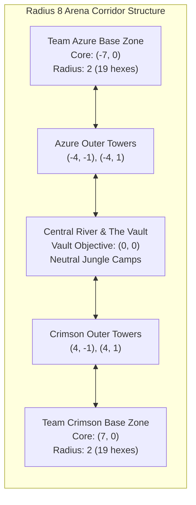
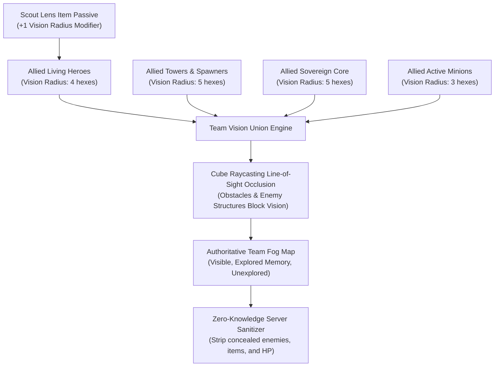
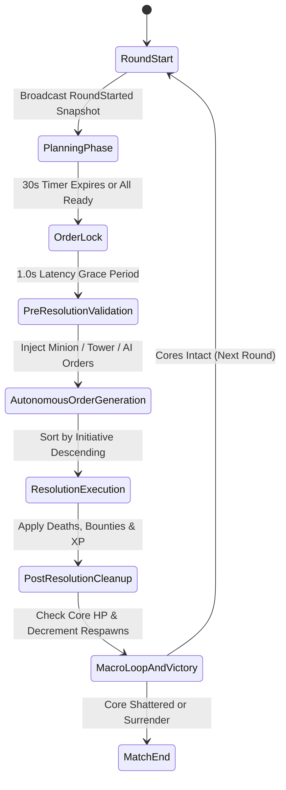
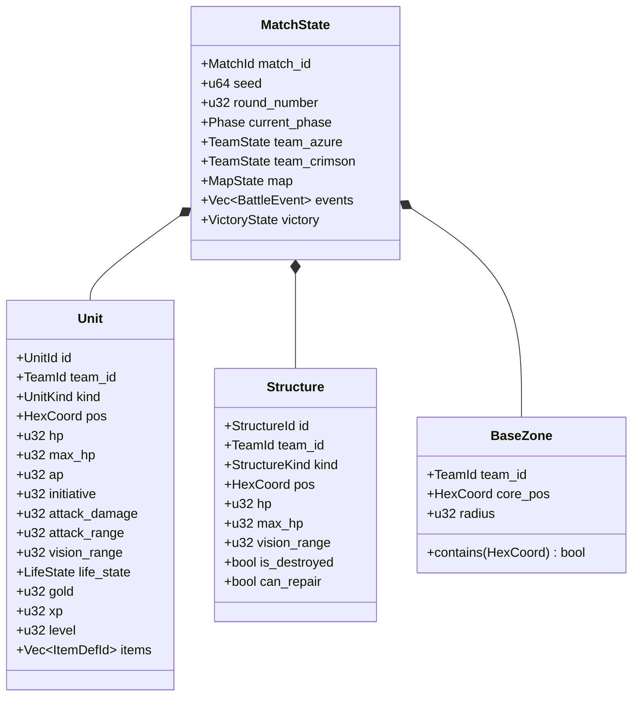
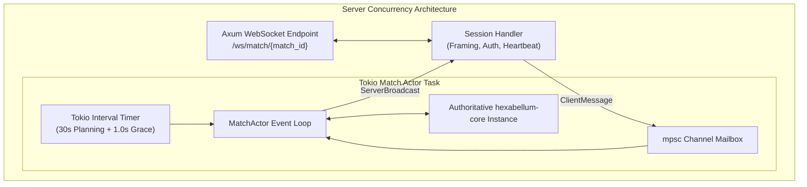
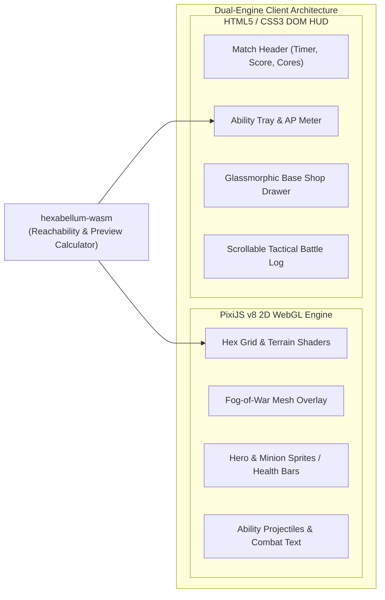
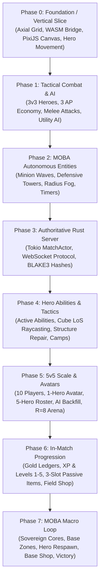
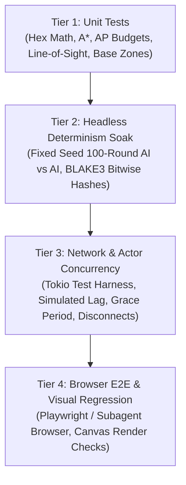

# HEXABELLUM

## System Architecture & Technical Master Plan

---

## Document Version
`Architecture v2.0 — Aligned with Phases 0–7 Technical Specs, GDD v1.0, UX v1.0, and DevOps v1.0`

---

## 1. Executive Summary & Document Purpose

**HEXABELLUM** is a **turn-based tactical MOBA** played on hexagonal arenas. Two teams of five heroes clash in simultaneous planning rounds, commanding movement, basic attacks, spells, itemization, and macro positioning before an authoritative simulation engine resolves each round deterministically. The ultimate objective is to breach the enemy defenses, contest neutral objectives, and shatter the enemy sovereign **Core**.

> *"Six sides of war. One victor."*

This document serves as the **master architectural blueprint** for the entire Hexabellum project. It defines:
1. The **core product vision**, design pillars, and engineering constraints.
2. The **multi-tier system architecture**, crate boundaries, and execution topologies.
3. The **mathematical foundations** of the hexagonal grid, A* pathfinding, and line-of-sight raycasting.
4. The **simultaneous turn lifecycle** and the authoritative 8-stage resolution pipeline.
5. The **entity-component data model**, hero progression, passive item economy, and macro structures.
6. The **networking model**, Tokio actor architecture, WebSocket wire protocol, and BLAKE3 cryptographic desync detection.
7. The **client presentation layer**, dual-renderer strategy (PixiJS WebGL + DOM HUD), and event-driven animation queue.
8. The **definitive 8-phase vertical slice development roadmap** (Phases 0 through 7).
9. The **cross-document sitemap** unifying Game Design ([`docs/gdd.md`](file:///home/user/Code/garnizeh/hexabellum/docs/gdd.md)), UI/UX Architecture ([`docs/ui-ux.md`](file:///home/user/Code/garnizeh/hexabellum/docs/ui-ux.md)), DevOps & Infrastructure ([`docs/devops.md`](file:///home/user/Code/garnizeh/hexabellum/docs/devops.md)), and Phase Specifications ([`docs/phase-0.md`](file:///home/user/Code/garnizeh/hexabellum/docs/phase-0.md) through [`docs/phase-7.md`](file:///home/user/Code/garnizeh/hexabellum/docs/phase-7.md)).

---

## 2. Core Product Vision & Design Pillars

Hexabellum bridges the strategic depth of modern MOBAs (*League of Legends*, *Dota 2*) with the intellectual clarity of turn-based tactical games (*Into the Breach*, *Final Fantasy Tactics*, *Civilization*). It completely eliminates the real-time mechanical APM barrier, replacing twitch reflexes with pure battlefield positioning, foresight, and simultaneous psychological mind games.



### The 5 Core Design Pillars

1. **Tactical Clarity**: The player must always understand *why* an outcome occurred. No hidden formulas, non-deterministic random rolls, or opaque calculations. Information is power, and the UI delivers complete transparency.
2. **Simultaneous Mind Games**: Both teams plan in secret during a synchronized 30-second window. Tension arises from *predicting* enemy actions, flanking maneuvers, and target priorities.
3. **Meaningful Progression**: Gold, XP, levels (1–5), and passive items provide tangible, visible power spikes that reshape the battlefield without causing runaway snowballing.
4. **Team Interdependence**: No hero wins in isolation. The Vanguard creates space, the Ranger scouts through line-of-sight fog, the Warden sustains allies, the Sniper provides long-range suppression, and the Berserker executes high-value targets.
5. **Web-First Accessibility**: The game launches instantly inside any modern web browser via WebAssembly (WASM) and WebGL without client installation or third-party launchers.

---

## 3. Fundamental Architectural Principles & Guarantees

Every subsystem in Hexabellum conforms to five non-negotiable architectural invariants:

### 1. Deterministic Simulation
Given identical initial state and identical player inputs, the engine **must** produce bitwise identical game states across all platforms, compilers, and architectures (x86_64 native, ARM64 native, and WASM32).
- **Seeded Pseudo-Randomness**: All procedural logic and initiative tie-breaking use a cryptographically secure, seeded PRNG (`rand_chacha::ChaCha8Rng`).
- **Integer & Fixed-Point Math**: Game truth uses integer arithmetic exclusively (HP, AP, damage, gold, XP, coordinates). Floating-point arithmetic (`f32`/`f64`) is strictly forbidden within the core simulation logic to prevent cross-architecture IEEE 754 drift.
- **Zero System Clock Dependency**: The simulation never queries system time (`Instant::now()` or `SystemTime`). Time is modeled strictly via discrete rounds and phase tick counters.
- **Stable Sort Orders**: All entity iterations and tie-breakers use deterministic stable sorting based on explicit identifiers (`UnitId`, `StructureId`, axial coordinate ordering).

### 2. Server Authority with Thin Client
The server owns absolute truth for all multiplayer matches:
- Clients submit **intentions** (`SubmitOrders`, `BuyItem`, `Surrender`), never state mutations.
- The server validates all constraints (AP budgets, line of sight, range, gold balances, inventory limits) before execution.
- The browser client runs an identical compiled WebAssembly simulation instance for **instant local validation, movement reachability previews, and offline/single-player gameplay**.

### 3. Event-Driven State Mutation & BLAKE3 Verification
- Every discrete mutation emits a strongly typed `BattleEvent` (`UnitMoved`, `UnitAttacked`, `DamageDealt`, `HeroDied`, `HeroRespawned`, `CoreDamaged`, `ItemPurchased`, etc.).
- State synchronization uses an **authoritative snapshot + event delta** model.
- At the conclusion of every round resolution, the engine calculates a **BLAKE3 256-bit cryptographic state root hash**. Clients and server compare hashes to verify 100% synchrony; any mismatch triggers an automated diagnostic state re-synchronization.

### 4. Data-Driven Content Architecture
- Hero definitions, item statistics, map dimensions, spawn points, and progression tables are declared as structured, immutable configuration data (`HeroDef`, `ItemDef`, `MapDef`, `EconomyConfig`).
- Adding new champions, abilities, or items requires zero modifications to the core turn-resolution pipeline.

### 5. Strict Engine / Presentation Decoupling
- The core simulation crate (`hexabellum-core`) contains **zero dependencies** on DOM APIs, WebGL, PixiJS, audio, or network sockets.
- The core crate compiles cleanly to native targets for server/CI runners and to `wasm32-unknown-unknown` for browser execution.

---

## 4. Multi-Tier System Topology

The Hexabellum deployment architecture is divided into four distinct tiers:

```mermaid
flowchart TD
    subgraph "Tier 1: Client Presentation (Browser)"
        DOM["DOM / HTML5 HUD<br/>(React / Svelte / Vanilla TS)"]
        PIXI["PixiJS v8 Canvas<br/>(WebGL 2D Hex Board, Sprites, VFX)"]
        WASM_B["hexabellum-wasm<br/>(WASM Bridge, Local Runner, Previews)"]
        NET_C["WebSocket Client<br/>(Protocol Serde, Event Queue)"]
        
        DOM <--> PIXI
        DOM <--> WASM_B
        DOM <--> NET_C
        PIXI <--> WASM_B
    end

    subgraph "Tier 2: Edge & Ingress"
        LB["Reverse Proxy / Load Balancer<br/>(TLS Termination, WSS Upgrade, Static CDN)"]
    end

    subgraph "Tier 3: Authoritative Application Tier"
        AXUM["hexabellum-server<br/>(Rust Axum HTTP / WebSocket Server)"]
        ROOMS["MatchActor Manager<br/>(Tokio Actor per Match Room)"]
        CORE_S["hexabellum-core<br/>(Authoritative Simulation Instance)"]
        
        AXUM --> ROOMS
        ROOMS --> CORE_S
    end

    subgraph "Tier 4: Persistence & Coordination Tier"
        PG[(PostgreSQL<br/>Accounts, Match Records, ELO)]
        REDIS[(Redis<br/>Matchmaking Queues, Session Pub/Sub)]
    end

    NET_C <==>|WSS (JSON / Binary)| LB
    DOM <==>|HTTPS Static Assets| LB
    LB <==> AXUM
    AXUM <--> PG
    AXUM <--> REDIS
```

### Dual-Execution Topologies

Hexabellum supports three execution modes using the exact same underlying simulation code:

| Execution Mode | Simulation Host | Network Overhead | Primary Use Case |
|---|---|---|---|
| **Multiplayer 5v5 / 1v1** | Server `MatchActor` (`hexabellum-server`) | WebSocket JSON/Binary packets | Ranked competitive play, matchmaking, custom rooms |
| **Single-Player / Bot Practice** | In-Browser WebAssembly (`hexabellum-wasm`) | Zero (100% local execution) | Offline play, new player tutorials, hero testing |
| **Headless CI / Balance Soak** | Native Rust Binary (`hexabellum-core`) | Zero (headless multithreaded CLI) | Automated 10,000-round determinism & balance verification |

---

## 5. Rust Workspace & Crate Topology

The repository is structured as a unified Cargo workspace coupled with a modern TypeScript front-end:

```text
hexabellum/
├── Cargo.toml                    # Workspace root definition
├── Cargo.lock
├── Makefile                      # Cross-compilation & test orchestration
├── README.md                     # Project introduction and quick-start guide
├── crates/
│   ├── core/                     # [hexabellum-core] Pure deterministic simulation engine
│   │   ├── Cargo.toml
│   │   └── src/
│   │       ├── lib.rs            # Top-level exports and engine API
│   │       ├── hex.rs            # Axial/Cube math, distance, A* pathfinding, LoS raycasting
│   │       ├── state.rs          # MatchState, TeamState, BaseZone, FogOfWar, Progression
│   │       ├── unit.rs           # Hero, Minion, Tower, Core, Vault, LifeState, Items
│   │       ├── orders.rs         # Order definitions, MoveOrder, AttackOrder, Action validation
│   │       ├── turn.rs           # 8-stage resolution pipeline, initiative scheduler
│   │       ├── ai.rs             # Heuristic AI, lane steering, timeout backfill, bot shop
│   │       └── event.rs          # Strongly typed battle events and serialization
│   ├── wasm/                     # [hexabellum-wasm] WebAssembly interop layer
│   │   ├── Cargo.toml
│   │   └── src/
│   │       └── lib.rs            # wasm-bindgen exports, JS-friendly DTOs, local runner
│   ├── protocol/                 # [hexabellum-protocol] Shared DTOs and network contracts
│   │   ├── Cargo.toml
│   │   └── src/
│   │       └── lib.rs            # Client/Server message schemas, error enums, versioning
│   └── server/                   # [hexabellum-server] Tokio/Axum authoritative backend
│       ├── Cargo.toml
│       └── src/
│           ├── main.rs           # Server entry point and CLI args
│           ├── ws.rs             # WebSocket connection lifecycle and session handler
│           └── actor.rs          # MatchActor per-room event loop, timers, BLAKE3 verification
├── web/                          # TypeScript + PixiJS client application
│   ├── package.json
│   ├── tsconfig.json
│   ├── vite.config.ts
│   ├── index.html
│   └── src/
│       ├── main.ts               # Client entry point
│       ├── wasm/                 # Compiled WASM artifacts and bindings
│       ├── renderer/             # PixiJS v8 board, hex grid, unit sprites, VFX, animations
│       ├── ui/                   # HUD components, shop drawer, hero inspect, battle log
│       └── net/                  # WebSocket transport, state hydration, desync recovery
└── docs/                         # Comprehensive architectural and phase documentation
```

### Crate Dependency Graph



---

## 6. Tactical Hex Grid Mathematics & Spatial Systems

Hexabellum uses a **pointy-topped hexagonal grid** with dual coordinate representations:

```
 Pointy-Topped Hex:
       /\
      /  \
     |    |
     |    |
      \  /
       \/
```

### 6.1 Axial vs. Cube Coordinates
- **Axial Coordinates `(q, r)`**: Used for compact storage, array indexing, and network serialization.
- **Cube Coordinates `(x, y, z)`**: Used for mathematical calculations, rotations, distance, and straight-line raycasting.
  $$\text{Invariant: } x + y + z = 0 \iff x = q, \quad z = r, \quad y = -q - r$$

```rust
#[derive(Debug, Clone, Copy, PartialEq, Eq, Hash, Serialize, Deserialize)]
pub struct HexCoord {
    pub q: i32,
    pub r: i32,
}

impl HexCoord {
    #[inline]
    pub const fn new(q: i32, r: i32) -> Self { Self { q, r } }
    
    #[inline]
    pub const fn x(&self) -> i32 { self.q }
    #[inline]
    pub const fn z(&self) -> i32 { self.r }
    #[inline]
    pub const fn y(&self) -> i32 { -self.q - self.r }

    #[inline]
    pub fn distance(&self, other: &Self) -> u32 {
        let dx = (self.x() - other.x()).abs();
        let dy = (self.y() - other.y()).abs();
        let dz = (self.z() - other.z()).abs();
        ((dx + dy + dz) / 2) as u32
    }
}
```

### 6.2 Neighbor Offsets & Directions
Pointy-topped hexes feature six adjacent neighbors:

| Direction | Axial Offset $(\Delta q, \Delta r)$ | Compass Equivalent |
|---|---|---|
| **0** | $(+1, 0)$ | East |
| **1** | $(+1, -1)$ | Northeast |
| **2** | $(0, -1)$ | Northwest |
| **3** | $(-1, 0)$ | West |
| **4** | $(-1, +1)$ | Southwest |
| **5** | $(0, +1)$ | Southeast |

### 6.3 Arena Geometry & Formulae
The canonical 5v5 arena is a regular hexagonal board of radius $R = 8$:
$$\text{Total Hexes} = 3R(R + 1) + 1 = 3(8)(9) + 1 = 217 \text{ hexes}$$



### 6.4 A* Pathfinding Engine
Movement paths are calculated using an A* algorithm optimized for hexagonal metrics:
- **Heuristic**: Hex distance $h(a, b) = \text{distance}(a, b)$.
- **Base Tile Cost**: 1 Action Point (AP) per hex traversed.
- **Passability Constraints**:
  - Obstacles (crystallized mana rocks) are permanently impassable.
  - Structures (Cores, Towers, Spawners, The Vault) are permanently impassable.
  - Living units (friendly and enemy) block movement tiles.
  - Enemy base gates reject opposing team traversal.
- **Dynamic Re-Pathing**: Because movement is resolved simultaneously in initiative order, an initially clear path may become obstructed by an earlier unit's movement. Units dynamically recalculate remaining path segments during resolution; if completely blocked, movement terminates early at the last valid hex without penalty.

---

## 7. Line-of-Sight & Fog of War Architecture

Hexabellum enforces strict **information asymmetry**: players only perceive what their team's combined line of sight actively illuminates.



### 7.1 Cube Raycasting Line of Sight
Vision does not pass through vision-blocking terrain (obstacles and hostile structures). For every target hex within vision radius, the engine casts a straight line using cube linear interpolation:
$$P(t) = \text{cube\_round}\Big(A \cdot (1 - t) + B \cdot t\Big), \quad \text{for } t \in [0, 1]$$
If any intermediate hex along the ray contains an obstacle or vision-blocking structure, all hexes beyond it along that ray are masked by fog of war.

### 7.2 The 3 Fog States
1. **Visible (Lit)**: Actively illuminated by at least one living allied vision source. All units, structures, health bars, and animation effects are displayed in full fidelity.
2. **Explored / Memory (Greyed Out)**: Hexes that were previously sighted but currently lack line of sight. Terrain and static structures remain visible at their last-known state; dynamic units (heroes, minions) are completely invisible.
3. **Unexplored (Black Fog)**: Hexes never revealed during the match. Completely hidden beneath dark tactical shroud.

### 7.3 Zero-Knowledge Anti-Cheat Redaction
The authoritative server performs **strict payload sanitization** before serializing state to a player's WebSocket:
- Concealed enemy heroes are omitted from the unit array entirely.
- Concealed enemy items, gold reserves, and XP meters are scrubbed from memory.
- Sound effects and battle log entries occurring outside of a team's line of sight are withheld to prevent audio or log sniffing.

---

## 8. Simultaneous Turn Lifecycle & 8-Stage Resolution Pipeline

A match consists of sequential rounds. Each round transitions through an authoritative 8-stage state machine:



### Detailed Pipeline Breakdown

| Stage | Subsystem | Action & Architectural Guarantees |
|---|---|---|
| **1. RoundStart** | Economy & State Reset | - AP replenished to maximum (3 AP per hero).<br/>- Cooldowns decremented by 1.<br/>- Passive gold income (+6G) distributed to all living heroes.<br/>- Base regeneration (+15 HP) applied to living heroes inside their `BaseZone`.<br/>- Minion wave spawn counter evaluated (spawns 2 minions per spawner every 2 rounds).<br/>- Clean snapshot serialized and broadcast to all connected clients. |
| **2. PlanningPhase** | Client Order Draft | - Synchronized 30-second client countdown timer.<br/>- Players select move destinations, target attacks, active abilities, and execute `BuyItem` transactions.<br/>- Orders can be freely modified or rescinded prior to lock. |
| **3. OrderLock & Grace** | Network Ingestion | - Server locks client order submissions.<br/>- 1.0-second network latency grace buffer absorbs inflight packets.<br/>- Any hero lacking orders is automatically handed to the `TimeoutFallbackAI`. |
| **4. Pre-Validation** | Rule Verification | - Verifies AP budgets ($\text{MoveCost} + \text{ActionCost} \le \text{CurrentAP}$).<br/>- Validates range and line of sight from planned origin.<br/>- Verifies item purchase constraints (living state, base zone containment, gold sufficiency). |
| **5. Autonomous AI** | Macro Steering | - Minions select A* paths along corridor waypoints toward the enemy Core.<br/>- Defensive towers select targets (prioritizing nearest enemy minion $\to$ enemy hero).<br/>- Neutral guardians evaluate leash radiuses and aggro states.<br/>- Disconnected players receive full AI bot behavior backfill. |
| **6. Resolution** | Initiative Execution | - All entities (heroes, minions, towers, neutrals) are sorted by **Initiative descending**.<br/>- Seeded PRNG (`rand_chacha`) breaks initiative ties deterministically, followed by stable `UnitId`.<br/>- Entities execute sequentially: path movement $\to$ basic attack / ability / repair.<br/>- **Death-Before-Acting Invariant**: If a unit reaches 0 HP before its initiative turn, all subsequent orders are canceled. |
| **7. Post-Resolution** | Reward Processing | - Dead entities processed: fatal blow triggers `last_attacker` reward.<br/>- Kill bounties distributed: Minion (+10G/+10XP), Hero (+30G/+30XP), Neutral Camp (+40G/+25XP).<br/>- Structure destruction awards team-wide bounties (+25G/+20XP) to all living allied heroes.<br/>- Level-up thresholds evaluated; stat increments applied (+12 Max HP, +3 Dmg, +1 Energy).<br/>- Team line-of-sight vision maps updated. |
| **8. Macro & Victory** | Macro Life & Core Check | - Dead heroes decrement respawn counters; heroes reaching 0 respawn at base.<br/>- Sovereign Core HP evaluated.<br/>- If Team Azure Core $\le 0 \implies$ Team Crimson Wins.<br/>- If Team Crimson Core $\le 0 \implies$ Team Azure Wins.<br/>- Emits `RoundResolved` event batch and BLAKE3 verification hash. |

---

## 9. Core Entity & Progression Data Models



### 9.1 Hero Roster & Archetypes
Hexabellum features 5 distinct hero archetypes balanced for 5v5 tactical synergy:

| Hero Archetype | Class Role | Base HP | AP | Initiative | Attack Dmg / Rng | Signature Ability | Tactical Identity |
|---|---|---|---|---|---|---|---|
| **Vanguard** | Tank / Bruiser | 120 | 3 | 10 | 18 / 1 (Melee) | **Cleave** (AoE Melee Cone) | Frontline anchor, damage sponge, area denial |
| **Ranger** | Skirmisher | 85 | 3 | 16 | 15 / 3 (Ranged) | **Bolt** (Piercing Line Shot) | High mobility, scout, objective harassment |
| **Warden** | Support / Protector | 95 | 3 | 12 | 12 / 2 (Reach) | **Mend** (Targeted Allied Heal) | Base defense, lane sustain, emergency triage |
| **Sniper** | Long-Range Artillery | 70 | 3 | 14 | 24 / 4 (Sniper) | **Overwatch** (Reaction Shot) | Glass cannon, zoning, high single-target burst |
| **Berserker** | Melee Assassin | 105 | 3 | 18 | 22 / 1 (Melee) | **Frenzy** (Bonus Attack on Kill) | Flanker, squishy executioner, rapid cleanup |

### 9.2 Progression & Level Scaling (Levels 1–5)
Heroes accumulate experience through last-hits, structure assists, and neutral camps. Reaching an XP threshold triggers immediate level-up:

$$\text{XP Thresholds: } \text{L1 } (0\text{ XP}) \longrightarrow \text{L2 } (50\text{ XP}) \longrightarrow \text{L3 } (120\text{ XP}) \longrightarrow \text{L4 } (220\text{ XP}) \longrightarrow \text{L5 } (350\text{ XP})$$

Every level-up bestows permanent base stat increases:
- **Max Health**: $+12\text{ HP}$ (accompanied by an instant $+12\text{ HP}$ heal).
- **Attack Damage**: $+3\text{ Damage}$.
- **Max Energy**: $+1\text{ Max Energy}$.
- *AP and Vision Range remain fixed to prevent game-breaking mobility inflation.*

### 9.3 Passive Item Economy & Base-Only Shop
Heroes possess 3 passive item slots. Items are purchased exclusively while physically standing inside the allied **Base Zone** during the `Planning` phase:

| Item Name | Gold Cost | Passive Stat Modifiers | Strategic Synergies |
|---|---|---|---|
| **Longblade** | 100G | $+6\text{ Attack Damage}$ | Core damage booster for Berserker and Sniper |
| **Plate Armor** | 120G | $+35\text{ Max HP}$, $+35\text{ Instant Heal}$ | Defensive survival against burst; essential for Vanguard |
| **Scout Lens** | 80G | $+1\text{ Vision Radius}$ | Pierces fog of war; essential for Ranger and Warden scouting |
| **Focus Charm** | 100G | $+1\text{ Energy Regen per Round}$ | Accelerates active ability casting frequency |

### 9.4 Sovereign Macro Structures
1. **The Sovereign Core (700 HP)**: Positioned at `(-7, 0)` (Azure) and `(7, 0)` (Crimson). Stationary, non-attacking, non-repairable. Possesses true sight (vision radius 5). Its destruction triggers immediate game victory for the enemy team.
2. **Defensive Sentinels / Towers (100 HP)**: Automated defensive fortifications. Attack the highest priority hostile unit within range 3 each round for 25 damage. Repairable by hero actions.
3. **Minion Spawners (150 HP)**: Barracks structures flanking each base. Generate autonomous waves of 2 melee/ranged minions every 2 rounds.
4. **The Ancient Vault (250 HP)**: Central neutral objective located at `(0, 0)`. Impassable, non-vision-blocking. Attributed via last-attacker. Awards $+50\text{G}$ and $+40\text{XP}$ to all living allied heroes, plus a 5-round $+5\text{ Attack Damage}$ team-wide combat buff.

---

## 10. Networking, WebSocket Protocol & Server Actor Engine

Hexabellum implements an asynchronous, actor-driven server architecture using **Rust**, **Axum**, and **Tokio**:



### 10.1 Wire Protocol Message Specifications

#### Client-to-Server Messages
```rust
#[derive(Debug, Clone, Serialize, Deserialize)]
#[serde(tag = "type", content = "payload")]
pub enum ClientMessage {
    JoinMatch { match_id: String, player_id: String, hero_id: String },
    SubmitOrders { round: u32, unit_id: u32, move_dest: Option<HexCoord>, action: ActionDto },
    BuyItem { item_id: String },
    Ping { client_time_ms: u64 },
    Surrender,
}
```

#### Server-to-Client Messages
```rust
#[derive(Debug, Clone, Serialize, Deserialize)]
#[serde(tag = "type", content = "payload")]
pub enum ServerMessage {
    MatchStarted { match_id: String, seed: u64, assigned_hero: u32, team_id: u8 },
    RoundStarted { round: u32, time_remaining_ms: u32, snapshot: SanitizedSnapshotDto },
    OrdersLocked { round: u32 },
    RoundResolved { 
        round: u32, 
        events: Vec<BattleEventDto>, 
        snapshot: SanitizedSnapshotDto, 
        state_hash: String 
    },
    MatchEnded { winner_team: u8, reason: MatchEndReasonDto, stats: MatchStatsDto },
    ErrorNotification { code: String, message: String },
}
```

### 10.2 BLAKE3 Cryptographic Desync Detection
At the end of every round resolution, the engine normalizes and serializes the complete authoritative state struct into a canonical byte buffer and hashes it with **BLAKE3**:
$$\text{StateHash} = \text{BLAKE3}\Big(\text{canonical\_bytes}(\text{MatchState})\Big)$$
This 64-character hexadecimal digest is transmitted inside the `RoundResolved` packet. The client's local WebAssembly instance computes the identical hash against its synchronized state. If a discrepancy is detected:
1. The client logs an urgent desync warning.
2. The client drops pending local predictions.
3. The client requests a full authoritative state rehydration snapshot from the server.

---

## 11. Client Presentation Layer & Dual-Renderer Architecture

The web client employs a **strict separation of rendering concerns**:



### 11.1 The Player Mental Model (Observe $\to$ Plan $\to$ Commit $\to$ Watch)
The UI dynamically transitions between four interaction states matching the player's cognitive loop:

1. **Observe**: Board exploration, pan/zoom, hover tooltips detailing enemy inventory, range rings, and fog perimeter inspection.
2. **Plan**: Selecting a hero highlights valid movement paths in **cyan** (respecting AP budget) and valid target hexes in **crimson**. Item purchases update stats in real-time.
3. **Commit**: Submitting orders locks the visual trajectory, displays a locked badge, and displays the synchronized countdown.
4. **Watch (Event Queue Playback)**: Upon receiving `RoundResolved`, the client locks input and processes events sequentially:
   - Units slide along hex paths simultaneously.
   - Projectiles (arrows, bolts, magic spheres) traverse between hex origins and targets.
   - Floating combat text displays numerical damage ($-18$), heals ($+15$), and gold bounties ($+30\text{G}$).
   - Defeated units trigger shatter animations; destroyed Cores trigger arena-wide victory explosions.

---

## 12. Definitive 8-Phase Vertical Slice Roadmap

Hexabellum is built through an unbroken sequence of **vertical slices**. Each phase delivers a complete, testable, end-to-end slice spanning engine, protocol, networking, and browser presentation:



### Comprehensive Phase Specifications Summary

| Phase | Milestone Name | Architecture Decision Record | Core Deliverables & Systems Built | Primary Verification Artifact |
|---|---|---|---|---|
| **0** | **Foundation / Vertical Slice** | [`ADR-001`](file:///home/user/Code/garnizeh/hexabellum/docs/phase-0.md#architectural-decision-record-adr-001-rust-wasm-vertical-slice-architecture) | Rust workspace (`core`, `wasm`), axial coordinates, A* pathfinding, single hero movement, PixiJS v8 browser renderer. | Playable browser prototype moving a hero across hexes via WASM. |
| **1** | **Combat & AI Opponent** | [`ADR-002`](file:///home/user/Code/garnizeh/hexabellum/docs/phase-1.md#architectural-decision-record-adr-002-deterministic-combat-engine-initiative-resolution--tactical-ai) | 3v3 team skirmish, 3 AP budget, melee combat, damage/elimination, initiative sorting (`rand_chacha`), greedy AI bot. | Headless 100-round AI vs AI test; browser 3v3 battle to hero elimination. |
| **2** | **MOBA Autonomous Entities** | [`ADR-003`](file:///home/user/Code/garnizeh/hexabellum/docs/phase-2.md#architectural-decision-record-adr-003-autonomous-moba-entities-dual-team-coordination-and-information-fog) | Automated minion waves, defensive towers with retaliatory attacks, radius fog of war, synchronized 30s turn timer. | Browser battle with autonomous minions pushing lanes and towers firing. |
| **3** | **Authoritative Server** | [`ADR-004`](file:///home/user/Code/garnizeh/hexabellum/docs/phase-3.md#architectural-decision-record-adr-004-tokio-actor-per-match-authoritative-server-architecture-websocket-framing--grace-period-synchronization) | Axum WebSocket server, Tokio `MatchActor` per room, simultaneous order ingestion with 1.0s grace, BLAKE3 state hashing. | 2 browser tabs connected over WebSockets playing a synchronized match. |
| **4** | **Abilities & Micro Tactics** | [`ADR-005`](file:///home/user/Code/garnizeh/hexabellum/docs/phase-4.md#architectural-decision-record-adr-005-hero-active-abilities-composable-effect-pipeline-cube-raycast-los-structure-repair-and-neutral-camps) | Hero active abilities (Cleave, Bolt, Mend), composable effect pipeline, cube raycast LoS, structure repair, neutral camps with leash. | Tactical depth with wall-blocked vision, ability cooldowns, and camp farming. |
| **5** | **5v5 Scale & True Multiplayer** | [`ADR-006`](file:///home/user/Code/garnizeh/hexabellum/docs/phase-5.md#architectural-decision-record-adr-006-5v5-multiplayer-scaling-per-player-single-hero-avatar-model-team-vision-union-and-dynamic-ai-backfill) | 1-player-1-hero avatar model (up to 10 players), 5-hero roster, shared team vision union, dynamic AI backfill, radius 8 arena. | 10 concurrent browser connections in an arena with pan/zoom and team vision. |
| **6** | **In-Match Economy & Progression** | [`ADR-007`](file:///home/user/Code/garnizeh/hexabellum/docs/phase-6.md#architectural-decision-record-adr-007-server-authoritative-economy-killobjective-bounties-level-up-progression--field-item-shop) | Sovereign gold ledgers, last-hit bounties, global structure payouts, linear XP/levels (1–5), 4 passive items, Field Shop. | Heroes leveling up, earning gold bounties, and buying stat-enhancing items. |
| **7** | **MOBA Macro Loop & Victory** | [`ADR-008`](file:///home/user/Code/garnizeh/hexabellum/docs/phase-7.md#architectural-decision-record-adr-008-sovereign-core-structures-base-zones-hero-respawn-lifecycle-neutral-objective-vault-mechanics-base-only-shopping-and-core-destruction-victory) | Sovereign Cores (700 HP), Base Zones (19 hexes), 3-round hero respawn, Base-only shopping, neutral Vault, Core Destruction victory. | Complete MOBA loop: siege enemy towers, contest Vault, shatter enemy Core. |

---

## 13. Testing, Determinism Verification & CI Strategy

The Hexabellum architecture is backed by a rigorous, four-tier testing hierarchy:



### 13.1 Determinism Test Invariant
To ensure cross-compilation determinism, the test suite executes **golden master match runs**:
```rust
#[test]
fn test_100_round_headless_determinism() {
    let mut engine_a = Engine::new_with_seed(0xDEADBEEF_CAFE1234);
    let mut engine_b = Engine::new_with_seed(0xDEADBEEF_CAFE1234);

    for _ in 0..100 {
        engine_a.step_round_ai_vs_ai();
        engine_b.step_round_ai_vs_ai();
        
        let hash_a = engine_a.blake3_state_hash();
        let hash_b = engine_b.blake3_state_hash();
        assert_eq!(hash_a, hash_b, "Bitwise state desynchronization detected!");
    }
}
```

---

## 14. Cross-Document Sitemap & Reference Index

To ensure seamless navigation across the complete Hexabellum documentation ecosystem, use the following index:

### Core Architectural & System Blueprints
- **System Architecture (This Document)**: [`docs/overview.md`](file:///home/user/Code/garnizeh/hexabellum/docs/overview.md)
- **Game Design Document (Identity, World & Content)**: [`docs/gdd.md`](file:///home/user/Code/garnizeh/hexabellum/docs/gdd.md)
- **UI/UX Blueprint (Interaction Design & Screen Layouts)**: [`docs/ui-ux.md`](file:///home/user/Code/garnizeh/hexabellum/docs/ui-ux.md)
- **DevOps & Infrastructure Guide (Docker, Cloud & CI/CD)**: [`docs/devops.md`](file:///home/user/Code/garnizeh/hexabellum/docs/devops.md)

### Vertical Slice Phase Specifications
- **Phase 0 — Foundation / First Playable Browser Slice**: [`docs/phase-0.md`](file:///home/user/Code/garnizeh/hexabellum/docs/phase-0.md)
- **Phase 1 — Tactical Combat & AI Opponent**: [`docs/phase-1.md`](file:///home/user/Code/garnizeh/hexabellum/docs/phase-1.md)
- **Phase 2 — MOBA Autonomous Entities & Fog of War**: [`docs/phase-2.md`](file:///home/user/Code/garnizeh/hexabellum/docs/phase-2.md)
- **Phase 3 — Authoritative Rust Server & WebSocket Synchronization**: [`docs/phase-3.md`](file:///home/user/Code/garnizeh/hexabellum/docs/phase-3.md)
- **Phase 4 — Hero Abilities, Status Effects & Micro-Macro Tactics**: [`docs/phase-4.md`](file:///home/user/Code/garnizeh/hexabellum/docs/phase-4.md)
- **Phase 5 — 5v5 Scale & True Multi-Avatar Multiplayer**: [`docs/phase-5.md`](file:///home/user/Code/garnizeh/hexabellum/docs/phase-5.md)
- **Phase 6 — In-Match Progression & Item Economy**: [`docs/phase-6.md`](file:///home/user/Code/garnizeh/hexabellum/docs/phase-6.md)
- **Phase 7 — MOBA Macro Loop, Base Zones, Respawn & Core Destruction Victory**: [`docs/phase-7.md`](file:///home/user/Code/garnizeh/hexabellum/docs/phase-7.md)

---
*Hexabellum Architecture Document v2.0 — Finalized and fully synchronized with the 8-phase vertical slice roadmap.*
