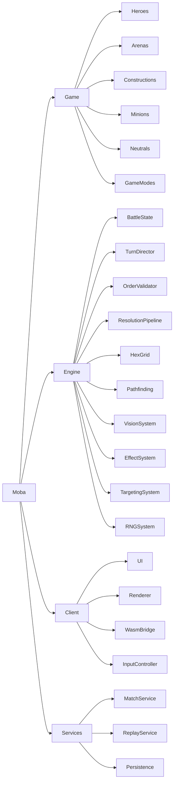
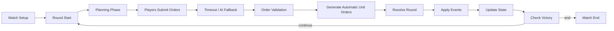
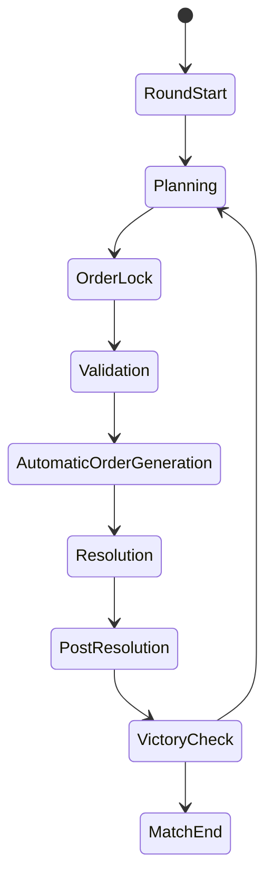
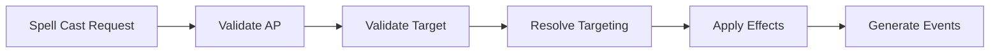

# Turn-Based MOBA  

## Game Architecture Document — MVP

---

## 1. Document Purpose

This document defines the architecture for a **turn-based MOBA** with tactical combat on a **hexagonal grid**.

The project will start with a small MVP focused only on the **battle loop**, but the architecture is designed to support future expansion into:

- 5v5 multiplayer
- gold / XP
- items
- shop
- upgrades
- objectives
- replays
- matchmaking
- ranking
- richer arenas and visual polish

---

## 2. Core Product Vision

The game is a **MOBA-inspired turn-based tactical battle game**.

Key characteristics:

- team-based combat
- heroes controlled by players
- automatic minions and constructions
- lanes / towers / objectives in future versions
- hexagonal tactical maps
- simultaneous order submission
- deterministic server-side resolution
- browser-based experience
- Rust server authority
- single-player and synchronous multiplayer support

The MVP should prove that the core battle loop is fun, testable, and architecturally stable.

---

## 3. Confirmed Constraints

The following decisions are fixed:

### Platform
- Web browser first
- WASM support for shared game logic
- Rust server is mandatory

### Multiplayer / Single-player
- Single-player supported
- Synchronous multiplayer supported
- MVP initially focuses on battle loop only
- 1v1 prototype first
- future support for 5v5 with up to 10 players

### Gameplay
- turn-based
- teams submit orders simultaneously
- engine resolves the round
- actions are limited by AP
- hexagonal grid
- obstacles block movement
- units always block tiles
- towers attack automatically
- minions spawn automatically from special towers
- constructions can be destroyed and repaired
- neutral units may help or hinder depending on type
- MVP win condition:
  - the team whose heroes all die first loses

### MVP Exclusions
No gold, XP, shop, items, or upgrades in the MVP.

Those systems will be added later.

---

## 4. MVP Scope

The MVP must include only what is necessary to run a complete tactical battle.

### MVP Includes

#### Game Modes
- local battle
- AI vs AI
- human vs AI
- human controlling an entire team in single-player
- optional 1v1 synchronous multiplayer later

#### Entities
- heroes
- minions
- towers
- special spawner towers
- destructible / repairable constructions
- obstacles
- neutral units

#### Systems
- hex grid
- pathfinding
- fog of war simplified
- AP-based orders
- initiative-based resolution
- deterministic RNG
- timeout fallback AI
- basic combat
- repair action
- automatic tower attacks
- minion spawning
- neutral unit behavior
- battle events
- win/loss detection

### MVP Does Not Include
- gold
- XP
- leveling
- items
- shop
- talent trees
- out-of-match progression
- ranked ladder
- matchmaking
- spectator mode
- replay UI
- cosmetics
- advanced objectives
- advanced fog / line-of-sight blocking

---

## 5. High-Level Architecture

The architecture is divided into four major layers:

1. **Game / Content**
2. **Engine / Simulation**
3. **Client**
4. **Server / Services**

For the MVP, the most important layers are **Game**, **Engine**, and **Client**.

Server functionality can initially be simulated locally, but the architecture should already be server-ready.



---

## 6. Module Responsibilities

---

# 6.1 Game Module

The **Game** module contains content definitions and static data.

It defines **what exists** in the game.

### Responsibilities
- hero definitions
- unit definitions
- minion definitions
- tower definitions
- neutral definitions
- construction definitions
- arena/map definitions
- game mode configuration
- AP costs
- vision ranges
- movement rules
- spawn rules

### Important Principle
The Game module should be mostly **data-driven**.

This allows future heroes, maps, and abilities to be added without changing core engine code.

---

# 6.2 Engine Module

The **Engine** module is the heart of the system.

It defines **how the battle behaves**.

### Responsibilities
- battle state management
- round / turn flow
- order collection
- order validation
- pathfinding
- movement resolution
- action resolution
- initiative scheduling
- combat resolution
- effect application
- fog of war
- deterministic RNG
- event generation
- win condition checking

### Important Principle
The Engine must be:
- deterministic
- server-authoritative
- independent from rendering
- independent from network
- testable in isolation

This allows the same core to run in:
- Rust server
- WASM browser client
- CLI simulation
- automated tests

---

# 6.3 Client Module

The **Client** is responsible for presentation and input.

### Responsibilities
- render arena
- render units
- show hex highlights
- show AP / HP / status
- collect player orders
- display movement preview
- display action preview
- show turn timer
- display battle log
- play animations based on events

### Important Principle
The client does **not** own game truth.

It may:
- predict
- display
- animate
- locally validate UX

But final game authority belongs to the server or to the authoritative engine instance.

---

# 6.4 Services Module

This is not the MVP priority, but should be considered early.

### Future Responsibilities
- authentication
- matchmaking
- player profiles
- persistence
- replays
- analytics
- ranking
- friend lists
- live match management

For the MVP, this can remain out of scope.

---

## 7. Recommended Technology Stack

---

## 7.1 Server
**Rust**

Suggested stack:
- `tokio`
- `axum` or `actix-web`
- `serde`
- `serde_json`
- `rand` + `rand_chacha`
- `tracing`
- `thiserror`
- WebSockets for live matches

The server should be authoritative and run the same core simulation used by the client.

---

## 7.2 Shared Core
A Rust workspace crate that contains the deterministic game engine.

This crate must compile to:
- native Rust for server/tests
- WASM for browser use

Suggested crate name:
- `moba-core`

---

## 7.3 WASM Bridge
A Rust crate exposing the core engine to JavaScript / TypeScript.

Suggested tools:
- `wasm-bindgen`
- `tsify` or `serde-wasm-bindgen`
- `web-sys` if needed

Suggested crate name:
- `moba-wasm`

---

## 7.4 Client UI / Rendering
Recommended:
- **TypeScript**
- **Vite**
- **Svelte** or **React**
- **PixiJS** for 2D WebGL rendering

Alternative:
- Canvas 2D for very early prototypes
- Three.js later if moving toward 2.5D / 3D

### Why this is recommended
- excellent web tooling
- fast UI iteration
- strong ecosystem
- easy integration with WASM
- easier to build HUD, menus, tooltips, and battle feedback

---

## 7.5 Recommended Architecture Decision

Use:

> **Rust shared core + Rust server + TypeScript/PixiJS client**

This gives you:
- Rust safety and performance where it matters most
- excellent web UX
- easier MVP development
- strong future scalability

---

## 8. Core Design Principles

The project should follow these rules:

### 1. Deterministic simulation
Same input must always produce same output.

### 2. Server authority
Clients submit intentions only.

### 3. Data-driven content
Heroes, arenas, and units should be defined as data.

### 4. Event-driven battle history
Every meaningful change should generate an event.

### 5. Separation between simulation and presentation
The engine must not depend on graphics, DOM, or UI.

### 6. Extensible effect system
Even if MVP is simple, spells/effects must be built as composable systems.

### 7. Testability
The engine should be testable headlessly with AI vs AI battles.

---

## 9. High-Level System Flow



---

## 10. Game Entity Model

---

## 10.1 Entity Categories

The game should support these entity categories:

- Hero
- Minion
- Tower
- Construction
- Neutral
- Obstacle

All of them can be modeled as entities in the battle state, but with different behaviors.

---

## 10.2 Suggested Core Entities

### Match
Represents the whole battle.

Fields:
- match_id
- seed
- round_number
- phase
- teams
- units
- constructions
- map
- fog_state
- winner

---

### Team
Fields:
- team_id
- color
- heroes
- owned_constructions
- visibility_state

---

### Unit
Used for heroes, minions, neutrals.

Fields:
- unit_id
- owner_team_id
- unit_kind
- controller_type
- hex_position
- hp
- max_hp
- ap
- max_ap
- initiative
- vision_range
- attack_range
- status_effects
- cooldowns
- is_alive

---

### Construction
Fields:
- construction_id
- owner_team_id
- construction_type
- hex_positions
- hp
- max_hp
- is_destroyed
- repairable
- spawn_behavior
- auto_attack_behavior

Construction types:
- Tower
- SpawnerTower
- Wall
- Barrier
- ObjectiveStructure

---

### Obstacle
Fields:
- obstacle_id
- hex_positions
- blocks_movement
- destructible

For MVP:
- obstacles block movement only
- obstacles do not block vision

---

## 11. Hex Grid System

The map uses a **hexagonal grid**.

---

## 11.1 Coordinate System

Use **axial coordinates**:

- `q`
- `r`

Optionally derive cube coordinates internally for distance calculations.

Why axial:
- simple storage
- easy neighbor calculation
- standard for hex grids
- good for pathfinding

---

## 11.2 Core Hex Operations

The engine should support:

- neighbors
- distance
- ring
- line drawing
- reachability
- pathfinding
- area of effect selection

---

## 11.3 Pathfinding

Use **A\*** over the hex grid.

### Path constraints
- cannot enter obstacle tiles
- cannot enter occupied tiles
- cannot enter enemy/constructions if defined as blocking
- path cost can be configurable later

For MVP:
- all valid hexes have cost 1
- blocked hexes are impassable

---

## 11.4 Occupancy Rules

For your game:

- one unit per hex
- heroes block
- minions block
- neutrals block
- constructions block
- obstacles block

This means movement resolution must re-validate paths during the round.

---

## 12. Turn System

---

## 12.1 Chosen Model

The game uses:

> **Simultaneous team planning + deterministic resolution**

Each side submits orders, then the engine resolves the round.

---

## 12.2 Round Phases



---

## 12.3 Phase Details

### RoundStart
- reset AP
- decrement timers / cooldowns if used later
- spawn minions if applicable
- update vision
- send state snapshot to clients

### Planning
- players choose orders
- timer runs
- UI shows valid moves/actions

### OrderLock
- no more orders accepted
- missing orders are assigned by fallback logic

### Validation
- validate AP costs
- validate targets
- validate movement destination
- validate action rules

### AutomaticOrderGeneration
- generate orders for:
  - minions
  - towers
  - neutrals
  - timed-out heroes

### Resolution
- resolve all orders in initiative order
- apply movement and actions
- generate events

### PostResolution
- remove dead units
- update fog
- update construction state
- update battle log

### VictoryCheck
- if one team has no heroes alive, match ends

---

## 13. Controller Model

---

## 13.1 Controller Types

Each controllable unit has a controller:

- Human
- AI
- None

### Hero control rules
- in multiplayer, each player controls 1 hero
- in single-player, one player can control all allied heroes
- in bot matches, AI controls heroes

---

## 13.2 Automatic Units
The following are automatic:
- minions
- summons
- towers
- constructions
- neutral units

They are resolved by the engine, not by players.

---

## 14. Action Points and Orders

---

## 14.1 AP Model

Each controllable unit has AP per round.

AP is configurable.

### Suggested default model
- each hero has a fixed AP pool per round
- movement has a fixed AP cost
- actions have variable AP costs

Example:
- hero AP per round: 3
- move cost: 1
- attack cost: 1
- spell cost: 1 or 2
- repair cost: 1

This can be fully data-driven.

---

## 14.2 Order Structure

Each controlled unit receives one order per round.

An order contains:

- optional movement destination
- selected action
- action target

### Example
```rust
struct UnitOrder {
    unit_id: UnitId,
    move_target: Option<HexCoord>,
    action: Action,
}
```

---

## 14.3 Supported Actions in MVP

Minimum action set:

- `Wait`
- `MoveOnly`
- `Attack`
- `Repair`
- `SpellStub`

Future:
- item use
- special abilities
- interact with objectives
- summon
- defend / guard

---

## 14.4 Order Semantics

A player chooses:

1. destination hex
2. action to perform after arrival

The engine then:
1. validates AP
2. validates path
3. moves unit if possible
4. re-validates action
5. executes action if still valid

If movement succeeds but action target is no longer valid, the action is canceled.

---

## 14.5 Invalid Orders

If an order is invalid:

- remove invalid part if possible
- if movement invalid but action valid at current position, keep action only if valid
- if action invalid, keep movement only if valid
- if nothing is valid, convert to `Wait`

This keeps simulation robust.

---

## 15. Initiative and Resolution Order

---

## 15.1 Initiative System

Every actionable entity has an initiative value.

Resolution order is:

1. higher initiative first
2. if tied, deterministic random sort
3. if still needed, stable ID fallback

This applies to:
- heroes
- minions
- towers
- neutrals
- constructions that act

---

## 15.2 Why Initiative Matters

Because orders are simultaneous, the engine needs a fair way to decide:
- who moves first
- who attacks first
- who occupies contested hexes
- who dies before acting

---

## 15.3 Death Before Acting

If a unit dies before its initiative turn:
- its orders are canceled
- it does not act

This is confirmed behavior.

---

## 16. Movement Resolution

---

## 16.1 Movement Rules

Movement is resolved during the resolution phase.

Rules:
- destination is chosen during planning
- actual path is computed during resolution
- units always block tiles
- obstacles block movement
- path may change due to earlier movements/deaths

---

## 16.2 Processing Movement

For each unit in initiative order:

1. if unit is dead, skip
2. recompute path from current hex to destination
3. respect AP cost
4. avoid blocked tiles
5. move along best valid path
6. stop early if blocked
7. emit movement event

---

## 16.3 Contested Hex Behavior

If two units want the same hex:

- the unit with higher initiative wins
- if tied, deterministic RNG decides

The losing unit:
- moves as close as possible
- or stops if no valid approach exists

This should be configurable later.

---

## 17. Combat Resolution

---

## 17.1 Basic Combat Model

For MVP, combat can be simple:

- attacker has damage value
- target has HP
- damage reduces HP
- if HP <= 0, unit dies

---

## 17.2 Action Execution Order

For each unit when its turn arrives:

1. validate current state
2. if move order exists, move
3. validate action range/target
4. execute action
5. apply effects
6. emit events

---

## 17.3 Attack Targeting

Attack target can be:
- enemy hero
- enemy minion
- enemy construction
- neutral unit if hostile

Target validation:
- target alive
- target in range
- target visible if fog rules require it

---

## 17.4 Repair Action

Repair can target:
- allied construction
- damaged construction
- construction in range

Effect:
- restore HP up to max HP

This uses the same effect pipeline as spells.

---

## 18. Spell / Effect System

Even if MVP is simple, this should be architected correctly.

---

## 18.1 Spell Definition

A spell is data.

Example fields:
- spell_id
- name
- ap_cost
- range
- target_type
- effects

Target types:
- single enemy
- single ally
- self
- hex area
- cone
- line
- none

---

## 18.2 Effect Definition

Effects are modular blocks.

MVP effects:
- Damage
- Heal
- Repair

Future effects:
- stun
- slow
- burn
- shield
- buff
- debuff
- knockback
- summon
- vision effect

---

## 18.3 Effect Pipeline



This design makes future expansion easy.

---

## 19. Minions

---

## 19.1 Minion Behavior

Minions are automatic.

They:
- spawn from special towers
- move along simple behavior rules
- attack enemies
- block hexes
- die when HP reaches 0

---

## 19.2 Spawn Rules

Minions spawn from **special spawner towers**.

Suggested MVP rule:
- spawn at start of round
- one or more minions per wave
- configurable by map/game mode

---

## 19.3 Minion AI

Simple behavior:
1. if enemy in attack range, attack
2. else move toward lane objective / nearest enemy
3. else wait

Later:
- lane waypoints
- aggro rules
- priority targets
- leash behavior

---

## 20. Towers

---

## 20.1 Tower Behavior

Towers:
- are constructions
- occupy hexes
- have HP
- can be destroyed
- can be repaired
- attack automatically

---

## 20.2 Tower Targeting

Default MVP targeting:
1. nearest enemy minion
2. nearest enemy hero
3. nearest enemy construction if relevant

Configurable priority:
- closest target
- lowest HP
- highest threat
- lane priority

---

## 20.3 Tower Actions

Towers use the same resolution system as other units:
- initiative value
- action = attack
- no movement

---

## 21. Neutral Units

---

## 21.1 Purpose

Neutral units can:
- help a team
- hinder a team
- act as obstacles
- guard areas
- provide future objectives

---

## 21.2 Neutral Behavior Profiles

Suggested types:
- hostile to all
- guardian of area
- passive until attacked
- team-triggered helper
- hazard / environmental creature

For MVP, implement one or two simple profiles.

---

## 21.3 Neutral AI

Simple options:
- attack nearest unit
- attack only if approached
- defend a zone
- apply aura later

The important part is that neutrals are engine-controlled entities.

---

## 22. Fog of War

---

## 22.1 MVP Fog Model

Use simplified fog:

A hex is visible to a team if:
- it is within vision radius of any allied hero
- or within vision radius of any allied tower/construction

For MVP:
- obstacles do **not** block vision
- no line-of-sight occlusion yet

---

## 22.2 Fog States

Each team sees:
- visible
- previously seen / memory
- unknown

For MVP, you can simplify to:
- visible
- not visible

---

## 22.3 Future Upgrade Path

Later add:
- line of sight
- vision blockers
- stealth
- wards / vision objects
- true fog-of-war memory

---

## 23. Randomness and Determinism

---

## 23.1 Deterministic RNG

Use seeded RNG.

Suggested:
- `rand_chacha`

All randomness must be:
- seeded per match
- controlled by the engine
- reproducible

---

## 23.2 Where RNG May Be Used

MVP:
- initiative tie-break
- critical hits if added later
- neutral behavior variation
- fallback AI variation if desired

Important:
- never use system time inside simulation
- never rely on hashmap iteration order
- use stable sorting and explicit IDs

---

## 24. Battle Events

The engine should emit events for every meaningful occurrence.

### Event Examples
- `RoundStarted`
- `OrdersLocked`
- `UnitMoved`
- `UnitAttacked`
- `DamageDealt`
- `UnitDied`
- `ConstructionRepaired`
- `ConstructionDestroyed`
- `MinionSpawned`
- `VisionUpdated`
- `RoundEnded`
- `MatchEnded`

Events allow:
- UI animation
- battle log
- debugging
- future replays
- server synchronization

---

## 25. State Management

---

## 25.1 Authoritative State

The authoritative state lives in the engine.

The client should receive:
- full snapshot at round start
- event list after resolution
- optional state hash for validation

---

## 25.2 Snapshot + Events Model

This is the best model for this game:

- server sends full state at the beginning of planning
- client sends orders
- server resolves
- server sends events + updated state

Because the game is turn-based, this is efficient and robust.

---

## 26. Single-Player Architecture

Single-player should reuse the same core.

### Options
1. run engine locally in WASM
2. run engine in a local background worker
3. connect to a local server process

For MVP, the simplest is:
- run engine directly in browser via WASM

This also makes AI vs AI testing easy.

---

## 27. Multiplayer Architecture

Although not required for day one, the architecture should support it.

---

## 27.1 Server Authority

The server:
- owns the match state
- validates orders
- controls timer
- resolves rounds
- broadcasts results

Clients:
- render state
- collect orders
- send orders
- display events

---

## 27.2 Match Service

Each live match can be represented as a match actor / session.

Responsibilities:
- store current state
- manage connected players
- manage turn timer
- collect orders
- trigger resolution
- broadcast results

---

## 27.3 Communication

Recommended:
- WebSocket for live match communication

Possible messages:

### Client -> Server
- `JoinMatch`
- `Ready`
- `SubmitOrders`
- `Ping`

### Server -> Client
- `MatchStarted`
- `RoundStarted`
- `OrdersAccepted`
- `RoundResolved`
- `MatchEnded`
- `Error`

---

## 28. AI System

AI is needed for:
- bots
- timeout fallback
- automatic units

---

## 28.1 Controller Abstraction

Create a common interface:

- choose orders for controlled units
- receive current battle snapshot
- return valid orders

Implementations:
- HumanController
- SimpleAIController
- AutomaticUnitAI

---

## 28.2 Timeout Fallback AI

If a player does not submit orders:
- AI chooses default actions for their units

Simple fallback logic:
1. if enemy in range, attack
2. else move toward nearest enemy
3. else wait

---

## 28.3 Bot AI for MVP

For 1v1 testing, simple utility AI is enough.

Example:
- evaluate nearby enemies
- attack lowest HP target in range
- move toward closest enemy if no target in range
- repair nearby damaged tower if applicable

The goal is testability, not brilliance.

---

## 29. Game Mode Configuration

Even in MVP, game rules should be configurable.

### Example Configurable Values
- team count
- heroes per team
- AP per round
- turn timer duration
- movement cost mode
- fog enabled
- minion spawn enabled
- neutral spawn enabled
- victory condition
- seed

This will make testing much easier.

---

## 30. Suggested Data Model

---

## 30.1 Hero Definition

```rust
struct HeroDef {
    id: HeroId,
    name: String,
    max_hp: u32,
    ap: u32,
    initiative: u32,
    attack_range: u32,
    vision_range: u32,
    movement_cost: ApCost,
    actions: Vec<ActionDef>,
}
```

---

## 30.2 Map Definition

```rust
struct MapDef {
    id: MapId,
    name: String,
    hexes: Vec<HexTile>,
    obstacles: Vec<ObstacleDef>,
    constructions: Vec<ConstructionDef>,
    spawn_points: Vec<SpawnPoint>,
    neutral_points: Vec<NeutralPoint>,
}
```

---

## 30.3 Battle Setup

```rust
struct BattleSetup {
    seed: u64,
    map_id: MapId,
    teams: Vec<TeamSetup>,
    rules: GameRules,
}
```

---

## 31. Recommended Repository Structure

A Rust workspace plus a web client is ideal.

```text
moba/
  crates/
    moba-core/
      src/
        hex/
        state/
        rules/
        turn/
        resolution/
        effects/
        ai/
        vision/
        replay/
    moba-protocol/
      src/
    moba-server/
      src/
    moba-wasm/
      src/
  web/
    src/
      ui/
      renderer/
      net/
      wasm/
    index.html
    package.json
```

---

## 32. Suggested Crate Split

---

### `moba-core`
Pure simulation engine.

Contains:
- state
- rules
- resolution
- hex logic
- effects
- AI interfaces

No network.
No rendering.
No DOM.

---

### `moba-protocol`
Shared messages and DTOs.

Contains:
- client/server message types
- serialization models
- versioning

---

### `moba-server`
Rust server.

Contains:
- match rooms
- websocket handling
- timers
- authoritative simulation execution

---

### `moba-wasm`
Browser bindings.

Contains:
- exported functions
- JS/TS interop
- local battle runner

---

## 33. Visual MVP Recommendation

This is the part you asked for help with.

---

## 33.1 Recommended Visual Direction

For the MVP, use:

> **2D top-down abstract hex-board style**

Do **not** start with:
- 3D
- isometric
- heavy animations
- detailed art

Start with:
- clear hex tiles
- readable units
- strong team colors
- simple shapes
- clean UI overlays

---

## 33.2 Why 2D Top-Down Is Best for MVP

Because it gives:
- maximum readability
- fastest implementation
- easiest debugging
- easiest hex interaction
- best browser performance
- low art dependency

Turn-based tactical games benefit more from clarity than from visual complexity.

---

## 33.3 Recommended Art Style

### Style
- flat / semi-flat 2D
- board-game clarity
- abstract fantasy/sci-fi neutral look
- no heavy realism

### Shapes
- heroes: circles or hex badges
- minions: small triangles
- towers: squares or larger hexes
- neutrals: diamonds
- obstacles: dark filled hexes
- constructions: outlined structures

### Colors
- team A: blue
- team B: red
- neutral: yellow / gray
- obstacles: dark gray
- fog: black translucent overlay
- selectable: white/yellow outline
- movement range: blue overlay
- attack range: red overlay

---

## 33.4 Essential Visual Features for MVP

The UI should show:
- current round number
- turn timer
- selected unit panel
- HP bars
- AP remaining
- initiative value if useful
- movement preview
- action preview
- valid target highlights
- battle log
- fog overlay
- hover tooltips

---

## 33.5 Recommended Renderer

### Best MVP choice
**PixiJS**

Why:
- fast 2D WebGL rendering
- good for tiles/sprites/effects
- easy to integrate with TypeScript UI
- lighter than a full game engine

### Alternative
**Canvas 2D**
- even simpler
- enough for very early prototypes
- less performant later

---

## 33.6 Suggested Client Stack

Recommended:
- Vite
- TypeScript
- Svelte or React for HUD/menus
- PixiJS for battle board
- WASM core for simulation bridge

This is likely the fastest and cleanest route.

---

## 34. UX Flow for MVP

A simple UX loop is enough.

### Player Flow
1. select unit
2. see movement hexes
3. choose destination
4. choose action
5. confirm order
6. wait for round resolution
7. watch events
8. repeat

---

## 35. Battle Log

A battle log is extremely useful.

Example entries:
- Round 3 started
- Blue Hero moved to (4, -2)
- Red Minion attacked Blue Hero
- Tower repaired by Blue Hero
- Neutral became hostile
- Red Hero died
- Blue team wins

This helps:
- debugging
- player understanding
- balancing
- AI testing

---

## 36. Testing Strategy

Testing is very important for this architecture.

---

## 36.1 Unit Tests
Test:
- hex distance
- neighbors
- pathfinding
- AP validation
- initiative sorting
- damage calculation
- repair logic
- fog radius

---

## 36.2 Simulation Tests
Run:
- AI vs AI battles
- fixed seed battles
- golden master replays
- edge cases:
  - contested hexes
  - dead before acting
  - invalid orders
  - timeout fallback

---

## 36.3 Determinism Tests
For the same seed and orders:
- result must always be identical

Check:
- final state hash
- event sequence
- unit positions
- deaths
- winner

---

## 37. Implementation Roadmap

---

# Phase 0 — Foundation
Build:
- Rust workspace
- core types
- hex grid
- map state
- unit state

Deliverable:
- console simulation skeleton

---

# Phase 1 — Minimal Battle Loop
Build:
- round start
- planning
- simple orders
- move
- wait
- resolution by initiative

Deliverable:
- units move on hex grid deterministically

---

# Phase 2 — Combat
Build:
- attack action
- HP/death
- tower auto-attack
- repair action

Deliverable:
- basic tactical combat works

---

# Phase 3 — Automatic Entities
Build:
- minion spawning
- minion AI
- neutral AI
- tower targeting

Deliverable:
- battle feels semi-MOBA even without player micromanagement everywhere

---

# Phase 4 — Fog and Validation
Build:
- simplified fog
- visibility
- order validation improvements
- timeout AI

Deliverable:
- cleaner tactical information model

---

# Phase 5 — WASM + Browser Client
Build:
- WASM bindings
- TypeScript client
- PixiJS board renderer
- click-to-order MVP UI

Deliverable:
- playable browser prototype

---

# Phase 6 — Server Integration
Build:
- Rust server
- websocket protocol
- match room
- authoritative turn execution

Deliverable:
- synchronous multiplayer battle

---

# Phase 7 — Content Expansion
Add:
- spells
- effects
- more heroes
- more maps
- objectives
- economy later

---

## 38. Assumptions I Am Making

These are reasonable assumptions based on your answers:

1. MVP can start with very small team sizes, even 1 hero per side, while architecture supports more.
2. Spells can start as simple effects or even stubs, but the effect pipeline should exist early.
3. “1v1” means a minimal battle mode, not necessarily full 5-hero teams yet.
4. Movement AP cost is fixed per movement order in MVP, but can become per-hex later.
5. Obstacles do not block vision in MVP.
6. Fog is radius-based only at first.
7. Repair is an action performed by heroes.
8. Neutral units are simple in MVP but architecturally extensible.
9. The first playable version should prioritize clarity and testability over visual polish.

If any of these are wrong, we can adjust the document.

---

## 39. Final Architecture Summary

The recommended architecture is:

- **Rust core engine**
- **Rust authoritative server**
- **WASM build of the core for browser use**
- **TypeScript/PixiJS client for UI and rendering**
- **hex-based tactical simulation**
- **simultaneous planning + deterministic resolution**
- **AP-limited orders**
- **initiative-based execution**
- **event-driven battle updates**
- **MVP focused only on the battle loop**

This gives you a strong foundation and leaves room to evolve into a much larger MOBA-like game later.
