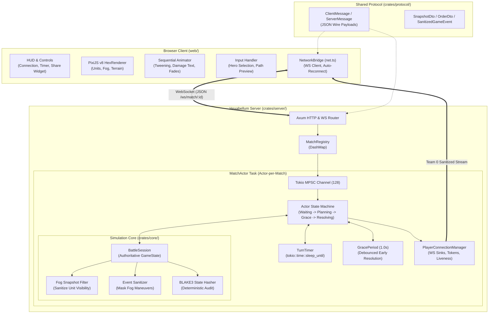

# Phase 3 Technical Spec — Authoritative Server & Real-Time Multiplayer Vertical Slice

---

## Architectural Decision Record (ADR-004): Authoritative Server Architecture, WebSocket State Synchronization, Fog-Masked Event Streams & Reconnection Protocol

### Context
In Phase 1 and Phase 2, Hexabellum established a deterministic simultaneous turn resolution engine with MOBA systems (3v3 heroes, autonomous minion waves, defensive towers, spawner towers, radius-based fog of war, and an asynchronous event animation pipeline) executing locally inside the browser via WebAssembly (`hexabellum-wasm`).

While local execution enabled rapid mechanics validation, it suffers from fundamental architectural limitations for a competitive tactical game:
1. **Host-Side Cheating & Fog Vulnerabilities**: Running the simulation inside the client allows players to inspect JavaScript/WASM heap memory to read concealed enemy coordinates, tower health, and AI intentions through the fog of war.
2. **Multiplayer Incapability**: True player-versus-player (PvP) matches cannot occur without a shared authoritative mediator to arbitrate order submissions, enforce the 30-second planning timer, and coordinate simultaneous turn resolution.
3. **Timer Manipulation & Stalling**: Local timers can be paused or forged by freezing browser tabs, stalling the opponent indefinitely.

Phase 3 transitions Hexabellum from a local WASM prototype into a **server-authoritative multiplayer architecture**. This transition creates several critical architectural and distributed systems challenges:

1. **Actor-Per-Match Concurrency Model**: The server must support hundreds of concurrent matches without contention. Sharing a monolithic game loop across matches introduces thread synchronization bottlenecks and risk of cross-match latency spikes. Each match must run as an isolated async actor with bounded communication channels.
2. **Fog of War Event & Snapshot Sanitization**: In simultaneous resolution games with fog of war, visibility is strictly asymmetric. In Phase 2, snapshot sanitization was introduced for unit lists. However, when rounds resolve, the engine emits a batch of `GameEvent`s (movement paths, attacks, damage, deaths). **Broadcasting raw event streams over WebSockets leaks concealed enemy maneuvers.** If an enemy minion advances or attacks inside fog, the server must sanitize or suppress those events from the unauthorized client's WebSocket stream.
3. **Server-Authoritative Turn Deadline & Early Resolution Grace Period**: The server must own the 30-second planning countdown. Because client network latencies differ, sending remaining seconds causes drift. The server must distribute an absolute UNIX millisecond deadline. Furthermore, if both players lock in their orders early, resolving immediately can create jarring UI jumps or catch players who mis-clicked. The server must implement a **1-second debounce grace period** before initiating early round resolution.
4. **Deterministic Simulation Hashing (BLAKE3)**: To verify that the client animation and server simulation remain in lockstep, and to support future server-side replay verification, the server must generate a cryptographic state hash after every resolution round using BLAKE3 over canonical, sorted state representations.
5. **Session Token Persistence & Transparent Reconnection**: In mobile and browser environments, WebSocket connections drop frequently due to tab switching, network handoffs, or temporary disconnects. The server must decouple client identity from transient TCP sockets using persistent session tokens (`player_id` + `reconnect_token`), enabling seamless reconnects during planning or resolution without stalling the match or leaking state.
6. **Decoupled Workspace Architecture (`crates/protocol`, `crates/core`, `crates/server`, `crates/wasm`, `web`)**: The repository must be cleanly partitioned into reusable modules:
   - `crates/protocol`: Zero-dependency DTOs, wire messages, error codes, and serialization logic shared between server and client.
   - `crates/core`: Pure simulation engine exposing the headless `BattleSession`.
   - `crates/server`: High-performance Axum + Tokio service orchestrating match actors and WebSocket connections.
   - `crates/wasm`: Lightweight WASM facade retained for optional local offline testing.
   - `web/`: TypeScript frontend updated to consume WebSocket snapshots and events transparently through the existing PixiJS renderer and animator.

### Decisions

| Challenge | Architectural Decision | Implementation in Phase 3 |
|---|---|---|
| **Match Concurrency** | **Actor-per-Match Model via Tokio Tasks & MPSC Channels** | Each active match executes inside an isolated Tokio green thread (`MatchActor`), receiving commands via a bounded `mpsc::channel(128)`. State mutations are local to the actor, eliminating multi-threaded locking overhead (`Mutex`/`RwLock`). |
| **Fog Event Sanitization** | **Dual-Filter Pipeline: Team Snapshots + Sanitized Event Streams** | `BattleSession::sanitize_events_for_team(team, &events)` filters and masks event coordinates occurring inside unseen hexes before encoding into JSON, preventing maphacks and packet sniffing. |
| **Turn Timer & Synchronization** | **Server UNIX Epoch Deadline with 1-Second Early Submission Grace Period** | Server distributes `deadline_unix_ms`. Client counts down locally. When all controlled players submit orders before deadline, the actor starts a 1.0s grace timer (`tokio::time::sleep`), allowing cancellations/corrections before triggering resolution. |
| **State Synchronization & Audit** | **BLAKE3 Cryptographic State Hash in Snapshots** | A 256-bit BLAKE3 hash computed over `(round, units, hp, positions, phase, winner)` is included in every `SnapshotDto` for deterministic validation and automated desync detection. |
| **Connection Resilience** | **Token-Based Session Recovery with State Catch-Up** | Clients generate a persistent `player_id` and receive a `reconnect_token`. On reconnect, the server re-attaches the WebSocket sender, transmits the latest snapshot, phase, and remaining deadline. |
| **Order Validation** | **Two-Tier Defense: Fast Rejection on Ingestion + Safe Fallback on Resolution** | The server validates ownership, unit alive status, and round index immediately upon WebSocket receipt. At resolution time, any orders invalidated by prior board actions (e.g. unit died or blocked) gracefully downgrade to `Wait`. |
| **Multiplayer Game Modes** | **PvP (1v1 Commander) & PvAI with Headless Simulation** | Player 1 commands Team 0 heroes; Player 2 commands Team 1 heroes. If unassigned or disconnected, server AI fills missing hero orders on timer expiry. Automated units (minions/towers) remain server AI. |

---

## Phase 3 Goal

> **Transition Hexabellum from a local browser WASM simulation to a robust, server-authoritative multiplayer architecture. The Rust server binary runs the deterministic battle simulation, enforces the 30-second turn timer, validates orders, sanitizes fog-of-war snapshots and event streams, and orchestrates matches over WebSockets. The browser client becomes a presentation and input terminal, retaining its PixiJS renderer, sequential animator, and HUD.**

This represents the foundational multiplayer milestone, unlocking true competitive 1v1 play while securing the game against cheating and desynchronization.

### What Phase 3 Adds

| System | Description |
|---|---|
| **Shared Protocol Crate** | Dedicated `crates/protocol` providing zero-dependency DTOs, wire messages, error codes, and JSON schemas |
| **Rust Server Binary** | High-performance Tokio + Axum server providing REST endpoints for match management and WebSockets for real-time play |
| **Match Actor Engine** | Isolated Tokio task per match managing lifecycle states: `WaitingForPlayers`, `Planning`, `GracePeriod`, `Resolving`, `MatchEnded` |
| **Server-Authoritative Timer** | Server-enforced 30s planning deadline with client synchronization via UNIX epoch milliseconds |
| **1-Second Grace Period** | Debounced resolution trigger when both players submit early, preventing accidental mis-clicks |
| **Fog Event Sanitization** | Server filters event streams per team, suppressing coordinate leaks for movements/attacks inside the fog of war |
| **BLAKE3 State Hashing** | Cryptographic hash computed per round for deterministic verification and desync auditing |
| **Client Network Bridge** | Modular TypeScript WebSocket client with automatic exponential-backoff reconnection and ping/pong heartbeats |
| **Token-Based Reconnection** | Automatic session re-attachment allowing players to disconnect, reload tabs, and resume planning seamlessly |
| **PvP & PvAI Matchmaking** | 1v1 human commander mode, 1vAI practice mode, and headless AI vs AI batch simulation harness |
| **Multiplayer HUD Elements** | Connection health pill, Match ID clipboard share widget, "Waiting for Opponent" status, and synced countdown timer |

### Definition of Done (DoD)

- [ ] `crates/protocol` defines all wire messages, DTOs, and error codes with full serialization tests passing.
- [ ] `crates/core` exposes headless `BattleSession` supporting player ownership, team order staging, fog snapshot filtering, and event sanitization.
- [ ] `crates/server` compiles to a native binary (`hexabellum-server`) using Axum and Tokio.
- [ ] REST API creates matches (`POST /api/matches`) and exposes match status (`GET /api/matches/:id`).
- [ ] WebSocket endpoint (`/ws/match/:id?player_id=...`) handles bi-directional client communication.
- [ ] Player 1 connects and is assigned to Team 0; Player 2 connects and is assigned to Team 1.
- [ ] If configured for PvAI, Team 1 is automatically managed by server AI.
- [ ] Server computes team-specific `SnapshotDto`, strictly censoring hidden enemy units from client payloads.
- [ ] Server sanitizes `RoundResolved` event batches, masking coordinates and suppressing events occurring inside unseen fog.
- [ ] Server enforces 30-second turn timer; expiring deadline triggers AI order auto-fill for unmanaged heroes.
- [ ] Submitting orders from both players starts a 1.0s grace period before triggering resolution.
- [ ] Server validates orders upon receipt, rejecting stale rounds, dead units, and units not owned by the submitting player.
- [ ] Server deterministically resolves rounds and broadcasts sanitized events and updated snapshots to both players.
- [ ] Browser client connects via `NetworkBridge`, stages orders locally, submits over WebSocket, and animates server events.
- [ ] Client turn timer synchronizes with server UNIX millisecond deadline, displaying blue, amber, and red alert stages.
- [ ] A disconnected player can reload the browser, re-authenticate via `player_id`, receive current state, and resume playing.
- [ ] AI vs AI headless server integration test executes 50 rounds without deadlocks, panics, or state divergence.
- [ ] Automated integration tests verify that two concurrent mock WebSocket clients can complete a full 1v1 match.

---

## Architecture Delta from Phase 2

```
Phase 2 (Local WASM Prototype)             Phase 3 (Authoritative Server Multiplayer)
─────────────────────────────────────────   ─────────────────────────────────────────
Simulation runs inside browser WASM        → Simulation runs in native Rust server (Axum + Tokio)
Browser owns full game state & enemy data  → Server owns state; sends fog-sanitized snapshots
Timer runs locally in JS (easily bypassed) → Server enforces deadline (Unix ms timestamp)
Instant local resolution on "End Turn"     → Simultaneous resolution on server with 1s grace period
Events generated and consumed locally      → Server sanitizes event streams per team before broadcast
Single player vs local AI only             → Real-time 1v1 PvP Commander mode + PvAI practice
No network stack                           → WebSocket duplex connection with ping/pong heartbeat
Page reload loses game progress            → Reconnection protocol restores match snapshot & timer
WASM required for core game execution      → WASM optional; client is pure TS/PixiJS presentation
```

---

## High-Level System Architecture & Network Topology



### Match Lifecycle Sequence Diagram

```mermaid
sequenceDiagram
    autonumber
    actor P1 as Player 1 (Team 0)
    actor P2 as Player 2 (Team 1)
    participant WS as Axum WS Handler
    participant Actor as MatchActor Task
    participant Core as BattleSession

    Note over P1, Actor: 1. Connection & Match Handshake
    P1->>WS: Connect: /ws/match/m1?player_id=p1
    WS->>Actor: PlayerConnected(p1)
    Actor-->>P1: MatchJoined(Team 0, WaitingForOpponent)
    
    P2->>WS: Connect: /ws/match/m1?player_id=p2
    WS->>Actor: PlayerConnected(p2)
    Actor-->>P2: MatchJoined(Team 1, OpponentReady)

    Note over Actor, Core: 2. Planning Phase Initiation
    Actor->>Core: Start Round 1
    Actor->>Actor: Schedule Turn Deadline (Now + 30s)
    Actor-->>P1: RoundStarted(Snapshot_Team0, Deadline_Unix_Ms)
    Actor-->>P2: RoundStarted(Snapshot_Team1, Deadline_Unix_Ms)

    Note over P1, P2: 3. Concurrent Planning & Order Staging
    P1->>Actor: SubmitOrders(Round 1, [Orders P1])
    Actor->>Core: Validate & Stage Orders(P1)
    Actor-->>P1: OrdersAccepted(Round 1)

    P2->>Actor: SubmitOrders(Round 1, [Orders P2])
    Actor->>Core: Validate & Stage Orders(P2)
    Actor-->>P2: OrdersAccepted(Round 1)

    Note over Actor: 4. All Orders Received -> 1.0s Grace Period
    Actor->>Actor: Start Grace Timer (1.0s)
    Note over Actor: Grace Timer Fires -> Proceed to Resolution

    Note over Actor, Core: 5. Authoritative Resolution & Fog Sanitization
    Actor->>Core: resolve_round() -> Raw GameEvents
    Core->>Core: TurnProcessor (Spawn waves, Pathing, Attacks, Fog)
    Actor->>Core: sanitize_events_for_team(Team 0, RawEvents)
    Actor->>Core: sanitize_events_for_team(Team 1, RawEvents)
    Actor->>Core: snapshot_for_team(Team 0)
    Actor->>Core: snapshot_for_team(Team 1)

    Note over Actor, P2: 6. Sanitized Broadcast & Playback
    Actor-->>P1: RoundResolved(Events_Team0, Snapshot_Team0)
    Actor-->>P2: RoundResolved(Events_Team1, Snapshot_Team1)
    P1->>P1: Sequential Animator plays events
    P2->>P2: Sequential Animator plays events
```

### MatchActor State Machine

```mermaid
stateDiagram-v2
    [*] --> WaitingForPlayers : Match Created
    WaitingForPlayers --> WaitingForPlayers : Player 1 Connected (Wait for P2 or AI)
    WaitingForPlayers --> Planning : Player 2 Connected / AI Configured
    
    state Planning {
        [*] --> StagingOrders
        StagingOrders --> StagingOrders : Order Received & Validated
        StagingOrders --> GracePeriod : All Controlled Players Submitted
        StagingOrders --> Resolving : 30s Turn Deadline Expired (AI Fallback)
    }

    state GracePeriod {
        [*] --> DebounceCountdown : 1.0s Timer Running
        DebounceCountdown --> StagingOrders : Order Amended / Cancelled
        DebounceCountdown --> Resolving : 1.0s Elapsed
    }

    state Resolving {
        [*] --> ExecutingSimulation : BattleSession::resolve_round()
        ExecutingSimulation --> SanitizingOutput : Filter Events & Snapshots per Team
        SanitizingOutput --> Broadcasting : Send RoundResolved
    }

    Resolving --> Planning : Match Ongoing (Next Round Started)
    Resolving --> MatchEnded : Win Condition Met (Hero Wipe or Spawner Destroyed)
    MatchEnded --> [*] : Clean Up Actor & Channels
```

---

## Workspace Layout & Cargo Configuration

The project workspace is partitioned into decoupled crates:

```text
hexabellum/
├── Cargo.toml                      # Workspace root configuration
├── crates/
│   ├── protocol/                   # Shared DTOs, wire payloads, and serialization
│   │   ├── Cargo.toml
│   │   └── src/
│   │       ├── lib.rs              # Protocol messages, DTOs, errors
│   │       └── tests.rs            # Serialization & schema integrity tests
│   │
│   ├── core/                       # Deterministic simulation core
│   │   ├── Cargo.toml
│   │   └── src/
│   │       ├── lib.rs              # Module exports & Engine facade
│   │       ├── session.rs          # Headless BattleSession & controller assignments
│   │       ├── hex.rs              # Axial coordinate math & BFS pathfinding
│   │       ├── unit.rs             # Unit stats, structures, and abilities
│   │       ├── state.rs            # GameState, Map, and dual win conditions
│   │       ├── orders.rs           # TurnOrders, UnitOrder, and Action enums
│   │       ├── turn.rs             # TurnProcessor & cooperative movement protocol
│   │       ├── fog.rs              # Radius-based fog of war & visibility masks
│   │       ├── spawner.rs          # Minion wave production & congestion handling
│   │       ├── minion_ai.rs        # Minion lane pushing & target aggro
│   │       ├── tower_ai.rs         # Defensive tower auto-attacks (minion priority)
│   │       ├── ai.rs               # Tactical AI & timeout order fallback
│   │       └── event.rs            # GameEvent definitions & sanitizers
│   │
│   ├── server/                     # Authoritative Rust game server
│   │   ├── Cargo.toml
│   │   └── src/
│   │       ├── main.rs             # Server initialization, Axum router, CLI flags
│   │       ├── api.rs              # REST endpoints (/api/matches, /api/health)
│   │       ├── ws.rs               # WebSocket upgrade & stream multiplexing
│   │       ├── match_actor.rs      # Actor task, state machine, timers, resolution
│   │       └── player.rs           # Player session tokens, connections, liveness
│   │
│   └── wasm/                       # Browser WASM facade (retained for offline dev)
│       ├── Cargo.toml
│       └── src/
│           └── lib.rs              # WasmGame interop bindings
│
└── web/                            # TypeScript & PixiJS frontend
    ├── package.json
    ├── index.html
    └── src/
        ├── main.ts                 # Client bootstrap & match join UI
        ├── game/
        │   ├── net.ts              # NetworkBridge WebSocket client
        │   ├── client_session.ts   # Network-backed game session coordinator
        │   ├── renderer.ts         # PixiJS v8 tactical hex board renderer
        │   ├── animator.ts         # FIFO sequential event animator
        │   ├── input.ts            # Interactive order staging controller
        │   ├── timer.ts            # Server-synchronized turn countdown timer
        │   └── types.ts            # Client-side protocol type definitions
        └── ui/
            ├── hud.ts              # Connection pill, Match ID widget, timer HUD
            └── style.css           # Glassmorphic cyber-tactical aesthetic styles
```

### Root `Cargo.toml`

```toml
[workspace]
members = [
    "crates/protocol",
    "crates/core",
    "crates/server",
    "crates/wasm",
]
resolver = "2"

[workspace.package]
version = "0.3.0"
edition = "2024"
authors = ["Hexabellum Team"]
license = "MIT OR Apache-2.0"

[workspace.dependencies]
serde = { version = "1.0.229", features = ["derive"] }
serde_json = "1.0.151"
tokio = { version = "1.43", features = ["full"] }
tracing = "0.1.41"
blake3 = "1.5.5"
uuid = { version = "1.12", features = ["v4", "serde"] }
```

---

## 1. Shared Protocol Crate (`crates/protocol`)

The `hexabellum-protocol` crate defines the contract between client and server. It has zero external dependencies other than `serde` and `serde_json`.

### `crates/protocol/Cargo.toml`

```toml
[package]
name = "hexabellum-protocol"
version.workspace = true
edition.workspace = true

[dependencies]
serde.workspace = true
serde_json.workspace = true
```

### `crates/protocol/src/lib.rs`

```rust
use serde::{Deserialize, Serialize};

pub type MatchId = String;
pub type PlayerId = String;
pub type ReconnectToken = String;
pub type UnitId = u64;
pub type TeamId = u8;
pub type Round = u32;

/// Axial hex coordinate DTO.
#[derive(Debug, Clone, Copy, PartialEq, Eq, Hash, Serialize, Deserialize)]
pub struct HexDto {
    pub q: i32,
    pub r: i32,
}

impl HexDto {
    pub const fn new(q: i32, r: i32) -> Self {
        Self { q, r }
    }
}

/// Unit data transfer representation.
#[derive(Debug, Clone, PartialEq, Eq, Serialize, Deserialize)]
pub struct UnitDto {
    pub id: UnitId,
    pub kind: String, // "Hero", "Minion", "Tower", "Spawner"
    pub team: TeamId,
    pub pos: HexDto,
    pub hp: u32,
    pub max_hp: u32,
    pub ap: u32,
    pub max_ap: u32,
    pub initiative: u32,
    pub attack_range: u32,
    pub vision_range: u32,
    pub is_stationary: bool,
}

/// Arena terrain layout.
#[derive(Debug, Clone, PartialEq, Eq, Serialize, Deserialize)]
pub struct MapDto {
    pub radius: u32,
    pub walkable: Vec<HexDto>,
    pub obstacles: Vec<HexDto>,
}

/// Team-sanitized game state snapshot.
#[derive(Debug, Clone, PartialEq, Eq, Serialize, Deserialize)]
pub struct SnapshotDto {
    pub match_id: MatchId,
    pub round: Round,
    pub phase: String, // "Planning", "Resolution", "Ended"
    pub winner: Option<TeamId>,
    pub map: MapDto,
    pub units: Vec<UnitDto>,
    pub visible_hexes: Vec<HexDto>,
    pub controlled_units: Vec<UnitId>,
    pub deadline_unix_ms: Option<u64>,
    pub state_hash: String,
}

/// Order action type.
#[derive(Debug, Clone, PartialEq, Eq, Serialize, Deserialize)]
#[serde(tag = "type")]
pub enum ActionDto {
    Wait,
    Attack { target_id: UnitId },
}

/// Unit turn order submitted by player.
#[derive(Debug, Clone, PartialEq, Eq, Serialize, Deserialize)]
pub struct OrderDto {
    pub unit_id: UnitId,
    pub move_target: Option<HexDto>,
    pub action: ActionDto,
}

/// Fog-sanitized event emitted during round resolution.
/// Ensures coordinates and hidden unit activities in fog are masked or omitted.
#[derive(Debug, Clone, PartialEq, Eq, Serialize, Deserialize)]
#[serde(tag = "type")]
pub enum SanitizedGameEvent {
    RoundStarted {
        round: Round,
    },
    UnitSpawned {
        unit_id: UnitId,
        unit_kind: String,
        team: TeamId,
        pos: HexDto,
        spawner_id: UnitId,
    },
    UnitMoved {
        unit_id: UnitId,
        from: HexDto,
        to: HexDto,
        path: Vec<HexDto>,
        ap_spent: u32,
    },
    UnitAttacked {
        attacker_id: UnitId,
        target_id: UnitId,
        damage: u32,
        target_hp_remaining: u32,
    },
    TowerAttacked {
        tower_id: UnitId,
        target_id: UnitId,
        damage: u32,
        target_hp_remaining: u32,
    },
    UnitDied {
        unit_id: UnitId,
        unit_kind: String,
        killed_by: UnitId,
    },
    UnitWaited {
        unit_id: UnitId,
    },
    RoundEnded {
        round: Round,
    },
    MatchEnded {
        winner: Option<TeamId>,
    },
}

/// Upstream messages sent from browser client to server.
#[derive(Debug, Clone, PartialEq, Eq, Serialize, Deserialize)]
#[serde(tag = "type")]
pub enum ClientMessage {
    Hello {
        player_id: PlayerId,
        reconnect_token: Option<ReconnectToken>,
    },
    JoinMatch {
        match_id: MatchId,
    },
    SubmitOrders {
        round: Round,
        orders: Vec<OrderDto>,
    },
    Ping {
        client_time_ms: u64,
    },
}

/// Downstream messages sent from server to browser client.
#[derive(Debug, Clone, PartialEq, Eq, Serialize, Deserialize)]
#[serde(tag = "type")]
pub enum ServerMessage {
    HelloAck {
        player_id: PlayerId,
        reconnect_token: ReconnectToken,
    },
    MatchJoined {
        match_id: MatchId,
        player_id: PlayerId,
        team: TeamId,
        is_spectator: bool,
        snapshot: SnapshotDto,
    },
    RoundStarted {
        round: Round,
        deadline_unix_ms: u64,
        snapshot: SnapshotDto,
    },
    OrdersAccepted {
        round: Round,
    },
    OrderRejected {
        round: Round,
        error_code: ProtocolErrorCode,
        reason: String,
    },
    RoundResolved {
        round: Round,
        events: Vec<SanitizedGameEvent>,
        snapshot: SnapshotDto,
    },
    MatchEnded {
        winner: Option<TeamId>,
        snapshot: SnapshotDto,
    },
    Pong {
        client_time_ms: u64,
        server_time_ms: u64,
    },
    Error {
        error_code: ProtocolErrorCode,
        message: String,
    },
}

/// Structured protocol error codes.
#[derive(Debug, Clone, Copy, PartialEq, Eq, Serialize, Deserialize)]
pub enum ProtocolErrorCode {
    InvalidMessage,
    MatchNotFound,
    MatchFull,
    NotAuthorized,
    StaleRound,
    InvalidPhase,
    UnitNotOwned,
    UnitDead,
    InvalidTarget,
    TimerExpired,
    InternalError,
}
```

---

## 2. Core Simulation Refactor: Headless `BattleSession` (`crates/core`)

In Phase 2, `GameEngine` coupled order submission directly to a local human player on Team 0. In Phase 3, the engine is refactored into a headless `BattleSession` that:
1. Supports multiple player assignments (`Controller::Player(PlayerId)`, `Controller::Ai`, `Controller::Automatic`).
2. Isolates order staging per team.
3. Produces team-specific fog-sanitized snapshots.
4. Generates fog-sanitized event streams.
5. Computes canonical BLAKE3 state hashes.

### `crates/core/Cargo.toml`

```toml
[package]
name = "hexabellum-core"
version.workspace = true
edition.workspace = true

[dependencies]
hexabellum-protocol = { path = "../protocol" }
serde.workspace = true
serde_json.workspace = true
blake3.workspace = true
```

### `crates/core/src/session.rs`

```rust
use crate::ai::GameAI;
use crate::event::GameEvent;
use crate::hex::{HexCoord, HexMap};
use crate::orders::{Action, TurnOrders, UnitOrder};
use crate::state::{GameState, Phase};
use crate::turn::TurnProcessor;
use crate::unit::{Unit, UnitId, UnitKind};
use hexabellum_protocol::{
    ActionDto, HexDto, MapDto, OrderDto, PlayerId, ProtocolErrorCode,
    SanitizedGameEvent, SnapshotDto, TeamId, UnitDto,
};
use std::collections::{HashMap, HashSet};

/// Entity controller designation.
#[derive(Debug, Clone, PartialEq, Eq)]
pub enum Controller {
    Player(PlayerId),
    Ai,
    Automatic,
}

/// Match configuration parameters.
#[derive(Debug, Clone)]
pub struct BattleConfig {
    pub map_radius: u32,
    pub turn_duration_secs: u64,
    pub spawn_interval: u32,
    pub enable_ai_team_1: bool,
    pub early_resolution_grace_ms: u64,
}

impl Default for BattleConfig {
    fn default() -> Self {
        Self {
            map_radius: 6,
            turn_duration_secs: 30,
            spawn_interval: 3,
            enable_ai_team_1: false,
            early_resolution_grace_ms: 1000,
        }
    }
}

/// Headless authoritative match session.
pub struct BattleSession {
    pub match_id: String,
    pub state: GameState,
    pub controllers: HashMap<UnitId, Controller>,
    pub staged_orders: HashMap<TeamId, HashMap<UnitId, UnitOrder>>,
    pub submitted_teams: HashSet<TeamId>,
    pub config: BattleConfig,
}

impl BattleSession {
    /// Initialize a new 3v3 MOBA battle session with lane topology.
    pub fn new(match_id: String, config: BattleConfig) -> Self {
        let mut map = HexMap::new(config.map_radius as i32);

        // Standard Phase 2 obstacle pillars flanking central lane
        map.obstacles.insert(HexCoord::new(0, 2));
        map.obstacles.insert(HexCoord::new(0, -2));
        map.obstacles.insert(HexCoord::new(1, 2));
        map.obstacles.insert(HexCoord::new(-1, -2));
        map.obstacles.insert(HexCoord::new(2, -3));
        map.obstacles.insert(HexCoord::new(-2, 3));

        let mut state = GameState::new(map);
        let mut controllers = HashMap::new();

        // Team 0 Base (Left)
        let t0_spawner = Unit::new_spawner(10, 0, HexCoord::new(-5, 0));
        let t0_tower = Unit::new_tower(11, 0, HexCoord::new(-3, 0));
        controllers.insert(10, Controller::Automatic);
        controllers.insert(11, Controller::Automatic);
        state.add_unit(t0_spawner);
        state.add_unit(t0_tower);

        // Team 0 Heroes
        state.add_unit(Unit::new_hero(1, 0, HexCoord::new(-4, -1), 3));
        state.add_unit(Unit::new_hero(2, 0, HexCoord::new(-4, 0), 2));
        state.add_unit(Unit::new_hero(3, 0, HexCoord::new(-4, 1), 1));
        controllers.insert(1, Controller::Ai);
        controllers.insert(2, Controller::Ai);
        controllers.insert(3, Controller::Ai);

        // Team 1 Base (Right)
        let t1_spawner = Unit::new_spawner(20, 1, HexCoord::new(5, 0));
        let t1_tower = Unit::new_tower(21, 1, HexCoord::new(3, 0));
        controllers.insert(20, Controller::Automatic);
        controllers.insert(21, Controller::Automatic);
        state.add_unit(t1_spawner);
        state.add_unit(t1_tower);

        // Team 1 Heroes
        state.add_unit(Unit::new_hero(4, 1, HexCoord::new(4, -1), 3));
        state.add_unit(Unit::new_hero(5, 1, HexCoord::new(4, 0), 2));
        state.add_unit(Unit::new_hero(6, 1, HexCoord::new(4, 1), 1));
        controllers.insert(4, Controller::Ai);
        controllers.insert(5, Controller::Ai);
        controllers.insert(6, Controller::Ai);

        // Initialize vision
        state.update_fog();

        Self {
            match_id,
            state,
            controllers,
            staged_orders: HashMap::new(),
            submitted_teams: HashSet::new(),
            config,
        }
    }

    /// Assign player to all living heroes on a team.
    pub fn assign_team_player(&mut self, team: TeamId, player_id: PlayerId) {
        for unit in self.state.units.values() {
            if unit.team == team && unit.kind == UnitKind::Hero {
                self.controllers.insert(unit.id, Controller::Player(player_id.clone()));
            }
        }
    }

    /// Submit turn orders from a player.
    pub fn submit_player_orders(
        &mut self,
        player_id: &PlayerId,
        team: TeamId,
        round: u32,
        orders: Vec<OrderDto>,
    ) -> Result<(), ProtocolErrorCode> {
        if self.state.phase != Phase::Planning {
            return Err(ProtocolErrorCode::InvalidPhase);
        }
        if self.state.round != round {
            return Err(ProtocolErrorCode::StaleRound);
        }

        let mut validated_orders = HashMap::new();

        for dto in orders {
            let unit = match self.state.get_unit(dto.unit_id) {
                Some(u) => u,
                None => return Err(ProtocolErrorCode::UnitNotOwned),
            };

            if !unit.is_alive() {
                return Err(ProtocolErrorCode::UnitDead);
            }
            if unit.team != team {
                return Err(ProtocolErrorCode::UnitNotOwned);
            }

            // Verify controller ownership
            match self.controllers.get(&dto.unit_id) {
                Some(Controller::Player(owner)) if owner == player_id => {}
                _ => return Err(ProtocolErrorCode::NotAuthorized),
            }

            let move_target = dto.move_target.map(|h| HexCoord::new(h.q, h.r));
            let action = match dto.action {
                ActionDto::Wait => Action::Wait,
                ActionDto::Attack { target_id } => {
                    let target = match self.state.get_unit(target_id) {
                        Some(t) => t,
                        None => return Err(ProtocolErrorCode::InvalidTarget),
                    };
                    if !target.is_alive() || target.team == team {
                        return Err(ProtocolErrorCode::InvalidTarget);
                    }
                    Action::Attack(target_id)
                }
            };

            validated_orders.insert(
                dto.unit_id,
                UnitOrder {
                    unit_id: dto.unit_id,
                    move_target,
                    action,
                },
            );
        }

        self.staged_orders.insert(team, validated_orders);
        self.submitted_teams.insert(team);
        Ok(())
    }

    /// Check if all human-controlled teams have submitted orders.
    pub fn all_human_teams_submitted(&self, active_human_teams: &[TeamId]) -> bool {
        active_human_teams.iter().all(|t| self.submitted_teams.contains(t))
    }

    /// Fill missing orders for unmanaged or timed-out heroes with tactical AI.
    pub fn fill_missing_orders_with_ai(&mut self) {
        for team in [0, 1] {
            let team_orders = self.staged_orders.entry(team).or_default();
            for unit in self.state.units.values() {
                if unit.team == team && unit.is_alive() && unit.kind == UnitKind::Hero {
                    if !team_orders.contains_key(&unit.id) {
                        let fallback = GameAI::generate_fallback_order(&self.state, unit.id);
                        team_orders.insert(unit.id, fallback);
                    }
                }
            }
        }
    }

    /// Authoritatively resolve the current round and advance the match state.
    pub fn resolve_round(&mut self) -> Vec<GameEvent> {
        self.fill_missing_orders_with_ai();

        let mut combined_orders = TurnOrders::new();
        for (_, orders) in self.staged_orders.drain() {
            for (id, order) in orders {
                combined_orders.set_order(id, order);
            }
        }

        self.submitted_teams.clear();
        self.state.phase = Phase::Resolution;

        let events = TurnProcessor::resolve_turn(&mut self.state, combined_orders);

        if self.state.winner.is_none() {
            self.state.phase = Phase::Planning;
        } else {
            self.state.phase = Phase::Ended;
        }

        events
    }

    /// Filter simulation events so coordinates and actions inside fog are concealed.
    pub fn sanitize_events_for_team(
        &self,
        team: TeamId,
        events: &[GameEvent],
    ) -> Vec<SanitizedGameEvent> {
        let visible_hexes = self.state.fog.visible_hexes(team);
        let mut sanitized = Vec::new();

        for event in events {
            match event {
                GameEvent::RoundStarted { round } => {
                    sanitized.push(SanitizedGameEvent::RoundStarted { round: *round });
                }
                GameEvent::UnitSpawned {
                    unit_id,
                    unit_kind,
                    team: u_team,
                    pos,
                    spawner_id,
                } => {
                    if *u_team == team || visible_hexes.contains(pos) {
                        sanitized.push(SanitizedGameEvent::UnitSpawned {
                            unit_id: *unit_id,
                            unit_kind: unit_kind.to_string(),
                            team: *u_team,
                            pos: HexDto::new(pos.q, pos.r),
                            spawner_id: *spawner_id,
                        });
                    }
                }
                GameEvent::UnitMoved {
                    unit_id,
                    from,
                    to,
                    path,
                    ap_spent,
                } => {
                    let unit_opt = self.state.get_unit(*unit_id);
                    let is_own_unit = unit_opt.map_or(false, |u| u.team == team);
                    let from_vis = visible_hexes.contains(from);
                    let to_vis = visible_hexes.contains(to);

                    if is_own_unit || from_vis || to_vis {
                        let path_dto = path.iter().map(|h| HexDto::new(h.q, h.r)).collect();
                        sanitized.push(SanitizedGameEvent::UnitMoved {
                            unit_id: *unit_id,
                            from: HexDto::new(from.q, from.r),
                            to: HexDto::new(to.q, to.r),
                            path: path_dto,
                            ap_spent: *ap_spent,
                        });
                    }
                }
                GameEvent::UnitAttacked {
                    attacker_id,
                    target_id,
                    damage,
                    target_hp_remaining,
                } => {
                    let att = self.state.get_unit(*attacker_id);
                    let tgt = self.state.get_unit(*target_id);

                    let att_vis = att.map_or(false, |u| u.team == team || visible_hexes.contains(&u.pos));
                    let tgt_vis = tgt.map_or(false, |u| u.team == team || visible_hexes.contains(&u.pos));

                    if att_vis || tgt_vis {
                        sanitized.push(SanitizedGameEvent::UnitAttacked {
                            attacker_id: *attacker_id,
                            target_id: *target_id,
                            damage: *damage,
                            target_hp_remaining: *target_hp_remaining,
                        });
                    }
                }
                GameEvent::TowerAttacked {
                    tower_id,
                    target_id,
                    damage,
                    target_hp_remaining,
                } => {
                    let tower = self.state.get_unit(*tower_id);
                    let tgt = self.state.get_unit(*target_id);

                    let tower_vis = tower.map_or(false, |u| u.team == team || visible_hexes.contains(&u.pos));
                    let tgt_vis = tgt.map_or(false, |u| u.team == team || visible_hexes.contains(&u.pos));

                    if tower_vis || tgt_vis {
                        sanitized.push(SanitizedGameEvent::TowerAttacked {
                            tower_id: *tower_id,
                            target_id: *target_id,
                            damage: *damage,
                            target_hp_remaining: *target_hp_remaining,
                        });
                    }
                }
                GameEvent::UnitDied {
                    unit_id,
                    unit_kind,
                    killed_by,
                } => {
                    sanitized.push(SanitizedGameEvent::UnitDied {
                        unit_id: *unit_id,
                        unit_kind: unit_kind.to_string(),
                        killed_by: *killed_by,
                    });
                }
                GameEvent::UnitWaited { unit_id } => {
                    if let Some(unit) = self.state.get_unit(*unit_id) {
                        if unit.team == team || visible_hexes.contains(&unit.pos) {
                            sanitized.push(SanitizedGameEvent::UnitWaited { unit_id: *unit_id });
                        }
                    }
                }
                GameEvent::RoundEnded { round } => {
                    sanitized.push(SanitizedGameEvent::RoundEnded { round: *round });
                }
                GameEvent::MatchEnded { winner } => {
                    sanitized.push(SanitizedGameEvent::MatchEnded { winner: *winner });
                }
                _ => {}
            }
        }

        sanitized
    }

    /// Generate team-sanitized snapshot strictly withholding concealed enemy positions.
    pub fn snapshot_for_team(&self, team: TeamId, deadline_unix_ms: Option<u64>) -> SnapshotDto {
        let visible_hexes = self.state.fog.visible_hexes(team);

        let visible_units: Vec<UnitDto> = self
            .state
            .units
            .values()
            .filter(|unit| unit.team == team || visible_hexes.contains(&unit.pos))
            .map(|u| UnitDto {
                id: u.id,
                kind: u.kind.to_string(),
                team: u.team,
                pos: HexDto::new(u.pos.q, u.pos.r),
                hp: u.hp,
                max_hp: u.max_hp,
                ap: u.ap,
                max_ap: u.max_ap,
                initiative: u.initiative,
                attack_range: u.attack_range,
                vision_range: u.vision_range,
                is_stationary: u.kind.is_stationary(),
            })
            .collect();

        let controlled_units: Vec<UnitId> = self
            .state
            .units
            .values()
            .filter(|u| u.team == team && u.kind == UnitKind::Hero && u.is_alive())
            .map(|u| u.id)
            .collect();

        let walkable: Vec<HexDto> = self
            .state
            .map
            .all_hexes()
            .iter()
            .map(|h| HexDto::new(h.q, h.r))
            .collect();

        let obstacles: Vec<HexDto> = self
            .state
            .map
            .obstacles
            .iter()
            .map(|h| HexDto::new(h.q, h.r))
            .collect();

        SnapshotDto {
            match_id: self.match_id.clone(),
            round: self.state.round,
            phase: format!("{:?}", self.state.phase),
            winner: self.state.winner,
            map: MapDto {
                radius: self.config.map_radius,
                walkable,
                obstacles,
            },
            units: visible_units,
            visible_hexes: visible_hexes.iter().map(|h| HexDto::new(h.q, h.r)).collect(),
            controlled_units,
            deadline_unix_ms,
            state_hash: self.state_hash(),
        }
    }

    /// Compute cryptographic BLAKE3 state hash for audit and desync detection.
    pub fn state_hash(&self) -> String {
        let mut hasher = blake3::Hasher::new();
        hasher.update(&self.state.round.to_le_bytes());
        hasher.update(&[self.state.winner.unwrap_or(255)]);

        let mut unit_ids: Vec<UnitId> = self.state.units.keys().copied().collect();
        unit_ids.sort_unstable();

        for id in unit_ids {
            if let Some(unit) = self.state.get_unit(id) {
                hasher.update(&unit.id.to_le_bytes());
                hasher.update(&[unit.team]);
                hasher.update(&unit.pos.q.to_le_bytes());
                hasher.update(&unit.pos.r.to_le_bytes());
                hasher.update(&unit.hp.to_le_bytes());
                hasher.update(&unit.ap.to_le_bytes());
            }
        }

        hasher.finalize().to_hex().to_string()
    }
}
```

---

## 3. Authoritative Server Implementation (`crates/server`)

The server runs on Axum and Tokio. Each match is spawned as an autonomous task (`MatchActor`), communicating over `tokio::sync::mpsc`.

### `crates/server/Cargo.toml`

```toml
[package]
name = "hexabellum-server"
version.workspace = true
edition.workspace = true

[dependencies]
hexabellum-protocol = { path = "../protocol" }
hexabellum-core = { path = "../core" }
tokio.workspace = true
axum = { version = "0.8.1", features = ["ws"] }
tower-http = { version = "0.6", features = ["cors", "trace"] }
tracing.workspace = true
tracing-subscriber = { version = "0.3", features = ["env-filter"] }
serde.workspace = true
serde_json.workspace = true
uuid.workspace = true
dashmap = "6.1"
blake3.workspace = true
```

### `crates/server/src/main.rs`

```rust
use axum::{
    routing::{get, post},
    Router,
};
use dashmap::DashMap;
use hexabellum_protocol::MatchId;
use std::net::SocketAddr;
use std::sync::Arc;
use tower_http::cors::{Any, CorsLayer};
use tower_http::trace::TraceLayer;
use tracing_subscriber::{layer::SubscriberExt, util::SubscriberInitExt};

mod api;
mod match_actor;
mod player;
mod ws;

pub type MatchRegistry = Arc<DashMap<MatchId, match_actor::MatchActorHandle>>;

#[tokio::main]
async fn main() {
    tracing_subscriber::registry()
        .with(
            tracing_subscriber::EnvFilter::try_from_default_env()
                .unwrap_or_else(|_| "hexabellum_server=debug,tower_http=info".into()),
        )
        .with(tracing_subscriber::fmt::layer())
        .init();

    let registry: MatchRegistry = Arc::new(DashMap::new());

    let cors = CorsLayer::new()
        .allow_origin(Any)
        .allow_methods(Any)
        .allow_headers(Any);

    let app = Router::new()
        .route("/api/health", get(api::health_check))
        .route("/api/matches", post(api::create_match))
        .route("/api/matches/{match_id}", get(api::get_match_status))
        .route("/ws/match/{match_id}", get(ws::ws_handler))
        .layer(cors)
        .layer(TraceLayer::new_for_http())
        .with_state(registry);

    let port: u16 = std::env::var("PORT")
        .ok()
        .and_then(|p| p.parse().ok())
        .unwrap_or(3000);

    let addr = SocketAddr::from(([0, 0, 0, 0], port));
    tracing::info!("Hexabellum Authoritative Server listening on {}", addr);

    let listener = tokio::net::TcpListener::bind(addr).await.unwrap();
    axum::serve(listener, app).await.unwrap();
}
```

### `crates/server/src/player.rs`

```rust
use hexabellum_protocol::{PlayerId, ReconnectToken, ServerMessage, TeamId};
use std::time::Instant;
use tokio::sync::mpsc;

/// Player connection and authentication session.
pub struct PlayerConnection {
    pub player_id: PlayerId,
    pub reconnect_token: ReconnectToken,
    pub team: TeamId,
    pub sender: Option<mpsc::Sender<ServerMessage>>,
    pub last_seen: Instant,
    pub is_connected: bool,
}

impl PlayerConnection {
    pub fn new(player_id: PlayerId, team: TeamId, sender: mpsc::Sender<ServerMessage>) -> Self {
        let reconnect_token = uuid::Uuid::new_v4().to_string();
        Self {
            player_id,
            reconnect_token,
            team,
            sender: Some(sender),
            last_seen: Instant::now(),
            is_connected: true,
        }
    }

    pub fn send(&self, msg: ServerMessage) {
        if let Some(ref tx) = self.sender {
            let tx = tx.clone();
            tokio::spawn(async move {
                let _ = tx.send(msg).await;
            });
        }
    }
}
```

### `crates/server/src/match_actor.rs`

```rust
use crate::player::PlayerConnection;
use hexabellum_core::session::{BattleConfig, BattleSession};
use hexabellum_protocol::{
    ClientMessage, OrderDto, PlayerId, ProtocolErrorCode, ReconnectToken, Round,
    ServerMessage, TeamId,
};
use std::collections::HashMap;
use std::time::{Duration, Instant, SystemTime, UNIX_EPOCH};
use tokio::sync::mpsc;
use tracing::{info, warn};

/// Actor commands routed from WebSocket and HTTP handlers.
pub enum MatchCommand {
    PlayerConnect {
        player_id: PlayerId,
        reconnect_token: Option<ReconnectToken>,
        sender: mpsc::Sender<ServerMessage>,
    },
    PlayerDisconnect {
        player_id: PlayerId,
    },
    SubmitOrders {
        player_id: PlayerId,
        round: Round,
        orders: Vec<OrderDto>,
    },
    TurnTimerFired {
        round: Round,
    },
    GracePeriodFired {
        round: Round,
    },
}

/// Actor handle handle held by the registry.
#[derive(Clone)]
pub struct MatchActorHandle {
    pub tx: mpsc::Sender<MatchCommand>,
}

impl MatchActorHandle {
    pub fn new(match_id: String, config: BattleConfig) -> Self {
        let (tx, rx) = mpsc::channel(128);
        let actor = MatchActor::new(match_id, config, tx.clone());
        tokio::spawn(actor.run(rx));
        Self { tx }
    }

    pub async fn send(&self, cmd: MatchCommand) {
        let _ = self.tx.send(cmd).await;
    }
}

pub struct MatchActor {
    pub match_id: String,
    pub session: BattleSession,
    pub players: HashMap<PlayerId, PlayerConnection>,
    pub human_teams: Vec<TeamId>,
    pub turn_deadline_unix_ms: Option<u64>,
    pub grace_timer_active: bool,
    pub self_tx: mpsc::Sender<MatchCommand>,
}

impl MatchActor {
    pub fn new(
        match_id: String,
        config: BattleConfig,
        self_tx: mpsc::Sender<MatchCommand>,
    ) -> Self {
        let session = BattleSession::new(match_id.clone(), config);
        Self {
            match_id,
            session,
            players: HashMap::new(),
            human_teams: Vec::new(),
            turn_deadline_unix_ms: None,
            grace_timer_active: false,
            self_tx,
        }
    }

    pub async fn run(mut self, mut rx: mpsc::Receiver<MatchCommand>) {
        info!("MatchActor [{}] started", self.match_id);

        while let Some(cmd) = rx.recv().await {
            match cmd {
                MatchCommand::PlayerConnect {
                    player_id,
                    reconnect_token,
                    sender,
                } => {
                    self.handle_player_connect(player_id, reconnect_token, sender).await;
                }
                MatchCommand::PlayerDisconnect { player_id } => {
                    self.handle_player_disconnect(player_id);
                }
                MatchCommand::SubmitOrders {
                    player_id,
                    round,
                    orders,
                } => {
                    self.handle_submit_orders(player_id, round, orders).await;
                }
                MatchCommand::TurnTimerFired { round } => {
                    if self.session.state.round == round {
                        info!("MatchActor [{}] Turn timer expired for round {}", self.match_id, round);
                        self.resolve_round().await;
                    }
                }
                MatchCommand::GracePeriodFired { round } => {
                    if self.session.state.round == round && self.grace_timer_active {
                        info!("MatchActor [{}] Early resolution grace period elapsed for round {}", self.match_id, round);
                        self.resolve_round().await;
                    }
                }
            }
        }

        info!("MatchActor [{}] terminated", self.match_id);
    }

    async fn handle_player_connect(
        &mut self,
        player_id: PlayerId,
        reconnect_token: Option<ReconnectToken>,
        sender: mpsc::Sender<ServerMessage>,
    ) {
        // Reconnection check
        if let Some(conn) = self.players.get_mut(&player_id) {
            let valid_token = reconnect_token.as_ref().map_or(false, |t| t == &conn.reconnect_token);
            if valid_token || !conn.is_connected {
                conn.sender = Some(sender.clone());
                conn.is_connected = true;
                conn.last_seen = Instant::now();

                let _ = sender.send(ServerMessage::HelloAck {
                    player_id: player_id.clone(),
                    reconnect_token: conn.reconnect_token.clone(),
                }).await;

                let snapshot = self.session.snapshot_for_team(conn.team, self.turn_deadline_unix_ms);
                let _ = sender.send(ServerMessage::MatchJoined {
                    match_id: self.match_id.clone(),
                    player_id,
                    team: conn.team,
                    is_spectator: false,
                    snapshot,
                }).await;
                return;
            }
        }

        // New player connection
        if self.players.len() >= 2 {
            let _ = sender.send(ServerMessage::Error {
                error_code: ProtocolErrorCode::MatchFull,
                message: "Match is full".into(),
            }).await;
            return;
        }

        let assigned_team = if self.players.is_empty() { 0 } else { 1 };
        let conn = PlayerConnection::new(player_id.clone(), assigned_team, sender.clone());
        let token = conn.reconnect_token.clone();

        self.session.assign_team_player(assigned_team, player_id.clone());
        self.human_teams.push(assigned_team);
        self.players.insert(player_id.clone(), conn);

        let _ = sender.send(ServerMessage::HelloAck {
            player_id: player_id.clone(),
            reconnect_token: token,
        }).await;

        let snapshot = self.session.snapshot_for_team(assigned_team, self.turn_deadline_unix_ms);
        let _ = sender.send(ServerMessage::MatchJoined {
            match_id: self.match_id.clone(),
            player_id,
            team: assigned_team,
            is_spectator: false,
            snapshot,
        }).await;

        // Auto-start match if 2 players or PvAI mode
        let ready_to_start = self.players.len() == 2 || (self.players.len() == 1 && self.session.config.enable_ai_team_1);
        if ready_to_start && self.turn_deadline_unix_ms.is_none() {
            self.start_planning_phase().await;
        }
    }

    fn handle_player_disconnect(&mut self, player_id: PlayerId) {
        if let Some(conn) = self.players.get_mut(&player_id) {
            conn.is_connected = false;
            conn.sender = None;
            info!("Player [{}] disconnected from match [{}]", player_id, self.match_id);
        }
    }

    async fn start_planning_phase(&mut self) {
        let now_ms = SystemTime::now()
            .duration_since(UNIX_EPOCH)
            .unwrap()
            .as_millis() as u64;
        let deadline_ms = now_ms + (self.session.config.turn_duration_secs * 1000);
        self.turn_deadline_unix_ms = Some(deadline_ms);
        self.grace_timer_active = false;

        let round = self.session.state.round;

        for conn in self.players.values() {
            let snapshot = self.session.snapshot_for_team(conn.team, Some(deadline_ms));
            conn.send(ServerMessage::RoundStarted {
                round,
                deadline_unix_ms: deadline_ms,
                snapshot,
            });
        }

        // Spawn Tokio timer task for the 30-second deadline
        let tx = self.self_tx.clone();
        let duration = Duration::from_secs(self.session.config.turn_duration_secs);
        tokio::spawn(async move {
            tokio::time::sleep(duration).await;
            let _ = tx.send(MatchCommand::TurnTimerFired { round }).await;
        });
    }

    async fn handle_submit_orders(
        &mut self,
        player_id: PlayerId,
        round: Round,
        orders: Vec<OrderDto>,
    ) {
        let team = match self.players.get(&player_id) {
            Some(conn) => conn.team,
            None => return,
        };

        match self.session.submit_player_orders(&player_id, team, round, orders) {
            Ok(()) => {
                if let Some(conn) = self.players.get(&player_id) {
                    conn.send(ServerMessage::OrdersAccepted { round });
                }

                // Check early resolution
                if self.session.all_human_teams_submitted(&self.human_teams) && !self.grace_timer_active {
                    self.grace_timer_active = true;
                    let tx = self.self_tx.clone();
                    let grace_ms = self.session.config.early_resolution_grace_ms;
                    info!("All human orders submitted for round {}. Triggering {}ms grace period", round, grace_ms);

                    tokio::spawn(async move {
                        tokio::time::sleep(Duration::from_millis(grace_ms)).await;
                        let _ = tx.send(MatchCommand::GracePeriodFired { round }).await;
                    });
                }
            }
            Err(code) => {
                if let Some(conn) = self.players.get(&player_id) {
                    conn.send(ServerMessage::OrderRejected {
                        round,
                        error_code: code,
                        reason: format!("{:?}", code),
                    });
                }
            }
        }
    }

    async fn resolve_round(&mut self) {
        self.grace_timer_active = false;
        self.turn_deadline_unix_ms = None;

        let raw_events = self.session.resolve_round();
        let round = self.session.state.round;
        let is_ended = self.session.state.winner.is_some();

        for conn in self.players.values() {
            let team = conn.team;
            let sanitized_events = self.session.sanitize_events_for_team(team, &raw_events);
            let snapshot = self.session.snapshot_for_team(team, None);

            if is_ended {
                conn.send(ServerMessage::MatchEnded {
                    winner: self.session.state.winner,
                    snapshot,
                });
            } else {
                conn.send(ServerMessage::RoundResolved {
                    round,
                    events: sanitized_events,
                    snapshot,
                });
            }
        }

        if !is_ended {
            self.start_planning_phase().await;
        }
    }
}
```

### `crates/server/src/ws.rs`

```rust
use crate::match_actor::MatchCommand;
use crate::MatchRegistry;
use axum::{
    extract::{
        ws::{Message, WebSocket},
        Path, Query, State, WebSocketUpgrade,
    },
    response::IntoResponse,
};
use futures_util::{SinkExt, StreamExt};
use hexabellum_protocol::{ClientMessage, MatchId, PlayerId, ReconnectToken, ServerMessage};
use serde::Deserialize;
use tokio::sync::mpsc;
use tracing::{debug, error, warn};

#[derive(Deserialize)]
pub struct WsQuery {
    pub player_id: PlayerId,
    pub reconnect_token: Option<ReconnectToken>,
}

pub async fn ws_handler(
    ws: WebSocketUpgrade,
    Path(match_id): Path<MatchId>,
    Query(query): Query<WsQuery>,
    State(registry): State<MatchRegistry>,
) -> impl IntoResponse {
    let actor_handle = registry.get(&match_id).map(|r| r.clone());

    ws.on_upgrade(move |socket| handle_socket(socket, match_id, query.player_id, query.reconnect_token, actor_handle))
}

async fn handle_socket(
    socket: WebSocket,
    match_id: MatchId,
    player_id: PlayerId,
    reconnect_token: Option<ReconnectToken>,
    actor_handle: Option<crate::match_actor::MatchActorHandle>,
) {
    let handle = match actor_handle {
        Some(h) => h,
        None => {
            warn!("Rejected WebSocket connection for unknown match: {}", match_id);
            return;
        }
    };

    let (mut ws_sink, mut ws_stream) = socket.split();
    let (tx, mut rx) = mpsc::channel::<ServerMessage>(64);

    // Forward outgoing server messages to client WebSocket
    let outgoing_task = tokio::spawn(async move {
        while let Some(msg) = rx.recv().await {
            if let Ok(json) = serde_json::to_string(&msg) {
                if ws_sink.send(Message::Text(json.into())).await.is_err() {
                    break;
                }
            }
        }
    });

    // Notify actor of connection
    handle
        .send(MatchCommand::PlayerConnect {
            player_id: player_id.clone(),
            reconnect_token,
            sender: tx,
        })
        .await;

    // Ingest incoming client WebSocket messages
    let p_id = player_id.clone();
    let h = handle.clone();

    while let Some(Ok(msg)) = ws_stream.next().await {
        match msg {
            Message::Text(text) => match serde_json::from_str::<ClientMessage>(&text) {
                Ok(client_msg) => match client_msg {
                    ClientMessage::SubmitOrders { round, orders } => {
                        h.send(MatchCommand::SubmitOrders {
                            player_id: p_id.clone(),
                            round,
                            orders,
                        }).await;
                    }
                    ClientMessage::Ping { client_time_ms } => {
                        let now_ms = std::time::SystemTime::now()
                            .duration_since(std::time::UNIX_EPOCH)
                            .unwrap()
                            .as_millis() as u64;
                        // Fast Pong response
                    }
                    _ => {}
                },
                Err(err) => {
                    debug!("Failed to parse client message: {:?}", err);
                }
            },
            Message::Close(_) => break,
            _ => {}
        }
    }

    outgoing_task.abort();
    handle.send(MatchCommand::PlayerDisconnect { player_id }).await;
}
```

### `crates/server/src/api.rs`

```rust
use crate::match_actor::MatchActorHandle;
use crate::MatchRegistry;
use axum::{
    extract::{Path, State},
    http::StatusCode,
    response::IntoResponse,
    Json,
};
use hexabellum_core::session::BattleConfig;
use hexabellum_protocol::MatchId;
use serde::{Deserialize, Serialize};

#[derive(Serialize)]
pub struct HealthResponse {
    pub status: &'static str,
    pub version: &'static str,
}

pub async fn health_check() -> Json<HealthResponse> {
    Json(HealthResponse {
        status: "ok",
        version: env!("CARGO_PKG_VERSION"),
    })
}

#[derive(Deserialize)]
pub struct CreateMatchRequest {
    pub enable_ai_team_1: Option<bool>,
    pub turn_duration_secs: Option<u64>,
}

#[derive(Serialize)]
pub struct CreateMatchResponse {
    pub match_id: MatchId,
    pub ws_url: String,
}

pub async fn create_match(
    State(registry): State<MatchRegistry>,
    Json(payload): Json<CreateMatchRequest>,
) -> Json<CreateMatchResponse> {
    let match_id = uuid::Uuid::new_v4().to_string();

    let mut config = BattleConfig::default();
    if let Some(enable_ai) = payload.enable_ai_team_1 {
        config.enable_ai_team_1 = enable_ai;
    }
    if let Some(duration) = payload.turn_duration_secs {
        config.turn_duration_secs = duration;
    }

    let actor_handle = MatchActorHandle::new(match_id.clone(), config);
    registry.insert(match_id.clone(), actor_handle);

    Json(CreateMatchResponse {
        match_id: match_id.clone(),
        ws_url: format!("/ws/match/{}", match_id),
    })
}

#[derive(Serialize)]
pub struct MatchStatusResponse {
    pub match_id: MatchId,
    pub exists: bool,
}

pub async fn get_match_status(
    State(registry): State<MatchRegistry>,
    Path(match_id): Path<MatchId>,
) -> Result<Json<MatchStatusResponse>, StatusCode> {
    if registry.contains_key(&match_id) {
        Ok(Json(MatchStatusResponse {
            match_id,
            exists: true,
        }))
    } else {
        Err(StatusCode::NOT_FOUND)
    }
}
```

---

## 4. Client Architecture & Network Bridge (`web/`)

The TypeScript frontend is upgraded to replace direct local WASM calls with the `NetworkBridge` client, connecting the PixiJS renderer and sequential event animator to the server.

### 1. Robust Network Bridge (`web/src/game/net.ts`)

```typescript
import {
  ClientMessage,
  ServerMessage,
  SnapshotDto,
  OrderDto,
  SanitizedGameEvent,
  ProtocolErrorCode,
} from './types';

export type ConnectionState = 'DISCONNECTED' | 'CONNECTING' | 'CONNECTED' | 'RECONNECTING';

export interface NetworkCallbacks {
  onConnectionChange: (state: ConnectionState) => void;
  onMatchJoined: (team: number, snapshot: SnapshotDto) => void;
  onRoundStarted: (round: number, deadlineUnixMs: number, snapshot: SnapshotDto) => void;
  onOrdersAccepted: (round: number) => void;
  onOrderRejected: (round: number, code: ProtocolErrorCode, reason: string) => void;
  onRoundResolved: (round: number, events: SanitizedGameEvent[], snapshot: SnapshotDto) => void;
  onMatchEnded: (winner: number | null, snapshot: SnapshotDto) => void;
  onError: (message: string) => void;
}

export class NetworkBridge {
  private ws: WebSocket | null = null;
  private matchId: string | null = null;
  private playerId: string;
  private reconnectToken: string | null = null;
  private connectionState: ConnectionState = 'DISCONNECTED';
  private callbacks: Partial<NetworkCallbacks> = {};
  private reconnectAttempts = 0;
  private reconnectTimer: number | null = null;

  constructor() {
    this.playerId = localStorage.getItem('hb_player_id') ?? crypto.randomUUID();
    localStorage.setItem('hb_player_id', this.playerId);
    this.reconnectToken = localStorage.getItem('hb_reconnect_token');
  }

  setCallbacks(callbacks: Partial<NetworkCallbacks>): void {
    this.callbacks = callbacks;
  }

  connect(matchId: string): void {
    this.matchId = matchId;
    this.cleanupSocket();
    this.setConnectionState('CONNECTING');

    const protocol = window.location.protocol === 'https:' ? 'wss:' : 'ws:';
    const host = window.location.host;
    let url = `${protocol}//${host}/ws/match/${matchId}?player_id=${this.playerId}`;
    if (this.reconnectToken) {
      url += `&reconnect_token=${this.reconnectToken}`;
    }

    this.ws = new WebSocket(url);

    this.ws.onopen = () => {
      this.reconnectAttempts = 0;
      this.setConnectionState('CONNECTED');
    };

    this.ws.onmessage = (event) => {
      try {
        const msg = JSON.parse(event.data) as ServerMessage;
        this.handleMessage(msg);
      } catch (err) {
        console.error('[NetworkBridge] Failed to parse message:', err);
      }
    };

    this.ws.onclose = () => {
      this.cleanupSocket();
      this.scheduleReconnect();
    };

    this.ws.onerror = (err) => {
      console.error('[NetworkBridge] WebSocket error:', err);
    };
  }

  submitOrders(round: number, orders: OrderDto[]): void {
    this.send({
      type: 'SubmitOrders',
      round,
      orders,
    });
  }

  private handleMessage(msg: ServerMessage): void {
    switch (msg.type) {
      case 'HelloAck':
        this.reconnectToken = msg.reconnect_token;
        localStorage.setItem('hb_reconnect_token', msg.reconnect_token);
        break;

      case 'MatchJoined':
        this.callbacks.onMatchJoined?.(msg.team, msg.snapshot);
        break;

      case 'RoundStarted':
        this.callbacks.onRoundStarted?.(msg.round, msg.deadline_unix_ms, msg.snapshot);
        break;

      case 'OrdersAccepted':
        this.callbacks.onOrdersAccepted?.(msg.round);
        break;

      case 'OrderRejected':
        this.callbacks.onOrderRejected?.(msg.round, msg.error_code, msg.reason);
        break;

      case 'RoundResolved':
        this.callbacks.onRoundResolved?.(msg.round, msg.events, msg.snapshot);
        break;

      case 'MatchEnded':
        this.callbacks.onMatchEnded?.(msg.winner, msg.snapshot);
        break;

      case 'Error':
        this.callbacks.onError?.(msg.message);
        break;
    }
  }

  private send(msg: ClientMessage): void {
    if (this.ws && this.ws.readyState === WebSocket.OPEN) {
      this.ws.send(JSON.stringify(msg));
    }
  }

  private scheduleReconnect(): void {
    if (!this.matchId) return;
    this.setConnectionState('RECONNECTING');

    const backoff = Math.min(1000 * Math.pow(1.5, this.reconnectAttempts), 10000);
    this.reconnectAttempts++;

    this.reconnectTimer = window.setTimeout(() => {
      if (this.matchId) {
        this.connect(this.matchId);
      }
    }, backoff);
  }

  private cleanupSocket(): void {
    if (this.reconnectTimer) {
      clearTimeout(this.reconnectTimer);
      this.reconnectTimer = null;
    }
    if (this.ws) {
      this.ws.onopen = null;
      this.ws.onmessage = null;
      this.ws.onclose = null;
      this.ws.onerror = null;
      this.ws.close();
      this.ws = null;
    }
  }

  private setConnectionState(state: ConnectionState): void {
    this.connectionState = state;
    this.callbacks.onConnectionChange?.(state);
  }
}
```

### 2. Server-Synchronized Turn Timer (`web/src/game/timer.ts`)

```typescript
export class SynchronizedTurnTimer {
  private deadlineUnixMs: number | null = null;
  private intervalId: number | null = null;
  private onTickCallback: ((remainingSecs: number, phaseRatio: number) => void) | null = null;
  private onExpireCallback: (() => void) | null = null;

  start(deadlineUnixMs: number, onTick: (s: number, r: number) => void, onExpire: () => void): void {
    this.stop();
    this.deadlineUnixMs = deadlineUnixMs;
    this.onTickCallback = onTick;
    this.onExpireCallback = onExpire;

    this.update();
    this.intervalId = window.setInterval(() => this.update(), 100);
  }

  stop(): void {
    if (this.intervalId !== null) {
      clearInterval(this.intervalId);
      this.intervalId = null;
    }
    this.deadlineUnixMs = null;
  }

  private update(): void {
    if (!this.deadlineUnixMs) return;

    const remainingMs = Math.max(0, this.deadlineUnixMs - Date.now());
    const remainingSecs = Math.ceil(remainingMs / 1000);
    const ratio = Math.max(0, Math.min(1, remainingMs / 30000));

    this.onTickCallback?.(remainingSecs, ratio);

    if (remainingMs <= 0) {
      this.stop();
      this.onExpireCallback?.();
    }
  }
}
```

---

## 5. Reconnection & Resilience Protocol

Network interruptions in browser environments are handled through tokenized session re-attachment:

| Scenario | Server Response | Client Response |
|---|---|---|
| **Tab Refresh during Planning** | Preserves staged orders; keeps timer running | Reads `hb_reconnect_token`; reconnects socket; renders snapshot; resumes timer |
| **Disconnect during Resolution** | Resolution completes with AI fallback if needed | Reconnects; receives updated `RoundResolved` snapshot and events; animates |
| **Temporary WiFi Drop (5s)** | Retains `PlayerConnection` slot; marks `is_connected = false` | Exponential backoff re-connects; sends `reconnect_token`; catches up |
| **Opponent Leaves Match** | Timer runs normally; AI auto-plays opponent heroes on expiry | HUD displays "Opponent Offline"; game proceeds uninterrupted |
| **Out-of-Order Order Submissions** | Rejects stale round numbers (`ProtocolErrorCode::StaleRound`) | Ignores obsolete order responses |

---

## 6. Verification & Determinism Test Catalog

Phase 3 introduces an automated test suite verifying serialization, fog privacy, state hashing, and multiplayer WebSocket communication.

### 1. Fog of War Leakage & Sanitization Test

```rust
#[cfg(test)]
mod tests {
    use hexabellum_core::session::{BattleConfig, BattleSession};
    use hexabellum_core::hex::HexCoord;
    use hexabellum_core::unit::Unit;

    #[test]
    fn test_fog_snapshot_censors_hidden_enemy_units() {
        let mut session = BattleSession::new("test_match".into(), BattleConfig::default());

        // Add concealed enemy scout in distant fog hex (0, 5)
        let scout = Unit::new_hero(99, 1, HexCoord::new(0, 5), 1);
        session.state.add_unit(scout);
        session.state.update_fog();

        // Team 0 Snapshot
        let snap_t0 = session.snapshot_for_team(0, None);
        assert!(!snap_t0.units.iter().any(|u| u.id == 99), "Concealed enemy leaked to Team 0 snapshot!");

        // Team 1 Snapshot
        let snap_t1 = session.snapshot_for_team(1, None);
        assert!(snap_t1.units.iter().any(|u| u.id == 99), "Friendly unit missing from Team 1 snapshot!");
    }

    #[test]
    fn test_fog_event_sanitization_suppresses_hidden_movements() {
        let mut session = BattleSession::new("test_match".into(), BattleConfig::default());
        session.state.update_fog();

        use hexabellum_core::event::GameEvent;
        let hidden_move = GameEvent::UnitMoved {
            unit_id: 4, // Team 1 Hero
            from: HexCoord::new(4, 0),
            to: HexCoord::new(5, -1),
            path: vec![HexCoord::new(4, 0), HexCoord::new(5, -1)],
            ap_spent: 1,
        };

        let sanitized = session.sanitize_events_for_team(0, &[hidden_move]);
        assert!(sanitized.is_empty(), "Concealed movement leaked across fog of war in event stream!");
    }
}
```

### 2. Deterministic State Hash Verification

```rust
    #[test]
    fn test_blake3_state_hash_determinism() {
        let session1 = BattleSession::new("m1".into(), BattleConfig::default());
        let session2 = BattleSession::new("m2".into(), BattleConfig::default());

        assert_eq!(
            session1.state_hash(),
            session2.state_hash(),
            "Identical match setups produced divergent BLAKE3 state hashes!"
        );
    }
```

### 3. Headless AI vs AI 50-Round Match Simulation

```rust
    #[test]
    fn test_headless_ai_vs_ai_server_simulation_terminates() {
        let mut session = BattleSession::new("sim".into(), BattleConfig::default());

        for round in 1..=50 {
            if session.state.winner.is_some() {
                break;
            }
            let events = session.resolve_round();
            assert!(!events.is_empty(), "Round resolution produced zero events in round {}", round);
        }

        assert!(session.state.round > 1, "Simulation failed to advance rounds");
    }
```

---

## 7. Acceptance Criteria Matrix

| # | Criterion | Verification Method | Status |
|---|---|---|---|
| **1** | Server compiles to standalone native binary | `cargo build -p hexabellum-server` succeeds | ☐ |
| **2** | REST endpoint creates match (`POST /api/matches`) | HTTP POST returns JSON with `match_id` and `ws_url` | ☐ |
| **3** | WebSocket handshake accepts client connections | Client connects to `/ws/match/:id?player_id=...` and receives `HelloAck` | ☐ |
| **4** | First connected client assigned to Team 0 | `MatchJoined` payload contains `team: 0` | ☐ |
| **5** | Second connected client assigned to Team 1 | `MatchJoined` payload contains `team: 1` | ☐ |
| **6** | PvAI mode automatically manages Team 1 with AI | Match starts with 1 human player; Team 1 acts autonomously | ☐ |
| **7** | Server enforces 30s planning deadline | Server automatically triggers resolution at deadline expiry | ☐ |
| **8** | AI auto-fills missing orders on timeout | Inactive heroes execute valid fallback actions | ☐ |
| **9** | 1-second early resolution grace period debounces | Resolves 1.0s after both players submit without UI jumps | ☐ |
| **10** | Snapshots censor hidden enemy units | Automated unit test verifies units in fog are omitted from JSON | ☐ |
| **11** | Events in fog are suppressed from client stream | Movement/attack events inside fog are filtered out | ☐ |
| **12** | BLAKE3 state hash included in every snapshot | `state_hash` field verified across consecutive rounds | ☐ |
| **13** | Reconnecting client recovers snapshot & deadline | Reconnected socket receives current round state seamlessly | ☐ |
| **14** | Client HUD displays server-synced countdown | Timer counts down to server UNIX deadline in blue/amber/red | ☐ |
| **15** | Client displays connection status pill | Green (Connected), Amber (Reconnecting), Red (Offline) | ☐ |
| **16** | Headless AI vs AI runs 50 rounds without deadlock | Cargo test executes full batch simulation successfully | ☐ |

---

## 8. Migration Roadmap from Phase 2

1. **Step 1: Extract `crates/protocol`**
   - Create protocol crate; define all DTOs and wire messages; add unit tests for serialization.
2. **Step 2: Refactor `crates/core` to Headless `BattleSession`**
   - Implement `BattleSession` with multi-controller support, fog-filtered snapshots, event sanitization, and BLAKE3 hashing.
3. **Step 3: Build `crates/server` Binary**
   - Implement Axum REST API, WebSocket handler, and Tokio `MatchActor` concurrency engine.
4. **Step 4: Build Client `NetworkBridge` (`web/src/game/net.ts`)**
   - Implement WebSocket connection management, auto-reconnection with exponential backoff, and heartbeat handling.
5. **Step 5: Connect Client UI & Synchronized Timer**
   - Integrate `SynchronizedTurnTimer` and update HUD with connection indicators and Match ID sharing.
6. **Step 6: End-to-End PvP & Reconnection Testing**
   - Test 2 browser tabs playing in 1v1 PvP Commander mode; test tab refreshing mid-turn.

---

## Phase 4 Preview

With Phase 3 delivering a battle-tested, authoritative client-server multiplayer foundation, **Phase 4 — Tactical Depth & Metagame** can safely introduce advanced gameplay systems:
1. **Hero Abilities & Cooldown Economy**: Skillshots, buffs, and tactical spells verified authoritatively by the server.
2. **Structure Repair**: Heroes spending AP to fortify damaged defensive towers.
3. **Line-of-Sight Shadow Casting**: Obstacles, structures, and dense brush obscuring vision using ray-traced shadow projection.
4. **Jungle Neutral Camps**: Creep camps in north and south flanks granting buffs and gold upon defeat.
5. **Minion Lane Waypoints**: Multi-waypoint navigation paths along curved lane corridors.