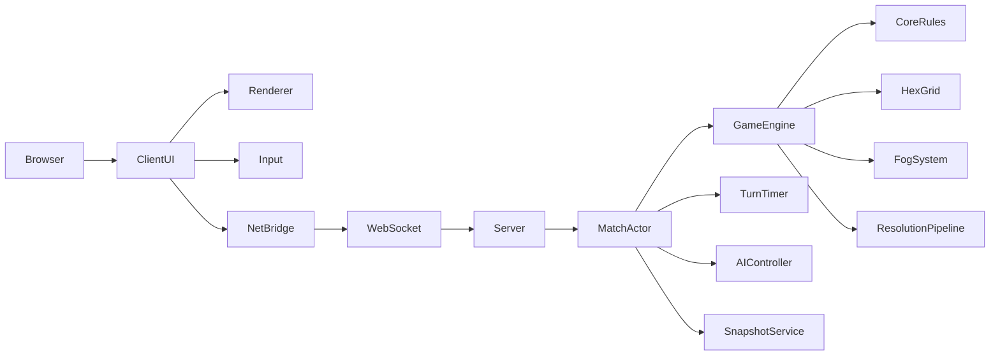
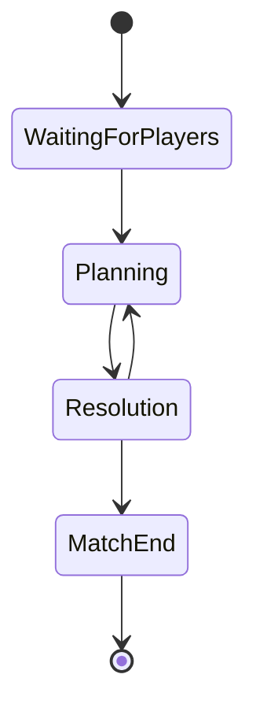

# Phase 3 Technical Spec  

## Authoritative Server Vertical Slice

---

## Important Scope Note

The Phase 2 preview listed several gameplay features for Phase 3:

- repair
- neutral camps
- line of sight
- spells / abilities
- lane waypoints
- server integration
- reconnection

That is too broad for a clean vertical slice.

For Phase 3, I recommend focusing on the highest-risk and highest-value next step:

> **Move the battle from local WASM to a Rust authoritative server.**

This slice proves the real multiplayer foundation before adding more gameplay complexity.

Gameplay features such as spells, repair, neutrals, and line of sight should move to Phase 4.

---

# 1. Phase 3 Goal

> **Run the existing Phase 2 battle on a Rust authoritative server. The browser client becomes a thin presentation and input layer. The server owns the game state, turn timer, order validation, AI fallback, fog filtering, and round resolution.**

This is the first true multiplayer-ready slice.

---

# 2. Why Server Now?

This is the right moment because:

1. The core battle loop already works locally.
2. The Rust core can be reused directly by the server.
3. Networking is a major architectural risk.
4. Future systems like spells, neutrals, repair, and fog of war will be easier to build if server authority already exists.
5. Cheating, synchronization, reconnection, and turn timers should be solved before adding more content.

---

# 3. Phase 3 Definition of Done

Phase 3 is complete when:

- [ ] A Rust server binary runs the battle simulation.
- [ ] The browser client connects to the server via WebSocket.
- [ ] A match can be created.
- [ ] Two players can join a 1v1 match.
- [ ] One player can also play against server AI.
- [ ] The server sends team-specific snapshots.
- [ ] Fog of war is enforced by the server.
- [ ] The client submits orders to the server.
- [ ] The server validates orders.
- [ ] The server owns the turn timer.
- [ ] If the timer expires, AI fills missing orders.
- [ ] The server resolves the round.
- [ ] The server broadcasts events and updated snapshots.
- [ ] The client animates events and renders the new state.
- [ ] A disconnected player can reconnect and receive the current state.
- [ ] AI vs AI matches can run server-side for testing.

---

# 4. Phase 3 Scope

## Included

### Server
- Rust server binary
- WebSocket endpoint
- match actor / session
- turn timer
- authoritative resolution
- AI fallback
- fog-filtered snapshots
- basic reconnection
- match creation endpoint

### Core Refactor
- separate `core`, `protocol`, and `server` crates
- server-side order submission
- team-specific snapshot generation
- state hash for debugging
- deterministic resolution preserved

### Client
- network bridge
- connect/join flow
- submit orders over WebSocket
- receive snapshots and events
- animate round resolution
- display server-authoritative timer

### Modes
- human vs human 1v1
- human vs AI 1v1
- AI vs AI server simulation for testing

---

## Not Included in Phase 3

These are deferred to Phase 4:

- repair mechanic
- neutral camps
- line-of-sight fog
- spells and abilities
- lane waypoints
- gold / XP
- items
- shop
- upgrades
- matchmaking
- ranking
- spectator mode
- full production deployment

---

# 5. High-Level Architecture



---

# 6. Target Runtime Model

## Client
The client no longer owns the simulation.

It does:
- render state
- collect player orders
- send orders to server
- receive events
- animate events
- display timer
- handle reconnection UI

It does not:
- resolve rounds
- compute authoritative fog
- decide winner
- enforce timer
- trust local state over server state

---

## Server
The server owns:
- match state
- player assignments
- turn phase
- planning timer
- order validation
- AI fallback
- fog visibility
- round resolution
- win condition
- event generation

---

# 7. Crate / Project Layout

Update the workspace to include a server and shared protocol.

```text
hexabellum/
├── Cargo.toml
├── crates/
│   ├── core/
│   │   ├── Cargo.toml
│   │   └── src/
│   │       ├── lib.rs
│   │       ├── hex.rs
│   │       ├── unit.rs
│   │       ├── state.rs
│   │       ├── orders.rs
│   │       ├── turn.rs
│   │       ├── ai.rs
│   │       ├── fog.rs
│   │       ├── event.rs
│   │       ├── minion_ai.rs
│   │       ├── tower_ai.rs
│   │       └── spawner.rs
│   │
│   ├── protocol/
│   │   ├── Cargo.toml
│   │   └── src/
│   │       └── lib.rs
│   │
│   ├── server/
│   │   ├── Cargo.toml
│   │   └── src/
│   │       ├── main.rs
│   │       ├── match_actor.rs
│   │       ├── player.rs
│   │       ├── api.rs
│   │       └── ws.rs
│   │
│   └── wasm/
│       ├── Cargo.toml
│       └── src/
│           └── lib.rs
│
└── web/
    ├── package.json
    ├── index.html
    └── src/
        ├── main.ts
        ├── game/
        │   ├── renderer.ts
        │   ├── input.ts
        │   ├── animator.ts
        │   ├── net.ts
        │   └── types.ts
        └── ui/
            └── hud.ts
```

---

# 8. Shared Protocol Crate

The protocol crate defines all messages exchanged between client and server.

## `crates/protocol/src/lib.rs`

```rust
use serde::{Serialize, Deserialize};

pub type MatchId = String;
pub type PlayerId = String;
pub type UnitId = u64;
pub type TeamId = u8;
pub type Round = u32;

#[derive(Debug, Clone, Serialize, Deserialize)]
pub struct HexDto {
    pub q: i32,
    pub r: i32,
}

#[derive(Debug, Clone, Serialize, Deserialize)]
pub struct UnitDto {
    pub id: UnitId,
    pub kind: String,
    pub team: TeamId,
    pub pos: HexDto,
    pub hp: u32,
    pub max_hp: u32,
    pub ap: u32,
    pub max_ap: u32,
    pub initiative: u32,
    pub attack_range: u32,
    pub vision_range: u32,
}

#[derive(Debug, Clone, Serialize, Deserialize)]
pub struct MapDto {
    pub radius: u32,
    pub walkable: Vec<HexDto>,
    pub obstacles: Vec<HexDto>,
}

#[derive(Debug, Clone, Serialize, Deserialize)]
pub struct SnapshotDto {
    pub match_id: MatchId,
    pub round: Round,
    pub phase: String,
    pub winner: Option<TeamId>,
    pub map: MapDto,
    pub units: Vec<UnitDto>,
    pub visible_hexes: Vec<HexDto>,
    pub controlled_units: Vec<UnitId>,
    pub deadline_unix_ms: Option<u64>,
    pub state_hash: String,
}

#[derive(Debug, Clone, Serialize, Deserialize)]
pub struct OrderDto {
    pub unit_id: UnitId,
    pub move_target: Option<HexDto>,
    pub action: ActionDto,
}

#[derive(Debug, Clone, Serialize, Deserialize)]
#[serde(tag = "type")]
pub enum ActionDto {
    Wait,
    Attack { target_id: UnitId },
}

#[derive(Debug, Clone, Serialize, Deserialize)]
#[serde(tag = "type")]
pub enum ClientMessage {
    Hello {
        player_id: PlayerId,
    },

    JoinMatch {
        match_id: MatchId,
        player_id: PlayerId,
    },

    SubmitOrders {
        round: Round,
        orders: Vec<OrderDto>,
    },

    Ping,
}

#[derive(Debug, Clone, Serialize, Deserialize)]
#[serde(tag = "type")]
pub enum ServerMessage {
    MatchJoined {
        match_id: MatchId,
        player_id: PlayerId,
        team: TeamId,
        snapshot: SnapshotDto,
    },

    RoundStarted {
        snapshot: SnapshotDto,
    },

    OrdersAccepted {
        round: Round,
    },

    RoundResolved {
        round: Round,
        events: serde_json::Value,
        snapshot: SnapshotDto,
    },

    MatchEnded {
        winner: Option<TeamId>,
        snapshot: SnapshotDto,
    },

    Error {
        message: String,
    },

    Pong,
}
```

---

# 9. Core Refactor for Server Use

The existing local `GameEngine` must be refactored into a server-friendly battle session.

## Required Changes

### Before Phase 3
`GameEngine`:
- owns local pending orders
- assumes team 0 is human
- resolves locally when client calls `end_turn`

### After Phase 3
`BattleSession`:
- owns authoritative state
- accepts orders per player/team
- validates controller ownership
- supports AI fallback per team
- produces team-specific snapshots
- produces state hash

---

## Suggested New Core API

```rust
pub struct BattleSession {
    state: GameState,
    round_orders: HashMap<UnitId, UnitOrder>,
    controllers: HashMap<UnitId, Controller>,
    config: BattleConfig,
}

pub enum Controller {
    Player(PlayerId),
    Ai,
    Automatic,
}

pub struct PlayerId(pub String);

impl BattleSession {
    pub fn new(config: BattleConfig) -> Self;

    pub fn state(&self) -> &GameState;

    pub fn current_round(&self) -> u32;

    pub fn phase(&self) -> Phase;

    pub fn submit_order(
        &mut self,
        player_id: &PlayerId,
        order: UnitOrder,
    ) -> Result<(), OrderError>;

    pub fn fill_missing_orders_with_ai(&mut self);

    pub fn resolve_round(&mut self) -> Vec<GameEvent>;

    pub fn snapshot_for_team(&self, team: TeamId) -> SnapshotDto;

    pub fn state_hash(&self) -> String;

    pub fn units_controlled_by_player(
        &self,
        player_id: &PlayerId,
    ) -> Vec<UnitId>;
}
```

---

# 10. Match Configuration

For Phase 3, keep configuration simple.

```rust
pub struct BattleConfig {
    pub map_radius: u32,
    pub heroes_per_team: u32,
    pub turn_duration_secs: u64,
    pub spawn_interval: u32,
    pub enable_ai_team_1: bool,
    pub resolve_early_if_all_orders_received: bool,
}
```

Default:

```rust
BattleConfig {
    map_radius: 6,
    heroes_per_team: 3,
    turn_duration_secs: 30,
    spawn_interval: 3,
    enable_ai_team_1: false,
    resolve_early_if_all_orders_received: true,
}
```

---

# 11. Player Assignment Model

Phase 3 uses the simplest competitive model:

## 1v1 Team Commander Mode

- Player A controls all heroes on Team 0.
- Player B controls all heroes on Team 1.
- Minions, towers, and spawners remain automatic.
- If a team has no human player, the server AI controls it.
- If a human does not submit orders before timer expiry, AI fills missing orders.

This model fits the current Phase 2 architecture and can evolve later into one-hero-per-player for 5v5.

---

# 12. Server Design

## Server Stack

Recommended:

- `axum`
- `tokio`
- `tokio-tungstenite` or Axum WebSocket support
- `serde_json`
- `uuid`
- `dashmap` or `tokio::sync::RwLock`
- `tracing`

---

## Server Responsibilities

### Match Registry
Creates and stores matches.

### Match Actor
Each match runs as an isolated async task or actor.

### Connection Manager
Maps connected players to match actors.

### Turn Scheduler
Owns the planning deadline and triggers resolution.

### Snapshot Service
Filters state per team based on fog.

---

# 13. Match Actor State Machine



---

## MatchActor Internal State

```rust
pub struct MatchActor {
    match_id: MatchId,
    session: BattleSession,
    players: HashMap<PlayerId, PlayerConnection>,
    team_assignments: HashMap<PlayerId, TeamId>,
    submitted_players: HashSet<PlayerId>,
    timer_deadline: Option<Instant>,
    phase: MatchPhase,
}
```

---

## Commands Handled by MatchActor

```rust
pub enum MatchCommand {
    PlayerConnected {
        player_id: PlayerId,
        sender: mpsc::Sender<ServerMessage>,
    },

    PlayerDisconnected {
        player_id: PlayerId,
    },

    SubmitOrders {
        player_id: PlayerId,
        round: Round,
        orders: Vec<OrderDto>,
    },

    TimerExpired,
}
```

---

# 14. Match Lifecycle

## 1. Create Match

Client calls:

```http
POST /api/matches
```

Server responds:

```json
{
  "match_id": "match_123"
}
```

---

## 2. Join Match

Client connects to:

```text
/ws/match/match_123?player_id=player_abc
```

Server assigns team:

- first human player → Team 0
- second human player → Team 1
- if only one human, Team 1 becomes AI

---

## 3. Start Match

When enough players are ready:

- server sends `MatchJoined`
- server sends `RoundStarted`
- planning timer starts

---

## 4. Submit Orders

Client sends:

```json
{
  "type": "SubmitOrders",
  "round": 3,
  "orders": [
    {
      "unit_id": 1,
      "move_target": { "q": -2, "r": 0 },
      "action": { "type": "Attack", "target_id": 6 }
    },
    {
      "unit_id": 2,
      "move_target": { "q": -3, "r": 1 },
      "action": { "type": "Wait" }
    }
  ]
}
```

Server validates and acknowledges:

```json
{
  "type": "OrdersAccepted",
  "round": 3
}
```

---

## 5. Timer Expires or All Orders Received

Server:
1. fills missing orders with AI
2. resolves round
3. updates fog
4. checks winner
5. sends `RoundResolved`

---

# 15. Order Validation

When a player submits orders, the server must validate:

## Basic Validation
- match is in planning phase
- submitted round matches current round
- player exists in match
- player controls the unit
- unit is alive
- unit is not stationary
- no duplicate orders for same unit

## Gameplay Validation
- move target is walkable
- move target is reachable with AP
- attack target exists
- attack target is alive
- attack target is enemy
- action cost is valid

For Phase 3, use two levels:

### Immediate Validation
Used for fast UX feedback:
- ownership
- alive status
- round correctness
- basic target validity

### Final Validation
Used during resolution:
- path validity after other movements
- range after movement
- AP after movement
- target still alive

Invalid orders are replaced safely:
- invalid move → remove move
- invalid action → replace with wait
- fully invalid → wait

---

# 16. Fog-Filtered Snapshots

This is critical.

The server must never send hidden enemy information to the client.

---

## Snapshot Rules

For a given team:

### Always Visible
- all own units
- own towers
- own spawners
- map terrain
- obstacles
- round number
- phase
- winner if match ended

### Conditionally Visible
Enemy units are visible only if their current hex is visible to the requesting team.

---

## Snapshot Generation

```rust
impl BattleSession {
    pub fn snapshot_for_team(&self, team: TeamId) -> SnapshotDto {
        let visible_hexes = self.state.fog.visible_hexes(team).clone();

        let visible_units: Vec<UnitDto> = self.state.units
            .values()
            .filter(|unit| {
                unit.team == team || visible_hexes.contains(&unit.pos)
            })
            .map(|unit| unit.to_dto())
            .collect();

        SnapshotDto {
            match_id: self.match_id.clone(),
            round: self.state.round,
            phase: self.state.phase.to_string(),
            winner: self.state.winner,
            map: self.map_dto(),
            units: visible_units,
            visible_hexes: visible_hexes.iter().map(|h| h.to_dto()).collect(),
            controlled_units: self.units_controlled_by_team(team),
            deadline_unix_ms: self.current_deadline_ms(),
            state_hash: self.state_hash(),
        }
    }
}
```

---

# 17. Turn Timer

The timer becomes server-authoritative.

## Timer Behavior

At round start:

```rust
let deadline = Instant::now() + Duration::from_secs(config.turn_duration_secs);
```

Server sends deadline to clients as UNIX milliseconds.

Client displays countdown locally based on server deadline.

---

## Timer Expiry

When timer expires:

1. server stops accepting orders for that round
2. server fills missing orders with AI
3. server resolves round
4. server starts next round if match not ended

---

## Early Resolution

If `resolve_early_if_all_orders_received` is enabled:

- if all human players have submitted orders,
- server may resolve immediately or after a short grace period.

Recommended grace period:

```text
1 second
```

This prevents accidental mis-clicks and gives clients time to display confirmation.

---

# 18. AI Integration

AI is now server-side.

## AI Responsibilities

### Full Team AI
If a team has no human player:
- AI controls all heroes on that team.

### Fallback AI
If a human player does not submit orders:
- AI fills missing hero orders only.

### Automatic Units
Minions, towers, and spawners are always server AI.

---

## Reuse Existing AI

The Phase 2 AI modules remain useful:

- `GameAI::generate_orders`
- `GameAI::generate_fallback_orders`
- `MinionAI`
- `TowerAI`
- `SpawnerSystem`

---

# 19. Reconnection

Phase 3 includes basic reconnection.

## Reconnection Requirements

A player can reconnect if:
- match still exists
- player_id is recognized
- match has not ended, or ended state can be shown

When a player reconnects:
1. server reattaches WebSocket sender
2. server sends current snapshot
3. server sends current phase and timer deadline
4. player can continue submitting orders if planning phase is active

---

## Minimal Player Identity

For Phase 3, use a simple client-generated player ID:

```ts
const playerId = localStorage.getItem("player_id") ?? crypto.randomUUID();
localStorage.setItem("player_id", playerId);
```

This is not secure production auth, but it is enough for the Phase 3 vertical slice.

---

# 20. State Hash

Add a state hash for debugging and future replays.

## Purpose
- detect client/server divergence
- verify deterministic simulation
- support future replay integrity

## Simple Hash Strategy

Hash:
- round
- unit IDs
- unit positions
- unit HP
- alive status
- phase
- winner

Use:
- `blake3`, or
- `sha2`, or
- `std::hash` for early prototype

Recommended:
```toml
blake3 = "1"
```

---

# 21. Client Network Bridge

The client needs a new network layer.

## `web/src/game/net.ts`

```ts
export type UnitId = number;
export type TeamId = number;

export interface HexDto {
  q: number;
  r: number;
}

export interface UnitDto {
  id: UnitId;
  kind: string;
  team: TeamId;
  pos: HexDto;
  hp: number;
  max_hp: number;
  ap: number;
  max_ap: number;
  initiative: number;
  attack_range: number;
  vision_range: number;
}

export interface MapDto {
  radius: number;
  walkable: HexDto[];
  obstacles: HexDto[];
}

export interface SnapshotDto {
  match_id: string;
  round: number;
  phase: string;
  winner: TeamId | null;
  map: MapDto;
  units: UnitDto[];
  visible_hexes: HexDto[];
  controlled_units: UnitId[];
  deadline_unix_ms: number | null;
  state_hash: string;
}

export type ActionDto =
  | { type: "Wait" }
  | { type: "Attack"; target_id: UnitId };

export interface OrderDto {
  unit_id: UnitId;
  move_target: HexDto | null;
  action: ActionDto;
}

export type ServerMessage =
  | {
      type: "MatchJoined";
      match_id: string;
      player_id: string;
      team: TeamId;
      snapshot: SnapshotDto;
    }
  | {
      type: "RoundStarted";
      snapshot: SnapshotDto;
    }
  | {
      type: "OrdersAccepted";
      round: number;
    }
  | {
      type: "RoundResolved";
      round: number;
      events: any[];
      snapshot: SnapshotDto;
    }
  | {
      type: "MatchEnded";
      winner: TeamId | null;
      snapshot: SnapshotDto;
    }
  | {
      type: "Error";
      message: string;
    }
  | {
      type: "Pong";
    };

export class NetworkBridge {
  private ws: WebSocket | null = null;
  private handlers: ((msg: ServerMessage) => void)[] = [];

  connect(matchId: string, playerId: string): Promise<void> {
    return new Promise((resolve, reject) => {
      const url = `ws://localhost:3000/ws/match/${matchId}?player_id=${playerId}`;
      this.ws = new WebSocket(url);

      this.ws.onopen = () => resolve();
      this.ws.onerror = () => reject(new Error("WebSocket error"));

      this.ws.onmessage = (event) => {
        const msg = JSON.parse(event.data) as ServerMessage;
        for (const handler of this.handlers) {
          handler(msg);
        }
      };
    });
  }

  onMessage(handler: (msg: ServerMessage) => void): void {
    this.handlers.push(handler);
  }

  submitOrders(round: number, orders: OrderDto[]): void {
    this.send({
      type: "SubmitOrders",
      round,
      orders,
    });
  }

  ping(): void {
    this.send({ type: "Ping" });
  }

  private send(msg: any): void {
    if (!this.ws || this.ws.readyState !== WebSocket.OPEN) {
      throw new Error("WebSocket not connected");
    }

    this.ws.send(JSON.stringify(msg));
  }
}
```

---

# 22. Client Flow Update

## Phase 2 Client Flow
1. load WASM
2. create local game
3. player clicks units
4. client calls `end_turn`
5. client renders result

## Phase 3 Client Flow
1. create/join match
2. connect WebSocket
3. receive snapshot
4. render board
5. collect orders
6. submit orders to server
7. wait for server resolution
8. receive events + snapshot
9. animate events
10. apply final snapshot

---

# 23. Client State Model

The client should maintain:

```ts
interface ClientState {
  connected: boolean;
  matchId: string | null;
  playerId: string;
  team: TeamId | null;
  snapshot: SnapshotDto | null;
  pendingOrders: Map<UnitId, OrderDto>;
  selectedUnit: UnitId | null;
  mode: InputMode;
  lastEvents: any[];
}
```

---

# 24. Client Rendering Rules

## Visible Units
Render only units present in the server snapshot.

Do not cache hidden enemy units from previous rounds unless you intentionally implement “last seen” ghosts. For Phase 3, keep it simple:

- if unit is not in snapshot, do not render it.

## Fog
Render fog using `snapshot.visible_hexes`.

## Controlled Units
Only allow selecting units listed in `snapshot.controlled_units`.

---

# 25. Order UX for Phase 3

Keep the same interaction model as Phase 2:

1. select controlled hero
2. choose move target
3. choose attack target or wait
4. repeat for other heroes
5. submit orders

But now the final action is:

```text
Submit Orders
```

not local `End Turn`.

The server decides when the round resolves.

---

# 26. HUD Updates

Add or update these HUD elements:

- connection status
- match ID
- player team
- round number
- server timer countdown
- orders submitted indicator
- waiting for opponent indicator
- error banner
- reconnecting banner

---

# 27. Server API

## REST Endpoints

### Create Match

```http
POST /api/matches
```

Response:

```json
{
  "match_id": "match_123",
  "ws_url": "/ws/match/match_123"
}
```

---

### Match Info

```http
GET /api/matches/:match_id
```

Response:

```json
{
  "match_id": "match_123",
  "phase": "Planning",
  "round": 2,
  "players": 1,
  "has_ai_team_1": true
}
```

---

## WebSocket Endpoint

```text
GET /ws/match/:match_id?player_id=...
```

---

# 28. Server Skeleton

## `crates/server/src/main.rs`

```rust
use axum::{
    routing::{get, post},
    Router,
};
use std::net::SocketAddr;
use std::sync::Arc;
use tokio::sync::RwLock;

mod api;
mod ws;
mod match_actor;
mod player;

#[tokio::main]
async fn main() {
    tracing_subscriber::fmt::init();

    let app_state = Arc::new(RwLock::new(api::AppState::new()));

    let app = Router::new()
        .route("/api/matches", post(api::create_match))
        .route("/api/matches/:match_id", get(api::match_info))
        .route("/ws/match/:match_id", get(ws::ws_handler))
        .with_state(app_state);

    let addr = SocketAddr::from(([127, 0, 0, 1], 3000));
    tracing::info!("server listening on {}", addr);

    axum::serve(
        tokio::net::TcpListener::bind(addr).await.unwrap(),
        app,
    )
    .await
    .unwrap();
}
```

---

# 29. Match Actor Skeleton

```rust
use tokio::sync::mpsc;

pub struct MatchActorHandle {
    tx: mpsc::Sender<MatchCommand>,
}

impl MatchActorHandle {
    pub fn new(match_id: String, config: BattleConfig) -> Self {
        let (tx, rx) = mpsc::channel(128);

        tokio::spawn(async move {
            let mut actor = MatchActor::new(match_id, config);
            actor.run(rx).await;
        });

        Self { tx }
    }

    pub async fn send(&self, cmd: MatchCommand) {
        let _ = self.tx.send(cmd).await;
    }
}

impl MatchActor {
    async fn run(&mut self, mut rx: mpsc::Receiver<MatchCommand>) {
        while let Some(cmd) = rx.recv().await {
            match cmd {
                MatchCommand::PlayerConnected { player_id, sender } => {
                    self.handle_player_connected(player_id, sender);
                }
                MatchCommand::PlayerDisconnected { player_id } => {
                    self.handle_player_disconnected(player_id);
                }
                MatchCommand::SubmitOrders { player_id, round, orders } => {
                    self.handle_submit_orders(player_id, round, orders);
                }
                MatchCommand::TimerExpired => {
                    self.handle_timer_expired();
                }
            }
        }
    }
}
```

---

# 30. Timer Implementation

Use Tokio sleep.

When planning starts:

```rust
let deadline = Instant::now() + self.config.turn_duration;
self.timer_deadline = Some(deadline);

let tx = self.command_tx.clone();
tokio::spawn(async move {
    tokio::time::sleep_until(deadline).await;
    let _ = tx.send(MatchCommand::TimerExpired).await;
});
```

Important:
- store round number with timer
- ignore stale timer messages from previous rounds

Better:

```rust
enum MatchCommand {
    TimerExpired { round: u32 },
}
```

---

# 31. Determinism Rules

The server must remain deterministic.

## Required Rules
- use seeded RNG
- no system time inside simulation
- stable ordering by unit ID and initiative
- no dependence on hashmap iteration order
- all AI decisions use only current deterministic state

## State Hash Timing
Generate state hash:
- after match setup
- after each resolution
- included in every snapshot

---

# 32. Testing Strategy

Phase 3 needs more integration testing than previous phases.

---

## Unit Tests
- protocol serialization
- snapshot fog filtering
- order validation
- controller assignment
- state hash stability

---

## Integration Tests
- create match
- connect two mock WebSocket clients
- submit orders
- receive resolution
- verify fog-hidden units are not leaked

---

## AI vs AI Test
Run a headless server match:
- Team 0 AI
- Team 1 AI
- simulate 50 rounds
- verify match terminates or reaches round cap

---

## Reconnection Test
- connect player
- disconnect player
- reconnect player
- verify current snapshot received

---

## Timer Test
- connect player
- submit no orders
- wait for timer
- verify AI fallback and round resolution

---

# 33. Migration Plan from Phase 2

## Step 1 — Create Protocol Crate
Move DTOs and messages into shared crate.

## Step 2 — Refactor GameEngine
Replace local-only engine with `BattleSession`.

## Step 3 — Add Snapshot Filtering
Implement team-specific snapshots.

## Step 4 — Build Server Binary
Add Axum server and WebSocket endpoint.

## Step 5 — Replace Client WASM Calls
Client no longer calls `end_turn` locally.

## Step 6 — Add Network Bridge
Implement WebSocket client.

## Step 7 — Move Timer to Server
Client only displays server deadline.

## Step 8 — Add Reconnection
Persist player ID and reattach socket.

---

# 34. Acceptance Criteria

| # | Criterion | Status |
|---|-----------|--------|
| 1 | Server starts and exposes WebSocket endpoint | ☐ |
| 2 | Client can create a match | ☐ |
| 3 | Client can join a match | ☐ |
| 4 | First human player is assigned Team 0 | ☐ |
| 5 | Second human player is assigned Team 1 | ☐ |
| 6 | If only one human, enemy team becomes AI | ☐ |
| 7 | Server sends initial snapshot | ☐ |
| 8 | Snapshot contains only visible enemy units | ☐ |
| 9 | Client can submit orders | ☐ |
| 10 | Server rejects orders for units player does not control | ☐ |
| 11 | Server rejects stale round orders | ☐ |
| 12 | Server acknowledges accepted orders | ☐ |
| 13 | Server resolves round when all orders submitted | ☐ |
| 14 | Server resolves round when timer expires | ☐ |
| 15 | AI fills missing orders | ☐ |
| 16 | Server broadcasts events after resolution | ☐ |
| 17 | Server sends updated snapshot after resolution | ☐ |
| 18 | Client animates events | ☐ |
| 19 | Client applies final snapshot | ☐ |
| 20 | Reconnecting player receives current state | ☐ |
| 21 | AI vs AI server simulation works | ☐ |
| 22 | State hash is included in snapshots | ☐ |

---

# 35. Risks and Mitigations

## Risk 1: Fog Leakage
Server accidentally sends hidden enemy units.

### Mitigation
- snapshot filtering tests
- never send full state to clients
- separate public snapshot from internal state

---

## Risk 2: Timer Desynchronization
Client timer differs from server.

### Mitigation
- server sends absolute deadline
- client only counts down locally
- server is always authoritative

---

## Risk 3: WebSocket Disconnects
Players disconnect during planning.

### Mitigation
- keep match running
- AI fallback on timer expiry
- reconnect support

---

## Risk 4: Order Validation Complexity
Orders become invalid after movement changes.

### Mitigation
- validate basic rules on submission
- validate final rules during resolution
- gracefully downgrade invalid orders

---

## Risk 5: Client/Server State Drift
Client animation state diverges from server snapshot.

### Mitigation
- always apply final server snapshot after animation
- treat snapshot as source of truth

---

# 36. Out of Scope

Again, Phase 3 does **not** include:

- repair
- spells
- abilities
- neutral camps
- line-of-sight blocking
- gold / XP
- items
- shop
- upgrades
- matchmaking
- ranked ladder
- spectator mode
- production authentication
- deployment infrastructure

---

# 37. Phase 4 Preview

After Phase 3 is stable, Phase 4 can focus on gameplay expansion:

- repair mechanic
- hero abilities / spells
- cooldowns
- energy or mana resource
- neutral camps
- line-of-sight vision
- lane waypoints for minions
- better target priority
- richer event animation

Because the server is already authoritative, those features can be added safely.

---

# 38. Final Recommendation

Phase 3 should be:

> **Authoritative Server Slice**

This is the most valuable next vertical slice because it proves:
- Rust server authority
- WebSocket synchronization
- fog privacy
- turn timers
- AI fallback
- reconnection
- multiplayer readiness

Once this is stable, gameplay expansion becomes much safer.