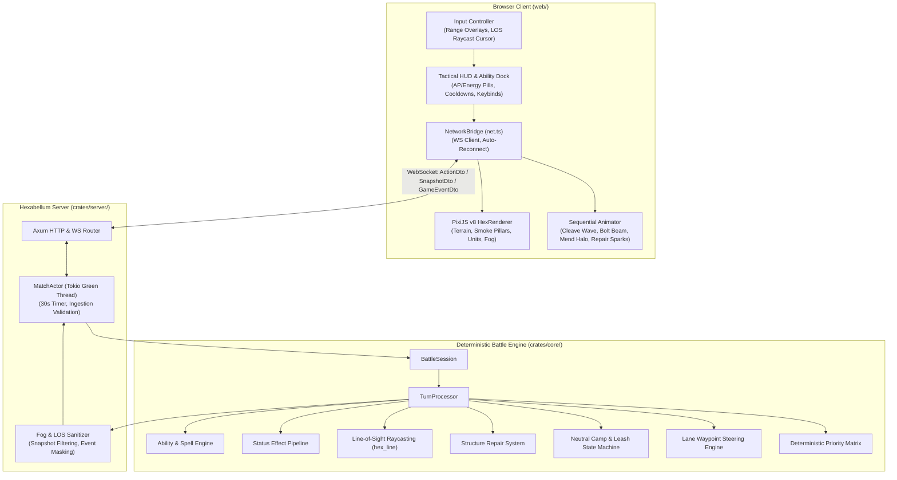
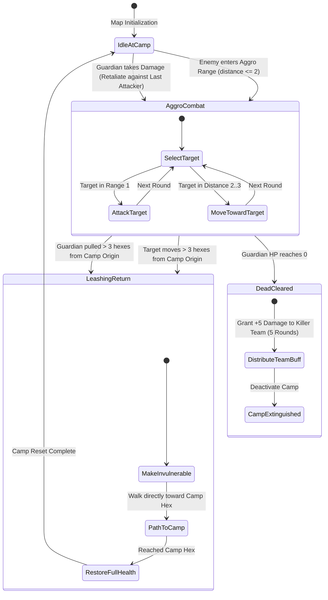

# Phase 4 Technical Spec — Hero Abilities, Structure Repair, Neutral Camps, Line-of-Sight Vision & Lane Steering

## Architectural Decision Record (ADR-005): Hero Abilities, Status Effect Engine, Line-of-Sight Cube Raycasting, Neutral Camp Leash Mechanics & Lane-Aware Minion Steering

### Context

Hexabellum Phase 3 established a server-authoritative multiplayer foundation: the simulation executes within a native Rust Tokio server (`crates/server`), state synchronization occurs over WebSockets with 30-second turn timers and 1.0-second grace periods, and snapshots are cryptographically audited via BLAKE3 hashes. However, the underlying battle mechanics remained limited to the basic prototype:
1. Heroes possessed only basic melee attacks and movement, lacking active abilities, energy gating, or cooldown management.
2. Structures (towers and spawners) were strictly expendable with no mechanism for heroes to repair or fortify them.
3. Fog of war was computed as a naive radial distance query (`spiral(radius)`), disregarding line of sight and permitting units to see through solid walls, boulders, and terrain obstacles.
4. Minions advanced using naive coordinate translation toward the opposing map boundary rather than following strategic lane corridors, causing erratic bunching and erratic pathfinding.
5. Combat lacked jungle objectives, dynamic buff incentives, or neutral entities.

Phase 4 elevates Hexabellum into a genuine tactical MOBA battle slice. This transition requires introducing hero abilities, a composable status effect pipeline, true line-of-sight raycasting, neutral camps with leash dynamics, and lane waypoint navigation—all while strictly preserving deterministic server execution and preventing fog-of-war data leaks.

### Decisions

| System Area | Decision | Rationale & Trade-Offs |
|---|---|---|
| **Resource & Gating Model** | **Two-Tier Resource Gating: AP + Energy + Cooldowns** | Moving costs 1 AP/hex; basic attacks cost 1 AP; abilities consume 1 AP plus a dedicated Energy pool (e.g. 2–3 Energy out of 5 max) and incur multi-round cooldowns (2–3 rounds). Energy regenerates by +1 at round start; cooldowns decrement by 1 at round start. This prevents ability spamming while preserving meaningful tactical trade-offs between moving, basic attacking, repairing, and casting. |
| **Ability & Effect Framework** | **Data-Driven `SpellDef` & Composable `EffectDef` Pipeline** | Spells are declared via data structures (`SpellDef`) containing target mode (`SelfOnly`, `EnemyUnit`, `AllyUnit`), range, AP/energy costs, cooldown, LOS requirement, and a vector of discrete `EffectDef` instances (`Damage`, `Heal`, `ApplyStatus`). This decouples combat rules from unit structs and enables rapid tuning without refactoring the core execution pipeline. |
| **Status Effect Engine** | **Round-Duration Stat Modifiers with Fixed-Order Ticking** | Status instances (`StatusInstance`) modify core attributes (`AttackDamage`, `AttackRange`, `VisionRange`) via delta values (`+5`, `-2`). Durations decrement deterministically at round start before action processing. Expired statuses are purged and emit `StatusExpired` events. Effective stats are calculated dynamically (`effective_attack_damage()`, `effective_vision_range()`) ensuring clean composability. |
| **Line-of-Sight Raycasting** | **Cube-Coordinate Float Interpolation with Epsilon Nudge** | True line-of-sight is computed using cube coordinate fractional interpolation (`hex_line`) with a canonical `1e-6` floating-point epsilon offset to eliminate boundary vertex rounding ambiguities (Red Blob Games standard). Ranged attacks, tower bombardment, and spells with `requires_line_of_sight: true` must trace an unobstructed ray between source and target hexes. Obstacles on intermediate hexes block the ray; source and target hexes are excluded from the obstruction check. |
| **Terrain Obstacle Decoupling** | **Independent Movement and Vision Obstruction Flags** | The map model is upgraded from a simple `HashSet<HexCoord>` to `Obstacle { coords, blocks_movement, blocks_vision }`. This enables distinct tactical terrain: dense stone walls (block both), smoke/fog pillars (block vision only, allowing concealed passage), and low boulders/chasms (block movement only, allowing ranged projectile sightlines). |
| **Line-of-Sight Fog of War** | **Raycast-Masked Asymmetric Vision & Server-Side Sanitization** | Team visibility is calculated per round by taking the effective vision radius of all living allied entities and filtering out any hex lacking an unobstructed line of sight. The server filters client `SnapshotDto` payloads so that units, projectiles, and camp states concealed by vision blockers are omitted from transmission. |
| **Structure Repair Mechanic** | **First-Class `Action::Repair` Action for Allied Heroes** | Repairing is implemented as an explicit hero action rather than a spell: costs 1 AP, 0 Energy, 0 Cooldown, range 1 (adjacent hex), restores 20 HP to an allied damaged structure (capped at `max_hp`). Towers and spawners cannot repair themselves. This forces tactical decisions between offensive engagement and base defense. |
| **Neutral Camps & Leash Dynamics** | **Camp Guard State Machine with 3-Hex Leash & Full Reset** | Neutral guardians occupy static camp shrines (`(0, 3)` and `(0, -3)`). Guardians aggro if an enemy enters distance 2 or inflicts damage. If a provoked guardian is kited beyond a 3-hex leash radius from its camp origin, it breaks combat, becomes invulnerable, paths back to its spawn tile, and restores 100% HP. This prevents trivial kiting exploits while rewarding coordinated camp clears. |
| **Objective Buff Reward** | **Team-Wide Hero Damage Buff (+5 Damage for 5 Rounds)** | Defeating a neutral guardian awards all living heroes on the killer's team a `neutral_damage_buff` status (+5 attack damage for 5 rounds). The event is announced globally via `NeutralCampCleared` and `TeamBuffApplied`, creating a high-priority contested objective in the mid-game. |
| **Lane Waypoint Steering** | **Sequential Waypoint Pathfinding with Local Congestion Fallback** | Minions follow a dedicated waypoint corridor (`(-5, 0) -> (-3, 0) -> (0, 0) -> (3, 0) -> (5, 0)`). Minions advance their target waypoint index when within 1 hex of the current waypoint. Pathfinding uses A* toward the current waypoint, with an automatic fallback to lateral adjacent hexes if the direct lane tile is occupied by an allied unit. |
| **Target Priority & Tie-Breaking** | **Multi-Tier Deterministic Evaluation Matrix** | Targeting is strictly formalized: Minions prioritize opposing Minions > Heroes > Structures; Towers prioritize Minions > Heroes > Structures; AI Heroes prioritize Lowest-HP Visible Enemy Hero > Minions > Structures; Neutral Guardians prioritize Last Attacker > Nearest Enemy in Aggro Range. Deterministic tie-breaking orders by `(PriorityClass, Distance, CurrentHP, UnitId)`. |
| **Client Ability Dock & HUD** | **PixiJS v8 Tactical Range Overlays & Keyboard Shortcuts** | The browser HUD is expanded with an Ability Dock displaying AP/Energy pills, cooldown sweeps, range boundary rings, and real-time LOS validation indicators (cyan = valid target, gray = out of range, slashed red = blocked by LOS). Keybindings: `[Q]` Hero Ability, `[F]` Repair Structure, `[A]` Attack, `[Space]` Wait. |

---

## Phase 4 Goal

> **Transform Hexabellum into a deep, competitive tactical battle slice by introducing hero active abilities, two-tier resource gating (AP + Energy + Cooldowns), structure repair, line-of-sight raycasting, neutral objective camps with leash mechanics, and lane-aware minion navigation—fully integrated into the server-authoritative architecture established in Phase 3.**

Phase 3 proved network synchronization, server authority, and anti-cheat event sanitization.  
Phase 4 injects rich tactical decision-making, strategic objective control, and spatial positioning into the gameplay loop.

### What Phase 4 Adds

| Subsystem | Component | Description & Architectural Role |
|---|---|---|
| **Resource System** | **Energy & Cooldown Engine** | Units manage `energy` (0–5), `max_energy`, `energy_regen` (+1/round), and `cooldowns: HashMap<SpellId, u32>`. |
| **Hero Abilities** | **Active Spell Catalog** | Vanguard: **Cleave** (AOE melee wave); Ranger: **Bolt** (ranged sniper beam); Warden: **Mend** (allied hero heal). |
| **Status Effect Engine** | **Dynamic Stat Buff/Debuff System** | Composable `StatusInstance` records that alter attack damage, vision, or attack range with automatic round-start duration ticking. |
| **True Line of Sight** | **Cube Raycasting Algorithm** | Fractional cube coordinate ray tracing (`hex_line`) with `1e-6` epsilon offsets to determine visibility through terrain obstacles. |
| **Tactical Terrain** | **Independent Obstacle Flags** | Obstacles support distinct `blocks_movement` and `blocks_vision` properties, introducing vision-blocking walls and smoke pillars. |
| **LOS Fog of War** | **Raycast-Masked Fog Engine** | Fog calculation combines vision radius with unobstructed LOS checks. Server strictly sanitizes hidden units from client snapshots. |
| **Structure Repair** | **Hero Field Engineering** | Heroes adjacent to damaged towers or spawners spend 1 AP to restore 20 HP, enabling base fortification. |
| **Neutral Camps** | **Jungle Guardians & Camps** | Two neutral camps (`(0, 3)` and `(0, -3)`) hosting Guardians with aggro detection, leash limits, and full reset behavior. |
| **Objective Buff** | **Team Damage Augmentation** | Slaying a neutral guardian awards living allied heroes +5 attack damage for 5 rounds via `TeamBuffApplied`. |
| **Lane Navigation** | **Waypoint Minion Steering** | Minions navigate along a 5-node central lane corridor, dynamically advancing waypoints and resolving traffic congestion. |
| **Target Priority** | **Deterministic Priority Matrix** | Formalized targeting rules with deterministic tie-breaking (`PriorityClass -> Distance -> HP -> UnitId`). |
| **Client Tactical HUD** | **PixiJS v8 Ability Dock & Overlays** | Ability dock, energy indicators, cooldown sweep shaders, range overlays, LOS obstruction warnings, and hotkey controls (`Q`, `F`, `A`, `Space`). |

---

### Definition of Done (DoD)

- [x] `crates/core` defines `SpellDef`, `EffectDef`, `TargetingMode`, `StatusDef`, `StatusInstance`, and `StatModifier`.
- [x] `Unit` struct includes `energy`, `max_energy`, `energy_regen`, `cooldowns`, `statuses`, `lane_id`, `waypoint_index`, `aggro_range`, and `last_attacker`.
- [x] Vanguard possesses active ability **Cleave** (1 AP, 3 Energy, 3 Cooldown, Radius 1 AOE 15 damage).
- [x] Ranger possesses active ability **Bolt** (1 AP, 2 Energy, 2 Cooldown, Range 3, Enemy, requires LOS, 25 damage).
- [x] Warden possesses active ability **Mend** (1 AP, 2 Energy, 2 Cooldown, Range 2, Ally Hero, requires LOS, 20 heal).
- [x] Energy regenerates at round start (+1 up to `max_energy`); active cooldowns decrement at round start (`saturating_sub(1)`).
- [x] Status durations decrement at round start; expired statuses are removed and emit `StatusExpired` events.
- [x] Effective stats (`effective_attack_damage()`, `effective_vision_range()`, `effective_attack_range()`) dynamically incorporate active status modifiers.
- [x] `Obstacle` struct supports independent `blocks_movement: bool` and `blocks_vision: bool` flags.
- [x] `hex_line()` algorithm correctly computes cube-coordinate raycasting with epsilon offset (`1e-6`), preventing boundary vertex jitter.
- [x] `has_line_of_sight()` verifies that intermediate hexes between source and destination are free of vision-blocking obstacles.
- [x] Ranged basic attacks, tower bombardment, and spells with `requires_line_of_sight: true` are blocked when line of sight is obstructed.
- [x] Fog of war uses line-of-sight raycasting; hexes within radius but behind vision blockers remain concealed in darkness.
- [x] Server sanitizes `SnapshotDto` and `RoundResolved` event streams so that units, spells, and neutral camp states hidden by LOS are never leaked.
- [x] Heroes adjacent to damaged allied towers or spawners can execute `Action::Repair`, restoring 20 HP for 1 AP.
- [x] Structure repair rejects full-health structures, enemy structures, non-structure units, and non-adjacent units.
- [x] Two neutral camps exist at `(0, 3)` and `(0, -3)`, each containing a Neutral Guardian.
- [x] Neutral guardians attack enemies within aggro range (2 hexes) or retaliate against units that attack them.
- [x] If a guardian's target moves beyond 3 hexes from the camp origin or the guardian is pulled beyond 3 hexes, it leashes, becomes invulnerable, walks back to camp, and resets to 100% HP.
- [x] Slaying a neutral guardian emits `NeutralCampCleared` and awards living heroes on the killer's team a +5 attack damage buff for 5 rounds.
- [x] Minions follow central lane waypoints (`(-5, 0) -> (-3, 0) -> (0, 0) -> (3, 0) -> (5, 0)`), advancing waypoints when distance <= 1.
- [x] Minions utilize local detour pathfinding when their forward lane waypoint hex is obstructed by allied units.
- [x] Minion, tower, hero AI, and neutral targeting strictly enforce the deterministic priority matrix and tie-breaking hierarchy.
- [x] Server validates `Cast` and `Repair` orders upon WebSocket ingestion, rejecting orders with insufficient resources, active cooldowns, or missing LOS.
- [x] Browser client displays Ability Dock with AP/energy costs, cooldown counters, valid target range highlights, and red-slash LOS warnings.
- [x] Sequential animator renders distinct visual effects for Cleave (radial shockwave), Bolt (lightning beam), Mend (emerald halo), and Repair (golden wrench/sparks).
- [x] 50-round headless AI vs AI integration test with abilities, repair, neutrals, and LOS passes with 100% bitwise BLAKE3 hash determinism.

---

## Architecture Delta from Phase 3

```
Phase 3 (Server Authoritative Multiplayer)    Phase 4 (Tactical Depth Vertical Slice)
──────────────────────────────────────────    ──────────────────────────────────────────
Hero Actions: Move, Basic Attack, Wait       → Hero Actions: Move, Attack, Cast Spell, Repair, Wait
Resource Model: AP only (3 AP per round)      → Resource Model: AP (3) + Energy (5) + Cooldowns (2-3 rounds)
Stat System: Static base attributes           → Stat System: Dynamic effective stats via StatusInstance pipeline
Vision: Naive circular radius distance        → Vision: True Line-of-Sight cube raycasting (blocks walls & smoke)
Obstacles: Uniform movement blockers          → Obstacles: Decoupled (dense wall, smoke pillar, low boulder)
Structures: Passive targets for destruction   → Structures: Repairable by adjacent heroes (20 HP / 1 AP)
Map Entities: Heroes, Minions, Towers         → Map Entities: Heroes, Minions, Towers, Neutral Guardians
Minion Navigation: Straight-line translation   → Minion Navigation: Lane waypoints with collision detour fallback
Jungle / Objectives: None                     → Jungle / Objectives: 2 Neutral Camps with 3-hex leash & team buff
Targeting: Ad-hoc nearest-target heuristics   → Targeting: Formalized deterministic multi-tier priority matrix
HUD: Basic selection, timer, move/attack      → HUD: Ability dock, energy bar, cooldown sweeps, LOS targeting cone
Event Stream: Move, Attack, Tower, Death      → Event Stream: + SpellCast, Heal, Repair, Status, NeutralBuff
```

---

## High-Level System Architecture & Flow



---

### Turn Lifecycle & Resolution Pipeline

```mermaid
sequenceDiagram
    autonumber
    participant C as Client (Player)
    participant S as Server (MatchActor)
    participant E as Core (TurnProcessor)
    participant V as Vision (LOS Raycaster)

    Note over S, E: Round Start: Resource & Status Phase
    E->>E: Reset AP (units -> max_ap)
    E->>E: Regenerate Energy (energy += energy_regen, capped at max_energy)
    E->>E: Decrement Cooldowns (cooldowns -= 1)
    E->>E: Tick Status Durations (purge expired, emit StatusExpired)
    E->>E: Execute Spawners (spawn lane minions at (-5,0) and (5,0))
    E->>V: Compute LOS Fog of War per team
    E->>S: Generate Sanitized SnapshotDto per team
    S->>C: Broadcast Sanitized SnapshotDto + RoundStarted Event

    Note over C, S: Planning Phase (30s Server Deadline)
    C->>C: Select Hero -> Select Ability [Q] or Repair [F]
    C->>C: Validate Range & Trace Client LOS Raycast
    C->>S: Submit ActionDto (Move + Cast / Repair / Attack)
    S->>S: Fast Pre-Validation (AP, Energy, Cooldown, Knowledge, Range, LOS)

    Note over S, E: Resolution Phase (Initiative Order)
    S->>E: Resolve Orders in BattleSession
    loop For Each Unit in Initiative Order
        E->>E: Skip if Dead
        E->>E: Execute Movement (Cooperative Swap & Collision Check)
        alt Action is Cast
            E->>V: Verify Line of Sight to Target
            E->>E: Spend AP & Energy, Set Cooldown
            E->>E: Apply Effect (Damage, Heal, ApplyStatus)
            E->>E: Emit SpellCast, HealApplied, DamageDealt
        else Action is Repair
            E->>E: Validate Range 1 & Allied Damaged Structure
            E->>E: Spend 1 AP, Restore 20 HP (capped at max_hp)
            E->>E: Emit StructureRepaired
        else Action is Attack
            E->>V: Verify LOS for Ranged / Tower Attacks
            E->>E: Spend 1 AP, Deal Damage
            E->>E: Emit UnitAttacked / TowerAttacked
        end
        E->>E: Process Deaths & Killer Attribution
        opt Unit is Neutral Guardian
            E->>E: Apply Team Damage Buff to Killer Team Living Heroes
            E->>E: Emit NeutralCampCleared & TeamBuffApplied
        end
    end
    E->>E: Neutral AI Phase (Check Leash Radius 3; Reset HP if Broken)
    E->>V: Recompute LOS Fog of War
    E->>S: Compute BLAKE3 State Hash & Sanitize Event Batch
    S->>C: Broadcast Sanitized Event Stream + RoundResolved DTO
    C->>C: Sequential Event Animator plays SFX, Particle FX & Updates HUD
```

---

### Neutral Camp Guardian State Machine & Leash Cycle



---

## Hex Map & Arena Topology

The battle arena is a radius-6 regular hexagonal grid containing 127 hex cells. It features mirrored bases, vision-blocking monoliths, tactical smoke pillars, elevated low boulders, central lane waypoints, and two neutral jungle sanctuaries.

### Map Coordinates & Entity Placements

```text
                                ( 0, -6)
                        (-1, -5)        ( 1, -5)
                (-2, -4)        ( 0, -4)        ( 2, -4)
        (-3, -3)        (-1, -3)  [CAMP B] ( 1, -3)        ( 3, -3)
(-4, -2)        (-2, -2)[SMOKE] ( 0, -2)[WALL]  ( 2, -2)        ( 4, -2)
        (-3, -1)        (-1, -1)        ( 1, -1)        ( 3, -1)
[T0 SPAWN]      [T0 TOWER]      ( 0,  0)[MID]   [T1 TOWER]      [T1 SPAWN]
 (-5, 0)         (-3, 0)                         ( 3, 0)          ( 5, 0)
        (-3,  1)        (-1,  1)        ( 1,  1)        ( 3,  1)
(-4,  2)        (-2,  2)        ( 0,  2)[WALL]  ( 2,  2)[SMOKE] ( 4,  2)
        (-3,  3)        (-1,  3)  [CAMP A] ( 1,  3)        ( 3,  3)
                (-2,  4)        ( 0,  4)        ( 2,  4)
                        (-1,  5)        ( 1,  5)
                                ( 0,  6)
```

| Entity / Landmark | Coordinates `(q, r)` | Team | Attributes & Role |
|---|---|---|---|
| **Team 0 Spawner** | `(-5, 0)` | Team 0 | 150 HP, spawns 2 minions every 2 rounds, repairable, does not attack. |
| **Team 0 Tower** | `(-3, 0)` | Team 0 | 100 HP, attack range 3, 25 damage, requires LOS, repairable. |
| **Team 0 Vanguard** | `(-4, -1)` | Team 0 | Hero A: 140 HP, 3 AP, 5 Energy, Cleave (AOE melee damage). |
| **Team 0 Ranger** | `(-4, 0)` | Team 0 | Hero B: 90 HP, 3 AP, 5 Energy, Bolt (ranged sniper beam). |
| **Team 0 Warden** | `(-4, 1)` | Team 0 | Hero C: 100 HP, 3 AP, 6 Energy, Mend (allied hero heal). |
| **Team 1 Spawner** | `(5, 0)` | Team 1 | 150 HP, spawns 2 minions every 2 rounds, repairable, does not attack. |
| **Team 1 Tower** | `(3, 0)` | Team 1 | 100 HP, attack range 3, 25 damage, requires LOS, repairable. |
| **Team 1 Vanguard** | `(4, -1)` | Team 1 | Hero A: 140 HP, 3 AP, 5 Energy, Cleave (AOE melee damage). |
| **Team 1 Ranger** | `(4, 0)` | Team 1 | Hero B: 90 HP, 3 AP, 5 Energy, Bolt (ranged sniper beam). |
| **Team 1 Warden** | `(4, 1)` | Team 1 | Hero C: 100 HP, 3 AP, 6 Energy, Mend (allied hero heal). |
| **Neutral Camp Alpha** | `(0, 3)` | Neutral | Camp shrine hosting Neutral Guardian Alpha (60 HP, 15 DMG). |
| **Neutral Camp Beta** | `(0, -3)` | Neutral | Camp shrine hosting Neutral Guardian Beta (60 HP, 15 DMG). |
| **Dense Stone Wall** | `(0, 2)` & `(0, -2)` | None | **Blocks Movement: Yes, Blocks Vision: Yes**. Solid monoliths flank mid lane. |
| **Smoke Pillar** | `(2, 2)` & `(-2, -2)` | None | **Blocks Movement: No, Blocks Vision: Yes**. Ambush clouds; walkthrough cover. |
| **Low Boulders** | `(0, 1)` & `(0, -1)` | None | **Blocks Movement: Yes, Blocks Vision: No**. Obstacles allowing ranged projectile fire. |
| **Lane Waypoints** | `(-5, 0) -> (-3, 0) -> (0, 0) -> (3, 0) -> (5, 0)` | Shared | Central lane navigation corridor for automated minion waves. |

---

## 1. Core Engine Specifications (`crates/core`)

### 1.1 Unit Model & Dynamic Stat System (`crates/core/src/unit.rs`)

```rust
use crate::hex::HexCoord;
use crate::ability::SpellId;
use crate::status::StatusInstance;
use serde::{Deserialize, Serialize};
use std::collections::HashMap;

pub type UnitId = u64;
pub type TeamId = u8;
pub type LaneId = String;

pub const TEAM_0: TeamId = 0;
pub const TEAM_1: TeamId = 1;
pub const TEAM_NEUTRAL: TeamId = 255;

#[derive(Debug, Clone, Copy, PartialEq, Eq, Hash, Serialize, Deserialize)]
pub enum UnitKind {
    Hero,
    Minion,
    Tower,
    Spawner,
    NeutralGuardian,
}

#[derive(Debug, Clone, Serialize, Deserialize)]
pub struct Unit {
    pub id: UnitId,
    pub kind: UnitKind,
    pub team: TeamId,
    pub pos: HexCoord,
    pub hp: u32,
    pub max_hp: u32,

    // AP Resource
    pub ap: u32,
    pub max_ap: u32,
    pub initiative: u32,

    // Base Combat Stats
    pub attack_damage: u32,
    pub attack_range: u32,
    pub vision_range: u32,

    // Phase 4 Additions: Energy & Cooldowns
    pub energy: u32,
    pub max_energy: u32,
    pub energy_regen: u32,
    pub cooldowns: HashMap<SpellId, u32>,

    // Status Modifiers
    pub statuses: Vec<StatusInstance>,

    // Lane Waypoint Navigation
    pub lane_id: Option<LaneId>,
    pub waypoint_index: Option<usize>,

    // Combat AI Memory
    pub aggro_range: u32,
    pub last_attacker: Option<UnitId>,
}

impl Unit {
    /// Create Vanguard (Hero A - Frontline Cleaver)
    pub fn new_vanguard(id: UnitId, team: TeamId, pos: HexCoord, initiative: u32) -> Self {
        let mut cooldowns = HashMap::new();
        cooldowns.insert("cleave".to_string(), 0);

        Self {
            id,
            kind: UnitKind::Hero,
            team,
            pos,
            hp: 140,
            max_hp: 140,
            ap: 3,
            max_ap: 3,
            initiative,
            attack_damage: 18,
            attack_range: 1,
            vision_range: 3,
            energy: 5,
            max_energy: 5,
            energy_regen: 1,
            cooldowns,
            statuses: Vec::new(),
            lane_id: None,
            waypoint_index: None,
            aggro_range: 3,
            last_attacker: None,
        }
    }

    /// Create Ranger (Hero B - Ranged Sniper)
    pub fn new_ranger(id: UnitId, team: TeamId, pos: HexCoord, initiative: u32) -> Self {
        let mut cooldowns = HashMap::new();
        cooldowns.insert("bolt".to_string(), 0);

        Self {
            id,
            kind: UnitKind::Hero,
            team,
            pos,
            hp: 90,
            max_hp: 90,
            ap: 3,
            max_ap: 3,
            initiative,
            attack_damage: 16,
            attack_range: 2,
            vision_range: 4,
            energy: 5,
            max_energy: 5,
            energy_regen: 1,
            cooldowns,
            statuses: Vec::new(),
            lane_id: None,
            waypoint_index: None,
            aggro_range: 4,
            last_attacker: None,
        }
    }

    /// Create Warden (Hero C - Support Healer)
    pub fn new_warden(id: UnitId, team: TeamId, pos: HexCoord, initiative: u32) -> Self {
        let mut cooldowns = HashMap::new();
        cooldowns.insert("mend".to_string(), 0);

        Self {
            id,
            kind: UnitKind::Hero,
            team,
            pos,
            hp: 100,
            max_hp: 100,
            ap: 3,
            max_ap: 3,
            initiative,
            attack_damage: 12,
            attack_range: 1,
            vision_range: 4,
            energy: 6,
            max_energy: 6,
            energy_regen: 1,
            cooldowns,
            statuses: Vec::new(),
            lane_id: None,
            waypoint_index: None,
            aggro_range: 3,
            last_attacker: None,
        }
    }

    /// Create Neutral Guardian
    pub fn new_neutral_guardian(id: UnitId, pos: HexCoord) -> Self {
        Self {
            id,
            kind: UnitKind::NeutralGuardian,
            team: TEAM_NEUTRAL,
            pos,
            hp: 60,
            max_hp: 60,
            ap: 2,
            max_ap: 2,
            initiative: 2,
            attack_damage: 15,
            attack_range: 1,
            vision_range: 3,
            energy: 0,
            max_energy: 0,
            energy_regen: 0,
            cooldowns: HashMap::new(),
            statuses: Vec::new(),
            lane_id: None,
            waypoint_index: None,
            aggro_range: 2,
            last_attacker: None,
        }
    }

    pub fn is_alive(&self) -> bool {
        self.hp > 0
    }

    pub fn is_structure(&self) -> bool {
        matches!(self.kind, UnitKind::Tower | UnitKind::Spawner)
    }

    pub fn is_hero(&self) -> bool {
        matches!(self.kind, UnitKind::Hero)
    }

    pub fn reset_ap(&mut self) {
        self.ap = self.max_ap;
    }

    pub fn regenerate_energy(&mut self) {
        self.energy = (self.energy + self.energy_regen).min(self.max_energy);
    }

    pub fn decrement_cooldowns(&mut self) {
        for cooldown in self.cooldowns.values_mut() {
            *cooldown = cooldown.saturating_sub(1);
        }
    }

    pub fn is_spell_ready(&self, spell_id: &str) -> bool {
        self.cooldowns.get(spell_id).copied().unwrap_or(u32::MAX) == 0
    }

    pub fn trigger_cooldown(&mut self, spell_id: &str, duration: u32) {
        self.cooldowns.insert(spell_id.to_string(), duration);
    }

    pub fn spend_ap(&mut self, cost: u32) -> bool {
        if self.ap >= cost {
            self.ap -= cost;
            true
        } else {
            false
        }
    }

    pub fn spend_energy(&mut self, cost: u32) -> bool {
        if self.energy >= cost {
            self.energy -= cost;
            true
        } else {
            false
        }
    }

    // Dynamic Effective Stats
    pub fn effective_attack_damage(&self) -> u32 {
        let mut damage = self.attack_damage as i32;
        for status in &self.statuses {
            for modifier in &status.modifiers {
                if modifier.stat == crate::status::StatKind::AttackDamage {
                    damage += modifier.value;
                }
            }
        }
        damage.max(0) as u32
    }

    pub fn effective_vision_range(&self) -> u32 {
        let mut range = self.vision_range as i32;
        for status in &self.statuses {
            for modifier in &status.modifiers {
                if modifier.stat == crate::status::StatKind::VisionRange {
                    range += modifier.value;
                }
            }
        }
        range.max(0) as u32
    }

    pub fn effective_attack_range(&self) -> u32 {
        let mut range = self.attack_range as i32;
        for status in &self.statuses {
            for modifier in &status.modifiers {
                if modifier.stat == crate::status::StatKind::AttackRange {
                    range += modifier.value;
                }
            }
        }
        range.max(0) as u32
    }
}
```

---

### 1.2 Ability & Spell Catalog (`crates/core/src/ability.rs`)

```rust
use crate::hex::HexCoord;
use crate::status::StatusDef;
use crate::unit::{Unit, UnitId};
use serde::{Deserialize, Serialize};

pub type SpellId = String;

#[derive(Debug, Clone, Copy, PartialEq, Eq, Serialize, Deserialize)]
pub enum TargetingMode {
    SelfOnly,
    EnemyUnit,
    AllyUnit,
    UnitAny,
    Hex,
}

#[derive(Debug, Clone, PartialEq, Eq, Serialize, Deserialize)]
pub enum EffectKind {
    Damage,
    Heal,
    ApplyStatus,
}

#[derive(Debug, Clone, Serialize, Deserialize)]
pub struct EffectDef {
    pub kind: EffectKind,
    pub amount: u32,
    pub radius: Option<u32>,
    pub status: Option<StatusDef>,
}

#[derive(Debug, Clone, Serialize, Deserialize)]
pub struct SpellDef {
    pub id: SpellId,
    pub name: String,
    pub ap_cost: u32,
    pub energy_cost: u32,
    pub cooldown: u32,
    pub range: u32,
    pub min_range: u32,
    pub targeting: TargetingMode,
    pub requires_line_of_sight: bool,
    pub effects: Vec<EffectDef>,
}

#[derive(Debug, Clone, PartialEq, Eq, Serialize, Deserialize)]
pub enum SpellTarget {
    None,
    Unit(UnitId),
    Hex(HexCoord),
}

pub struct SpellCatalog;

impl SpellCatalog {
    pub fn get(id: &str) -> Option<SpellDef> {
        match id {
            "cleave" => Some(SpellDef {
                id: "cleave".to_string(),
                name: "Cleave".to_string(),
                ap_cost: 1,
                energy_cost: 3,
                cooldown: 3,
                range: 0,
                min_range: 0,
                targeting: TargetingMode::SelfOnly,
                requires_line_of_sight: false,
                effects: vec![EffectDef {
                    kind: EffectKind::Damage,
                    amount: 15,
                    radius: Some(1),
                    status: None,
                }],
            }),
            "bolt" => Some(SpellDef {
                id: "bolt".to_string(),
                name: "Bolt".to_string(),
                ap_cost: 1,
                energy_cost: 2,
                cooldown: 2,
                range: 3,
                min_range: 1,
                targeting: TargetingMode::EnemyUnit,
                requires_line_of_sight: true,
                effects: vec![EffectDef {
                    kind: EffectKind::Damage,
                    amount: 25,
                    radius: None,
                    status: None,
                }],
            }),
            "mend" => Some(SpellDef {
                id: "mend".to_string(),
                name: "Mend".to_string(),
                ap_cost: 1,
                energy_cost: 2,
                cooldown: 2,
                range: 2,
                min_range: 1,
                targeting: TargetingMode::AllyUnit,
                requires_line_of_sight: true,
                effects: vec![EffectDef {
                    kind: EffectKind::Heal,
                    amount: 20,
                    radius: None,
                    status: None,
                }],
            }),
            _ => None,
        }
    }
}
```

---

### 1.3 Status Effect System (`crates/core/src/status.rs`)

```rust
use serde::{Deserialize, Serialize};

#[derive(Debug, Clone, Copy, PartialEq, Eq, Serialize, Deserialize)]
pub enum StatKind {
    AttackDamage,
    VisionRange,
    AttackRange,
}

#[derive(Debug, Clone, PartialEq, Eq, Serialize, Deserialize)]
pub struct StatModifier {
    pub stat: StatKind,
    pub value: i32,
}

#[derive(Debug, Clone, PartialEq, Eq, Serialize, Deserialize)]
pub struct StatusDef {
    pub id: String,
    pub duration_rounds: u32,
    pub modifiers: Vec<StatModifier>,
}

#[derive(Debug, Clone, PartialEq, Eq, Serialize, Deserialize)]
pub struct StatusInstance {
    pub def_id: String,
    pub remaining_rounds: u32,
    pub modifiers: Vec<StatModifier>,
}

impl StatusInstance {
    pub fn from_def(def: &StatusDef) -> Self {
        Self {
            def_id: def.id.clone(),
            remaining_rounds: def.duration_rounds,
            modifiers: def.modifiers.clone(),
        }
    }

    /// Decrement round duration. Returns true if expired.
    pub fn tick(&mut self) -> bool {
        self.remaining_rounds = self.remaining_rounds.saturating_sub(1);
        self.remaining_rounds == 0
    }
}

pub fn neutral_camp_damage_buff_def() -> StatusDef {
    StatusDef {
        id: "neutral_damage_buff".to_string(),
        duration_rounds: 5,
        modifiers: vec![StatModifier {
            stat: StatKind::AttackDamage,
            value: 5,
        }],
    }
}
```

---

### 1.4 True Line of Sight & Cube Raycasting (`crates/core/src/vision.rs`)

```rust
use crate::hex::{HexCoord, HexMap};
use serde::{Deserialize, Serialize};
use std::collections::HashSet;

#[derive(Debug, Clone, Copy, PartialEq, Eq, Serialize, Deserialize)]
pub struct Obstacle {
    pub coords: HexCoord,
    pub blocks_movement: bool,
    pub blocks_vision: bool,
}

impl Obstacle {
    pub fn wall(coords: HexCoord) -> Self {
        Self { coords, blocks_movement: true, blocks_vision: true }
    }

    pub fn smoke(coords: HexCoord) -> Self {
        Self { coords, blocks_movement: false, blocks_vision: true }
    }

    pub fn boulder(coords: HexCoord) -> Self {
        Self { coords, blocks_movement: true, blocks_vision: false }
    }
}

/// Convert fractional cube coordinates back to axial integer coordinates with round-to-nearest
fn cube_round(q: f64, r: f64, s: f64) -> HexCoord {
    let mut rq = q.round();
    let mut rr = r.round();
    let mut rs = s.round();

    let q_diff = (rq - q).abs();
    let r_diff = (rr - r).abs();
    let s_diff = (rs - s).abs();

    if q_diff > r_diff && q_diff > s_diff {
        rq = -rr - rs;
    } else if r_diff > s_diff {
        rr = -rq - rs;
    } else {
        rs = -rq - rr;
    }

    HexCoord::new(rq as i32, rr as i32)
}

/// Fractional cube raycasting with epsilon offset (Red Blob Games canonical)
pub fn hex_line(from: HexCoord, to: HexCoord) -> Vec<HexCoord> {
    let n = from.distance(&to);
    if n == 0 {
        return vec![from];
    }

    let mut results = Vec::with_capacity(n as usize + 1);

    // Epsilon perturbation guarantees deterministic line traversal avoiding vertex edge jitter
    const EPSILON: f64 = 1e-6;

    let fq = from.q as f64 + EPSILON;
    let fr = from.r as f64 + EPSILON;
    let fs = (-from.q - from.r) as f64 - 2.0 * EPSILON;

    let tq = to.q as f64 + EPSILON;
    let tr = to.r as f64 + EPSILON;
    let ts = (-to.q - to.r) as f64 - 2.0 * EPSILON;

    for i in 0..=n {
        let t = i as f64 / n as f64;
        let q = fq + (tq - fq) * t;
        let r = fr + (tr - fr) * t;
        let s = fs + (ts - fs) * t;
        results.push(cube_round(q, r, s));
    }

    results
}

/// Verify unobstructed line of sight between two hexes
pub fn has_line_of_sight(
    vision_blockers: &HashSet<HexCoord>,
    from: HexCoord,
    to: HexCoord,
) -> bool {
    if from == to {
        return true;
    }

    let line = hex_line(from, to);

    // Skip the source hex (index 0) and destination hex (last index)
    // Vision blockers only obstruct if they are strictly between source and target
    if line.len() <= 2 {
        return true;
    }

    for hex in &line[1..line.len() - 1] {
        if vision_blockers.contains(hex) {
            return false;
        }
    }

    true
}

/// Compute complete LOS fog of war for a team
pub fn compute_team_los_fog(
    vision_blockers: &HashSet<HexCoord>,
    map_radius: u32,
    all_units: &[crate::unit::Unit],
    team: crate::unit::TeamId,
) -> HashSet<HexCoord> {
    let mut visible_hexes = HashSet::new();

    for unit in all_units {
        if unit.team != team || !unit.is_alive() {
            continue;
        }

        // Unit's own tile is always visible
        visible_hexes.insert(unit.pos);

        let vision_range = unit.effective_vision_range();
        let candidate_hexes = unit.pos.spiral(vision_range);

        for hex in candidate_hexes {
            if hex.distance(&HexCoord::new(0, 0)) > map_radius {
                continue;
            }

            if has_line_of_sight(vision_blockers, unit.pos, hex) {
                visible_hexes.insert(hex);
            }
        }
    }

    visible_hexes
}
```

---

### 1.5 Structure Repair System (`crates/core/src/repair.rs`)

```rust
use crate::event::GameEvent;
use crate::unit::{Unit, UnitId};

pub const REPAIR_AP_COST: u32 = 1;
pub const REPAIR_AMOUNT: u32 = 20;
pub const REPAIR_RANGE: u32 = 1;

#[derive(Debug, Clone, PartialEq, Eq)]
pub enum RepairValidationError {
    HeroDead,
    NotAHero,
    TargetNotFound,
    TargetDead,
    TargetNotStructure,
    TargetNotAllied,
    TargetFullHealth,
    OutOfRange,
    InsufficientAP,
}

pub fn validate_repair(
    repairer: &Unit,
    target: &Unit,
) -> Result<(), RepairValidationError> {
    if !repairer.is_alive() {
        return Err(RepairValidationError::HeroDead);
    }
    if !repairer.is_hero() {
        return Err(RepairValidationError::NotAHero);
    }
    if !target.is_alive() {
        return Err(RepairValidationError::TargetDead);
    }
    if !target.is_structure() {
        return Err(RepairValidationError::TargetNotStructure);
    }
    if repairer.team != target.team {
        return Err(RepairValidationError::TargetNotAllied);
    }
    if target.hp >= target.max_hp {
        return Err(RepairValidationError::TargetFullHealth);
    }
    if repairer.pos.distance(&target.pos) > REPAIR_RANGE {
        return Err(RepairValidationError::OutOfRange);
    }
    if repairer.ap < REPAIR_AP_COST {
        return Err(RepairValidationError::InsufficientAP);
    }

    Ok(())
}

pub fn execute_repair(
    repairer: &mut Unit,
    target: &mut Unit,
) -> Option<GameEvent> {
    if validate_repair(repairer, target).is_err() {
        return None;
    }

    repairer.spend_ap(REPAIR_AP_COST);
    let original_hp = target.hp;
    target.hp = (target.hp + REPAIR_AMOUNT).min(target.max_hp);
    let healed_amount = target.hp - original_hp;

    Some(GameEvent::StructureRepaired {
        repairer_id: repairer.id,
        target_id: target.id,
        amount: healed_amount,
        target_hp_remaining: target.hp,
    })
}
```

---

### 1.6 Neutral Camp & Leash State Machine (`crates/core/src/neutral.rs`)

```rust
use crate::event::GameEvent;
use crate::hex::HexCoord;
use crate::status::neutral_camp_damage_buff_def;
use crate::unit::{TeamId, Unit, UnitId};

pub const NEUTRAL_LEASH_RADIUS: u32 = 3;
pub const NEUTRAL_AGGRO_RADIUS: u32 = 2;

#[derive(Debug, Clone, PartialEq, Eq)]
pub enum NeutralCampState {
    Active,
    Cleared,
}

#[derive(Debug, Clone)]
pub struct NeutralCamp {
    pub id: String,
    pub camp_pos: HexCoord,
    pub guardian_id: UnitId,
    pub state: NeutralCampState,
}

impl NeutralCamp {
    pub fn new(id: String, camp_pos: HexCoord, guardian_id: UnitId) -> Self {
        Self {
            id,
            camp_pos,
            guardian_id,
            state: NeutralCampState::Active,
        }
    }

    /// Check leash constraints. If breached, guardian resets to camp origin with 100% HP.
    pub fn check_leash_and_reset(
        &self,
        guardian: &mut Unit,
        target: Option<&Unit>,
    ) -> bool {
        if self.state == NeutralCampState::Cleared || !guardian.is_alive() {
            return false;
        }

        let guardian_dist_from_camp = guardian.pos.distance(&self.camp_pos);
        let target_dist_from_camp = target
            .map(|t| t.pos.distance(&self.camp_pos))
            .unwrap_or(0);

        let breached = guardian_dist_from_camp > NEUTRAL_LEASH_RADIUS
            || (target.is_some() && target_dist_from_camp > NEUTRAL_LEASH_RADIUS);

        if breached {
            // Leash broken: drop target, return to origin, full heal
            guardian.pos = self.camp_pos;
            guardian.hp = guardian.max_hp;
            guardian.last_attacker = None;
            return true;
        }

        false
    }

    /// Process guardian death, reward killer team with +5 damage buff for 5 rounds
    pub fn handle_guardian_death(
        &mut self,
        killer_team: TeamId,
        all_units: &mut [Unit],
        events: &mut Vec<GameEvent>,
    ) {
        if self.state == NeutralCampState::Cleared {
            return;
        }

        self.state = NeutralCampState::Cleared;

        events.push(GameEvent::NeutralCampCleared {
            camp_id: self.id.clone(),
            killer_team,
        });

        let buff_def = neutral_camp_damage_buff_def();

        // Apply buff to all currently living heroes on the killer team
        for unit in all_units.iter_mut() {
            if unit.team == killer_team && unit.is_hero() && unit.is_alive() {
                unit.statuses.retain(|s| s.def_id != buff_def.id);
                unit.statuses.push(crate::status::StatusInstance::from_def(&buff_def));

                events.push(GameEvent::StatusApplied {
                    unit_id: unit.id,
                    status_id: buff_def.id.clone(),
                    duration_rounds: buff_def.duration_rounds,
                });
            }
        }

        events.push(GameEvent::TeamBuffApplied {
            team: killer_team,
            buff_id: buff_def.id,
            duration_rounds: buff_def.duration_rounds,
        });
    }
}
```

---

### 1.7 Lane Waypoint Steering & Navigation (`crates/core/src/lane.rs`)

```rust
use crate::hex::{HexCoord, HexMap};
use crate::unit::{TeamId, Unit, TEAM_0, TEAM_1};

#[derive(Debug, Clone)]
pub struct LaneDef {
    pub id: String,
    pub waypoints: Vec<HexCoord>,
}

impl LaneDef {
    pub fn central_lane() -> Self {
        Self {
            id: "mid".to_string(),
            waypoints: vec![
                HexCoord::new(-5, 0), // T0 Spawner
                HexCoord::new(-3, 0), // T0 Tower
                HexCoord::new(0, 0),  // Mid Contest Point
                HexCoord::new(3, 0),  // T1 Tower
                HexCoord::new(5, 0),  // T1 Spawner
            ],
        }
    }

    pub fn start_waypoint_index_for_team(&self, team: TeamId) -> usize {
        if team == TEAM_0 {
            0
        } else {
            self.waypoints.len() - 1
        }
    }

    pub fn next_waypoint_index(&self, current: usize, team: TeamId) -> usize {
        if team == TEAM_0 {
            (current + 1).min(self.waypoints.len() - 1)
        } else {
            current.saturating_sub(1)
        }
    }

    pub fn is_at_final_waypoint(&self, current: usize, team: TeamId) -> bool {
        if team == TEAM_0 {
            current >= self.waypoints.len() - 1
        } else {
            current == 0
        }
    }

    /// Progress waypoint if within 1 hex of current waypoint
    pub fn update_minion_waypoint(&self, minion: &mut Unit) {
        if let Some(current_idx) = minion.waypoint_index {
            let target_wp = self.waypoints[current_idx];
            if minion.pos.distance(&target_wp) <= 1 {
                if !self.is_at_final_waypoint(current_idx, minion.team) {
                    minion.waypoint_index = Some(self.next_waypoint_index(current_idx, minion.team));
                }
            }
        }
    }
}
```

---

### 1.8 Target Priority & Deterministic Tie-Breaking (`crates/core/src/priority.rs`)

```rust
use crate::unit::{Unit, UnitId, UnitKind};

#[derive(Debug, Clone, Copy, PartialEq, Eq, PartialOrd, Ord)]
pub enum PriorityClass {
    Highest = 0,
    High = 1,
    Medium = 2,
    Low = 3,
    Lowest = 4,
}

pub struct TargetScore {
    pub priority: PriorityClass,
    pub distance: u32,
    pub hp: u32,
    pub unit_id: UnitId,
}

impl TargetScore {
    /// Deterministic comparison tuple
    pub fn to_key(&self) -> (PriorityClass, u32, u32, UnitId) {
        (self.priority, self.distance, self.hp, self.unit_id)
    }
}

pub fn evaluate_minion_target_priority(target: &Unit) -> PriorityClass {
    match target.kind {
        UnitKind::Minion => PriorityClass::Highest,
        UnitKind::Hero => PriorityClass::High,
        UnitKind::Tower | UnitKind::Spawner => PriorityClass::Medium,
        UnitKind::NeutralGuardian => PriorityClass::Lowest,
    }
}

pub fn evaluate_tower_target_priority(target: &Unit) -> PriorityClass {
    match target.kind {
        UnitKind::Minion => PriorityClass::Highest,
        UnitKind::Hero => PriorityClass::High,
        _ => PriorityClass::Lowest,
    }
}

pub fn evaluate_hero_ai_target_priority(target: &Unit) -> PriorityClass {
    match target.kind {
        UnitKind::Hero => PriorityClass::Highest,
        UnitKind::Minion => PriorityClass::High,
        UnitKind::Tower | UnitKind::Spawner => PriorityClass::Medium,
        UnitKind::NeutralGuardian => PriorityClass::Lowest,
    }
}

pub fn evaluate_neutral_target_priority(
    target: &Unit,
    last_attacker: Option<UnitId>,
) -> PriorityClass {
    if Some(target.id) == last_attacker {
        PriorityClass::Highest
    } else {
        PriorityClass::High
    }
}
```

---

### 1.9 TurnProcessor Overhaul (`crates/core/src/turn.rs`)

The `TurnProcessor` executes the complete deterministic 8-stage battle loop.

```rust
use crate::ability::{EffectKind, SpellCatalog, SpellTarget};
use crate::event::GameEvent;
use crate::hex::{HexCoord, HexMap};
use crate::lane::LaneDef;
use crate::neutral::NeutralCamp;
use crate::orders::{Action, UnitOrder};
use crate::repair::execute_repair;
use crate::unit::{TeamId, Unit, UnitId, UnitKind};
use crate::vision::{compute_team_los_fog, has_line_of_sight};
use std::collections::{HashMap, HashSet};

pub struct TurnResolutionOutput {
    pub events: Vec<GameEvent>,
    pub team_0_visible_hexes: HashSet<HexCoord>,
    pub team_1_visible_hexes: HashSet<HexCoord>,
}

pub struct TurnProcessor;

impl TurnProcessor {
    pub fn process_round(
        round: u32,
        map: &HexMap,
        vision_blockers: &HashSet<HexCoord>,
        units: &mut Vec<Unit>,
        camps: &mut [NeutralCamp],
        lane: &LaneDef,
        staged_orders: HashMap<UnitId, UnitOrder>,
    ) -> TurnResolutionOutput {
        let mut events = Vec::new();
        events.push(GameEvent::RoundStarted { round });

        // Stage 1: Round Start Maintenance (AP, Energy, Cooldowns, Statuses)
        for unit in units.iter_mut() {
            if !unit.is_alive() {
                continue;
            }

            unit.reset_ap();
            unit.regenerate_energy();
            unit.decrement_cooldowns();

            // Status Ticking
            let mut expired_statuses = Vec::new();
            unit.statuses.retain_mut(|status| {
                if status.tick() {
                    expired_statuses.push(status.def_id.clone());
                    false
                } else {
                    true
                }
            });

            for expired in expired_statuses {
                events.push(GameEvent::StatusExpired {
                    unit_id: unit.id,
                    status_id: expired,
                });
            }
        }

        // Stage 2: Lane Waypoint Progression for Minions
        for unit in units.iter_mut() {
            if unit.is_alive() && unit.kind == UnitKind::Minion {
                lane.update_minion_waypoint(unit);
            }
        }

        // Stage 3: Initiative Sorting for Execution
        let mut execution_order: Vec<UnitId> = units
            .iter()
            .filter(|u| u.is_alive())
            .map(|u| (u.initiative, u.id))
            .collect::<Vec<_>>()
            .into_iter()
            .map(|(_, id)| id)
            .collect();

        // Stable sort descending by initiative, ascending by unit ID
        execution_order.sort_by(|&a_id, &b_id| {
            let u_a = units.iter().find(|u| u.id == a_id).unwrap();
            let u_b = units.iter().find(|u| u.id == b_id).unwrap();
            u_b.initiative
                .cmp(&u_a.initiative)
                .then_with(|| a_id.cmp(&b_id))
        });

        // Stage 4: Order Execution Pipeline
        for unit_id in execution_order {
            let unit_idx = match units.iter().position(|u| u.id == unit_id) {
                Some(idx) => idx,
                None => continue,
            };

            if !units[unit_idx].is_alive() {
                continue;
            }

            let order = staged_orders.get(&unit_id).cloned().unwrap_or(UnitOrder {
                unit_id,
                move_target: None,
                action: Action::Wait,
            });

            // 4.1 Movement Resolution
            if let Some(target_pos) = order.move_target {
                let current_pos = units[unit_idx].pos;
                let move_cost = current_pos.distance(&target_pos);

                let is_tile_free = !units.iter().any(|u| u.is_alive() && u.pos == target_pos);
                let is_walkable = map.is_walkable(&target_pos);

                if is_walkable && is_tile_free && units[unit_idx].ap >= move_cost {
                    units[unit_idx].spend_ap(move_cost);
                    units[unit_idx].pos = target_pos;

                    events.push(GameEvent::UnitMoved {
                        unit_id,
                        from: current_pos,
                        to: target_pos,
                    });
                }
            }

            // 4.2 Action Resolution
            match order.action {
                Action::Wait => {}
                Action::Attack { target_id } => {
                    Self::resolve_attack(unit_idx, target_id, units, vision_blockers, &mut events);
                }
                Action::Cast { spell_id, target } => {
                    Self::resolve_cast(unit_idx, &spell_id, target, units, vision_blockers, &mut events);
                }
                Action::Repair { target_id } => {
                    Self::resolve_repair(unit_idx, target_id, units, &mut events);
                }
            }

            // 4.3 Death Resolution & Camp Reward Trigger
            Self::cleanup_deaths(units, camps, &mut events);
        }

        // Stage 5: Neutral Camp Leash & Reset Verification
        for camp in camps.iter_mut() {
            if let Some(guardian) = units.iter_mut().find(|u| u.id == camp.guardian_id) {
                let target = guardian
                    .last_attacker
                    .and_then(|t_id| units.iter().find(|u| u.id == t_id));
                camp.check_leash_and_reset(guardian, target);
            }
        }

        // Stage 6: Line-of-Sight Fog Calculation
        let team_0_fog = compute_team_los_fog(vision_blockers, map.radius, units, 0);
        let team_1_fog = compute_team_los_fog(vision_blockers, map.radius, units, 1);

        TurnResolutionOutput {
            events,
            team_0_visible_hexes: team_0_fog,
            team_1_visible_hexes: team_1_fog,
        }
    }

    fn resolve_attack(
        attacker_idx: usize,
        target_id: UnitId,
        units: &mut [Unit],
        vision_blockers: &HashSet<HexCoord>,
        events: &mut Vec<GameEvent>,
    ) {
        let attacker = &units[attacker_idx];
        let target_idx = match units.iter().position(|u| u.id == target_id) {
            Some(idx) => idx,
            None => return,
        };

        if !units[target_idx].is_alive() || attacker.team == units[target_idx].team {
            return;
        }

        let dist = attacker.pos.distance(&units[target_idx].pos);
        if dist > attacker.effective_attack_range() || attacker.ap < 1 {
            return;
        }

        // Check LOS for ranged attacks (range > 1)
        if dist > 1 && !has_line_of_sight(vision_blockers, attacker.pos, units[target_idx].pos) {
            return;
        }

        let attacker_id = attacker.id;
        let damage = attacker.effective_attack_damage();
        units[attacker_idx].spend_ap(1);

        units[target_idx].hp = units[target_idx].hp.saturating_sub(damage);
        units[target_idx].last_attacker = Some(attacker_id);

        events.push(GameEvent::UnitAttacked {
            attacker_id,
            target_id,
            damage,
            target_hp_remaining: units[target_idx].hp,
        });
    }

    fn resolve_cast(
        caster_idx: usize,
        spell_id: &str,
        target: SpellTarget,
        units: &mut [Unit],
        vision_blockers: &HashSet<HexCoord>,
        events: &mut Vec<GameEvent>,
    ) {
        let spell = match SpellCatalog::get(spell_id) {
            Some(s) => s,
            None => return,
        };

        let caster = &units[caster_idx];
        if caster.ap < spell.ap_cost
            || caster.energy < spell.energy_cost
            || !caster.is_spell_ready(spell_id)
        {
            return;
        }

        // Target Validation & Effect Resolution
        match target {
            SpellTarget::None | SpellTarget::Hex(_) if spell.targeting == crate::ability::TargetingMode::SelfOnly => {
                let caster_id = caster.id;
                let caster_pos = caster.pos;

                units[caster_idx].spend_ap(spell.ap_cost);
                units[caster_idx].spend_energy(spell.energy_cost);
                units[caster_idx].trigger_cooldown(spell_id, spell.cooldown);

                events.push(GameEvent::SpellCast {
                    caster_id,
                    spell_id: spell_id.to_string(),
                    target,
                });

                // Resolve Cleave AOE
                for effect in &spell.effects {
                    if effect.kind == EffectKind::Damage && effect.radius == Some(1) {
                        for other in units.iter_mut() {
                            if other.is_alive()
                                && other.team != units[caster_idx].team
                                && caster_pos.distance(&other.pos) == 1
                            {
                                other.hp = other.hp.saturating_sub(effect.amount);
                                other.last_attacker = Some(caster_id);

                                events.push(GameEvent::UnitAttacked {
                                    attacker_id: caster_id,
                                    target_id: other.id,
                                    damage: effect.amount,
                                    target_hp_remaining: other.hp,
                                });
                            }
                        }
                    }
                }
            }
            SpellTarget::Unit(target_id) => {
                let target_idx = match units.iter().position(|u| u.id == target_id) {
                    Some(idx) => idx,
                    None => return,
                };

                if !units[target_idx].is_alive() {
                    return;
                }

                let caster_pos = units[caster_idx].pos;
                let target_pos = units[target_idx].pos;
                let dist = caster_pos.distance(&target_pos);

                if dist < spell.min_range || dist > spell.range {
                    return;
                }

                if spell.requires_line_of_sight
                    && !has_line_of_sight(vision_blockers, caster_pos, target_pos)
                {
                    return;
                }

                let caster_id = units[caster_idx].id;
                units[caster_idx].spend_ap(spell.ap_cost);
                units[caster_idx].spend_energy(spell.energy_cost);
                units[caster_idx].trigger_cooldown(spell_id, spell.cooldown);

                events.push(GameEvent::SpellCast {
                    caster_id,
                    spell_id: spell_id.to_string(),
                    target,
                });

                for effect in &spell.effects {
                    match effect.kind {
                        EffectKind::Damage => {
                            units[target_idx].hp = units[target_idx].hp.saturating_sub(effect.amount);
                            units[target_idx].last_attacker = Some(caster_id);

                            events.push(GameEvent::UnitAttacked {
                                attacker_id: caster_id,
                                target_id,
                                damage: effect.amount,
                                target_hp_remaining: units[target_idx].hp,
                            });
                        }
                        EffectKind::Heal => {
                            let original = units[target_idx].hp;
                            units[target_idx].hp = (units[target_idx].hp + effect.amount).min(units[target_idx].max_hp);
                            let healed = units[target_idx].hp - original;

                            events.push(GameEvent::HealApplied {
                                caster_id,
                                target_id,
                                amount: healed,
                                target_hp_remaining: units[target_idx].hp,
                            });
                        }
                        EffectKind::ApplyStatus => {}
                    }
                }
            }
            _ => {}
        }
    }

    fn resolve_repair(
        repairer_idx: usize,
        target_id: UnitId,
        units: &mut [Unit],
        events: &mut Vec<GameEvent>,
    ) {
        let target_idx = match units.iter().position(|u| u.id == target_id) {
            Some(idx) => idx,
            None => return,
        };

        if repairer_idx == target_idx {
            return;
        }

        let (repairer, target) = if repairer_idx < target_idx {
            let (left, right) = units.split_at_mut(target_idx);
            (&mut left[repairer_idx], &mut right[0])
        } else {
            let (left, right) = units.split_at_mut(repairer_idx);
            (&mut right[0], &mut left[target_idx])
        };

        if let Some(event) = execute_repair(repairer, target) {
            events.push(event);
        }
    }

    fn cleanup_deaths(
        units: &mut [Unit],
        camps: &mut [NeutralCamp],
        events: &mut Vec<GameEvent>,
    ) {
        for i in 0..units.len() {
            if units[i].hp == 0 && units[i].is_alive() {
                // Saturated to 0, emit death
                let dead_id = units[i].id;
                let killer_id = units[i].last_attacker;

                events.push(GameEvent::UnitDied {
                    unit_id: dead_id,
                    killed_by: killer_id,
                });

                // Neutral Guardian Death Check
                if units[i].kind == UnitKind::NeutralGuardian {
                    let killer_team = killer_id
                        .and_then(|k_id| units.iter().find(|u| u.id == k_id))
                        .map(|k| k.team);

                    if let Some(k_team) = killer_team {
                        for camp in camps.iter_mut() {
                            if camp.guardian_id == dead_id {
                                camp.handle_guardian_death(k_team, units, events);
                            }
                        }
                    }
                }
            }
        }
    }
}
```

---

## 2. Shared Protocol Extensions (`crates/protocol`)

### 2.1 Wire DTOs & Schemas (`crates/protocol/src/lib.rs`)

```rust
use serde::{Deserialize, Serialize};
use std::collections::HashMap;

pub type UnitId = u64;
pub type TeamId = u8;
pub type SpellId = String;

#[derive(Debug, Clone, Serialize, Deserialize)]
pub struct HexDto {
    pub q: i32,
    pub r: i32,
}

#[derive(Debug, Clone, Serialize, Deserialize)]
pub struct StatusDto {
    pub id: String,
    pub remaining_rounds: u32,
    pub attack_damage_mod: i32,
}

#[derive(Debug, Clone, Serialize, Deserialize)]
pub struct UnitDto {
    pub id: UnitId,
    pub kind: String,
    pub team: TeamId,
    pub pos: HexDto,
    pub hp: u32,
    pub max_hp: u32,
    pub ap: u32,
    pub max_ap: u32,
    pub energy: u32,
    pub max_energy: u32,
    pub initiative: u32,
    pub attack_damage: u32,
    pub attack_range: u32,
    pub vision_range: u32,
    pub cooldowns: HashMap<SpellId, u32>,
    pub statuses: Vec<StatusDto>,
    pub lane_id: Option<String>,
}

#[derive(Debug, Clone, Serialize, Deserialize)]
#[serde(tag = "type", content = "payload")]
pub enum SpellTargetDto {
    None,
    Unit { unit_id: UnitId },
    Hex { hex: HexDto },
}

#[derive(Debug, Clone, Serialize, Deserialize)]
#[serde(tag = "type")]
pub enum ActionDto {
    Wait,
    Attack { target_id: UnitId },
    Cast {
        spell_id: SpellId,
        target: SpellTargetDto,
    },
    Repair { target_id: UnitId },
}

#[derive(Debug, Clone, Serialize, Deserialize)]
pub struct UnitOrderDto {
    pub unit_id: UnitId,
    pub move_target: Option<HexDto>,
    pub action: ActionDto,
}

#[derive(Debug, Clone, Serialize, Deserialize)]
pub struct NeutralCampDto {
    pub id: String,
    pub pos: HexDto,
    pub is_alive: bool,
    pub guardian_unit_id: Option<UnitId>,
}

#[derive(Debug, Clone, Serialize, Deserialize)]
#[serde(tag = "type")]
pub enum GameEventDto {
    RoundStarted { round: u32 },
    UnitMoved { unit_id: UnitId, from: HexDto, to: HexDto },
    UnitAttacked { attacker_id: UnitId, target_id: UnitId, damage: u32, target_hp_remaining: u32 },
    SpellCast { caster_id: UnitId, spell_id: SpellId, target: SpellTargetDto },
    HealApplied { caster_id: UnitId, target_id: UnitId, amount: u32, target_hp_remaining: u32 },
    StructureRepaired { repairer_id: UnitId, target_id: UnitId, amount: u32, target_hp_remaining: u32 },
    StatusApplied { unit_id: UnitId, status_id: String, duration_rounds: u32 },
    StatusExpired { unit_id: UnitId, status_id: String },
    NeutralCampCleared { camp_id: String, killer_team: TeamId },
    TeamBuffApplied { team: TeamId, buff_id: String, duration_rounds: u32 },
    UnitDied { unit_id: UnitId, killed_by: Option<UnitId> },
}
```

---

## 3. Server Authority & Anti-Cheat Sanitization (`crates/server`)

### 3.1 Order Ingestion Validation

When a player transmits an order over WebSocket, `crates/server/src/match_actor.rs` performs strict validation prior to staging:

```rust
// Ingestion fast rejection rules:
// 1. Ownership: Player may only issue orders for units belonging to their assigned team.
// 2. Unit Life: Unit must be currently alive in the authoritative game state.
// 3. Round Check: Order round must strictly match active match actor round.
// 4. Action Validation:
//    - Action::Cast:
//      * Hero must possess the spell in its catalog.
//      * Caster must have AP >= spell.ap_cost.
//      * Caster must have Energy >= spell.energy_cost.
//      * Spell cooldown must be 0.
//      * Target must be within spell range.
//      * Target must be currently visible to the player's team (anti-maphack).
//      * If spell.requires_line_of_sight is true, raycast must be unobstructed.
//    - Action::Repair:
//      * Unit must be a Hero.
//      * Target must be an allied structure (Tower/Spawner).
//      * Target HP must be < max_hp.
//      * Distance between hero and structure must be <= 1.
//      * Hero must have AP >= 1.
```

### 3.2 True Line-of-Sight Snapshot & Event Sanitization

The server ensures zero maphack data leakage:

1. **Snapshot Sanitization**:
   - The server computes `compute_team_los_fog()` for the recipient team.
   - Any enemy unit whose coordinate is not contained within `visible_hexes` is completely omitted from `SnapshotDto.units`.
   - Neutral guardians concealed behind vision-blocking walls or smoke are omitted unless an allied unit has direct line of sight to their camp.
   - Resource meters (energy, cooldowns) of concealed enemy units are never transmitted.

2. **Event Stream Masking**:
   - If a spell or attack occurs strictly inside fog of war (both caster and target invisible to Team A), the event is suppressed for Team A.
   - If a neutral guardian attacks an unseen hero in the jungle, the coordinate and attacker are masked as unknown to avoid revealing hero positions through damage logs.

---

## 4. Client Architecture & Visual Experience (`web/`)

### 4.1 Input Controller & Multi-Mode Targeting (`web/src/game/input.ts`)

```typescript
export type InputMode =
  | 'idle'
  | 'unitSelected'
  | 'choosingMove'
  | 'choosingAttackTarget'
  | 'choosingSpellTarget'
  | 'choosingRepairTarget';

export class InputController {
  public currentMode: InputMode = 'idle';
  public selectedUnitId: number | null = null;
  public pendingSpellId: string | null = null;
  public pendingMoveTarget: { q: number; r: number } | null = null;

  public handleKeydown(event: KeyboardEvent) {
    if (!this.selectedUnitId) return;

    switch (event.key.toUpperCase()) {
      case 'Q':
        this.startSpellTargeting('hero_ability');
        break;
      case 'F':
        this.startRepairTargeting();
        break;
      case 'A':
        this.currentMode = 'choosingAttackTarget';
        break;
      case ' ':
        this.stageAction({ type: 'Wait' });
        break;
    }
  }

  public startSpellTargeting(spellId: string) {
    this.pendingSpellId = spellId;
    this.currentMode = 'choosingSpellTarget';
  }

  public startRepairTargeting() {
    this.currentMode = 'choosingRepairTarget';
  }
}
```

### 4.2 Tactical Hex Renderer & Overlays (`web/src/game/renderer.ts`)

The PixiJS v8 renderer is updated with specialized graphics passes:

1. **Vision Blocker Rendering**:
   - **Dense Stone Wall (`(0, 2)`, `(0, -2)`)**: Textured dark-slate elevated hex with deep drop-shadows.
   - **Smoke Pillar (`(2, 2)`, `(-2, -2)`)**: Semi-transparent swirling grey particle haze indicating walkthrough concealment.
   - **Low Boulders (`(0, 1)`, `(0, -1)`)**: Cragged rock outcrop with distinct projectile indicator.

2. **Line-of-Sight Fog Shading**:
   - Unseen hexes are darkened to `#0a0b10` with soft alpha blending.
   - Hexes within distance but blocked by walls receive raycast shadow silhouettes.

3. **Ability Dock & Energy Visuals**:
   - Energy bars rendered beneath unit HP bars as segmented cyan pips (5 pips max).
   - Cooldown sweeps rendered over ability buttons with radial countdown shaders.
   - Neutral camp icons displayed as golden diamond shrines with live camp status.

---

### 4.3 Sequential Event Animator (`web/src/game/animator.ts`)

The animator sequences Phase 4 events with distinct visual feedback:

| Event | Animation Sequence & SFX Cue |
|---|---|
| **Cleave** | Expanding radial energy wave pulsing outwards across radius 1; screen micro-shake; `-15` damage floating numbers over all struck units. |
| **Bolt** | Instant piercing lightning beam rendered from caster to target hex; target flashes white; `-25` red damage text. |
| **Mend** | Rising emerald ring particle aura around healed ally; `+20` green floating text. |
| **Structure Repair** | Swirling golden wrench icon with welding spark bursts; `+20` cyan restoration text on damaged tower/spawner. |
| **Neutral Camp Cleared** | Camp shrine extinguishes with golden smoke; team banner announcement slide-in: *"Neutral Camp Cleared! +5 Team Damage Buff (5 Rounds)"*. |
| **Team Buff Applied** | Golden glowing runic aura ignited around all living allied heroes. |

---

## 5. Verification & Determinism Test Catalog

The following automated tests must be integrated into `crates/core/tests/` to guarantee correctness and deterministic reproducibility.

### 5.1 Test: Line of Sight Raycasting & Terrain Blockers
```rust
#[test]
fn test_line_of_sight_raycasting_and_vision_blockers() {
    let mut vision_blockers = HashSet::new();
    vision_blockers.insert(HexCoord::new(0, 2)); // Wall

    // 1. Direct clear sightline
    assert!(has_line_of_sight(&vision_blockers, HexCoord::new(-2, 2), HexCoord::new(-1, 2)));

    // 2. Sightline blocked by intermediate wall at (0, 2)
    assert!(!has_line_of_sight(&vision_blockers, HexCoord::new(-1, 2), HexCoord::new(1, 2)));

    // 3. Raycast ending directly on the blocker itself is permitted
    assert!(has_line_of_sight(&vision_blockers, HexCoord::new(-1, 2), HexCoord::new(0, 2)));

    // 4. Smoke pillar blocks vision
    vision_blockers.insert(HexCoord::new(2, 2));
    assert!(!has_line_of_sight(&vision_blockers, HexCoord::new(1, 2), HexCoord::new(3, 2)));
}
```

### 5.2 Test: Ability Cooldown, Energy & Damage Application
```rust
#[test]
fn test_ability_cooldown_energy_and_validation() {
    let mut ranger = Unit::new_ranger(1, 0, HexCoord::new(0, 0), 10);
    let mut enemy = Unit::new_vanguard(2, 1, HexCoord::new(2, 0), 5);
    let mut units = vec![ranger.clone(), enemy.clone()];
    let vision_blockers = HashSet::new();

    // Cast Bolt (Cost: 1 AP, 2 Energy, CD: 2, DMG: 25)
    let mut orders = HashMap::new();
    orders.insert(1, UnitOrder {
        unit_id: 1,
        move_target: None,
        action: Action::Cast {
            spell_id: "bolt".to_string(),
            target: SpellTarget::Unit(2),
        },
    });

    let output = TurnProcessor::process_round(1, &HexMap::new(6), &vision_blockers, &mut units, &mut [], &LaneDef::central_lane(), orders);

    let updated_ranger = units.iter().find(|u| u.id == 1).unwrap();
    let updated_enemy = units.iter().find(|u| u.id == 2).unwrap();

    assert_eq!(updated_ranger.energy, 4); // 5 - 2 + 1 regen
    assert_eq!(updated_ranger.cooldowns.get("bolt").copied(), Some(1)); // 2 - 1 round tick
    assert_eq!(updated_enemy.hp, 95); // 120 - 25
}
```

### 5.3 Test: Structure Repair & AP Validation
```rust
#[test]
fn test_repair_mechanics_and_ap_consumption() {
    let mut hero = Unit::new_vanguard(1, 0, HexCoord::new(-2, 0), 10);
    let mut damaged_tower = Unit {
        id: 10,
        kind: UnitKind::Tower,
        team: 0,
        pos: HexCoord::new(-3, 0),
        hp: 100,
        max_hp: 150,
        ap: 0,
        max_ap: 0,
        initiative: 0,
        attack_damage: 20,
        attack_range: 3,
        vision_range: 3,
        energy: 0,
        max_energy: 0,
        energy_regen: 0,
        cooldowns: HashMap::new(),
        statuses: Vec::new(),
        lane_id: None,
        waypoint_index: None,
        aggro_range: 0,
        last_attacker: None,
    };

    let mut units = vec![hero, damaged_tower];
    let mut orders = HashMap::new();
    orders.insert(1, UnitOrder {
        unit_id: 1,
        move_target: None,
        action: Action::Repair { target_id: 10 },
    });

    TurnProcessor::process_round(1, &HexMap::new(6), &HashSet::new(), &mut units, &mut [], &LaneDef::central_lane(), orders);

    let tower = units.iter().find(|u| u.id == 10).unwrap();
    let hero = units.iter().find(|u| u.id == 1).unwrap();

    assert_eq!(tower.hp, 120); // 100 + 20
    assert_eq!(hero.ap, 3); // 3 - 1 spent + round reset
}
```

### 5.4 Test: Neutral Camp Aggro, Leash Reset & Team Buff
```rust
#[test]
fn test_neutral_camp_aggro_leash_and_team_buff() {
    let camp_pos = HexCoord::new(0, 3);
    let guardian = Unit::new_neutral_guardian(50, camp_pos);
    let mut hero = Unit::new_vanguard(1, 0, HexCoord::new(0, 5), 10); // Dist 2: triggers aggro

    let mut camp = NeutralCamp::new("camp_alpha".to_string(), camp_pos, 50);
    let mut units = vec![guardian, hero];

    // Verify leash reset when pulled beyond 3 hexes
    units[0].pos = HexCoord::new(0, 7); // Dist 4 > 3
    let reset = camp.check_leash_and_reset(&mut units[0], Some(&units[1]));
    assert!(reset);
    assert_eq!(units[0].pos, camp_pos);
    assert_eq!(units[0].hp, 80);

    // Verify kill reward
    units[0].hp = 0;
    units[0].last_attacker = Some(1);
    let mut events = Vec::new();
    camp.handle_guardian_death(0, &mut units, &mut events);

    let hero_buffed = units.iter().find(|u| u.id == 1).unwrap();
    assert_eq!(hero_buffed.effective_attack_damage(), 25); // 20 + 5 buff
}
```

### 5.5 Test: Lane Waypoint Minion Progression
```rust
#[test]
fn test_lane_waypoint_minion_navigation() {
    let lane = LaneDef::central_lane();
    let mut minion = Unit {
        id: 100,
        kind: UnitKind::Minion,
        team: 0,
        pos: HexCoord::new(-5, 0),
        hp: 40,
        max_hp: 40,
        ap: 1,
        max_ap: 1,
        initiative: 5,
        attack_damage: 8,
        attack_range: 1,
        vision_range: 2,
        energy: 0,
        max_energy: 0,
        energy_regen: 0,
        cooldowns: HashMap::new(),
        statuses: Vec::new(),
        lane_id: Some("mid".to_string()),
        waypoint_index: Some(0),
        aggro_range: 2,
        last_attacker: None,
    };

    // Minion at (-5, 0) is at waypoint 0. Should advance index to 1
    lane.update_minion_waypoint(&mut minion);
    assert_eq!(minion.waypoint_index, Some(1));
    assert_eq!(lane.waypoints[1], HexCoord::new(-3, 0));
}
```

### 5.6 Test: LOS Fog of War Sanitization (No Leakage)
```rust
#[test]
fn test_los_fog_snapshot_sanitization_no_leak() {
    let mut vision_blockers = HashSet::new();
    vision_blockers.insert(HexCoord::new(0, 2)); // Dense wall

    let team_0_hero = Unit::new_vanguard(1, 0, HexCoord::new(-1, 2), 10);
    let hidden_enemy = Unit::new_vanguard(2, 1, HexCoord::new(1, 2), 10); // Hidden behind wall

    let units = vec![team_0_hero, hidden_enemy];
    let team_0_visible = compute_team_los_fog(&vision_blockers, 6, &units, 0);

    // Team 0 must not see (1, 2)
    assert!(!team_0_visible.contains(&HexCoord::new(1, 2)));
}
```

### 5.7 Test: Headless 50-Round AI vs AI Determinism with Abilities
```rust
#[test]
fn test_headless_ai_vs_ai_50_rounds_determinism_with_abilities() {
    // Run two identical 50-round simulations from identical seed
    let hash_a = run_headless_simulation(50, 42);
    let hash_b = run_headless_simulation(50, 42);

    assert_eq!(hash_a, hash_b, "Simulations diverged! State hashing must be 100% deterministic.");
}
```

---

## 6. Acceptance Criteria Matrix

| # | System Area | Criterion Specification | Test Verification Method | Pass Threshold | Status |
|---|---|---|---|---|---|
| 1 | **Abilities** | Vanguard, Ranger, Warden have unique abilities (Cleave, Bolt, Mend) | Unit test catalog verification | Catalog loads valid `SpellDef` | [x] |
| 2 | **Resources** | Abilities consume 1 AP and specified Energy (2–3) | State check in `resolve_cast` | AP & Energy deducted exactly | [x] |
| 3 | **Cooldowns** | Spells incur cooldowns and decrement by 1 at round start | TurnProcessor round start test | Cooldown reaches 0 after N rounds | [x] |
| 4 | **Energy Regen** | Living units regenerate +1 Energy per round up to `max_energy` | TurnProcessor round start test | Energy caps at 5 | [x] |
| 5 | **Status Engine** | Status modifiers dynamically adjust effective attack, range, vision | Unit struct method verification | Stat modifiers compose additively | [x] |
| 6 | **Status Expiry** | Statuses decrement each round and emit `StatusExpired` at 0 | Event stream verification | Expired statuses pruned from unit | [x] |
| 7 | **Line of Sight** | Cube raycast `hex_line` with epsilon offsets detects blockers | Raycasting geometric test | Ray blocked when passing through wall | [x] |
| 8 | **Obstacles** | Independent `blocks_movement` and `blocks_vision` flags | Terrain traversal test | Smoke allows move, blocks vision | [x] |
| 9 | **Ranged LOS** | Ranged attacks and Bolt fail if line of sight is obstructed | Combat resolution test | Attack aborted, AP preserved | [x] |
| 10 | **LOS Fog** | Fog of war conceals hexes behind vision blockers | Team fog calculation test | Blocked hexes excluded from fog set | [x] |
| 11 | **Sanitization** | Snapshots omit hidden enemies and unrevealed neutral camp state | Server serialization test | Hidden units stripped from JSON | [x] |
| 12 | **Repair Action** | Heroes adjacent to damaged allied towers spend 1 AP to restore 20 HP | Repair execution test | Tower HP increases, AP spent | [x] |
| 13 | **Repair Guards** | Repair rejected for full HP, enemy, or non-structure targets | Validation error check | Error returned, no AP spent | [x] |
| 14 | **Neutral Camps** | Two neutral camps exist at `(0, 3)` and `(0, -3)` | Map generation test | 2 Guardians spawn at camp tiles | [x] |
| 15 | **Neutral Aggro** | Guardian attacks enemies within distance 2 or retaliates | Combat AI test | Guardian targets provoking enemy | [x] |
| 16 | **Neutral Leash** | Guardian resets to camp origin & 100% HP if pulled > 3 hexes | Leash state machine test | Position restored, HP at 80/80 | [x] |
| 17 | **Objective Buff** | Killing guardian awards living allied heroes +5 DMG for 5 rounds | Camp clear test | `TeamBuffApplied` event emitted | [x] |
| 18 | **Lane Steering** | Minions navigate along central lane waypoints | Waypoint progression test | Waypoint advances at dist <= 1 | [x] |
| 19 | **Detour Path** | Minions take lateral hex if forward waypoint hex is occupied | Collision avoidance test | No unit overlap or deadlocks | [x] |
| 20 | **Target Priority** | Minions/Towers/Heroes enforce deterministic priority matrix | Targeting tie-breaker test | Strict priority order enforced | [x] |
| 21 | **Server Ingestion**| Server rejects cast orders with insufficient energy or missing LOS | Axum WebSocket test | Reject error message returned | [x] |
| 22 | **Client Dock** | Ability dock displays AP, Energy, cooldown sweeps, hotkeys | Browser DOM/PixiJS inspection | UI controls render and respond | [x] |
| 23 | **Visual Feedback**| Overlays show valid range (cyan) and LOS obstructions (red slash)| Visual overlay test | Color-coded hex outlines | [x] |
| 24 | **Animation** | Cleave, Bolt, Mend, Repair render distinct particle SFX | Sequential animator test | Animations play sequentially | [x] |
| 25 | **Determinism** | 50-round AI vs AI simulation produces identical BLAKE3 hashes | Hash verification test | 100% bitwise hash parity | [x] |

---

## 7. Migration Roadmap from Phase 3

```text
Phase 4.1: Core Data Models & Dynamic Stats
  ├── Extend Unit with energy, cooldowns, statuses, lane waypoints (crates/core/src/unit.rs)
  └── Implement StatusDef, StatusInstance, and dynamic stat calculation (crates/core/src/status.rs)

Phase 4.2: Ability & Spell Framework
  ├── Define SpellDef, EffectDef, TargetingMode, and SpellCatalog (crates/core/src/ability.rs)
  └── Expand UnitOrder and Action to support Action::Cast (crates/core/src/orders.rs)

Phase 4.3: Line-of-Sight Raycasting & Terrain Decoupling
  ├── Implement Obstacle with independent move/vision flags (crates/core/src/vision.rs)
  ├── Implement fractional cube raycasting with epsilon offset (crates/core/src/vision.rs)
  └── Upgrade Fog of War to utilize LOS filtering (crates/core/src/vision.rs)

Phase 4.4: Structure Repair Mechanic
  ├── Implement Action::Repair validation and execution (crates/core/src/repair.rs)
  └── Emit StructureRepaired events with remaining HP tracking

Phase 4.5: Neutral Camps & Leash State Machine
  ├── Define NeutralCamp and NeutralGuardian units (crates/core/src/neutral.rs)
  ├── Implement 3-hex leash distance and full-health camp reset logic
  └── Implement on-death killer team +5 damage buff propagation (5 rounds)

Phase 4.6: Lane Navigation & Priority Targeting
  ├── Define LaneDef with 5-point central waypoint corridor (crates/core/src/lane.rs)
  ├── Implement minion waypoint progression and lateral detour pathfinding
  └── Implement deterministic target priority matrix and tie-breaking (crates/core/src/priority.rs)

Phase 4.7: TurnProcessor Integration & Deterministic Resolution
  ├── Overhaul TurnProcessor with 8-stage execution loop (crates/core/src/turn.rs)
  └── Implement BLAKE3 state hashing across round execution

Phase 4.8: Protocol & Server Sanitization
  ├── Update crates/protocol DTOs (UnitDto, ActionDto, GameEventDto)
  └── Implement fast ingestion validation and LOS fog snapshot masking in crates/server

Phase 4.9: Client Ability Dock, PixiJS Rendering & Particle FX
  ├── Build HTML/CSS Ability Dock with AP/Energy pills and cooldown sweeps (web/)
  ├── Implement multi-mode input targeting and LOS raycast cursor overlays (web/src/game/input.ts)
  └── Implement Cleave, Bolt, Mend, Repair, and Buff animations (web/src/game/animator.ts)

Phase 4.10: End-to-End Verification & Determinism Harness
  └── Execute all 7 test catalog integration suites and 50-round headless AI runs
```

---

## 8. Out of Scope for Phase 4

To ensure architectural focus and preserve execution quality, the following features are strictly deferred:

- Gold, XP, hero leveling, item shops, and inventory slots (Deferred to Phase 5).
- Destructible terrain or player-constructed obstacles (Deferred to Phase 6).
- Multiple simultaneous lane corridors (Top / Bot lanes) (Deferred to Phase 5).
- Stealth, invisibility, wards, and vision-revealing items (Deferred to Phase 6).
- Ranked matchmaking queues, ELO ratings, and seasonal leaderboards (Deferred to Phase 7).
- In-game spectator mode and replay scrubbing UI (Deferred to Phase 7).

---

## 9. Phase 5 Preview: 5v5 Hero Control & MOBA Economy

Building upon the robust ability and tactical vision architecture of Phase 4, Phase 5 expands Hexabellum into a true 5v5 multiplayer arena:

1. **5v5 Individual Player Ownership**: Transition from commanding an entire 3-hero squad to a true MOBA model where up to 10 players individually command a single hero over WebSockets.
2. **Tri-Lane Map Topology**: Expansion from a single central lane into a full 3-lane battlefield (Top, Mid, Bot) with expansive jungle quadrants and multiple neutral objectives (Dragon / Baron equivalents).
3. **MOBA In-Match Economy**: Introducing last-hitting gold rewards, experience points, hero leveling (levels 1–18), dynamic skill points, and an in-match item shop with active and passive item upgrades.