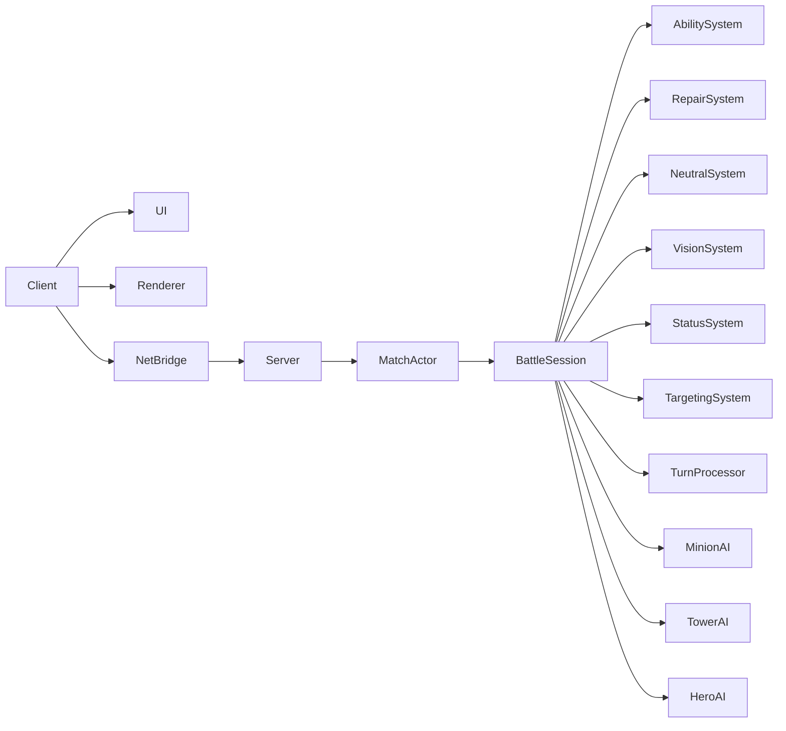

# Phase 4 Technical Spec  

## Abilities, Repair, Neutrals, and True Vision Slice

---

## 1. Phase 4 Goal

> **Expand the battle from a basic tactical prototype into a deeper MOBA-like tactical game by adding hero abilities, repair, neutral camps, lane-aware minion movement, and line-of-sight vision — all running under the Phase 3 server-authoritative model.**

Phase 3 proved the server foundation.  
Phase 4 makes the gameplay richer.

---

## 2. Recommended Phase 4 Scope

To keep this a true vertical slice, Phase 4 should be limited to:

- **One active ability per hero**
- **Cooldowns**
- **Energy resource**
- **Repair action for allied structures**
- **Neutral camps with at least one neutral guardian type**
- **Line-of-sight vision**
- **Vision-blocking obstacles**
- **Lane waypoint movement for minions**
- **Improved target priority**
- **Server-validated abilities and effects**
- **Client UI for abilities, cooldowns, energy, and repair**

This is enough to make battles meaningfully more tactical without exploding scope.

---

## 3. Definition of Done

Phase 4 is complete when:

- [ ] Each hero has one active ability.
- [ ] Abilities consume AP and energy.
- [ ] Abilities have cooldowns.
- [ ] Cooldowns decrement each round.
- [ ] Energy regenerates each round.
- [ ] Abilities are validated by the server.
- [ ] Line of sight is enforced for ranged attacks and spells.
- [ ] Some obstacles block vision.
- [ ] Fog of war uses line of sight, not only radius.
- [ ] Heroes can repair allied towers and spawners.
- [ ] Repair consumes AP.
- [ ] Neutral camps exist on the map.
- [ ] Neutral guardians attack when provoked or when enemies approach.
- [ ] Killing a neutral grants a simple team benefit.
- [ ] Minions follow lane waypoints instead of only moving toward the enemy side.
- [ ] Minion and tower targeting uses improved priority rules.
- [ ] Client displays ability buttons, cooldowns, energy, and valid targets.
- [ ] Server sends ability-related events.
- [ ] The slice remains playable as human vs human, human vs AI, and AI vs AI.

---

# 4. Phase 4 Content Slice

To avoid content bloat, define a minimal playable set.

---

## 4.1 Heroes

Keep the existing 3 heroes per team, but give each a distinct active ability.

### Hero A — Vanguard
- Role: frontliner
- Ability: **Cleave**
  - self-centered area damage
  - damages enemies adjacent to caster

### Hero B — Ranger
- Role: ranged damage
- Ability: **Bolt**
  - ranged single-target damage
  - requires line of sight

### Hero C — Warden
- Role: support
- Ability: **Mend**
  - heals an allied hero
  - does not repair structures

All heroes still have:
- basic attack
- movement
- AP
- initiative
- vision

---

## 4.2 Structures

### Tower
- attacks enemies in range
- requires line of sight for ranged attacks
- can be repaired

### Spawner Tower
- spawns minions
- can be repaired
- does not attack

---

## 4.3 Neutrals

Add two neutral camps:

### Camp Type: Guardian Camp
- neutral guardian unit
- hostile if enemies enter aggro range
- hostile if attacked
- grants a temporary damage buff to the team that kills it

For Phase 4, keep rewards simple:

> Killing a neutral guardian gives all currently alive heroes on the killer team **+5 damage for 5 rounds**.

No gold. No XP. No items.

---

## 4.4 Lane

Add one central lane with waypoints.

Example lane:

```text
(-5, 0) → (-3, 0) → (0, 0) → (3, 0) → (5, 0)
```

Team 0 minions move left to right.  
Team 1 minions move right to left.

---

# 5. Architecture Impact

Phase 4 affects almost every module, but it should build directly on Phase 3.



---

# 6. Core Data Model Updates

---

## 6.1 Unit Additions

Add these fields to `Unit`:

```rust
pub struct Unit {
    // Existing fields
    pub id: UnitId,
    pub kind: UnitKind,
    pub team: TeamId,
    pub pos: HexCoord,
    pub hp: u32,
    pub max_hp: u32,
    pub ap: u32,
    pub max_ap: u32,
    pub initiative: u32,
    pub attack_damage: u32,
    pub attack_range: u32,
    pub vision_range: u32,

    // Phase 4 additions
    pub energy: u32,
    pub max_energy: u32,
    pub energy_regen: u32,
    pub cooldowns: HashMap<SpellId, u32>,
    pub statuses: Vec<StatusInstance>,
    pub lane_id: Option<LaneId>,
    pub waypoint_index: Option<u32>,
    pub aggro_range: u32,
    pub last_attacker: Option<UnitId>,
}
```

---

## 6.2 Suggested Default Values

### Hero
```rust
max_energy: 5,
energy: 5,
energy_regen: 1,
cooldowns: {},
statuses: [],
aggro_range: 3,
```

### Minion
```rust
max_energy: 0,
energy: 0,
energy_regen: 0,
aggro_range: 2,
```

### Tower
```rust
max_energy: 0,
energy: 0,
energy_regen: 0,
aggro_range: 0,
```

### Neutral Guardian
```rust
max_energy: 0,
energy: 0,
energy_regen: 0,
aggro_range: 2,
```

---

## 6.3 Spell Identity

```rust
pub type SpellId = String;
pub type LaneId = String;
```

Examples:

```text
"cleave"
"bolt"
"mend"
```

---

# 7. Ability / Spell System

This is the centerpiece of Phase 4.

---

## 7.1 Spell Definition

```rust
#[derive(Debug, Clone, Serialize, Deserialize)]
pub struct SpellDef {
    pub id: SpellId,
    pub name: String,
    pub ap_cost: u32,
    pub energy_cost: u32,
    pub cooldown: u32,
    pub range: u32,
    pub min_range: u32,
    pub targeting: TargetingMode,
    pub requires_line_of_sight: bool,
    pub effects: Vec<EffectDef>,
}
```

---

## 7.2 Targeting Modes

```rust
#[derive(Debug, Clone, Serialize, Deserialize)]
pub enum TargetingMode {
    SelfOnly,
    EnemyUnit,
    AllyUnit,
    UnitAny,
    Hex,
    None,
}
```

---

## 7.3 Effect Definition

For Phase 4, keep effects simple and data-driven.

```rust
#[derive(Debug, Clone, Serialize, Deserialize)]
pub struct EffectDef {
    pub kind: EffectKind,
    pub amount: u32,
    pub radius: Option<u32>,
    pub status: Option<StatusDef>,
}

#[derive(Debug, Clone, Serialize, Deserialize)]
pub enum EffectKind {
    Damage,
    Heal,
    ApplyStatus,
}
```

---

## 7.4 Status Definition

```rust
#[derive(Debug, Clone, Serialize, Deserialize)]
pub struct StatusDef {
    pub id: String,
    pub duration_rounds: u32,
    pub modifiers: Vec<StatModifier>,
}

#[derive(Debug, Clone, Serialize, Deserialize)]
pub struct StatModifier {
    pub stat: StatKind,
    pub value: i32,
}

#[derive(Debug, Clone, Serialize, Deserialize)]
pub enum StatKind {
    AttackDamage,
    VisionRange,
    AttackRange,
}
```

---

## 7.5 Status Instance

```rust
#[derive(Debug, Clone, Serialize, Deserialize)]
pub struct StatusInstance {
    pub def_id: String,
    pub remaining_rounds: u32,
    pub modifiers: Vec<StatModifier>,
}
```

---

# 8. Phase 4 Ability Definitions

---

## 8.1 Cleave

```rust
SpellDef {
    id: "cleave".into(),
    name: "Cleave".into(),
    ap_cost: 1,
    energy_cost: 3,
    cooldown: 3,
    range: 0,
    min_range: 0,
    targeting: TargetingMode::SelfOnly,
    requires_line_of_sight: false,
    effects: vec![
        EffectDef {
            kind: EffectKind::Damage,
            amount: 15,
            radius: Some(1),
            status: None,
        },
    ],
}
```

---

## 8.2 Bolt

```rust
SpellDef {
    id: "bolt".into(),
    name: "Bolt".into(),
    ap_cost: 1,
    energy_cost: 2,
    cooldown: 2,
    range: 3,
    min_range: 1,
    targeting: TargetingMode::EnemyUnit,
    requires_line_of_sight: true,
    effects: vec![
        EffectDef {
            kind: EffectKind::Damage,
            amount: 25,
            radius: None,
            status: None,
        },
    ],
}
```

---

## 8.3 Mend

```rust
SpellDef {
    id: "mend".into(),
    name: "Mend".into(),
    ap_cost: 1,
    energy_cost: 2,
    cooldown: 2,
    range: 2,
    min_range: 1,
    targeting: TargetingMode::AllyUnit,
    requires_line_of_sight: true,
    effects: vec![
        EffectDef {
            kind: EffectKind::Heal,
            amount: 20,
            radius: None,
            status: None,
        },
    ],
}
```

---

# 9. Ability Validation Rules

When a player submits a `Cast` order, the server must validate:

## Caster Checks
- caster exists
- caster is alive
- caster knows the spell
- caster has enough AP
- caster has enough energy
- spell is not on cooldown

## Target Checks
- target exists
- target is alive
- target type is valid for targeting mode
- target is within range
- target is visible to caster team
- line of sight is satisfied if required

## Hex Target Checks
- hex is walkable or valid for effect
- hex is within range
- hex is visible
- line of sight to hex is satisfied if required

---

# 10. Ability Resolution Pipeline

```mermaid
flowchart LR
    A[Cast Order] --> B[Validate AP]
    B --> C[Validate Energy]
    C --> D[Validate Cooldown]
    D --> E[Validate Target]
    E --> F[Validate Range]
    F --> G[Validate LOS]
    G --> H[Apply Effects]
    H --> I[Emit Events]
    I --> J[Set Cooldown]
    J --> K[Spend AP/Energy]
```



Recommended order:

1. validate spell
2. spend AP
3. spend energy
4. set cooldown
5. resolve targeting
6. apply effects
7. emit events
8. cleanup deaths

This prevents a spell being “queued” but not paid for.

---

# 11. Effective Stats

Because Phase 4 introduces statuses, stats should be computed dynamically.

```rust
impl Unit {
    pub fn effective_attack_damage(&self) -> u32 {
        let mut damage = self.attack_damage as i32;

        for status in &self.statuses {
            for modifier in &status.modifiers {
                if modifier.stat == StatKind::AttackDamage {
                    damage += modifier.value;
                }
            }
        }

        damage.max(0) as u32
    }

    pub fn effective_vision_range(&self) -> u32 {
        let mut range = self.vision_range as i32;

        for status in &self.statuses {
            for modifier in &status.modifiers {
                if modifier.stat == StatKind::VisionRange {
                    range += modifier.value;
                }
            }
        }

        range.max(0) as u32
    }

    pub fn effective_attack_range(&self) -> u32 {
        let mut range = self.attack_range as i32;

        for status in &self.statuses {
            for modifier in &status.modifiers {
                if modifier.stat == StatKind::AttackRange {
                    range += modifier.value;
                }
            }
        }

        range.max(0) as u32
    }
}
```

---

# 12. Repair System

Repair becomes a first-class action.

---

## 12.1 Repair Rules

A repair order is valid if:

- repairing unit is alive
- repairing unit is a hero
- target is an allied structure
- target is alive
- target is damaged
- target is within repair range
- repairing unit has enough AP

For Phase 4:
- repair does not cost energy
- repair has no cooldown
- repair amount is fixed

Suggested defaults:

```rust
repair_range: 1
repair_amount: 20
repair_ap_cost: 1
```

---

## 12.2 Updated Action Enum

```rust
#[derive(Debug, Clone, Serialize, Deserialize)]
pub enum Action {
    Wait,
    Attack { target_id: UnitId },
    Cast { spell_id: SpellId, target: SpellTarget },
    Repair { target_id: UnitId },
}

#[derive(Debug, Clone, Serialize, Deserialize)]
pub enum SpellTarget {
    None,
    Unit(UnitId),
    Hex(HexCoord),
}
```

---

## 12.3 Repair Event

```rust
GameEvent::StructureRepaired {
    repairer_id: UnitId,
    target_id: UnitId,
    amount: u32,
    target_hp_remaining: u32,
}
```

---

# 13. Neutral Camp System

---

## 13.1 Camp Definition

```rust
#[derive(Debug, Clone, Serialize, Deserialize)]
pub struct NeutralCampDef {
    pub id: String,
    pub pos: HexCoord,
    pub guardian_kind: NeutralKind,
    pub reward: NeutralReward,
}

#[derive(Debug, Clone, Serialize, Deserialize)]
pub enum NeutralKind {
    Guardian,
}

#[derive(Debug, Clone, Serialize, Deserialize)]
pub enum NeutralReward {
    TeamDamageBuff {
        amount: u32,
        duration_rounds: u32,
    },
}
```

---

## 13.2 Phase 4 Camp Setup

Use two camps:

```text
Camp A: (0, 3)
Camp B: (0, -3)
```

Each camp spawns one neutral guardian.

---

## 13.3 Neutral Guardian Stats

Suggested:

```rust
hp: 80
max_hp: 80
attack_damage: 12
attack_range: 1
vision_range: 3
aggro_range: 2
initiative: 2
```

---

## 13.4 Neutral Behavior

Neutral guardian AI:

1. If current target is alive and within attack range, attack.
2. Else if an enemy is within aggro range, target nearest enemy.
3. Else if last attacker is alive and within aggro range, target last attacker.
4. Else wait at camp.

For Phase 4, neutrals do not leave their camp area unless provoked.

Optional simple leash rule:
- if target is farther than 3 hexes from camp, drop target.

---

## 13.5 Neutral Reward

When a neutral guardian dies:

1. determine killer team from `killed_by`
2. apply damage buff to all alive heroes on that team
3. emit event

Example buff:

```rust
StatusDef {
    id: "neutral_damage_buff".into(),
    duration_rounds: 5,
    modifiers: vec![
        StatModifier {
            stat: StatKind::AttackDamage,
            value: 5,
        },
    ],
}
```

---

# 14. Line of Sight System

This is a major tactical upgrade.

---

## 14.1 Obstacle Update

Obstacles now have vision properties.

```rust
#[derive(Debug, Clone, Serialize, Deserialize)]
pub struct Obstacle {
    pub coords: HexCoord,
    pub blocks_movement: bool,
    pub blocks_vision: bool,
    pub destructible: bool,
}
```

For Phase 4:
- keep existing movement blockers
- add some vision blockers
- destructibility remains out of scope

---

## 14.2 Suggested Map Additions

Add a few vision-blocking rocks or walls:

```text
(0, 2)   blocks movement + blocks vision
(0, -2)  blocks movement + blocks vision
(2, 2)   blocks vision only
(-2, -2) blocks vision only
```

This creates tactical angles without making the map too complex.

---

## 14.3 Hex Line Algorithm

Use cube-coordinate line projection.

```rust
pub fn hex_line(from: HexCoord, to: HexCoord) -> Vec<HexCoord> {
    let n = from.distance(&to);
    if n == 0 {
        return vec![from];
    }

    let mut results = Vec::new();

    for i in 0..=n {
        let t = i as f32 / n as f32;

        let fq = from.q as f32;
        let fr = from.r as f32;
        let fs = (-from.q - from.r) as f32;

        let tq = to.q as f32;
        let tr = to.r as f32;
        let ts = (-to.q - to.r) as f32;

        let qf = fq + (tq - fq) * t;
        let rf = fr + (tr - fr) * t;
        let sf = fs + (ts - fs) * t;

        results.push(cube_round(qf, rf, sf));
    }

    results
}
```

Where `cube_round` converts fractional cube coordinates back to axial.

---

## 14.4 LOS Check

```rust
pub fn has_line_of_sight(
    map: &HexMap,
    from: HexCoord,
    to: HexCoord,
) -> bool {
    let line = hex_line(from, to);

    // Skip the first hex and last hex.
    // We only care about blockers between source and target.
    for hex in line.iter().skip(1).take(line.len().saturating_sub(2)) {
        if map.blocks_vision(hex) {
            return false;
        }
    }

    true
}
```

---

## 14.5 Where LOS Is Required

Phase 4 requires LOS for:

- ranged basic attacks
- tower attacks
- targeted spells
- hex-targeted spells
- heal spells
- repair?  
  Recommendation: repair requires LOS if range > 1, but since repair range is 1, LOS usually passes automatically.

Melee attacks with range 1 generally do not need intermediate LOS checks.

---

# 15. Updated Fog of War

Fog becomes true tactical fog.

---

## 15.1 Vision Rules

A hex is visible to a team if:

1. it belongs to an alive friendly unit or structure, or
2. it is within effective vision range of a friendly unit, and
3. there is line of sight from that unit to the hex

---

## 15.2 Fog Update Algorithm

For each alive unit of a team:

1. get effective vision range
2. collect all hexes within that range
3. for each hex:
   - if `has_line_of_sight(unit.pos, hex)` is true,
   - add hex to team visibility

---

## 15.3 Important Rule

The server must filter snapshots using the new LOS-based fog.

Clients must not compute authoritative fog locally.

---

# 16. Lane Waypoints and Minion Movement

---

## 16.1 Lane Definition

```rust
#[derive(Debug, Clone, Serialize, Deserialize)]
pub struct LaneDef {
    pub id: LaneId,
    pub waypoints: Vec<HexCoord>,
}
```

Phase 4 uses one central lane:

```rust
LaneDef {
    id: "mid".into(),
    waypoints: vec![
        HexCoord::new(-5, 0),
        HexCoord::new(-3, 0),
        HexCoord::new(0, 0),
        HexCoord::new(3, 0),
        HexCoord::new(5, 0),
    ],
}
```

Team 0 minions use the list forward.  
Team 1 minions use the list reversed.

---

## 16.2 Minion Lane Assignment

When a minion spawns:

```rust
minion.lane_id = Some("mid".into());
minion.waypoint_index = Some(start_index_for_team(team));
```

Team 0 starts at index 0.  
Team 1 starts at last index.

---

## 16.3 Minion Decision Logic

For each minion:

1. If enemy in attack range, attack best target.
2. Else if enemy within aggro range, move toward and/or attack.
3. Else move toward next lane waypoint.
4. If at final waypoint and no target, wait.

---

## 16.4 Waypoint Progression

A minion advances its waypoint index when:

- it reaches the current waypoint, or
- it is within 1 hex of the current waypoint and pathing forward is blocked

For Phase 4, simple “distance <= 1” is enough.

---

# 17. Improved Target Priority

---

## 17.1 Priority Profiles

Define target priority per unit kind.

### Minions
Priority:
1. enemy minions
2. enemy heroes
3. enemy towers / spawners

### Towers
Priority:
1. enemy minions
2. enemy heroes
3. other structures, if added later

### Heroes AI
Priority:
1. visible enemy hero in range with lowest HP
2. visible enemy minion in range
3. visible enemy structure in range

### Neutral Guardians
Priority:
1. last attacker
2. nearest enemy inside aggro range

---

## 17.2 Tie-Breaking

Use deterministic tie-breaks:

1. priority class
2. distance
3. lowest HP
4. lowest unit ID

---

# 18. Updated Turn Processing

Phase 4 changes the round pipeline.

---

## 18.1 New Round Start Steps

At round start:

1. reset AP
2. regenerate energy
3. decrement cooldowns
4. tick status durations
5. remove expired statuses
6. process spawners
7. update fog

---

## 18.2 Resolution Steps

For each unit in initiative order:

1. skip if dead
2. process movement
3. process action:
   - wait
   - attack
   - cast
   - repair
4. apply effects
5. update last attacker where relevant
6. cleanup dead units
7. process on-death effects

---

## 18.3 On-Death Effects

Needed for neutral rewards.

When a unit dies:

- if unit is a neutral guardian:
  - determine killer team
  - apply reward

This requires death events to include a valid `killed_by`.

---

# 19. Protocol Updates

Phase 4 requires protocol extensions.

---

## 19.1 Updated Unit DTO

```rust
pub struct UnitDto {
    pub id: UnitId,
    pub kind: String,
    pub team: TeamId,
    pub pos: HexDto,
    pub hp: u32,
    pub max_hp: u32,
    pub ap: u32,
    pub max_ap: u32,
    pub energy: u32,
    pub max_energy: u32,
    pub initiative: u32,
    pub attack_range: u32,
    pub vision_range: u32,
    pub cooldowns: HashMap<SpellId, u32>,
    pub statuses: Vec<StatusDto>,
    pub lane_id: Option<LaneId>,
}
```

---

## 19.2 Updated Action DTO

```rust
#[derive(Debug, Clone, Serialize, Deserialize)]
#[serde(tag = "type")]
pub enum ActionDto {
    Wait,
    Attack { target_id: UnitId },
    Cast {
        spell_id: SpellId,
        target: SpellTargetDto,
    },
    Repair { target_id: UnitId },
}

#[derive(Debug, Clone, Serialize, Deserialize)]
#[serde(tag = "type")]
pub enum SpellTargetDto {
    None,
    Unit { unit_id: UnitId },
    Hex { q: i32, r: i32 },
}
```

---

## 19.3 Spell DTO

```rust
pub struct SpellDto {
    pub id: SpellId,
    pub name: String,
    pub ap_cost: u32,
    pub energy_cost: u32,
    pub cooldown: u32,
    pub range: u32,
    pub targeting: TargetingModeDto,
    pub requires_line_of_sight: bool,
}
```

---

## 19.4 Snapshot Additions

Add to `SnapshotDto`:

```rust
pub spells: Vec<SpellDto>,
pub neutral_camps: Vec<NeutralCampDto>,
```

Alternatively, spells can be sent once in `MatchJoined`.

---

# 20. Event Updates

Add new event types.

```rust
pub enum GameEvent {
    // Existing
    RoundStarted { round: u32 },
    UnitMoved { ... },
    UnitAttacked { ... },
    TowerAttacked { ... },
    UnitDied { ... },
    UnitSpawned { ... },
    FogUpdated { ... },

    // Phase 4
    SpellCast {
        caster_id: UnitId,
        spell_id: SpellId,
        target: SpellTarget,
    },

    HealApplied {
        caster_id: UnitId,
        target_id: UnitId,
        amount: u32,
        target_hp_remaining: u32,
    },

    StructureRepaired {
        repairer_id: UnitId,
        target_id: UnitId,
        amount: u32,
        target_hp_remaining: u32,
    },

    StatusApplied {
        unit_id: UnitId,
        status_id: String,
        duration_rounds: u32,
    },

    StatusExpired {
        unit_id: UnitId,
        status_id: String,
    },

    NeutralCampCleared {
        camp_id: String,
        killer_team: TeamId,
    },

    TeamBuffApplied {
        team: TeamId,
        buff_id: String,
        duration_rounds: u32,
    },
}
```

---

# 21. Client UI Updates

Phase 4 needs a much richer HUD.

---

## 21.1 Selected Unit Panel

Display:
- HP
- AP
- energy
- initiative
- statuses
- cooldowns

---

## 21.2 Ability Bar

When a hero is selected, show:

- basic attack
- repair
- active ability
- wait

For each ability show:
- AP cost
- energy cost
- cooldown remaining
- enabled/disabled state
- targeting mode

---

## 21.3 Target Modes

The input controller needs new modes:

```ts
type InputMode =
  | "idle"
  | "unitSelected"
  | "choosingMove"
  | "choosingAction"
  | "choosingAttackTarget"
  | "choosingSpellTarget"
  | "choosingRepairTarget";
```

---

## 21.4 Visual Feedback

Add overlays for:

- ability range
- spell target validity
- no line of sight indicator
- repairable structures
- neutral camp markers
- buff icons
- cooldown numbers
- energy pips

---

## 21.5 Recommended UX Flow

### Cast Ability
1. select hero
2. choose movement destination, if needed
3. click ability button
4. valid targets highlight
5. click target
6. order becomes `Cast`

### Repair
1. select hero
2. move adjacent to damaged structure if needed
3. click repair
4. valid structures highlight
5. click structure

---

# 22. Client Rendering Updates

Add rendering support for:

- ability icons
- cooldown overlay
- energy bar
- status icons
- neutral camp icon
- vision blocker obstacle style
- invalid target style
- line-of-sight failure style

Suggested visual language:

| Element | Visual |
|---|---|
| valid ability target | cyan outline |
| invalid target | gray outline |
| no LOS | red slashed outline |
| repairable structure | green wrench marker |
| neutral camp | yellow diamond |
| buffed unit | small yellow icon |
| vision blocker | darker obstacle with haze |

---

# 23. Animation Updates

Phase 4 animations should remain simple but clear.

## Ability Animations
- Bolt: quick line flash from caster to target
- Cleave: radial pulse around caster
- Mend: green glow on target

## Repair Animation
- blue/green floating number
- brief structure outline flash

## Neutral Death
- camp marker fades
- buff banner or floating text

## Status Changes
- small icon pop-in
- expiration fade-out

---

# 24. AI Updates

Phase 4 AI must use the new systems.

---

## 24.1 Hero AI

Simple ability usage:

### Bolt
Use if:
- enemy in range
- enemy visible
- line of sight exists
- cooldown ready
- energy available

### Mend
Use if:
- allied hero HP below 60%
- target in range
- line of sight exists
- cooldown ready
- energy available

### Cleave
Use if:
- at least 2 enemies within radius 1
- cooldown ready
- energy available

Otherwise:
- basic attack
- move toward target
- wait

---

## 24.2 Minion AI
Use:
- lane waypoints
- aggro range
- improved target priority

---

## 24.3 Tower AI
Use:
- LOS
- target priority
- effective range

---

## 24.4 Neutral AI
Use:
- aggro range
- last attacker memory
- leash limit

---

# 25. Server Validation Requirements

The server must be strict.

---

## 25.1 Cast Validation
Reject if:
- unknown spell
- caster does not know spell
- not enough AP
- not enough energy
- cooldown active
- invalid targeting mode
- target dead
- target invisible
- target out of range
- no line of sight

---

## 25.2 Repair Validation
Reject if:
- target is not a structure
- target is not allied
- target is full HP
- target out of range
- not enough AP

---

## 25.3 Fog Validation
Never send:
- invisible enemy units
- hidden cooldowns of invisible units
- hidden neutral state outside visible camps

If a neutral camp is not visible:
- either omit it
- or show only terrain, not live unit state

For Phase 4, simplest:
- only include neutral guardian units in snapshot if visible

---

# 26. Determinism Requirements

Phase 4 introduces more simulation state, so determinism becomes even more important.

## Required Rules
- cooldowns tick in fixed phase order
- statuses tick in fixed order by unit ID
- neutral rewards apply in deterministic order
- AI choices use stable sorting
- RNG only where explicitly needed

---

# 27. Suggested Map Update

Use radius 6 map.

## Structures
- Team 0 spawner: (-5, 0)
- Team 0 tower: (-3, 0)
- Team 1 spawner: (5, 0)
- Team 1 tower: (3, 0)

## Heroes
Team 0:
- (-4, -1)
- (-4, 0)
- (-4, 1)

Team 1:
- (4, -1)
- (4, 0)
- (4, 1)

## Neutral Camps
- (0, 3)
- (0, -3)

## Vision Blockers
- (0, 2)
- (0, -2)
- (2, 2)
- (-2, -2)

## Lane Waypoints
```text
(-5, 0)
(-3, 0)
(0, 0)
(3, 0)
(5, 0)
```

---

# 28. Implementation Order

To keep Phase 4 manageable, implement in this order:

---

## Step 1 — Core Resource System
Add:
- energy
- cooldowns
- statuses
- effective stat calculation

---

## Step 2 — Spell Framework
Add:
- spell definitions
- cast order type
- targeting
- validation
- event emission

---

## Step 3 — Line of Sight
Add:
- vision-blocking obstacles
- hex line algorithm
- LOS validation
- LOS fog update

---

## Step 4 — Repair
Add:
- repair action
- structure repair validation
- repair events

---

## Step 5 — Neutral Camps
Add:
- neutral unit kind
- camp definitions
- neutral AI
- kill reward

---

## Step 6 — Lane Waypoints
Add:
- lane definitions
- minion lane assignment
- waypoint progression

---

## Step 7 — AI Upgrade
Add:
- hero ability usage
- improved target priority
- neutral behavior

---

## Step 8 — Client HUD
Add:
- ability bar
- cooldown display
- energy display
- repair UI
- spell targeting UI

---

# 29. Acceptance Criteria

| # | Criterion | Status |
|---|-----------|--------|
| 1 | Each hero has one active ability | ☐ |
| 2 | Abilities consume AP | ☐ |
| 3 | Abilities consume energy | ☐ |
| 4 | Abilities enter cooldown after use | ☐ |
| 5 | Cooldowns decrement at round start | ☐ |
| 6 | Energy regenerates each round | ☐ |
| 7 | Server rejects cast orders with insufficient energy | ☐ |
| 8 | Server rejects cast orders on cooldown | ☐ |
| 9 | Server rejects invalid spell targets | ☐ |
| 10 | Ranged attacks require line of sight | ☐ |
| 11 | Spells require line of sight when configured | ☐ |
| 12 | Some obstacles block vision | ☐ |
| 13 | Fog of war uses LOS, not only radius | ☐ |
| 14 | Snapshot hides invisible enemy units | ☐ |
| 15 | Heroes can repair allied structures | ☐ |
| 16 | Repair only works on damaged allied structures | ☐ |
| 17 | Repair consumes AP | ☐ |
| 18 | Neutral camps exist on the map | ☐ |
| 19 | Neutral guardians attack enemies in aggro range | ☐ |
| 20 | Neutral guardians retaliate when attacked | ☐ |
| 21 | Killing a neutral applies a team buff | ☐ |
| 22 | Buff expires after configured duration | ☐ |
| 23 | Minions follow lane waypoints | ☐ |
| 24 | Minions engage enemies within aggro range | ☐ |
| 25 | Towers use target priority and LOS | ☐ |
| 26 | Client displays cooldowns | ☐ |
| 27 | Client displays energy | ☐ |
| 28 | Client displays valid spell targets | ☐ |
| 29 | Client shows when target has no LOS | ☐ |
| 30 | AI uses abilities in simple situations | ☐ |

---

# 30. Out of Scope for Phase 4

Do not add these yet:

- gold
- XP
- items
- shop
- hero leveling
- talent trees
- multiple ability kits per hero
- ability drafting
- destructible obstacles
- stealth
- wards
- vision-blocking projectiles
- multiple lanes
- jungle respawns
- advanced neutral objectives
- matchmaking
- ranking
- spectator mode
- replay UI

---

# 31. Risks and Mitigations

---

## Risk 1: Ability System Becomes Too Complex
### Mitigation
Use only three spells and three effect types in Phase 4.

---

## Risk 2: LOS Fog Is Expensive
### Mitigation
Map radius is small. Compute LOS only for alive units and visible-radius hexes.

---

## Risk 3: Client UI Becomes Crowded
### Mitigation
Keep ability bar minimal: attack, repair, one ability, wait.

---

## Risk 4: Neutral Reward Creates Snowball
### Mitigation
Keep buff small and short-lived.

---

## Risk 5: Minion Waypoint Logic Conflicts With Combat
### Mitigation
Combat always takes priority over waypoint movement.

---

# 32. Phase 5 Preview

After Phase 4, the next slice should likely focus on one of these directions:

## Option A — 5v5 Readiness
- one hero per player
- player assignment per unit
- larger maps
- team vision sharing
- more heroes

## Option B — MOBA Economy
- gold
- XP
- hero leveling
- items
- shop
- power progression

## Option C — Objectives and Lanes
- multiple lanes
- destructible towers
- inhibitors / bases
- win conditions beyond hero elimination

My recommendation:
> Phase 5 should be **5v5 readiness + one-hero-per-player control**, because that validates the real MOBA player model before adding economy.

---

# 33. Final Phase 4 Recommendation

Phase 4 should be:

> **A tactical gameplay expansion slice focused on abilities, repair, neutrals, and true line-of-sight vision.**

This gives the game a much stronger tactical identity while keeping the scope controlled and building directly on the server-authoritative foundation from Phase 3.

If you want, the next document can be:

**“Phase 4 implementation task breakdown”**  
with a ordered backlog of concrete coding tasks.