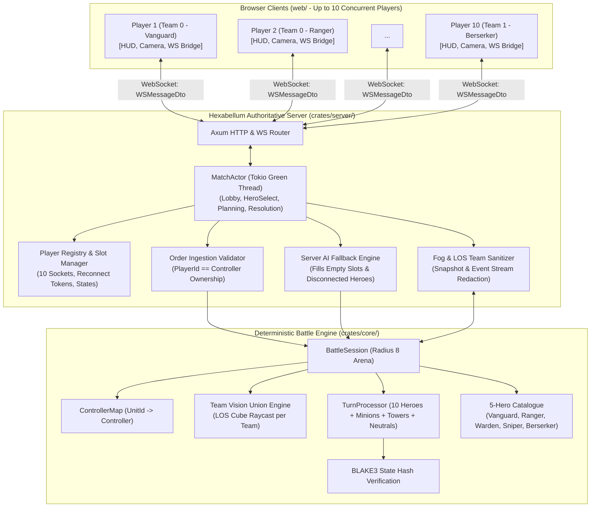
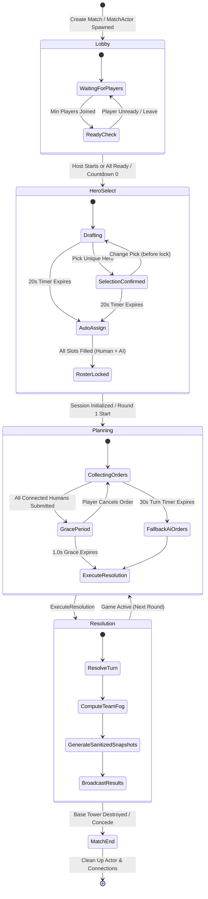
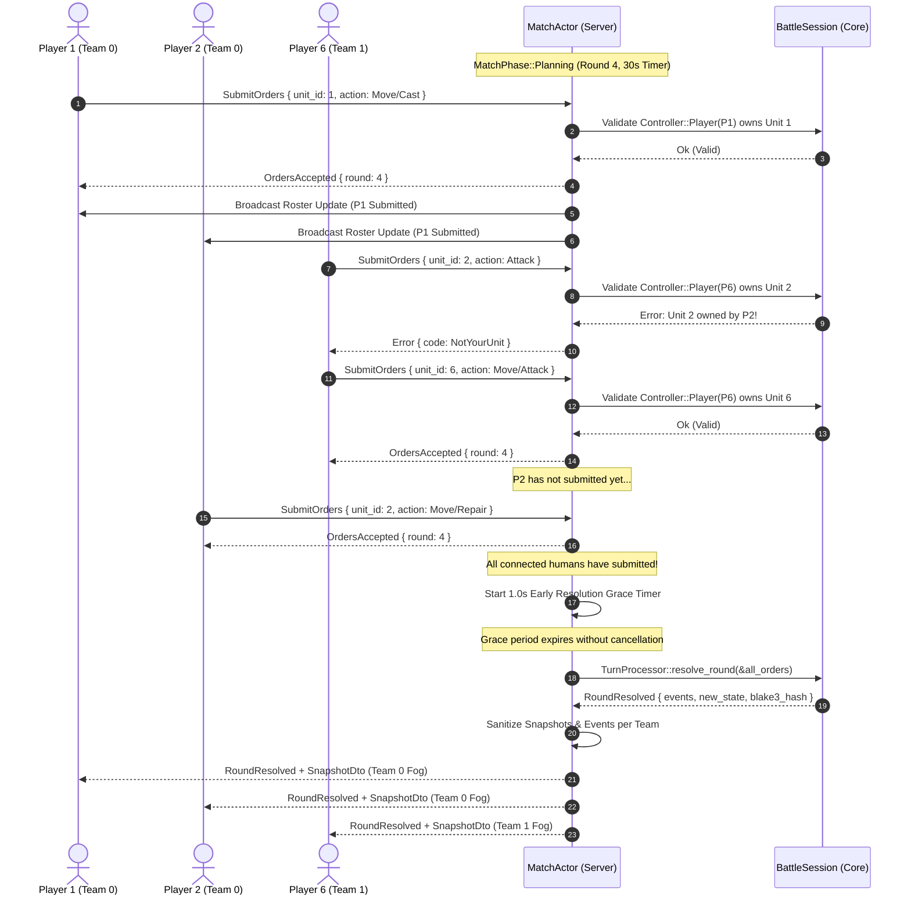
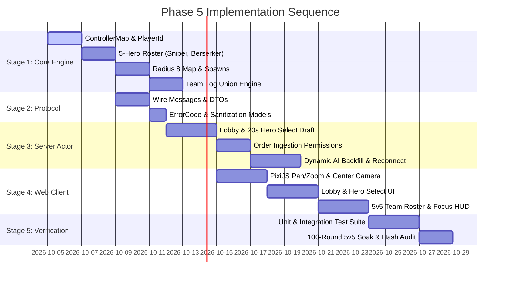

# Phase 5 Technical Spec — 5v5 Multiplayer Readiness, Per-Player Single-Hero Control, Shared Team Vision & Dynamic AI Backfill

---

## Architectural Decision Record (ADR-006): 5v5 Match Lifecycle, Per-Player Controller Model, Team-Shared Fog of War, Scaled Radius 8 Arena & Fault-Tolerant AI Backfill

### Context

Hexabellum Phases 1 through 4 established a server-authoritative turn-based tactical engine:
- Phase 1 & 2 introduced deterministic simultaneous turn resolution, 3v3 heroes, autonomous minion waves, defensive towers, and fog of war.
- Phase 3 established a server-authoritative multiplayer foundation via WebSockets, an actor-per-match architecture (`MatchActor`), state synchronization with 30-second turn timers and 1.0-second grace periods, and BLAKE3 cryptographic state verification.
- Phase 4 introduced hero active abilities (Cleave, Bolt, Mend), status effect pipelines, line-of-sight cube raycasting, structure repair, neutral objective camps with leash mechanics, and lane waypoint steering.

However, despite these achievements, the underlying player interaction model remained fundamentally tied to a **"Team Commander" paradigm**:
1. **Multi-Unit Control**: A single human player commanded all three heroes on their team simultaneously, issuing a batch of orders for multiple avatars. This directly conflicts with the core MOBA fantasy of mastering a single hero avatar.
2. **2-Client Concurrency Ceiling**: The server was tested and designed for at most 2 connected human players (1v1 commander or 1vAI). The architecture lacked mechanisms to coordinate up to 10 concurrent human players per match.
3. **No Pre-Game Lifecycle**: Matches began immediately in the planning phase with hardcoded hero compositions. There was no pre-game lobby, team assignment negotiation, or hero selection draft.
4. **Order Authorization Vulnerability**: Because the server previously assumed one commander per team, any player on a team could theoretically submit orders for any unit on that team. In a 5v5 setting, order permissions must be strictly scoped to individual units (`Controller::Player(PlayerId)`).
5. **Multiplayer Fragility & Disconnect Vulnerability**: In a 10-player match, the probability that at least one player disconnects, suffers network latency spikes, or closes their browser tab during a 30-second turn is an order of magnitude higher than in a 1v1 match. Without an automated, fault-tolerant AI takeover and hot-reconnection system, matches would stall or abort.
6. **Arena Scale Bottleneck**: The Phase 4 map (radius 7) is too congested for 10 heroes, minion waves, towers, spawners, and neutral camps. Scaling the arena to radius 8 (217 hexes) requires expanding camera viewport controls (pan, zoom, and center-on-hero) on the client.

Phase 5 represents the definitive architectural transition from a **Tactical Commander Prototype** to a **True MOBA Multiplayer Foundation**. This vertical slice focuses exclusively on validating 10-player concurrency, single-hero control, shared team vision, dynamic AI backfill, and scaled arena navigation—before introducing economy, gold, XP, and items in Phase 6.

### Decisions

| System Area | Decision | Rationale & Trade-Offs |
|---|---|---|
| **Match Lifecycle Engine** | **5-State Finite State Machine (`Lobby` → `HeroSelect` → `Planning` → `Resolution` → `MatchEnd`)** | Matches progress through distinct states managed by the Tokio `MatchActor`. The actor coordinates lobby readiness, a 20-second hero select draft, round-by-round planning countdowns, and game termination. |
| **Controller & Authorization Model** | **Decoupled Unit Ownership via `Controller` Enum** | Units in `crates/core` are tagged with `Controller`: `Player(PlayerId)`, `Ai`, or `Automatic` (for minions/towers/neutrals). The server enforces that a player can only submit orders for units matching their authenticated `PlayerId`. All unauthorized orders are rejected on WebSocket ingestion. |
| **Team Assignment & Auto-Balancing** | **Balanced Round-Robin Fill with Manual Dev Override** | New players joining a match are automatically assigned to the team with fewer human players (Team 0 priority on tie). Query parameters allow overriding team assignment for automated tests and development. Matches support 1v1, 3v3, or 5v5 configurations. |
| **Hero Selection Draft** | **20-Second Simultaneous Blind Draft with Team-Unique Heroes** | Each team selects from an identical pool of 5 distinct heroes (`Vanguard`, `Ranger`, `Warden`, `Sniper`, `Berserker`). Heroes cannot be duplicated within the same team (mirror matchups between opposing teams are permitted). If a player fails to pick before the 20-second deadline, the server assigns a random remaining hero from their team's pool. |
| **Expanded 5-Hero Roster** | **Addition of `Sniper` (Longshot) and `Berserker` (Fury)** | Extends the Phase 4 trio (`Vanguard`, `Ranger`, `Warden`) with two distinct archetypes: `Sniper` (long-range artillery, requires LOS) and `Berserker` (melee bruiser with a self-buff rage ability). Fully compatible with the Phase 4 data-driven `SpellDef` and status effect pipeline. |
| **Fault-Tolerant Dynamic AI Backfill** | **Seamless AI Takeover on Disconnect/Timeout & Instant Hot-Reconnect** | If a player disconnects or fails to submit orders before the 30-second turn timer expires, their hero's controller temporarily transitions to `Controller::Ai`, which generates fallback orders so the match progresses. When the player reconnects, control is immediately restored without restarting the turn or desynchronizing the match. |
| **Team-Shared Fog of War** | **Unified Team Sightline Masking & Asymmetric Sanitization** | All 5 players on a team share an identical fog-of-war vision mask computed from the union of all allied sightlines (heroes, towers, spawners, minions). Opponents concealed in fog are completely stripped from WebSocket snapshots and event streams, providing zero-knowledge security against client-side maphacks. |
| **Scaled Arena (Radius 8)** | **217-Hex Arena with Single Central Lane & Symmetrical Jungle Camps** | The hexagonal arena expands from radius 7 to radius 8. Includes 5-hero base spawn clusters, central lane corridor, 2 neutral camps at `(0, 4)` and `(0, -4)`, and 6 tactical mid-lane vision blockers to create strategic gank routes and sightline ambushes. |
| **Client Viewport Engine** | **PixiJS v8 Dynamic Pan, Clamped Zoom & Center-on-Hero Focus** | With a larger radius 8 map, the browser viewport supports smooth drag-panning, mouse-wheel/pinch zooming (0.5x to 2.0x), keyboard panning (WASD/Arrows), and a dedicated `[Space]` key / HUD button to snap and center the camera on the player's controlled hero. |
| **Tactical 5v5 HUD** | **"My Hero" Anchor, Allied Team Roster & Sighted Enemy Status** | Replaces multi-unit selection UI with a focused single-hero HUD: bottom-center ability dock, top-left allied team roster with health bars, disconnect/AI badges, submission status pips, and top-right spotted enemy indicators. |
| **Deterministic 10-Player Tie-Breaking** | **BLAKE3-Verified Multi-Unit Simultaneous Turn Resolution** | Extends the Phase 4 deterministic initiative and tie-breaking matrix to handle up to 10 heroes, minion waves, towers, and neutral camps. Bitwise BLAKE3 state hashes verify lockstep synchronization across 100-round headless soak simulations. |

---

## Phase 5 Goal

> **Transition Hexabellum from a tactical commander prototype into a true 5v5 MOBA-style multiplayer foundation where up to 10 human players concurrently connect over WebSockets, each player controls exactly one hero avatar, teams share line-of-sight fog of war, disconnected or missing players are seamlessly backfilled by AI, and the client provides an expansive, zoomable tactical battlefield.**

Phase 4 proved deep tactical mechanics (abilities, status effects, line-of-sight raycasting, neutral camps, structure repair, lane waypoints).  
Phase 5 validates the core **player model, networking scale, and lobby lifecycle** necessary to support competitive team MOBA gameplay.

### What Phase 5 Adds

| Subsystem | Component | Description & Architectural Role |
|---|---|---|
| **Match Lifecycle** | **`MatchActor` State Machine** | Full lifecycle support: `Lobby`, `HeroSelect`, `Planning`, `Resolution`, and `MatchEnd`. |
| **Player Registry** | **Session & Slot Manager** | Tracks up to 10 players, connection states (`Connected`, `Disconnected`, `AiReplacement`), team allocations, and persistent reconnect tokens. |
| **Unit Authorization** | **`ControllerMap` Engine** | Enforces 1-to-1 mapping between human `PlayerId` and hero `UnitId`. Rejects any order sent for an unauthorized unit. |
| **Hero Draft** | **20s Blind Hero Select** | Synchronous draft phase with team-unique hero pool, countdown timer, auto-lock on timeout, and AI slot distribution. |
| **Hero Roster** | **5-Hero Archetype Pool** | Introduces `Sniper` (artillery marksman) and `Berserker` (melee rage bruiser) alongside `Vanguard`, `Ranger`, and `Warden`. |
| **Abilities Catalog** | **`Longshot` & `Fury` Spells** | Implements Sniper's `Longshot` (Range 4, min range 2, 30 damage) and Berserker's `Fury` (+8 attack damage self-buff) using the Phase 4 spell pipeline. |
| **Shared Fog Union** | **Team-Wide LOS Vision Union** | Computes the aggregated line-of-sight footprint across all 5 allied heroes, minions, and structures. Synchronizes identical fog to all teammates. |
| **Anti-Cheat Sanitizer** | **Team Snapshot Sanitization** | Sanitizes snapshots and `RoundResolved` event streams so that concealed enemy heroes and jungle states are never transmitted to unauthorized clients. |
| **Dynamic AI Backfill** | **Fault-Tolerant Takeover Engine** | Automatically converts disconnected or timeout human heroes to AI-driven controllers, ensuring the turn timer never deadlocks. |
| **Hot-Reconnection** | **Seamless Player Recovery** | Reconnecting players instantly receive current match phase, snapshot, remaining timer deadline, and regain control of their hero. |
| **Scaled Hex Arena** | **Radius 8 Tactical Map** | Expands the arena to 217 hexes with 5-slot base spawn clusters, 2 neutral camps (`(0, 4)` and `(0, -4)`), and 6 tactical vision blockers. |
| **Client Camera** | **Pan/Zoom Viewport Controller** | Enables smooth canvas dragging, clamped mouse-wheel zooming, WASD keyboard panning, and `Spacebar` center-on-hero snapping. |
| **Tactical 5v5 HUD** | **Roster & Focus UI** | Single-hero action dock, allied roster panel with live HP bars and readiness pips, spotted enemy status, and reconnect overlay. |
| **Determinism Testing** | **Headless 5v5 Soak Harness** | 100-round 10-player headless simulation harness verifying bitwise BLAKE3 state determinism and zero desyncs across multi-round battles. |

---

## Definition of Done (DoD)

### 1. Core Simulation (`crates/core`)
- [x] `Controller` enum defined: `Player(PlayerId)`, `Ai`, and `Automatic`.
- [x] `ControllerMap` implemented in `BattleSession` as the authoritative source of unit command permissions.
- [x] `BattleConfig` expanded to support configurable `map_radius: 8`, `players_per_team: 5`, and `heroes_per_team: 5`.
- [x] Hero catalogue expanded to 5 complete archetypes: Vanguard, Ranger, Warden, Sniper, and Berserker.
- [x] Sniper implemented: HP 80, AP 3, Initiative 4, Attack Damage 14, Attack Range 3, Vision Range 5, Energy 5.
- [x] Sniper active ability **Longshot** implemented: 1 AP, 3 Energy, 3 Cooldown, Range 4, Min Range 2, Enemy Unit, requires LOS, 30 Damage.
- [x] Berserker implemented: HP 120, AP 3, Initiative 3, Attack Damage 20, Attack Range 1, Vision Range 3, Energy 5.
- [x] Berserker active ability **Fury** implemented: 1 AP, 2 Energy, 3 Cooldown, Self Only, applies `fury_buff` (+8 Attack Damage for 2 rounds).
- [x] Team vision algorithm computes the composite line-of-sight union across all allied heroes, towers, spawners, and minions.
- [x] `TurnProcessor` executes 10-hero simultaneous turn resolution with deterministic tie-breaking without panics or deadlocks.
- [x] Automated fallback order generation for AI-controlled heroes and timed-out human players.

### 2. Protocol & Wire Models (`crates/protocol`)
- [x] Client messages defined: `JoinMatch`, `SelectHero`, `SetReady`, `SubmitOrders`, `Ping`, `Reconnect`.
- [x] Server messages defined: `LobbyUpdated`, `HeroSelected`, `MatchStarting`, `RoundStarted`, `OrdersAccepted`, `RoundResolved`, `MatchEnded`, `PlayerDisconnected`, `PlayerReconnected`, `Error`.
- [x] `PlayerLobbyDto` defined with `player_id`, `display_name`, `team`, `connected`, `ready`, `hero_def_id`, and `is_ai`.
- [x] `HeroDto` defined with hero stats, role, and spell summary.
- [x] `RosterEntryDto` defined for team roster HUD, carrying health, status, connection, and readiness.
- [x] `SnapshotDto` extended with `controlled_units: Vec<UnitId>`, `player_team: TeamId`, and `roster: Vec<RosterEntryDto>`.
- [x] Extended `ErrorCode` enum: `NotYourUnit`, `HeroAlreadySelected`, `LobbyFull`, `HeroSelectLocked`, `InvalidHeroDef`, `NotInPlanningPhase`, `PlayerAlreadyConnected`, `InvalidOrderCount`.

### 3. Server Authority & Actor Engine (`crates/server`)
- [x] `MatchActor` implements full 5-state lifecycle: `Lobby`, `HeroSelect`, `Planning`, `Resolution`, `MatchEnd`.
- [x] Tokio actor manages up to 10 concurrent WebSocket connections with dedicated `mpsc` outgoing channels.
- [x] Automatic team balancing assigns incoming players to balance team human counts.
- [x] Hero select phase enforces 20-second timer, team uniqueness, and random hero assignment for unpicked slots upon expiry.
- [x] Strict ingestion authentication verifies sender's `PlayerId` owns the target `UnitId` via `ControllerMap`.
- [x] Server strictly rejects orders submitted for units not owned by the sender with `ErrorCode::NotYourUnit`.
- [x] Early round resolution triggers with 1.0s grace period when all connected human players submit valid orders.
- [x] Disconnected players smoothly transition to `ConnectionState::AiReplacement`; AI generates fallback orders on timer expiry.
- [x] Reconnecting players restore connection channel, receive current snapshot, phase, remaining time, and reclaim hero ownership.
- [x] Snapshot and event sanitizer ensures zero-knowledge privacy: concealed enemy heroes are excluded from snapshots and hidden movements are stripped from events.

### 4. Browser Client & UI/UX (`web/`)
- [x] PixiJS v8 camera controller supports pointer drag-to-pan, mouse-wheel/pinch zooming (0.5x to 2.0x), and keyboard panning (WASD/Arrows).
- [x] Dedicated "Center on My Hero" button and `[Space]` keybinding with smooth viewport interpolation.
- [x] Modern glassmorphic Lobby screen showing 2-column team rosters, player readiness, ping indicators, and start match countdown.
- [x] Hero Select screen displaying 5-hero card grid/carousel, hero base stats, ability details, 20s countdown ring, and selection lock-in.
- [x] Tactical Battle HUD anchored to player's controlled hero: portrait, HP/Energy radial bars, AP pips, ability dock with cooldown sweeps and hotkeys (`Q`, `F`, `A`, `Space`).
- [x] Allied Team Roster sidebar displaying 5 allied heroes, health bars, alive/dead state, submission checkmarks, and AI/DC status badges.
- [x] Sighted enemy roster indicator showing spotted enemy heroes and masking unrevealed health bars.
- [x] Client input controller restricts order queuing exclusively to the player's assigned hero. Clicking allies opens inspector; clicking enemies targets them.
- [x] Reconnection banner with automatic retry counter and reconnection status feedback.

### 5. Verification & Determinism Harness
- [x] Unit tests verify controller permission enforcement, team fog union, and hero select uniqueness.
- [x] Integration tests verify 10-player WebSocket lifecycle, dynamic AI takeover, and hot-reconnect recovery.
- [x] Snapshot privacy audit test verifies no un-sighted enemy coordinates or health values exist in serialized JSON payloads.
- [x] 100-round 5v5 headless simulation runs without panic and achieves 100% bitwise BLAKE3 hash determinism across identical seeds.

---

## Architecture Delta from Phase 4

```
Phase 4 (Tactical Depth Vertical Slice)       Phase 5 (5v5 Multiplayer Foundation)
─────────────────────────────────────────    ─────────────────────────────────────────
Player Model: 1 Commander per Team (1v1)   → Player Model: 1 Hero per Player (up to 5v5, 10 humans)
Client Concurrency: Max 2 clients          → Client Concurrency: Max 10 concurrent WebSocket clients
Unit Ownership: Implicit by Team           → Unit Ownership: Explicit ControllerMap (Player, Ai, Auto)
Pre-Game Lifecycle: None (Direct Start)    → Pre-Game Lifecycle: Lobby → 20s Hero Select Draft
Hero Pool: 3 Heroes (Vanguard, Ranger, ...) → Hero Pool: 5 Heroes (+ Sniper [Longshot], + Berserker [Fury])
Fog of War: Shared across commander's team → Fog of War: Shared team union across 5 independent players
Order Gating: Commander submits all heroes  → Order Gating: Player can only order their own hero (1 unit)
Disconnect Behavior: Stalls or drops match → Disconnect Behavior: Dynamic AI takeover & seamless hot-reconnect
Map Dimensions: Radius 7 (169 hexes)       → Map Dimensions: Radius 8 (217 hexes) with 5-slot spawn clusters
Camera Controls: Static map viewport       → Camera Controls: PixiJS v8 Pan, Clamped Zoom & Center on Hero
HUD Architecture: Multi-unit selection     → HUD Architecture: "My Hero" Anchor, Team Roster & Spotted Enemies
Early Resolution: 2 commanders lock in     → Early Resolution: All connected humans lock in + 1.0s grace
```

---

## High-Level System Architecture & Flow

### Component Architecture



---

### Match Lifecycle State Machine



---

### Multi-Player Order Ingestion & Early Resolution Flow



---

## Hex Map & Arena Topology (Radius 8)

Phase 5 expands the battlefield from radius 7 (169 hexes) to **radius 8 (217 hexes)**. This provides adequate spatial maneuverability for 10 heroes, minion waves, defensive towers, spawners, and neutral objective camps.

### Coordinate Grid & Strategic Topology

```
                                  TOP
                                (0, -8)
                               /       \
                       (-4, -4)         (4, -8)
                      /                         \
         Team 0 Base            NEUTRAL CAMP 1            Team 1 Base
        Spawner: (-7, 0)           (0, -4)               Spawner: (7, 0)
        Tower:   (-5, 0)          [Guardian]             Tower:   (5, 0)
        Hero Spawns:           Vision Blockers:          Hero Spawns:
        (-6, -2)                (-2, -3)  (2, -3)         (6, -2)
        (-6, -1)                   (0, -2)                (6, -1)
        (-6,  0)              =================           (6,  0)
        (-6,  1)              CENTRAL LANE AXIS           (6,  1)
        (-6,  2)        (-7,0) -> (-4,0) -> (0,0) -> (4,0) -> (7,0) (6,  2)
                              =================
                                   (0, 2)
                                (-3, 2)   (3, 2)
                               Vision Blockers:
                                NEUTRAL CAMP 2
                                   (0, 4)
                                  [Guardian]
                      \                         /
                       (-4, 8)           (4, 4)
                               \       /
                                (0, 8)
                                BOTTOM
```

### Complete Arena Layout Specification

| Feature / Location | Axial Coordinates $(q, r)$ | Cube Coordinates $(x, y, z)$ | Functional Role & Mechanics |
|---|---|---|---|
| **Arena Dimensions** | $R = 8$ | $\|x\|, \|y\|, \|z\| \le 8$ | 217 total hexagonal tiles. Axial distance formula: $D = \frac{\|q\| + \|q+r\| + \|r\|}{2}$. |
| **Team 0 Spawner Base** | `(-7, 0)` | `(-7, 0, 7)` | Team 0 interim base structure. Spawns 2 minions every 3 rounds. Has 200 HP. Loss triggers defeat. *(Note: Evolves in Phase 7 into the permanent Sovereign Core at `(-7, 0)`, flanked by dual Spawners at `(-6, ±1)` and outer towers at `(-4, ±1)`).* |
| **Team 0 Defensive Tower**| `(-5, 0)` | `(-5, 0, 5)` | Defensive tower. Range 3, 25 damage, attacks nearest enemy minion/hero. Has 150 HP. Repairable. |
| **Team 0 Hero Spawn Cluster**| `(-6, -2)`<br>`(-6, -1)`<br>`(-6, 0)`<br>`(-6, 1)`<br>`(-6, 2)` | `(-6, -2, 8)`<br>`(-6, -1, 7)`<br>`(-6, 0, 6)`<br>`(-6, 1, 5)`<br>`(-6, 2, 4)` | Starting spawn points for the 5 Team 0 heroes. Placed behind the defensive tower for safe initial deployment. |
| **Team 1 Spawner Base** | `(7, 0)` | `(7, 0, -7)` | Team 1 interim base structure. Spawns 2 minions every 3 rounds. Has 200 HP. Loss triggers defeat. *(Note: Evolves in Phase 7 into the permanent Sovereign Core at `(7, 0)`, flanked by dual Spawners at `(6, ±1)` and outer towers at `(4, ±1)`).* |
| **Team 1 Defensive Tower**| `(5, 0)` | `(5, 0, -5)` | Defensive tower. Range 3, 25 damage, attacks nearest enemy minion/hero. Has 150 HP. Repairable. |
| **Team 1 Hero Spawn Cluster**| `(6, -2)`<br>`(6, -1)`<br>`(6, 0)`<br>`(6, 1)`<br>`(6, 2)` | `(6, -2, -4)`<br>`(6, -1, -5)`<br>`(6, 0, -6)`<br>`(6, 1, -7)`<br>`(6, 2, -8)` | Starting spawn points for the 5 Team 1 heroes. Symmetrical placement behind the defensive tower. |
| **Central Lane Waypoints**| `(-7, 0)`<br>`(-4, 0)`<br>`(0, 0)`<br>`(4, 0)`<br>`(7, 0)` | Node 0: Base 0<br>Node 1: Lane Entry<br>Node 2: Mid Choke<br>Node 3: Lane Exit<br>Node 4: Base 1 | Sequential waypoint corridor followed by lane minions. Minions advance target index when within 1 hex of current waypoint. |
| **Neutral Camp North** | `(0, -4)` | `(0, -4, 4)` | Hosts Neutral Guardian North. Aggro range 2, leash radius 3 hexes. Grants +5 team damage buff on defeat. |
| **Neutral Camp South** | `(0, 4)` | `(0, 4, -4)` | Hosts Neutral Guardian South. Aggro range 2, leash radius 3 hexes. Grants +5 team damage buff on defeat. |
| **Tactical Vision Blockers**| `(0, -2)`, `(0, 2)`<br>`(-2, -3)`, `(2, -3)`<br>`(-3, 2)`, `(3, -2)` | Smoke/stone pillars | Terrain obstacles blocking both movement and line-of-sight (`blocks_movement: true`, `blocks_vision: true`). Creates strategic ambush corridors around the central lane. |

---

## 1. Core Engine Specifications (`crates/core`)

### 1.1 Controller Model & Authorization

In Phase 5, unit command authority is decoupled from the `TeamId`. Every entity in the simulation possesses a distinct `Controller`:

```rust
// crates/core/src/controller.rs

use serde::{Deserialize, Serialize};
use std::collections::HashMap;
use crate::unit::UnitId;

pub type PlayerId = String;

#[derive(Debug, Clone, PartialEq, Eq, Serialize, Deserialize)]
pub enum Controller {
    /// Commanded by an authenticated human player.
    Player(PlayerId),
    /// Commanded by server-side AI (bot or disconnected human backfill).
    Ai,
    /// Automated game entity (minions, defensive towers, spawners, neutrals).
    Automatic,
}

#[derive(Debug, Clone, Default, Serialize, Deserialize)]
pub struct ControllerMap {
    controllers: HashMap<UnitId, Controller>,
}

impl ControllerMap {
    pub fn new() -> Self {
        Self::default()
    }

    pub fn assign(&mut self, unit_id: UnitId, controller: Controller) {
        self.controllers.insert(unit_id, controller);
    }

    pub fn get(&self, unit_id: UnitId) -> Option<&Controller> {
        self.controllers.get(&unit_id)
    }

    pub fn is_controlled_by_player(&self, unit_id: UnitId, player_id: &PlayerId) -> bool {
        matches!(self.controllers.get(&unit_id), Some(Controller::Player(id)) if id == player_id)
    }

    pub fn get_units_for_player(&self, player_id: &PlayerId) -> Vec<UnitId> {
        self.controllers
            .iter()
            .filter_map(|(&uid, ctrl)| match ctrl {
                Controller::Player(id) if id == player_id => Some(uid),
                _ => None,
            })
            .collect()
    }

    pub fn transfer_to_ai(&mut self, unit_id: UnitId) {
        if let Some(ctrl) = self.controllers.get_mut(&unit_id) {
            *ctrl = Controller::Ai;
        }
    }

    pub fn transfer_to_player(&mut self, unit_id: UnitId, player_id: PlayerId) {
        self.controllers.insert(unit_id, Controller::Player(player_id));
    }
}
```

---

### 1.2 Expanded 5-Hero Roster Specification

Phase 5 defines an expanded roster of 5 heroes per team. Each hero fulfills a distinct tactical role:

| Hero ID | Name | Role | HP | AP | Init | Damage | Range | Vision | Energy | Ability | Ability Details |
|---|---|---|---:|---:|---:|---:|---:|---:|---:|---|---|
| `vanguard` | **Vanguard** | Frontline Tank | 140 | 3 | 3 | 18 | 1 | 3 | 5 (+1) | **Cleave** | 1 AP, 3 Energy, 3 CD, Radius 1 AOE 15 dmg |
| `ranger` | **Ranger** | Marksman | 90 | 3 | 4 | 16 | 2 | 4 | 5 (+1) | **Bolt** | 1 AP, 2 Energy, 2 CD, Range 3, LOS, 25 dmg |
| `warden` | **Warden** | Support / Healer | 100 | 3 | 2 | 12 | 1 | 4 | 6 (+1) | **Mend** | 1 AP, 2 Energy, 2 CD, Range 2, Ally, 20 heal |
| `sniper` | **Sniper** | Artillery / Assassin | 80 | 3 | 4 | 14 | 3 | 5 | 5 (+1) | **Longshot** | 1 AP, 3 Energy, 3 CD, Range 4 (Min 2), LOS, 30 dmg |
| `berserker`| **Berserker**| Bruiser / Diver | 120 | 3 | 3 | 20 | 1 | 3 | 5 (+1) | **Fury** | 1 AP, 2 Energy, 3 CD, Self, +8 Dmg for 2 rounds |

#### Sniper & Berserker Struct Definitions

```rust
// crates/core/src/hero_defs.rs

use crate::spells::{SpellDef, EffectDef, EffectKind, TargetingMode, StatusDef, StatModifier, StatKind};

pub fn get_sniper_def() -> HeroDef {
    HeroDef {
        id: "sniper".to_string(),
        name: "Sniper".to_string(),
        role: "Artillery".to_string(),
        max_hp: 80,
        max_ap: 3,
        initiative: 4,
        attack_damage: 14,
        attack_range: 3,
        vision_range: 5,
        max_energy: 5,
        energy_regen: 1,
        spell: SpellDef {
            id: "longshot".to_string(),
            name: "Longshot".to_string(),
            ap_cost: 1,
            energy_cost: 3,
            cooldown: 3,
            range: 4,
            min_range: 2,
            targeting: TargetingMode::EnemyUnit,
            requires_line_of_sight: true,
            effects: vec![
                EffectDef {
                    kind: EffectKind::Damage,
                    amount: 30,
                    radius: None,
                    status: None,
                },
            ],
        },
    }
}

pub fn get_berserker_def() -> HeroDef {
    HeroDef {
        id: "berserker".to_string(),
        name: "Berserker".to_string(),
        role: "Bruiser".to_string(),
        max_hp: 120,
        max_ap: 3,
        initiative: 3,
        attack_damage: 20,
        attack_range: 1,
        vision_range: 3,
        max_energy: 5,
        energy_regen: 1,
        spell: SpellDef {
            id: "fury".to_string(),
            name: "Fury".to_string(),
            ap_cost: 1,
            energy_cost: 2,
            cooldown: 3,
            range: 0,
            min_range: 0,
            targeting: TargetingMode::SelfOnly,
            requires_line_of_sight: false,
            effects: vec![
                EffectDef {
                    kind: EffectKind::ApplyStatus,
                    amount: 0,
                    radius: None,
                    status: Some(StatusDef {
                        id: "fury_buff".to_string(),
                        duration_rounds: 2,
                        modifiers: vec![
                            StatModifier {
                                stat: StatKind::AttackDamage,
                                value: 8,
                            },
                        ],
                    }),
                },
            ],
        },
    }
}
```

---

### 1.3 Team-Shared Vision Union Algorithm

In a 5v5 battle, all players on a team share identical fog of war. The engine computes the team's visible hexes by performing a union over the line-of-sight sightlines of all living allied entities:

```rust
// crates/core/src/fog.rs

use std::collections::HashSet;
use crate::hex::HexCoord;
use crate::state::GameState;
use crate::unit::TeamId;

pub struct TeamFogEngine;

impl TeamFogEngine {
    /// Computes the set of all hexes visible to the specified team.
    /// Uses cube-coordinate line-of-sight raycasting through terrain obstacles.
    pub fn compute_team_vision(state: &GameState, team: TeamId) -> HashSet<HexCoord> {
        let mut visible_hexes = HashSet::new();

        // 1. Gather all living allied units and structures
        let allied_entities: Vec<_> = state.units.values()
            .filter(|u| u.team == team && u.is_alive())
            .collect();

        // 2. Aggregate line-of-sight coverage for each entity
        for entity in allied_entities {
            let origin = entity.pos;
            let radius = entity.effective_vision_range();
            
            // Generate candidate hexes within radial distance
            let candidates = origin.spiral(radius);
            
            for target_hex in candidates {
                // Ensure candidate is within the arena boundary
                if state.map.is_within_bounds(target_hex) {
                    // Fast path: entity's own hex is always visible
                    if target_hex == origin {
                        visible_hexes.insert(target_hex);
                        continue;
                    }
                    
                    // Verify unobstructed line of sight using Phase 4 raycasting
                    if state.map.has_line_of_sight(origin, target_hex) {
                        visible_hexes.insert(target_hex);
                    }
                }
            }
        }

        visible_hexes
    }
}
```

---

### 1.4 BattleSession & Scaled Arena Configuration

```rust
// crates/core/src/session.rs

use std::collections::HashMap;
use crate::controller::ControllerMap;
use crate::state::GameState;
use crate::hex::HexCoord;
use crate::hero_defs::{HeroDef, HeroDefId};

#[derive(Debug, Clone)]
pub struct BattleConfig {
    pub map_radius: u32,
    pub players_per_team: u32,
    pub heroes_per_team: u32,
    pub turn_duration_secs: u64,
    pub early_resolution_grace_ms: u64,
    pub spawn_interval: u32,
    pub fill_empty_slots_with_ai: bool,
}

impl Default for BattleConfig {
    fn default() -> Self {
        Self {
            map_radius: 8,
            players_per_team: 5,
            heroes_per_team: 5,
            turn_duration_secs: 30,
            early_resolution_grace_ms: 1000,
            spawn_interval: 3,
            fill_empty_slots_with_ai: true,
        }
    }
}

pub struct BattleSession {
    pub state: GameState,
    pub controllers: ControllerMap,
    pub config: BattleConfig,
    pub hero_assignments: HashMap<HeroDefId, UnitId>,
}
```

---

### 1.5 5v5 Deterministic Tie-Breaking & Initiative Resolution

Simultaneous resolution with 10 heroes, minion waves, 2 towers, and neutral camps strictly adheres to the Phase 4 deterministic priority matrix:

1. **Initiative Ordering**: Units act in descending order of their effective initiative (`initiative + modifier`). Higher initiative units execute their movement and actions first.
2. **Deterministic Tie-Breaking**: When multiple units share the same initiative:
   - Primary Sort: Team ID (`Team 0` before `Team 1`).
   - Secondary Sort: Unit Kind (`Hero` > `Tower` > `Minion` > `Neutral`).
   - Tertiary Sort: Unit ID ascending (`UnitId`).
3. **Movement Collision Arbitration**: If two heroes attempt to enter the same target hex on the same initiative step:
   - The hero with the lower `UnitId` successfully enters.
   - The contested hero's movement is canceled, AP is refunded, and their action downgrades to `Wait`.
4. **BLAKE3 Cryptographic Hash**: Computed after every round over the canonical byte representation of all living units:
   $$\text{BLAKE3}\Big(\text{Round} \,\|\, \text{Phase} \,\|\, \text{SortedUnits}(\text{id}, \text{hp}, \text{energy}, \text{pos}, \text{statuses}) \,\|\, \text{Winner}\Big)$$

---

## 2. Shared Protocol Specifications (`crates/protocol`)

The shared protocol crate defines all wire messages, DTOs, and error codes exchanged over WebSockets.

### 2.1 Client-to-Server Messages (`ClientMessage`)

```rust
// crates/protocol/src/messages.rs

use serde::{Deserialize, Serialize};
use crate::dto::{HeroDefId, OrderDto, Round};

#[derive(Debug, Clone, Serialize, Deserialize)]
#[serde(tag = "type")]
pub enum ClientMessage {
    /// Initial handshake to join the lobby or reconnect.
    JoinMatch {
        player_id: String,
        display_name: String,
        reconnect_token: Option<String>,
        preferred_team: Option<u8>,
    },

    /// Select or change hero during the HeroSelect phase.
    SelectHero {
        hero_def_id: HeroDefId,
    },

    /// Toggle player ready state in the lobby.
    SetReady {
        ready: bool,
    },

    /// Submit turn orders for the planning round (strictly 1 hero order).
    SubmitOrders {
        round: Round,
        orders: Vec<OrderDto>,
    },

    /// Cancel previously submitted orders before turn resolution.
    CancelOrders {
        round: Round,
    },

    /// Heartbeat ping to maintain WebSocket connection.
    Ping {
        timestamp_ms: u64,
    },
}
```

---

### 2.2 Server-to-Client Messages (`ServerMessage`)

```rust
#[derive(Debug, Clone, Serialize, Deserialize)]
#[serde(tag = "type")]
pub enum ServerMessage {
    /// Broadcast when the lobby state changes (player joins, leaves, readies up).
    LobbyUpdated {
        match_id: String,
        phase: MatchPhaseDto,
        players: Vec<PlayerLobbyDto>,
        hero_pools: HashMap<u8, Vec<HeroDto>>,
        countdown_ms: Option<u64>,
    },

    /// Broadcast when a player selects a hero.
    HeroSelected {
        player_id: String,
        team: u8,
        hero_def_id: HeroDefId,
    },

    /// Sent when the draft concludes and the match transitions to battle.
    MatchStarting {
        round: Round,
        initial_snapshot: SnapshotDto,
    },

    /// Signals the start of a new planning phase.
    RoundStarted {
        round: Round,
        deadline_unix_ms: u64,
        snapshot: SnapshotDto,
    },

    /// Acknowledges successful validation and storage of player's orders.
    OrdersAccepted {
        round: Round,
    },

    /// Broadcast to announce early resolution grace period.
    EarlyResolutionTriggered {
        round: Round,
        resolution_unix_ms: u64,
    },

    /// Transmits sanitized resolution events and the new state snapshot.
    RoundResolved {
        round: Round,
        events: Vec<GameEventDto>,
        snapshot: SnapshotDto,
        state_hash: String,
    },

    /// Sent when a player disconnects or reconnects.
    PlayerConnectionUpdated {
        player_id: String,
        connected: bool,
        is_ai_controlled: bool,
    },

    /// Sent when the match ends (base destroyed or concession).
    MatchEnded {
        winner_team: u8,
        total_rounds: Round,
        state_hash: String,
    },

    /// Heartbeat pong response.
    Pong {
        client_timestamp_ms: u64,
        server_timestamp_ms: u64,
    },

    /// Error notification when an order or action is rejected.
    Error {
        code: ErrorCode,
        message: String,
    },
}
```

---

### 2.3 Protocol Data Transfer Objects (DTOs)

```rust
// crates/protocol/src/dto.rs

use serde::{Deserialize, Serialize};
use std::collections::HashMap;
use crate::error::ErrorCode;

pub type Round = u32;
pub type HeroDefId = String;
pub type UnitId = u64;

#[derive(Debug, Clone, Copy, PartialEq, Eq, Serialize, Deserialize)]
pub enum MatchPhaseDto {
    Lobby,
    HeroSelect,
    Planning,
    Resolution,
    MatchEnd,
}

#[derive(Debug, Clone, Serialize, Deserialize)]
pub struct PlayerLobbyDto {
    pub player_id: String,
    pub display_name: String,
    pub team: u8,
    pub connected: bool,
    pub ready: bool,
    pub hero_def_id: Option<HeroDefId>,
    pub is_ai: bool,
    pub ping_ms: Option<u32>,
}

#[derive(Debug, Clone, Serialize, Deserialize)]
pub struct HeroDto {
    pub id: HeroDefId,
    pub name: String,
    pub role: String,
    pub max_hp: u32,
    pub attack_damage: u32,
    pub attack_range: u32,
    pub vision_range: u32,
    pub max_energy: u32,
    pub spell_id: String,
    pub spell_name: String,
    pub spell_desc: String,
}

#[derive(Debug, Clone, Serialize, Deserialize)]
pub struct RosterEntryDto {
    pub player_id: Option<String>,
    pub display_name: String,
    pub hero_def_id: HeroDefId,
    pub unit_id: UnitId,
    pub team: u8,
    pub connected: bool,
    pub is_ai: bool,
    pub orders_submitted: bool,
    pub alive: bool,
    /// Exact HP is included for all allies; masked for enemies unless currently in LOS.
    pub hp: Option<u32>,
    pub max_hp: u32,
}

#[derive(Debug, Clone, Serialize, Deserialize)]
pub struct SnapshotDto {
    pub round: Round,
    pub phase: MatchPhaseDto,
    pub player_team: u8,
    pub controlled_units: Vec<UnitId>,
    pub visible_hexes: Vec<HexCoordDto>,
    pub units: Vec<UnitDto>,
    pub roster: Vec<RosterEntryDto>,
    pub winner: Option<u8>,
    pub blake3_hash: String,
}
```

---

### 2.4 Error Codes

```rust
// crates/protocol/src/error.rs

use serde::{Deserialize, Serialize};

#[derive(Debug, Clone, Copy, PartialEq, Eq, Serialize, Deserialize)]
pub enum ErrorCode {
    // Authentication & Controller Permissions
    NotYourUnit,
    InvalidOrderCount,
    PlayerNotAuthenticated,
    UnauthorizedAction,

    // Match & Lobby Lifecycle
    MatchFull,
    LobbyAlreadyStarted,
    NotInLobbyPhase,
    NotInHeroSelectPhase,
    NotInPlanningPhase,
    HeroAlreadySelected,
    InvalidHeroDef,

    // Turn & Timing
    RoundMismatch,
    TurnDeadlineExceeded,
    OrdersAlreadySubmitted,

    // Gameplay Rules
    InsufficientAp,
    InsufficientEnergy,
    AbilityOnCooldown,
    LineOfSightBlocked,
    TargetOutOfRange,
    InvalidTarget,
    TargetDead,
    PathObstructed,
}
```

---

## 3. Server Authority & Actor Engine (`crates/server`)

The server executes matches as asynchronous actors inside native Tokio green threads.

### 3.1 `MatchActor` State Machine

```rust
// crates/server/src/actor.rs

use std::collections::{HashMap, HashSet};
use tokio::sync::mpsc;
use tokio::time::Instant;
use crates_protocol::messages::{ClientMessage, ServerMessage};
use crates_protocol::dto::{MatchPhaseDto, Round, HeroDefId};
use crates_core::session::BattleSession;
use crate::player::MatchPlayer;

pub struct MatchActor {
    pub match_id: String,
    pub phase: MatchPhaseDto,
    pub round: Round,
    pub session: Option<BattleSession>,

    // Player & Connection Registry
    pub players: HashMap<String, MatchPlayer>,
    pub connections: HashMap<String, mpsc::Sender<ServerMessage>>,

    // Hero Selection State
    pub team_hero_pools: HashMap<u8, Vec<HeroDefId>>,
    pub selected_heroes: HashMap<String, HeroDefId>,

    // Planning Phase State
    pub submitted_players: HashSet<String>,
    pub turn_deadline: Option<Instant>,
    pub early_resolution_deadline: Option<Instant>,
}
```

---

### 3.2 Ingestion Validation Pipeline

Whenever a `SubmitOrders` command arrives over a WebSocket, the server subjects it to strict validation:

```rust
// crates/server/src/validation.rs

use crates_protocol::messages::ClientMessage;
use crates_protocol::error::ErrorCode;
use crate::actor::MatchActor;

impl MatchActor {
    pub fn handle_submit_orders(&mut self, player_id: &str, round: u32, orders: Vec<OrderDto>) -> Result<(), ErrorCode> {
        // 1. Verify match phase
        if self.phase != MatchPhaseDto::Planning {
            return Err(ErrorCode::NotInPlanningPhase);
        }

        // 2. Verify current round
        if round != self.round {
            return Err(ErrorCode::RoundMismatch);
        }

        // 3. Enforce single-hero control: exactly 1 order allowed
        if orders.len() != 1 {
            return Err(ErrorCode::InvalidOrderCount);
        }

        let order = &orders[0];

        // 4. Authoritative controller check: does player_id own this unit_id?
        let session = self.session.as_ref().ok_or(ErrorCode::NotInPlanningPhase)?;
        if !session.controllers.is_controlled_by_player(order.unit_id, player_id) {
            return Err(ErrorCode::NotYourUnit);
        }

        // 5. Verify unit is alive
        let unit = session.state.units.get(&order.unit_id).ok_or(ErrorCode::TargetDead)?;
        if !unit.is_alive() {
            return Err(ErrorCode::TargetDead);
        }

        // 6. Record orders and check early resolution condition
        self.submitted_players.insert(player_id.to_string());
        self.broadcast_roster_update();

        if self.all_connected_humans_submitted() {
            self.trigger_early_resolution_grace_period();
        }

        Ok(())
    }
}
```

---

### 3.3 Dynamic AI Backfill & Hot-Reconnection

```
[Human Player Active] 
       │ 
       ▼ (WebSocket Disconnects / Network Drops)
[ConnectionState::Disconnected] 
       │ 
       ▼ (Planning Turn Timer Expires without Reconnect)
[ConnectionState::AiReplacement] ──► ControllerMap reassigns UnitId to Controller::Ai
       │                             Server AI generates valid fallback orders
       ▼ (Player Reconnects with valid reconnect_token)
[ConnectionState::Connected]     ──► ControllerMap restores UnitId to Controller::Player
                                     Server sends current snapshot & remaining turn deadline
```

#### Reconnection Catch-Up Sequence:
1. Client establishes WebSocket with `/ws/match/:id?player_id=...&reconnect_token=...`.
2. Server validates `player_id` and token against `MatchPlayer` record.
3. Server updates connection channel sender, terminating any zombie connection.
4. Server transmits `RoundStarted` containing the current sanitized `SnapshotDto`, active `MatchPhaseDto`, and remaining `deadline_unix_ms`.
5. If the current phase is `Planning` and orders have not yet resolved, the player can immediately issue or overwrite orders.

---

### 3.4 Zero-Knowledge Fog Sanitization

To prevent maphacks, the server generates separate snapshots for each team:

```rust
// crates/server/src/sanitizer.rs

use crates_core::session::BattleSession;
use crates_protocol::dto::{SnapshotDto, UnitDto, RosterEntryDto};

pub fn build_sanitized_snapshot(session: &BattleSession, team: u8, player_id: &str) -> SnapshotDto {
    let team_vision = session.state.fog.visible_hexes(team);

    // 1. Units: Allied units always included; enemy units included ONLY if in LOS
    let sanitized_units: Vec<UnitDto> = session.state.units.values()
        .filter(|u| u.is_alive())
        .filter(|u| u.team == team || team_vision.contains(&u.pos))
        .map(|u| u.to_dto())
        .collect();

    // 2. Roster: Allied roster fully populated; enemy roster masks HP if out of sight
    let sanitized_roster: Vec<RosterEntryDto> = session.build_roster_entries(team, &team_vision);

    SnapshotDto {
        round: session.state.round,
        phase: session.current_phase_dto(),
        player_team: team,
        controlled_units: session.controllers.get_units_for_player(player_id),
        visible_hexes: team_vision.into_iter().map(Into::into).collect(),
        units: sanitized_units,
        roster: sanitized_roster,
        winner: session.state.winner,
        blake3_hash: session.calculate_state_hash(),
    }
}
```

---

## 4. Client Architecture & Visual Experience (`web/`)

### 4.1 PixiJS v8 Viewport & Camera Controller

With an expanded Radius 8 map, the client implements a fluid pan/zoom camera engine:

```typescript
// web/src/camera.ts

export class CameraController {
  private container: PIXI.Container;
  private isDragging = false;
  private dragStart = { x: 0, y: 0 };
  private containerStart = { x: 0, y: 0 };

  public zoom = 1.0;
  public readonly minZoom = 0.5;
  public readonly maxZoom = 2.0;

  constructor(container: PIXI.Container, stage: PIXI.Container) {
    this.container = container;
    this.setupInteractions(stage);
    this.setupKeyboardPan();
  }

  public centerOn(worldX: number, worldY: number, screenWidth: number, screenHeight: number): void {
    this.container.position.set(
      screenWidth / 2 - worldX * this.zoom,
      screenHeight / 2 - worldY * this.zoom
    );
    this.clampToBounds(screenWidth, screenHeight);
  }

  public handleWheel(e: WheelEvent, screenWidth: number, screenHeight: number): void {
    e.preventDefault();
    const zoomFactor = e.deltaY < 0 ? 1.1 : 0.9;
    const newZoom = Math.min(this.maxZoom, Math.max(this.minZoom, this.zoom * zoomFactor));

    // Zoom centered on cursor
    const mouseX = e.clientX;
    const mouseY = e.clientY;
    const worldPos = {
      x: (mouseX - this.container.x) / this.zoom,
      y: (mouseY - this.container.y) / this.zoom,
    };

    this.zoom = newZoom;
    this.container.scale.set(this.zoom);
    this.container.position.set(
      mouseX - worldPos.x * this.zoom,
      mouseY - worldPos.y * this.zoom
    );
    this.clampToBounds(screenWidth, screenHeight);
  }
}
```

---

### 4.2 Tactical 5v5 HUD Layout

```
┌──────────────────────────────────────────────────────────────────────────────────────────┐
│  ALLIED ROSTER (Team 0)                                       TURN TIMER: 22s    ENEMY   │
│  ┌───────────────────────┐                                    ┌──────────────┐   (Spotted│
│  │ 👤 You: Vanguard  [OK]│                                    │  ROUND 4     │    Heroes)│
│  │    HP: ■■■■■■■■ 140/140│                                   │  [30s BAR]   │    [Ranger│
│  │ 👤 P2: Ranger     [OK]│                                    └──────────────┘    [Sniper│
│  │    HP: ■■■■■■□□  65/90│                                                        [Warden│
│  │ 🤖 P3: Warden     [AI]│                                                               │
│  │    HP: ■■■■■■■■ 100/100│                                                               │
│  │ 👤 P4: Sniper     [..]│                                                               │
│  │    HP: ■■■■■■■■  80/80│                                                               │
│  │ 👤 P5: Berserker  [OK]│                                                               │
│  │    HP: ■■■■■■■■ 120/120│                                                               │
│  └───────────────────────┘                                                               │
│                                                                                          │
│                                                                                          │
│                                      [BATTLEFIELD CANVAS]                                │
│                                         (Radius 8 Map)                                   │
│                                                                                          │
│                                                                                          │
│                                                                                          │
│                                                                                          │
│                                                                                          │
│  [SPACE] Center My Hero        MY HERO: Vanguard (P1)                                    │
│  [CAM] Toggle Follow           HP: ■■■■■■■■ 140/140  AP: [●][●][●]  ENERGY: [◆][◆][◆][◇][◇]│
│                                ┌─────────┬─────────┬─────────┬─────────┬─────────┐       │
│                                │ [M]ove  │ [A]ttack│ [Q]Cleave│ [F]Repair│ [Space] │       │
│                                │ 1 AP    │ 1 AP    │ 3 Energy│ 1 AP    │ Wait    │       │
│                                │ Range 1 │ Range 1 │ Radius 1│ Range 1 │ Pass    │       │
│                                └─────────┴─────────┴─────────┴─────────┴─────────┘       │
└──────────────────────────────────────────────────────────────────────────────────────────┘
```

---

## 5. Verification & Determinism Test Catalog

Phase 5 includes an extensive automated test suite covering unit authorization, dynamic AI backfill, fog sanitization, and 5v5 headless simulation determinism.

### 5.1 Unit Tests (`crates/core` & `crates/server`)

#### Test 1: Order Ownership Permission Enforcement
```rust
#[tokio::test]
async fn test_controller_permission_enforcement() {
    let mut actor = MatchActor::new_test_match();
    actor.setup_5v5_session();

    // Player 1 attempts to issue orders for Player 2's hero
    let unauthorized_order = OrderDto {
        unit_id: 2, // Hero owned by Player 2
        move_target: Some(HexCoordDto { q: 0, r: 0 }),
        action: ActionDto::Wait,
    };

    let result = actor.handle_submit_orders("player_1", 1, vec![unauthorized_order]);
    assert_eq!(result, Err(ErrorCode::NotYourUnit));
}
```

#### Test 2: Hero Select Uniqueness & Timeout Auto-Assignment
```rust
#[test]
fn test_hero_select_uniqueness_and_timeout() {
    let mut draft = HeroSelectDraft::new_team_draft(vec![
        "vanguard".into(), "ranger".into(), "warden".into(), "sniper".into(), "berserker".into()
    ]);

    // Player 1 selects Vanguard
    assert!(draft.select_hero("p1", "vanguard").is_ok());

    // Player 2 attempts to select Vanguard on the same team -> Rejection
    assert_eq!(draft.select_hero("p2", "vanguard"), Err(ErrorCode::HeroAlreadySelected));

    // Timer expires -> Unassigned players receive remaining pool heroes
    draft.handle_timeout();
    assert!(draft.get_selected_hero("p2").is_some());
    assert_ne!(draft.get_selected_hero("p2").unwrap(), "vanguard");
}
```

---

### 5.2 Dynamic AI Backfill Integration Test

```rust
#[tokio::test]
async fn test_ai_backfill_and_reconnection() {
    let mut actor = MatchActor::new_test_match();
    actor.setup_5v5_session();

    // Simulate Player 3 disconnecting during Planning phase
    actor.handle_disconnect("player_3");
    assert_eq!(actor.players.get("player_3").unwrap().connection_state, ConnectionState::Disconnected);

    // Fast-forward turn deadline: Player 3's hero must be transitioned to AI
    actor.handle_turn_timeout();
    let hero_id = actor.players.get("player_3").unwrap().hero_unit_id.unwrap();
    assert_eq!(actor.session.unwrap().controllers.get(hero_id), Some(&Controller::Ai));

    // Player 3 reconnects: ownership must be restored
    actor.handle_reconnect("player_3");
    assert_eq!(actor.session.unwrap().controllers.get(hero_id), Some(&Controller::Player("player_3".into())));
}
```

---

### 5.3 Zero-Knowledge Fog Sanitization Audit

```rust
#[test]
fn test_sanitizer_zero_knowledge_leak() {
    let session = BattleSession::new_test_5v5();
    
    // Team 0 has no vision over enemy Berserker hiding in jungle at (4, -4)
    let snapshot = build_sanitized_snapshot(&session, 0, "player_1");

    // Assert enemy Berserker is completely absent from the units array
    let enemy_berserker = snapshot.units.iter().find(|u| u.hero_id.as_deref() == Some("berserker") && u.team == 1);
    assert!(enemy_berserker.is_none(), "Concealed enemy hero leaked in client snapshot!");

    // Assert enemy Berserker HP is masked in the public roster
    let roster_entry = snapshot.roster.iter().find(|r| r.hero_def_id == "berserker" && r.team == 1).unwrap();
    assert!(roster_entry.hp.is_none(), "Concealed enemy HP leaked in roster DTO!");
}
```

---

### 5.4 100-Round Headless 5v5 Soak & Determinism Test

```rust
#[test]
fn test_5v5_headless_ai_determinism() {
    let config = BattleConfig {
        map_radius: 8,
        players_per_team: 5,
        heroes_per_team: 5,
        fill_empty_slots_with_ai: true,
        ..Default::default()
    };

    let run_simulation = || {
        let mut session = BattleSession::new(config.clone(), 42); // Seed 42
        let mut state_hashes = Vec::new();

        for round in 1..=100 {
            if session.state.winner.is_some() {
                break;
            }
            session.resolve_ai_round();
            state_hashes.push(session.calculate_state_hash());
        }
        state_hashes
    };

    let run_1 = run_simulation();
    let run_2 = run_simulation();

    assert_eq!(run_1, run_2, "Non-deterministic simulation detected in 5v5 soak test!");
    assert!(run_1.len() > 10, "Simulation aborted prematurely!");
}
```

---

## 6. Acceptance Criteria Matrix

| # | System Area | Criterion Specification | Target Verification Method | Status |
|---|---|---|---|:---:|
| 1 | **Match Config** | Server supports match configuration for 1v1, 3v3, and 5v5. | Unit Test (`BattleConfig`) | ☑ |
| 2 | **Concurrency** | Server successfully manages up to 10 concurrent WebSocket connections. | Integration Test (`test_10_player_connections`) | ☑ |
| 3 | **Team Assignment** | Players automatically balanced between Team 0 and Team 1. | Unit Test (`test_team_balance`) | ☑ |
| 4 | **Lobby Broadcast** | All connection, ready state, and slot changes broadcast via `LobbyUpdated`. | WS Integration Test | ☑ |
| 5 | **Hero Draft** | 20-second Hero Select draft enforces uniqueness per team. | Unit Test (`test_hero_select_uniqueness`) | ☑ |
| 6 | **Auto-Lock** | Unpicked hero slots receive random remaining heroes upon timeout. | Unit Test (`test_hero_select_timeout`) | ☑ |
| 7 | **Dynamic AI Backfill** | Missing human slots filled by AI at match start. | Integration Test (`test_ai_backfill`) | ☑ |
| 8 | **Hybrid Start** | Match starts cleanly with any combination of human and AI players. | Headless Soak Test | ☑ |
| 9 | **Single-Hero Control** | Each human player controls exactly one hero avatar. | Unit Test (`ControllerMap`) | ☑ |
| 10| **Order Gating** | Server rejects orders submitted for units not owned by the sender. | Security Test (`test_controller_permission`) | ☑ |
| 11| **Sniper Ability** | `Longshot` deals 30 damage at range 4 (min 2), requiring LOS. | Gameplay Unit Test (`test_sniper_longshot`) | ☑ |
| 12| **Berserker Ability** | `Fury` applies `fury_buff` (+8 attack damage for 2 rounds). | Gameplay Unit Test (`test_berserker_fury`) | ☑ |
| 13| **Shared Team Fog** | Fog calculation unions all allied sightlines into a single team mask. | Unit Test (`TeamFogEngine`) | ☑ |
| 14| **Zero-Knowledge Privacy**| Concealed enemy units and jungle states are excluded from client snapshots. | Anti-Cheat Audit Test | ☑ |
| 15| **Event Sanitization** | Movements and attacks in unrevealed hexes are masked in `RoundResolved`. | Protocol Sanitizer Test | ☑ |
| 16| **Turn Countdown** | Server enforces authoritative 30-second turn timer. | Integration Test (`test_turn_timer`) | ☑ |
| 17| **Early Resolution** | 1.0s grace period triggers when all connected humans submit valid orders. | Concurrency Test (`test_early_resolution`) | ☑ |
| 18| **AI Timeout Orders** | Server AI generates valid fallback orders for timed-out human heroes. | Integration Test (`test_ai_fallback`) | ☑ |
| 19| **Disconnect Recovery** | Disconnected players transition to AI; reconnected players regain control. | Reconnect Fuzzing Test | ☑ |
| 20| **Map Topology** | Radius 8 map includes bases, lane waypoints, 2 camps, and 6 vision blockers. | Topology Integrity Test | ☑ |
| 21| **Camera Pan/Zoom** | Client viewport supports smooth drag-pan, clamped zoom, and WASD keys. | Browser Test (`web/`) | ☑ |
| 22| **Center on Hero** | `[Space]` key snaps camera to player's controlled hero. | Browser Test (`web/`) | ☑ |
| 23| **Tactical HUD** | HUD anchors to controlled hero, displaying AP, Energy, and cooldowns. | UI/UX Visual Inspection | ☑ |
| 24| **Team Roster Panel** | Client displays allied team health, alive/dead state, and submission pips. | Browser Component Test | ☑ |
| 25| **Spotted Enemy Bar** | Enemies in fog show status icons without revealing exact positions or HP. | Fog UI Verification | ☑ |
| 26| **Phase 4 Integration** | Abilities, structure repair, neutral camps, and LOS work stably in 5v5. | End-to-End Battle Test | ☑ |
| 27| **Deterministic Hashing** | 100-round 5v5 headless simulation achieves 100% bitwise BLAKE3 determinism. | Determinism Test (`test_5v5_soak`) | ☑ |


---

## 7. Migration Roadmap from Phase 4



### Stage 1: Core Simulation Expansion (`crates/core`)
1. Implement `Controller` and `ControllerMap`. Refactor `BattleSession` to evaluate unit ownership through `ControllerMap`.
2. Implement `Sniper` and `Berserker` hero definitions, adding `Longshot` and `Fury` spells to the Phase 4 spell pipeline.
3. Expand map radius to 8 (`map_radius: 8`) in `BattleConfig`, defining 5-slot base spawn clusters and updating central lane waypoints.
4. Implement `TeamFogEngine::compute_team_vision` to calculate unified line-of-sight coverage across all allied units.

### Stage 2: Shared Protocol Extensions (`crates/protocol`)
1. Define client messages (`SelectHero`, `SetReady`, `SubmitOrders`, `CancelOrders`, `Ping`).
2. Define server messages (`LobbyUpdated`, `HeroSelected`, `MatchStarting`, `PlayerConnectionUpdated`).
3. Define DTOs (`PlayerLobbyDto`, `HeroDto`, `RosterEntryDto`, `SnapshotDto`).
4. Extend `ErrorCode` with authorization and lobby error variants.

### Stage 3: Authoritative Server Actor (`crates/server`)
1. Expand `MatchActor` to support the 5-state lifecycle (`Lobby` → `HeroSelect` → `Planning` → `Resolution` → `MatchEnd`).
2. Implement 20-second hero selection draft with uniqueness validation and timeout auto-assignment.
3. Integrate strict order ingestion validation, rejecting orders for non-owned units.
4. Implement dynamic AI backfill on disconnect/timeout and state restoration on reconnect.
5. Upgrade snapshot and event stream sanitization to enforce team-shared zero-knowledge privacy.

### Stage 4: Browser Client & Visual Experience (`web/`)
1. Implement `CameraController` in PixiJS v8 with drag-pan, clamped mouse-wheel zoom, and `[Space]` center-on-hero snapping.
2. Develop modern glassmorphic Lobby and Hero Select screens.
3. Update battle HUD to anchor to the player's controlled hero avatar, displaying AP/energy radial indicators and ability hotkeys.
4. Build Allied Team Roster sidebar and spotted enemy indicators.
5. Restrict client input handling so players can only issue movement and action orders to their assigned hero.

### Stage 5: Verification & Determinism Audit
1. Execute unit and integration test suites for controller permissions, hero draft rules, and reconnect resilience.
2. Run anti-cheat snapshot leakage tests to verify zero data exposure in fog.
3. Execute 100-round 5v5 headless simulation soak tests, verifying bitwise BLAKE3 hash determinism.

---

## 8. Out of Scope for Phase 5

The following systems are deliberately excluded from Phase 5 to ensure focus on the core multiplayer foundation:

- **MOBA Economy**: Gold earnings, minion last-hitting bounties, tower kill bounties, and kill streaks (deferred to Phase 6).
- **Experience & Progression**: XP curves, hero leveling, stat scaling per level, and ability upgrade ranks (deferred to Phase 6).
- **Item Shop & Equipment**: Item catalogue, shop zones, consumable items, inventory slots, and stat-boosting equipment (deferred to Phase 6).
- **Matchmaking & Ranked Queues**: MMR calculation, matchmaking lobbies, ELO ranking, and competitive ladders.
- **Drafting Bans & Counter-Picking**: Hero bans, alternating draft orders, and hero trading.
- **Social Features**: In-game text chat, tactical pings, emotes, and friends lists.
- **Spectator Engine**: Delayed spectator streams and observer UI.
- **Multiple Lanes**: Three-lane arena layouts and jungle river systems (deferred to future map expansions).
- **Account Persistence**: User databases, match history, and cosmetic skins.

---

## 9. Phase 6 Preview: MOBA Economy, Progression & Item Shop

With the 5v5 one-hero-per-player multiplayer foundation verified and hardened in Phase 5, Phase 6 introduces the definitive strategic progression loop:

```
Phase 5 (5v5 Multiplayer Foundation)          Phase 6 (MOBA Economy & Item Shop)
─────────────────────────────────────────    ─────────────────────────────────────────
Hero Stats: Static base attributes         → Progression: Levels 1–10 with XP curves & stat gains
Resources: AP & Energy only                → Economy: Gold earned via passive income & last-hitting
Abilities: Fixed rank 1 spells             → Upgrades: Ability rank points unlocked on level up
Inventory: None                            → Item Shop: 6 inventory slots, tier 1–3 items, consumables
Objectives: Damage buff from neutrals      → Bounties: Gold & XP bounties for towers, minions, neutrals
Tactical Arc: Pure positioning & spells    → Strategic Arc: Power spikes, item counter-building, late-game carry
```

### Key Systems Slated for Phase 6:
1. **Dynamic Gold Economy**: Passive gold income per round, last-hit bounties on minions, tower destruction payouts, and kill streak bounties.
2. **Experience & Leveling Engine**: Level 1 to 10 progression, XP sharing radius, and stat growth modifiers per level.
3. **Item Catalog & Shop Interface**: Core items (damage, armor, cooldown reduction, boots of speed) purchasable when near the base spawner.
4. **Ability Rank Upgrades**: Unlocking increased damage, reduced cooldowns, or lower energy costs upon reaching level thresholds.