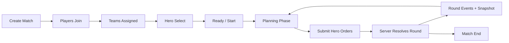
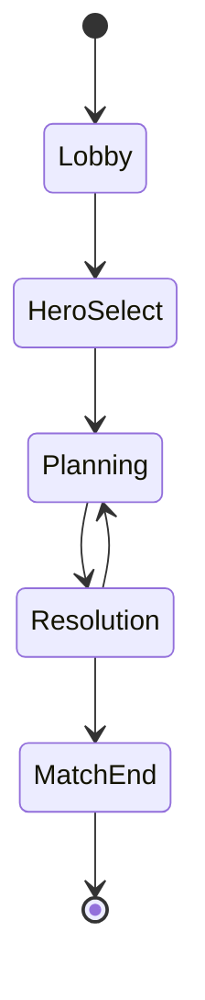

# Phase 5 Technical Spec  

## 5v5 Readiness and One-Hero-Per-Player Slice

---

## 1. Phase 5 Goal

> **Move the game from a team-commander prototype to a real MOBA-style multiplayer foundation where each human player controls one hero, teams share vision, and the architecture supports up to 5v5 with AI backfill.**

Phase 4 added tactical depth.  
Phase 5 validates the actual MOBA player model.

---

## 2. Why This Is the Right Phase 5 Slice

Before adding gold, XP, items, shops, and upgrades, the game must prove:

- 10 concurrent players can exist in a match
- each player controls only one hero
- teams share fog of war
- the server can assign and track player-controlled units
- disconnected players can be replaced by AI
- the lobby and hero assignment flow works
- the battle remains stable with more heroes, more vision sharing, and more simultaneous orders

If we add economy before this model is stable, we risk building on the wrong multiplayer foundation.

---

## 3. Phase 5 Definition of Done

Phase 5 is complete when:

- [ ] A match can be configured for 1v1, 3v3, or 5v5.
- [ ] The primary target mode is 5v5.
- [ ] Up to 10 human players can join a match.
- [ ] Each human player controls exactly one hero.
- [ ] AI fills empty player slots.
- [ ] AI takes over disconnected players.
- [ ] Players can select or receive a unique hero.
- [ ] Teams share fog of war.
- [ ] Each player receives a snapshot filtered by team vision.
- [ ] Each player can submit orders only for their own hero.
- [ ] The server rejects orders for units a player does not control.
- [ ] The lobby shows players, teams, hero assignments, and readiness.
- [ ] The match can start with partial humans plus AI backfill.
- [ ] A disconnected player can reconnect and regain control of their hero.
- [ ] The client supports a larger map with pan and zoom.
- [ ] The client shows a basic team roster.
- [ ] AI vs AI 5v5 can run headlessly for testing.

---

# 4. Phase 5 Scope

## Included

### Match Structure
- lobby phase
- hero selection or assignment
- team assignment
- ready/start flow
- AI backfill
- reconnect support
- 5v5 configuration

### Server
- player registry per match
- hero assignment
- controller mapping
- team-shared snapshots
- per-player order permissions
- disconnect handling
- AI takeover

### Core Simulation
- one controller per hero
- team vision sharing
- larger battle configuration
- stable behavior with 10 heroes

### Client
- lobby screen
- hero selection screen
- battle screen with controlled hero focus
- team roster panel
- pan/zoom camera
- order submission for only one hero
- reconnect banner

### Content
- 5 hero definitions
- larger map
- existing towers, spawners, minions, neutrals, abilities, repair, LOS

---

## Excluded

Phase 5 does **not** include:

- gold
- XP
- leveling
- items
- shop
- talents
- matchmaking
- ranking
- draft / bans
- spectator mode
- chat
- pings
- multiple maps
- persistence
- cosmetics
- advanced anti-cheat
- production deployment

---

# 5. High-Level Player Flow



---

# 6. Match Lifecycle

Phase 5 introduces more match phases.



---

## 6.1 Lobby

Players join the match.

Server handles:
- player identity
- display name
- team assignment
- connection state
- ready state

---

## 6.2 Hero Select

Each connected human player selects one hero.

Rules:
- heroes are unique per team
- each team has the same hero pool
- if a player does not select in time, server assigns a random remaining hero
- AI players are assigned remaining heroes

For Phase 5, keep hero select simple:
- no bans
- no draft order
- no trading
- no roles enforcement

---

## 6.3 Planning

Normal turn-based planning:
- each human player controls their assigned hero
- each player submits one order for their hero
- server waits for timer or all human orders

---

## 6.4 Resolution

Server resolves:
- player hero orders
- AI hero orders
- minion orders
- tower orders
- neutral orders
- spawner logic
- fog update
- win condition

---

# 7. Controller Model

Phase 5 replaces the Phase 2–4 “team commander” model with a per-unit controller model.

---

## 7.1 Controller Types

```rust
pub enum Controller {
    Player(PlayerId),
    Ai,
    Automatic,
}
```

### Usage
- heroes can be `Player` or `Ai`
- minions are `Automatic`
- towers are `Automatic`
- spawners are `Automatic`
- neutrals are `Automatic`

---

## 7.2 Controller Map

The battle session stores:

```rust
pub struct ControllerMap {
    controllers: HashMap<UnitId, Controller>,
}
```

This is now the source of truth for order permissions.

---

## 7.3 Order Permission Rule

A player may submit an order only if:

```rust
controller == Controller::Player(player_id)
```

If not, reject.

---

# 8. Player Assignment Model

---

## 8.1 Player Record

```rust
pub struct MatchPlayer {
    pub player_id: PlayerId,
    pub display_name: String,
    pub team: TeamId,
    pub hero_unit_id: Option<UnitId>,
    pub hero_def_id: Option<HeroDefId>,
    pub connection_state: ConnectionState,
    pub ready: bool,
}
```

---

## 8.2 Connection State

```rust
pub enum ConnectionState {
    Connected,
    Disconnected,
    AiReplacement,
}
```

---

## 8.3 Team Assignment

For Phase 5, use simple auto-assignment:

1. first player joins Team 0 if Team 0 has fewer humans
2. otherwise Team 1 if Team 1 has fewer humans
3. if both teams full, reject join or mark as spectator later

For development, allow override via query parameter:

```text
/ws/match/:match_id?player_id=...&team=0
```

But production matchmaking is out of scope.

---

# 9. Hero Roster

Phase 5 needs at least 5 heroes per team.

---

## 9.1 Hero Definition

```rust
pub type HeroDefId = String;

pub struct HeroDef {
    pub id: HeroDefId,
    pub name: String,
    pub max_hp: u32,
    pub max_ap: u32,
    pub initiative: u32,
    pub attack_damage: u32,
    pub attack_range: u32,
    pub vision_range: u32,
    pub max_energy: u32,
    pub energy_regen: u32,
    pub spell_id: SpellId,
}
```

---

## 9.2 Suggested Hero Set

| Hero | Role | Basic Attack | Ability |
|---|---|---:|---|
| Vanguard | Frontline | melee | Cleave |
| Ranger | Ranged damage | range 2 | Bolt |
| Warden | Support | melee | Mend |
| Sniper | Long-range damage | range 3 | Longshot |
| Berserker | Damage bruiser | melee | Fury |

---

## 9.3 Suggested Stats

These are starting values, not final balance.

### Vanguard
```rust
max_hp: 140,
max_ap: 3,
initiative: 3,
attack_damage: 18,
attack_range: 1,
vision_range: 3,
max_energy: 5,
energy_regen: 1,
spell_id: "cleave"
```

### Ranger
```rust
max_hp: 90,
max_ap: 3,
initiative: 4,
attack_damage: 16,
attack_range: 2,
vision_range: 4,
max_energy: 5,
energy_regen: 1,
spell_id: "bolt"
```

### Warden
```rust
max_hp: 100,
max_ap: 3,
initiative: 2,
attack_damage: 12,
attack_range: 1,
vision_range: 4,
max_energy: 6,
energy_regen: 1,
spell_id: "mend"
```

### Sniper
```rust
max_hp: 80,
max_ap: 3,
initiative: 4,
attack_damage: 14,
attack_range: 3,
vision_range: 5,
max_energy: 5,
energy_regen: 1,
spell_id: "longshot"
```

### Berserker
```rust
max_hp: 120,
max_ap: 3,
initiative: 3,
attack_damage: 20,
attack_range: 1,
vision_range: 3,
max_energy: 5,
energy_regen: 1,
spell_id: "fury"
```

---

## 9.4 New Phase 5 Abilities

Only add two simple new abilities using the Phase 4 spell framework.

### Longshot
```rust
SpellDef {
    id: "longshot".into(),
    name: "Longshot".into(),
    ap_cost: 1,
    energy_cost: 3,
    cooldown: 3,
    range: 4,
    min_range: 2,
    targeting: TargetingMode::EnemyUnit,
    requires_line_of_sight: true,
    effects: vec![
        EffectDef {
            kind: EffectKind::Damage,
            amount: 30,
            radius: None,
            status: None,
        },
    ],
}
```

### Fury
```rust
SpellDef {
    id: "fury".into(),
    name: "Fury".into(),
    ap_cost: 1,
    energy_cost: 2,
    cooldown: 3,
    range: 0,
    min_range: 0,
    targeting: TargetingMode::SelfOnly,
    requires_line_of_sight: false,
    effects: vec![
        EffectDef {
            kind: EffectKind::ApplyStatus,
            amount: 0,
            radius: None,
            status: Some(StatusDef {
                id: "fury_buff".into(),
                duration_rounds: 2,
                modifiers: vec![
                    StatModifier {
                        stat: StatKind::AttackDamage,
                        value: 8,
                    },
                ],
            }),
        },
    ],
}
```

---

# 10. Map and Content Scale

Phase 5 should use a larger map than Phase 4.

---

## 10.1 Map Recommendation

Use:

```rust
map_radius: 8
```

This gives enough space for:
- 10 heroes
- minion waves
- towers
- spawners
- neutral camps
- tactical positioning

---

## 10.2 Suggested Layout

### Team 0 Base
- Spawner: `(-7, 0)`
- Tower: `(-5, 0)`
- Hero spawn cluster:
  - `(-6, -2)`
  - `(-6, -1)`
  - `(-6, 0)`
  - `(-6, 1)`
  - `(-6, 2)`

### Team 1 Base
- Spawner: `(7, 0)`
- Tower: `(5, 0)`
- Hero spawn cluster:
  - `(6, -2)`
  - `(6, -1)`
  - `(6, 0)`
  - `(6, 1)`
  - `(6, 2)`

---

## 10.3 Lane Waypoints

Keep one central lane for Phase 5.

```text
(-7, 0)
(-4, 0)
(0, 0)
(4, 0)
(7, 0)
```

This is enough to validate minion movement at 5v5 scale.

Multiple lanes should move to a later phase.

---

## 10.4 Neutral Camps

Use two camps:

```text
(0, 4)
(0, -4)
```

Each camp contains one neutral guardian.

---

## 10.5 Vision Blockers

Add a few vision blockers around the middle:

```text
(0, 2)
(0, -2)
(2, 3)
(-2, -3)
(3, -2)
(-3, 2)
```

These create angles without making the map too complex.

---

# 11. Core Simulation Changes

---

## 11.1 BattleSession Additions

```rust
pub struct BattleSession {
    state: GameState,
    controllers: ControllerMap,
    config: BattleConfig,
    hero_assignments: HashMap<HeroDefId, UnitId>,
}
```

---

## 11.2 Updated BattleConfig

```rust
pub struct BattleConfig {
    pub map_radius: u32,
    pub players_per_team: u32,
    pub heroes_per_team: u32,
    pub turn_duration_secs: u64,
    pub spawn_interval: u32,
    pub fill_empty_slots_with_ai: bool,
    pub resolve_early_if_all_orders_received: bool,
}
```

Default for Phase 5:

```rust
BattleConfig {
    map_radius: 8,
    players_per_team: 5,
    heroes_per_team: 5,
    turn_duration_secs: 30,
    spawn_interval: 3,
    fill_empty_slots_with_ai: true,
    resolve_early_if_all_orders_received: true,
}
```

---

## 11.3 Hero Creation

When a hero is assigned:

1. create a unit from `HeroDef`
2. assign team
3. assign spawn position
4. assign controller:
   - `Controller::Player(player_id)` for human
   - `Controller::Ai` for AI
5. insert into battle state

---

## 11.4 Team Vision Sharing

Fog remains team-based, not player-based.

```rust
pub fn visible_hexes_for_team(&self, team: TeamId) -> &HashSet<HexCoord>
```

Every player on Team 0 receives the same visible hex set.

---

## 11.5 Snapshot for Player

A player snapshot is based on:

- player’s team fog
- player’s controlled hero
- public match state

```rust
pub fn snapshot_for_player(&self, player_id: &PlayerId) -> SnapshotDto {
    let team = self.team_of_player(player_id);
    let fog = self.state.fog.visible_hexes(team);
    let controlled = self.units_controlled_by_player(player_id);

    // filter units by team fog
    // include only visible enemy units
    // include all allied units
}
```

---

# 12. Server Changes

Phase 5 significantly expands the server match actor.

---

## 12.1 Match Actor State

```rust
pub struct MatchActor {
    match_id: MatchId,
    config: BattleConfig,
    phase: MatchPhase,
    session: Option<BattleSession>,

    players: HashMap<PlayerId, MatchPlayer>,
    connections: HashMap<PlayerId, mpsc::Sender<ServerMessage>>,

    team_hero_pool: HashMap<TeamId, Vec<HeroDefId>>,
    selected_heroes: HashMap<PlayerId, HeroDefId>,

    submitted_players: HashSet<PlayerId>,
    timer_deadline: Option<Instant>,
}
```

---

## 12.2 MatchPhase

```rust
pub enum MatchPhase {
    Lobby,
    HeroSelect,
    Planning,
    Resolution,
    MatchEnd,
}
```

---

## 12.3 Commands

```rust
pub enum MatchCommand {
    PlayerConnected {
        player_id: PlayerId,
        display_name: String,
        sender: mpsc::Sender<ServerMessage>,
    },

    PlayerDisconnected {
        player_id: PlayerId,
    },

    SelectHero {
        player_id: PlayerId,
        hero_def_id: HeroDefId,
    },

    SetReady {
        player_id: PlayerId,
        ready: bool,
    },

    SubmitOrders {
        player_id: PlayerId,
        round: Round,
        orders: Vec<OrderDto>,
    },

    TimerExpired {
        phase: MatchPhase,
        round: Option<u32>,
    },
}
```

---

# 13. Lobby Rules

---

## 13.1 Join Rules

A player may join if:
- match exists
- match is in lobby or hero select
- target team has an open human slot
- player ID is not already connected

If reconnecting:
- player ID already exists
- reattach connection
- send current lobby/match state

---

## 13.2 Team Fill Strategy

For each new player:

```text
if team 0 has fewer humans than team 1:
    assign team 0
else if team 1 has fewer humans than team 0:
    assign team 1
else:
    assign team with fewer total connected players
```

For dev/testing, allow forced team.

---

## 13.3 AI Backfill

When match starts:
- any missing player slot becomes AI
- AI is assigned a remaining hero
- controller becomes `Controller::Ai`

During match:
- if player disconnects, controller becomes AI
- if player reconnects, controller returns to player

---

# 14. Hero Select Rules

---

## 14.1 Hero Pool

Each team has the same 5 heroes:

```text
vanguard
ranger
warden
sniper
berserker
```

---

## 14.2 Selection Rules

A hero selection is valid if:
- match is in hero select
- hero belongs to the team pool
- hero has not already been selected on that team
- player has not already selected a different hero, unless replacement is allowed

For Phase 5:
- allow changing selection until timer ends
- final selection locks at hero select expiry

---

## 14.3 Hero Select Timer

Recommended:

```text
20 seconds
```

When timer expires:
- assign random remaining heroes to players who did not select
- assign remaining heroes to AI slots
- build battle session
- start planning round 1

---

# 15. Protocol Updates

---

## 15.1 Client Messages

Add:

```rust
SelectHero {
    hero_def_id: HeroDefId,
}

SetReady {
    ready: bool,
}
```

Keep:

```rust
JoinMatch
SubmitOrders
Ping
```

---

## 15.2 Server Messages

Add:

```rust
LobbyUpdated {
    match_id: MatchId,
    phase: MatchPhaseDto,
    players: Vec<PlayerLobbyDto>,
    hero_pools: HashMap<TeamId, Vec<HeroDto>>,
    selected_heroes: HashMap<PlayerId, HeroDefId>,
    countdown_ms: Option<u64>,
}

HeroSelected {
    player_id: PlayerId,
    team: TeamId,
    hero_def_id: HeroDefId,
}

MatchStarting {
    snapshot: SnapshotDto,
}
```

Existing messages remain:
- `RoundStarted`
- `OrdersAccepted`
- `RoundResolved`
- `MatchEnded`
- `Error`

---

## 15.3 PlayerLobbyDto

```rust
pub struct PlayerLobbyDto {
    pub player_id: PlayerId,
    pub display_name: String,
    pub team: TeamId,
    pub connected: bool,
    pub ready: bool,
    pub hero_def_id: Option<HeroDefId>,
    pub is_ai: bool,
}
```

---

## 15.4 HeroDto

```rust
pub struct HeroDto {
    pub id: HeroDefId,
    pub name: String,
    pub role: String,
    pub max_hp: u32,
    pub attack_damage: u32,
    pub attack_range: u32,
    pub vision_range: u32,
    pub spell_id: SpellId,
}
```

---

## 15.5 Snapshot Updates

`SnapshotDto` should include:

```rust
pub controlled_units: Vec<UnitId>,
pub player_team: TeamId,
pub roster: Vec<RosterEntryDto>,
```

Where:

```rust
pub struct RosterEntryDto {
    pub player_id: Option<PlayerId>,
    pub display_name: String,
    pub hero_def_id: HeroDefId,
    pub unit_id: UnitId,
    pub team: TeamId,
    pub connected: bool,
    pub is_ai: bool,
    pub hp: u32,
    pub max_hp: u32,
    pub alive: bool,
}
```

This lets the client render team status without exposing hidden enemy details.

Important:
- roster HP for visible enemy heroes can be included only if visible
- for invisible enemy heroes, either omit or show only alive/dead state if desired

For Phase 5, simplest:
- include full roster for allied team
- include enemy roster entries only if visible

---

# 16. Order Submission in Phase 5

---

## 16.1 Order Size

Each human player submits orders only for their own hero.

Usually:

```json
{
  "type": "SubmitOrders",
  "round": 4,
  "orders": [
    {
      "unit_id": 12,
      "move_target": { "q": -2, "r": 0 },
      "action": {
        "type": "Cast",
        "spell_id": "bolt",
        "target": { "type": "Unit", "unit_id": 27 }
      }
    }
  ]
}
```

---

## 16.2 Server Acceptance

Server accepts if:
- round is current
- player controls unit
- order is structurally valid
- basic gameplay validation passes

Server responds:

```json
{
  "type": "OrdersAccepted",
  "round": 4
}
```

---

## 16.3 Early Resolution

If all connected human players have submitted:
- server may resolve early after short grace period

If some humans are missing:
- wait for timer
- AI fills missing hero orders

---

# 17. Fog and Privacy in 5v5

---

## 17.1 Team Vision

All players on a team see the same fog.

This means:
- allied vision is shared
- enemy units appear only if visible to any allied unit or structure
- no private fog per player

---

## 17.2 Snapshot Privacy Rules

For each player snapshot:

### Include fully
- allied heroes
- allied minions
- allied towers
- allied spawners
- visible enemy units
- visible neutrals
- map terrain

### Do not include
- invisible enemy heroes
- invisible enemy minion positions
- invisible neutral state
- enemy orders
- enemy cooldowns for invisible units

---

# 18. Client Updates

Phase 5 requires a larger client UX upgrade.

---

## 18.1 Screens

### Lobby Screen
Shows:
- match ID
- players per team
- connection status
- ready status
- start conditions

### Hero Select Screen
Shows:
- team hero pool
- selected hero per player
- selection timer
- confirm/change selection

### Battle Screen
Shows:
- hex board
- controlled hero highlight
- team roster
- ability bar
- turn timer
- order submitted indicator
- reconnect banner

---

## 18.2 Camera

Because the map is larger, the client needs:
- pan
- zoom
- center on own hero
- optional follow own hero

Minimum:
- mouse drag pan
- wheel zoom
- button to center camera on controlled hero

---

## 18.3 Controlled Hero Focus

The player should only be able to issue orders to their own hero.

Client behavior:
- clicking allied units can inspect them
- clicking own hero enables order mode
- clicking enemy units only selects them as targets when in attack/spell/repair mode

---

## 18.4 Team Roster Panel

Display for allied team:
- hero name
- player name or AI
- HP bar
- alive/dead state
- connected/disconnected icon
- order submitted indicator

Do not show exact orders of teammates.

---

## 18.5 Order Submitted Indicator

Each human player should see whether they submitted orders for the round.

Also show:
- “Waiting for teammates…”
- “Timer expires in 12s”

---

# 19. AI Updates for 5v5

---

## 19.1 AI Hero Behavior

AI heroes use the Phase 4 hero AI, improved slightly:

1. stay near allies if possible
2. focus visible enemies
3. use abilities when valuable
4. repair nearby damaged towers if no better action
5. do not intentionally walk into tower range alone

For Phase 5, AI does not need to be smart. It only needs to be stable.

---

## 19.2 AI Fill Cases

AI controls a hero when:
- slot was empty at match start
- player disconnected
- player failed to submit before timer

---

## 19.3 AI Order Generation Timing

At resolution:
- for each AI-controlled hero, generate orders
- for each human hero with missing orders, generate fallback orders

---

# 20. Reconnection and Disconnect Handling

---

## 20.1 Disconnect During Lobby
- remove player from lobby if not reconnected before match starts
- replace with AI at match start

---

## 20.2 Disconnect During Hero Select
- if hero already selected, keep selection
- if not selected, assign random hero at end of timer

---

## 20.3 Disconnect During Planning
- mark player disconnected
- AI fills their order at timer expiry
- if player reconnects before resolution, they may submit

---

## 20.4 Disconnect During Resolution
- no orders can be changed
- reconnect after resolution receives updated snapshot

---

## 20.5 Reconnect Payload

When a player reconnects, server sends:
- current match phase
- lobby state if before battle
- current snapshot if in battle
- controlled unit ID
- current round and deadline

---

# 21. Server Performance Considerations

Phase 5 is still small enough for a single match actor.

Expected entities:
- 10 heroes
- dozens of minions over time
- towers/spawners
- neutrals

Expected traffic:
- 10 WebSocket connections
- small JSON snapshots per round
- small order payloads

For Phase 5:
- JSON is fine
- one match actor is fine
- full snapshots per round are fine

Optimization can come later.

---

# 22. Testing Strategy

---

## 22.1 Unit Tests
- team assignment
- hero selection uniqueness
- controller permission checks
- snapshot filtering per team
- AI backfill logic
- reconnect state restoration

---

## 22.2 Integration Tests
- 2 players join and start 1v1 with AI backfill
- 6 players join and start 3v3 with AI backfill
- 10 players join and start 5v5
- player disconnects, AI takes over
- player reconnects and regains hero
- invalid order for another hero is rejected
- hidden enemy hero not present in snapshot

---

## 22.3 Headless AI vs AI Test
Run:
- 5v5 AI match
- 100 rounds or until winner
- verify no panic
- verify deterministic state hash for same seed/orders

---

## 22.4 Load Test
Simulate:
- 10 connected clients
- simultaneous order submission
- reconnect storms
- late orders near timer expiry

---

# 23. Acceptance Criteria

| # | Criterion | Status |
|---|-----------|--------|
| 1 | Server supports match config for 5v5 | ☐ |
| 2 | Up to 10 human players can join | ☐ |
| 3 | Players are assigned to teams | ☐ |
| 4 | Lobby updates broadcast to all players | ☐ |
| 5 | Hero select works with unique heroes per team | ☐ |
| 6 | Unselected heroes are auto-assigned | ☐ |
| 7 | AI fills empty slots | ☐ |
| 8 | Battle starts with partial humans plus AI | ☐ |
| 9 | Each human controls exactly one hero | ☐ |
| 10 | Server rejects orders for non-controlled heroes | ☐ |
| 11 | Team vision is shared | ☐ |
| 12 | Snapshot is filtered by player team fog | ☐ |
| 13 | Invisible enemy units are not sent | ☐ |
| 14 | Turn timer works with multiple human players | ☐ |
| 15 | Missing human orders are filled by AI | ☐ |
| 16 | Disconnected player’s hero becomes AI-controlled | ☐ |
| 17 | Reconnected player regains control | ☐ |
| 18 | Client displays team roster | ☐ |
| 19 | Client displays controlled hero clearly | ☐ |
| 20 | Client supports pan/zoom on larger map | ☐ |
| 21 | Hero abilities work in 5v5 | ☐ |
| 22 | Repair works in 5v5 | ☐ |
| 23 | Neutrals work in 5v5 | ☐ |
| 24 | Minions spawn and lane pathing remains stable | ☐ |
| 25 | AI vs AI 5v5 headless simulation works | ☐ |

---

# 24. Risks and Mitigations

---

## Risk 1: Lobby Complexity Grows Too Fast
### Mitigation
Keep hero select simple:
- no draft
- no bans
- no trading
- no persistence

---

## Risk 2: Snapshot Size Increases
### Mitigation
Phase 5 entity count is still small. Use full snapshots now and optimize later.

---

## Risk 3: Player Confusion Over Controlled Unit
### Mitigation
Strong UI focus:
- highlight own hero
- camera center button
- clear “your hero” panel

---

## Risk 4: Disconnects Create Order Conflicts
### Mitigation
Only accept orders from currently assigned controller at submission time. Reconnection replaces AI only before resolution.

---

## Risk 5: 5v5 Balance Breaks Existing Systems
### Mitigation
Run AI vs AI soak tests and keep Phase 4 mechanics stable before adding new content.

---

# 25. Out of Scope

Do not add in Phase 5:

- gold
- XP
- leveling
- items
- shop
- talents
- matchmaking
- ranked
- draft mode
- bans
- chat
- pings
- spectator mode
- multiple lanes
- multiple maps
- persistence
- cosmetics
- friends system

---

# 26. Phase 6 Preview

After Phase 5 is stable, the best next slice is:

## Phase 6 — MOBA Economy and Progression

Likely contents:
- gold
- XP
- hero levels
- item definitions
- shop
- item slots
- power spikes
- tower kill rewards
- minion kill rewards
- neutral rewards tied to economy
- win conditions beyond hero elimination

Phase 6 becomes much safer after Phase 5 because the player-per-hero model and team-shared server state already exist.

---

# 27. Final Recommendation

Phase 5 should be:

> **5v5 readiness with one-hero-per-player control, AI backfill, lobby/hero select, team vision sharing, and server-enforced player permissions.**

This is the correct next vertical slice because it turns the project from a tactical prototype into a true MOBA-style multiplayer foundation.

If you want, the next step can be:

**“Phase 5 implementation task breakdown”**  
with concrete server, core, protocol, and client tasks in execution order.