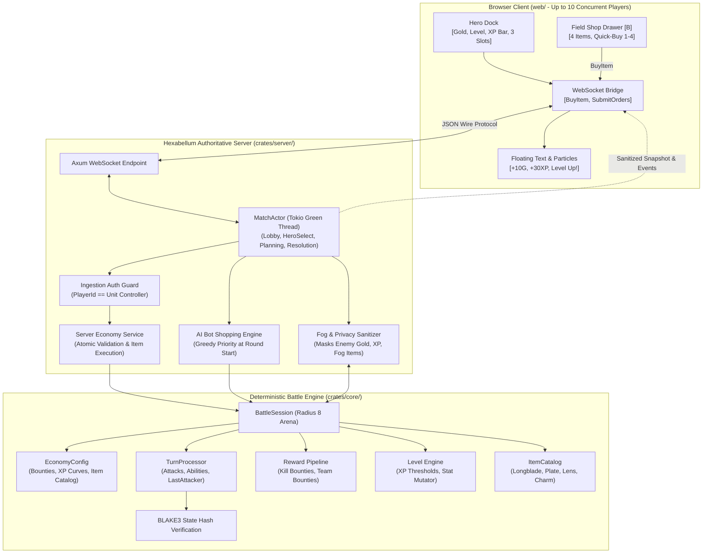
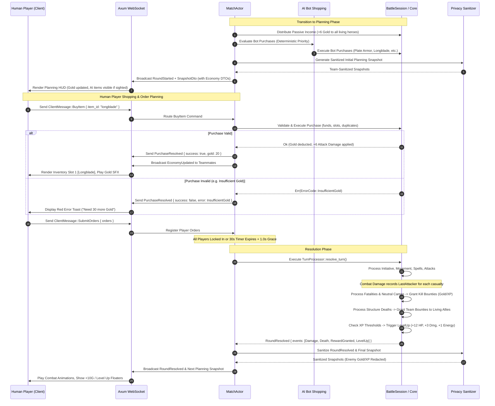

# Phase 6 Technical Spec — MOBA Economy, Hero Progression, Level Scaling & Field Item Shop

---

## Architectural Decision Record (ADR-007): Server-Authoritative Economy, Kill/Objective Bounties, Level-Up Progression & Field Item Shop

### Context

Hexabellum Phases 1 through 5 established a solid server-authoritative 5v5 MOBA multiplayer foundation:
- **Phase 1 & 2**: Simultaneous deterministic turn resolution, 3v3 heroes, autonomous minion waves, defensive towers, and fog of war.
- **Phase 3**: Tokio-based actor-per-match architecture (`MatchActor`), WebSocket state synchronization with 30s turn timers and 1.0s grace periods, and BLAKE3 cryptographic state verification.
- **Phase 4**: Hero active abilities (Cleave, Bolt, Mend), status effect pipelines, line-of-sight cube raycasting, structure repair, neutral objective camps with leash mechanics, and lane waypoint steering.
- **Phase 5**: Transitioned from a multi-unit "Team Commander" model to a true per-player single-hero avatar model (up to 10 concurrent human players), expanded 5-hero roster (Vanguard, Ranger, Warden, Sniper, Berserker), team-shared line-of-sight fog of war union, dynamic AI backfill on disconnect, and a scaled radius 8 arena (217 hexes) with client pan/zoom.

However, in Phase 5 the match remained a **static tactical battle**:
1. **Zero Progression Pressure**: Heroes started and ended the match with identical base statistics. There was no strategic reason to farm minion waves, eliminate enemy heroes, or secure neutral camps beyond short-term territorial control.
2. **No Build Diversity or Counter-Itemization**: Every hero archetype possessed fixed stats throughout the match. Players had no tactical agency to adapt their build in response to enemy team compositions (e.g., building extra armor against heavy melee divers or vision range against snipers).
3. **No Economy or Reward Attribution**: When a unit was eliminated or a tower destroyed, zero gold or experience was generated. Combat lacked individual positive reinforcement.
4. **Lack of Mid-Game Strategic Arcs**: MOBA gameplay thrives on economic curves—early-game laning, mid-game item power spikes, and late-game scaling. Without gold, XP, and levels, matches quickly devolved into flat attrition.

Phase 6 introduces the **fundamental progression layer** to Hexabellum: per-hero gold, kill/objective bounties, experience gain, level-up stat growth (Levels 1–5), and a minimal 3-slot passive item system with a server-authoritative Field Shop.

---

### Decisions

| System Area | Decision | Rationale & Trade-Offs |
|---|---|---|
| **Gold Ledger Model** | **Per-Hero Sovereign Gold Ledger** | Gold is owned individually by each hero rather than pooled at the team level. This preserves individual player agency, rewards individual farming and kill execution, enables hero-specific item builds, and natively supports AI bot wallets. |
| **Bounty Attribution** | **Deterministic Last-Attacker Kill Tracking** | Kill bounties are awarded directly to the unit that dealt the fatal blow (`last_attacker`). If scored by a hero, that hero receives the full gold/XP bounty. Minion/tower last hits do not grant individual hero bounties, incentivizing precise last-hitting mechanics. |
| **Objective Team Rewards** | **Living Allied Hero Team Payouts for Structures** | When an enemy Tower or Spawner is destroyed, a flat team bounty (gold + XP) is awarded to *all living allied heroes*. This ensures that taking objectives benefits the entire team even if a minion wave strikes the final blow, while incentivizing player survival. |
| **Progression Range & Curve** | **Levels 1 to 5 with Linear Thresholds** | Caps hero progression at Level 5 for this vertical slice. Thresholds (`0`, `50`, `120`, `220`, `350` XP) provide a clear progression cadence (average 1 level-up every 2–4 combat rounds) without overwhelming balance or extending match length. |
| **Level-Up Stat Growth** | **Fixed Base Stat Growth (+12 HP, +12 Heal, +3 Dmg, +1 Energy)** | Each level-up directly increases Max HP (+12), current HP (+12 immediate heal), Attack Damage (+3), and Max Energy (+1). Action Points (AP) and Energy Regen are intentionally left constant to prevent runaway action economy imbalance. |
| **Item System Scope** | **Minimal Passive Items (3 Slots, No Duplicates, No Selling)** | A curated catalogue of 4 passive items (`Longblade`, `Plate Armor`, `Scout Lens`, `Focus Charm`). Heroes have at most 3 slots. Items cannot be duplicated or sold in Phase 6. This eliminates complex inventory rearrangement, recipe trees, and refund abuse while validating the stat modifier engine. |
| **Shop Architecture** | **Planning-Phase "Field Shop" (Shop from Anywhere)** | Heroes may purchase items at any time during the 30-second `Planning` phase regardless of map position. Validated atomically by the server. This bypasses base pathfinding and recall mechanics in Phase 6, focusing purely on economic verification and inventory management. (Base-only shopping is slated for Phase 7). |
| **Purchase Authorization & Atomicity** | **Atomic Validation via Client `BuyItem` Command** | Purchasing is an instantaneous server-validated transaction. The server verifies match phase (`Planning`), player ownership (`PlayerId == Controller`), living state, item catalog validity, wallet sufficiency, available slot, and duplicate restrictions. Purchases cost 0 AP and take effect immediately. |
| **AI Shopping Integration** | **Deterministic Greedy AI Item Purchase at Round Start** | Bot-controlled heroes automatically evaluate item purchases at the beginning of each planning phase immediately following passive income distribution. Evaluates a fixed priority tier (`Plate Armor` → `Longblade` → `Focus Charm` → `Scout Lens`), ensuring bots remain competitive with human players. |
| **Anti-Cheat & Economy Privacy** | **Asymmetric Fog Masking & Zero-Knowledge Redaction** | Allied gold, XP, and inventory are shared with teammates via WebSocket snapshots. Enemy gold and XP are strictly stripped from server messages. Enemy items and levels are *only* revealed when the enemy hero is actively sighted in the team's line-of-sight union; concealed enemies have their economy completely redacted. |

---

### Consequences & System Impacts

- **Positive**:
  - Eliminating enemies, waves, and camps now provides tangible strategic advantage through gold and levels.
  - Item choices create distinct hero power spikes and tactical counter-play (e.g., buying Plate Armor against burst damage or Scout Lens to control neutral vision).
  - The deterministic execution pipeline remains 100% reproducible; all rewards and AI purchases occur at discrete, ordered evaluation steps.
  - The Field Shop keeps client interactions snappy and eliminates base-backtracking pathfinding complications during this milestone.
- **Negative / Constraints**:
  - The absence of item selling or consumables means item purchases are permanent commitments for the duration of the match.
  - Field shopping allows players to buy items mid-lane; tactical positioning around a physical base shop is deferred to Phase 7.
  - Last-attacker attribution without assist bounties can occasionally lead to accidental "kill steals" by allied minions or towers where no hero receives the bounty.

---

## Phase 6 Goal

> **Add the first server-authoritative MOBA progression layer: sovereign per-hero gold, combat and objective bounties, XP-driven level scaling (Levels 1–5), and a minimal 3-slot passive item system with a planning-phase Field Shop—seamlessly integrated into the 5v5 multiplayer architecture from Phase 5.**

Phase 5 verified 10-player concurrency, single-hero ownership, team vision, and AI takeover.  
Phase 6 gives players the strategic reason to farm, fight, conquer neutral objectives, and grow stronger over the course of the match.

---

### What Phase 6 Adds

| Subsystem | Component | Description & Architectural Role |
|---|---|---|
| **Economy Ledger** | **Per-Hero Gold & XP Tracker** | Sovereign unit fields tracking accumulated gold, total XP, current level, and 3-slot item inventory. |
| **Income Engine** | **Round Start Passive Income** | Grants +6 Gold per alive hero at the beginning of each planning round to maintain baseline purchasing power. |
| **Bounty Engine** | **Deterministic Killer Attribution** | Attributed via `last_attacker` tracking on damage instances. Awards individual bounties for hero (30G/30XP), minion (10G/10XP), and neutral guardian (40G/25XP) eliminations. |
| **Objective Payouts** | **Team Structure Bounties** | Distributes team-wide gold and XP bounties to all living allied heroes upon the destruction of enemy Towers (25G/20XP) and Spawners (30G/25XP). |
| **Progression Engine** | **Linear XP Thresholds & Level Up** | Manages Levels 1 through 5 with thresholds (0, 50, 120, 220, 350). Evaluates level thresholds and applies immediate base stat growth. |
| **Stat Scaling** | **Base Attribute Growth** | Direct increases of +12 Max HP, +12 instant HP heal, +3 Attack Damage, and +1 Max Energy per level-up. |
| **Item Catalogue** | **4 Canonical Passive Items** | `Longblade` (+6 Dmg, 100G), `Plate Armor` (+35 Max HP & instant heal, 120G), `Scout Lens` (+1 Vision, 80G), `Focus Charm` (+1 Energy Regen, 100G). |
| **Field Shop Engine** | **Planning-Phase Shopping Service** | Atomic purchase validation on the server during `Planning`. Zero AP cost, immediate stat application, and snapshot synchronisation. |
| **Bot Economy AI** | **Deterministic AI Shopping** | Greedy deterministic item purchase logic executed by AI and backfilled heroes at the start of each planning phase. |
| **Protocol Extensions** | **`BuyItem` & Economy DTOs** | Client message `BuyItem`, server messages `PurchaseResolved`, `EconomyUpdated`, `LevelUpOccurred`, and extended `SnapshotDto`. |
| **Zero-Knowledge Privacy** | **Economy Fog Sanitizer** | Strips enemy gold/XP entirely; masks enemy items and levels unless actively revealed within team line-of-sight. |
| **Client Economy HUD** | **Gold, XP Bar, Items & Shop Drawer** | Glassmorphic Field Shop drawer (`[B]`), 3 inventory slot frames, live gold counter, XP progress bar, level badge, and floating combat text (+10G, +30XP, LEVEL UP!). |
| **Determinism Harness** | **100-Round Economy Soak Test** | Verifies 100% bitwise BLAKE3 state hash reproducibility across 10-player matches with full economy, leveling, and bot purchases. |

---

## Definition of Done (DoD)

### 1. Core Simulation (`crates/core`)
- [ ] `Unit` struct expanded with `gold: u32`, `xp: u32`, `level: u32`, `items: Vec<ItemDefId>`, and `last_attacker: Option<UnitId>`.
- [ ] `EconomyConfig` defined with configurable starting gold (50), passive income (6), kill bounties, objective payouts, and max level (5).
- [ ] Passive gold income (+6G) awarded to all living heroes at the start of each planning round.
- [ ] `LastAttacker` tracker correctly attributes fatal blows during basic attacks, abilities, and structure strikes.
- [ ] Kill rewards awarded deterministically: Minion (10G/10XP), Hero (30G/30XP), Neutral Guardian (40G/25XP).
- [ ] Objective structure destruction awards team rewards to all living allied heroes: Tower (25G/20XP), Spawner (30G/25XP).
- [ ] Experience threshold engine correctly handles level progression from Level 1 to Level 5.
- [ ] Multi-level jumps in a single resolution round (e.g., from massive double-kill XP) correctly trigger sequential level-up bonuses.
- [ ] Level-up bonuses correctly applied: +12 Max HP, +12 instant HP heal (capped at max), +3 Attack Damage, +1 Max Energy.
- [ ] `ItemDef` and `ItemCatalog` implemented with the 4 canonical items (`longblade`, `plate_armor`, `scout_lens`, `focus_charm`).
- [ ] Inventory constraints enforced: maximum 3 items, no duplicate items, no selling in Phase 6.
- [ ] Item stat modifiers correctly applied upon purchase (including Plate Armor's +35 Max HP and instant +35 HP heal).
- [ ] Deterministic AI shopping evaluates bot heroes in sorted `UnitId` order at round start.

### 2. Protocol & Wire Models (`crates/protocol`)
- [ ] Client message added: `ClientMessage::BuyItem { item_id: ItemDefId }`.
- [ ] Server messages added: `ServerMessage::PurchaseResolved`, `ServerMessage::EconomyUpdated`, `ServerMessage::LevelUpOccurred`.
- [ ] `HeroEconomyDto` defined with `unit_id`, `hero_def_id`, `gold`, `xp`, `level`, and `items`.
- [ ] `ItemDto` defined with `id`, `name`, `cost`, `description`, `icon`, and `modifiers`.
- [ ] `SnapshotDto` extended with `controlled_hero_economy`, `allied_hero_economy`, `shop_catalog`, and `can_shop`.
- [ ] `RosterEntryDto` extended with `level: u32` and `items: Vec<ItemDefId>`.
- [ ] `ErrorCode` expanded with `InsufficientGold`, `InventoryFull`, `ItemAlreadyOwned`, `NoSuchItem`, `CannotShopInPhase`, `UnitDead`.
- [ ] Serde serialization and deserialization unit tests verify schema round-trips.

### 3. Server Authority & Actor Engine (`crates/server`)
- [ ] `MatchActor` validates `BuyItem` strictly during `MatchState::Planning`. Rejects commands in all other states.
- [ ] Ingestion authentication verifies the requesting player owns the targeted hero via `ControllerMap`.
- [ ] Atomic purchase handler verifies funds, inventory slots, living status, and item existence before mutating session state.
- [ ] Server broadcasts `PurchaseResolved` directly to the purchaser and `EconomyUpdated` to all teammates.
- [ ] Passive gold distribution executed synchronously on round transition before broadcasting `RoundStarted`.
- [ ] AI heroes and disconnected backfill bots execute automated shopping at round start prior to human snapshot emission.
- [ ] Reconnecting players seamlessly inherit current gold, XP, level, and items purchased by AI backfill during their absence.
- [ ] Fog-of-War sanitizer completely redacts enemy gold and XP from all client snapshots; redacts enemy items and levels for unsighted enemies.

### 4. Browser Client & UI/UX (`web/`)
- [ ] Hero Status Dock displays golden coin badge (`🪙 50 G`), Level shield badge (`LVL 1`), and animated XP progress bar (`xp / next_xp`).
- [ ] 3-slot inventory dock rendered on the HUD showing item icons, empty slot frames, and hover tooltips detailing stat bonuses.
- [ ] Glassmorphic Field Shop drawer toggled via dedicated HUD button or `[B]` keybinding.
- [ ] Shop drawer displays 4 item cards with name, icon, cost, stat boost, player gold comparison, and responsive BUY button.
- [ ] Quick-buy keyboard shortcuts (`1`, `2`, `3`, `4`) buy corresponding items while the shop drawer is open.
- [ ] Dynamic BUY button states: `Buy` (emerald), `Too Expensive` (dimmed with gold deficit), `Owned` (blue), `Full (3/3)` (amber).
- [ ] Allied team roster sidebar updated with hero level badges and mini 3-dot item racks.
- [ ] Sighted enemy roster displays level and items when visible; obscures them when concealed in fog of war.
- [ ] Floating combat text particle engine displays `+10G`, `+30 XP`, and radiant `LEVEL UP!` burst over hero sprites.
- [ ] Combat log panel displays economy events (`Vanguard purchased Longblade`, `Ranger defeated Minion (+10G, +10XP)`).

### 5. Verification & Determinism Harness
- [ ] Core unit tests verify passive income, kill attribution, team bounties, XP thresholds, level scaling, and purchase constraints.
- [ ] Protocol unit tests verify JSON serialization, error code handling, and wire DTO representations.
- [ ] Server integration tests verify WebSocket `BuyItem` transactions, concurrency, and dynamic AI bot shopping.
- [ ] Snapshot privacy audit verifies zero leakage of enemy gold, XP, or fog-concealed inventory in client payloads.
- [ ] 100-round 5v5 headless simulation runs without panic and achieves 100% bitwise BLAKE3 state determinism across identical seeds.

---

## Architecture Delta from Phase 5

```
Phase 5 (5v5 Multiplayer Foundation)          Phase 6 (MOBA Economy & Item Shop)
─────────────────────────────────────────    ─────────────────────────────────────────
Progression: None (Static hero base stats)  → Progression: Levels 1–5 with linear XP thresholds & stat scaling
Gold Economy: None (No currency)             → Gold Economy: Sovereign hero wallets, +6G/round passive income
Bounties: None (Pure tactical advantage)     → Bounties: Kills (10–40G/10–30XP) & Structure Team Bounties
Inventory: None                              → Inventory: 3 slots per hero, passive items only, no duplicates
Item Shop: None                              → Item Shop: Server-authoritative Field Shop (available in Planning)
Item Set: None                               → Item Set: 4 items (Longblade, Plate Armor, Scout Lens, Focus Charm)
AI Behavior: Tactical movement & combat      → AI Behavior: Tactical combat + deterministic greedy item shopping
Wire Protocol: Unit coordinates & combat HP  → Wire Protocol: Economy DTOs, BuyItem command, LevelUp/Purchase events
Anti-Cheat: Unit position & LOS masking      → Anti-Cheat: Position masking + enemy gold/XP/item zero-knowledge redaction
HUD Architecture: HP/AP/Energy & 5v5 Roster  → HUD Architecture: Gold counter, XP bar, 3-slot inventory, Shop drawer [B]
Early Resolution: Based on orders only       → Early Resolution: Based on orders (purchases do not block turn lock-in)
```

---

## High-Level System Architecture & Flow

### Component Architecture



---

### Turn Lifecycle & Economy Execution Sequence



---

### Item Purchase State Machine & Invariants

```mermaid
stateDiagram-v2
    [*] --> Ingestion: ClientMessage::BuyItem Received
    
    state Ingestion {
        [*] --> CheckMatchPhase
        CheckMatchPhase --> RejectPhase: Phase != Planning
        CheckMatchPhase --> CheckPlayerAuth: Phase == Planning
        CheckPlayerAuth --> RejectAuth: Sender does not own UnitId
        CheckPlayerAuth --> CheckUnitAlive: Player owns Unit
        CheckUnitAlive --> RejectDead: Unit HP == 0
        CheckUnitAlive --> ValidateStore: Unit is Alive
    }

    state ValidateStore {
        [*] --> CheckItemExists
        CheckItemExists --> RejectNoItem: ItemDef not in Catalog
        CheckItemExists --> CheckDuplicate: ItemDef exists
        CheckDuplicate --> RejectDuplicate: Hero already owns item
        CheckDuplicate --> CheckSlotCapacity: No duplicate
        CheckSlotCapacity --> RejectFull: Hero items.len() >= 3
        CheckSlotCapacity --> CheckGold: Hero items.len() < 3
        CheckGold --> RejectFunds: Hero gold < ItemDef.cost
        CheckGold --> ApproveTransaction: Hero gold >= ItemDef.cost
    }

    state Execution {
        [*] --> DeductGold: gold = gold - cost
        DeductGold --> InsertItem: items.push(item_id)
        InsertItem --> ApplyModifiers: apply item stat modifiers
        ApplyModifiers --> SpecialRules: if Plate Armor, hp = min(hp + 35, max_hp)
        SpecialRules --> EmitEvents: emit RewardGranted / PurchaseResolved
    }

    ApproveTransaction --> Execution: Atomic Commit
    Execution --> [*]: Broadcast Updates

    RejectPhase --> [*]: ErrorCode::CannotShopInPhase
    RejectAuth --> [*]: ErrorCode::NotYourUnit
    RejectDead --> [*]: ErrorCode::UnitDead
    RejectNoItem --> [*]: ErrorCode::NoSuchItem
    RejectDuplicate --> [*]: ErrorCode::ItemAlreadyOwned
    RejectFull --> [*]: ErrorCode::InventoryFull
    RejectFunds --> [*]: ErrorCode::InsufficientGold
```

---

## 1. Core Engine Specifications (`crates/core`)

### 1.1 Economy Configuration & Ledger State

The simulation economy is governed by an authoritative `EconomyConfig` struct attached to `BattleConfig`:

```rust
// crates/core/src/economy.rs

use serde::{Deserialize, Serialize};

#[derive(Debug, Clone, Serialize, Deserialize)]
pub struct EconomyConfig {
    /// Gold granted to each hero at match start (default: 50).
    pub starting_gold: u32,
    /// Passive gold granted to each living hero at round start (default: 6).
    pub passive_income_per_round: u32,

    /// Gold bounty awarded to killer hero on enemy hero kill (default: 30).
    pub hero_kill_gold: u32,
    /// Experience bounty awarded to killer hero on enemy hero kill (default: 30).
    pub hero_kill_xp: u32,

    /// Gold bounty awarded to killer hero on enemy minion kill (default: 10).
    pub minion_kill_gold: u32,
    /// Experience bounty awarded to killer hero on enemy minion kill (default: 10).
    pub minion_kill_xp: u32,

    /// Gold bounty awarded to killer hero on neutral guardian kill (default: 40).
    pub neutral_kill_gold: u32,
    /// Experience bounty awarded to killer hero on neutral guardian kill (default: 25).
    pub neutral_kill_xp: u32,

    /// Gold bounty awarded to EVERY living allied hero when an enemy tower is destroyed (default: 25).
    pub tower_destroy_gold_per_hero: u32,
    /// Experience bounty awarded to EVERY living allied hero when an enemy tower is destroyed (default: 20).
    pub tower_destroy_xp_per_hero: u32,

    /// Gold bounty awarded to EVERY living allied hero when an enemy spawner is destroyed (default: 30).
    pub spawner_destroy_gold_per_hero: u32,
    /// Experience bounty awarded to EVERY living allied hero when an enemy spawner is destroyed (default: 25).
    pub spawner_destroy_xp_per_hero: u32,

    /// Maximum hero level attainable in Phase 6 (default: 5).
    pub max_level: u32,
    /// Maximum item slots per hero (default: 3).
    pub max_item_slots: usize,
    /// Whether duplicate copies of the same item can be purchased (default: false).
    pub allow_duplicate_items: bool,
}

impl Default for EconomyConfig {
    fn default() -> Self {
        Self {
            starting_gold: 50,
            passive_income_per_round: 6,
            hero_kill_gold: 30,
            hero_kill_xp: 30,
            minion_kill_gold: 10,
            minion_kill_xp: 10,
            neutral_kill_gold: 40,
            neutral_kill_xp: 25,
            tower_destroy_gold_per_hero: 25,
            tower_destroy_xp_per_hero: 20,
            spawner_destroy_gold_per_hero: 30,
            spawner_destroy_xp_per_hero: 25,
            max_level: 5,
            max_item_slots: 3,
            allow_duplicate_items: false,
        }
    }
}
```

---

### 1.2 Unit Additions & Progression State

The `Unit` struct in `crates/core/src/unit.rs` is extended with sovereign progression attributes:

```rust
// crates/core/src/unit.rs

use crate::hex::HexCoord;
use crate::economy::ItemDefId;
use serde::{Deserialize, Serialize};

pub type UnitId = u64;
pub type TeamId = u8;

#[derive(Debug, Clone, Serialize, Deserialize)]
pub struct Unit {
    pub id: UnitId,
    pub kind: UnitKind,
    pub team: TeamId,
    pub pos: HexCoord,
    pub hp: u32,
    pub max_hp: u32,
    pub ap: u32,
    pub max_ap: u32,
    pub initiative: u32,
    pub attack_damage: u32,
    pub attack_range: u32,
    pub vision_range: u32,
    pub energy: u32,
    pub max_energy: u32,
    pub energy_regen: u32,

    // Phase 6 Economy & Progression fields
    pub gold: u32,
    pub xp: u32,
    pub level: u32,
    pub items: Vec<ItemDefId>,
    /// Tracks the last entity that inflicted damage on this unit within the round.
    pub last_attacker: Option<UnitId>,
}
```

For non-hero units (minions, defensive towers, spawners, neutrals), these fields default to:
```rust
gold: 0,
xp: 0,
level: 1,
items: Vec::new(),
last_attacker: None,
```

---

### 1.3 Damage Tracking & Deterministic Killer Attribution

To award bounties accurately without ambiguity or race conditions, the engine tracks `last_attacker`:

1. **Damage Event Hook**: Whenever a unit suffers damage (via Basic Attack, Active Ability, or Tower Cannon), the damaging entity's `UnitId` is assigned to `victim.last_attacker`.
2. **Fatality Check**: When evaluating unit deaths during `TurnProcessor::resolve_turn`:
   ```rust
   // Pseudo-code in TurnProcessor resolution
   if unit.hp == 0 {
       if let Some(killer_id) = unit.last_attacker {
           if let Some(killer) = units.get_mut(&killer_id) {
               if killer.kind == UnitKind::Hero && killer.is_alive() {
                   // Killer is a living hero: award individual bounty
                   let (gold_bounty, xp_bounty) = match unit.kind {
                       UnitKind::Hero => (config.hero_kill_gold, config.hero_kill_xp),
                       UnitKind::Minion => (config.minion_kill_gold, config.minion_kill_xp),
                       UnitKind::Neutral => (config.neutral_kill_gold, config.neutral_kill_xp),
                       _ => (0, 0),
                   };
                   killer.gold += gold_bounty;
                   grant_xp(killer, xp_bounty, &mut events);
                   events.push(Event::RewardGranted {
                       unit_id: killer.id,
                       gold: gold_bounty,
                       xp: xp_bounty,
                       reason: match unit.kind {
                           UnitKind::Hero => RewardReason::HeroKill,
                           UnitKind::Minion => RewardReason::MinionKill,
                           UnitKind::Neutral => RewardReason::NeutralKill,
                           _ => unreachable!(),
                       },
                   });
               }
           }
       }
   }
   ```
3. **Non-Hero / Suicide / Friendly Fire Rules**:
   - If the last attacker was a minion or tower, no individual hero receives the kill bounty.
   - If the killer hero died earlier in the same round, no individual bounty is awarded (dead units cannot receive sovereign bounties).
   - Friendly fire (if introduced in future spells) does not award kill gold or XP.

---

### 1.4 Reward Pipeline & Event Models

```rust
// crates/core/src/event.rs

use serde::{Deserialize, Serialize};
use crate::unit::UnitId;

#[derive(Debug, Clone, Copy, PartialEq, Eq, Serialize, Deserialize)]
pub enum RewardReason {
    PassiveIncome,
    HeroKill,
    MinionKill,
    NeutralKill,
    TowerDestroyed,
    SpawnerDestroyed,
}

#[derive(Debug, Clone, Serialize, Deserialize)]
pub struct RewardGrantedEvent {
    pub unit_id: UnitId,
    pub gold: u32,
    pub xp: u32,
    pub reason: RewardReason,
}

#[derive(Debug, Clone, Serialize, Deserialize)]
pub struct LevelUpEvent {
    pub unit_id: UnitId,
    pub new_level: u32,
    pub new_max_hp: u32,
    pub new_attack_damage: u32,
    pub new_max_energy: u32,
}
```

#### Objective Structure Destruction Rules:
When a team's Tower or Spawner reaches 0 HP:
1. Identify the opposing (destroying) team: `let beneficiary_team = 1 - structure.team;`.
2. Find all currently living heroes belonging to `beneficiary_team`.
3. Distribute flat objective bounties to *each* living allied hero:
   - **Tower**: `+25 Gold`, `+20 XP`
   - **Spawner**: `+30 Gold`, `+25 XP`
4. Emit individual `RewardGrantedEvent` records for each living teammate.

---

### 1.5 Experience Curves & Level-Up Scaling Math

Hero level progression spans Levels 1 through 5. Level 1 starts with 0 XP.

#### Cumulative Experience Thresholds

| Level | Required Cumulative XP | Incremental XP From Previous Level | Typical Rounds to Reach |
|:---:|:---:|:---:|:---|
| **1** | **0** | — | Starting Level |
| **2** | **50** | 50 | Round 2–3 (e.g., 5 minion kills or 1 hero + 2 minions) |
| **3** | **120** | 70 | Round 4–6 (e.g., Tower destroyed + multiple minions/camps) |
| **4** | **220** | 100 | Round 7–9 (Mid-game combat skirmishes) |
| **5** | **350** | 130 | Round 10–12 (Maximum Level Cap for Phase 6) |

```rust
// crates/core/src/progression.rs

pub const MAX_LEVEL: u32 = 5;

pub fn xp_threshold(level: u32) -> u32 {
    match level {
        1 => 0,
        2 => 50,
        3 => 120,
        4 => 220,
        5 => 350,
        _ => u32::MAX,
    }
}
```

#### Stat Scaling per Level
Upon leveling up, a hero gains permanent baseline attribute improvements:
- **Max HP**: `+12`
- **Current HP**: `+12` (instant heal, clamped at `new_max_hp`)
- **Attack Damage**: `+3`
- **Max Energy**: `+1`
- **Action Points (AP)**: `+0` (Unchanged to maintain strict turn-based action economy balance)
- **Energy Regen**: `+0` (Unchanged; baseline remains +1 per round unless buffed by Focus Charm)

```rust
// crates/core/src/progression.rs

pub fn grant_xp(unit: &mut Unit, amount: u32, events: &mut Vec<Event>) {
    if unit.level >= MAX_LEVEL {
        return;
    }

    unit.xp = unit.xp.saturating_add(amount);

    while unit.level < MAX_LEVEL && unit.xp >= xp_threshold(unit.level + 1) {
        unit.level += 1;
        unit.max_hp += 12;
        unit.hp = (unit.hp + 12).min(unit.max_hp);
        unit.attack_damage += 3;
        unit.max_energy += 1;

        events.push(Event::LevelUp(LevelUpEvent {
            unit_id: unit.id,
            new_level: unit.level,
            new_max_hp: unit.max_hp,
            new_attack_damage: unit.attack_damage,
            new_max_energy: unit.max_energy,
        }));
    }
}
```

---

### 1.6 Item Catalog & Stat Modifier Engine (4 Canonical Items)

Items are strictly passive equipment that occupy one of 3 hero inventory slots.

```rust
// crates/core/src/items.rs

use serde::{Deserialize, Serialize};

pub type ItemDefId = String;

#[derive(Debug, Clone, Copy, PartialEq, Eq, Serialize, Deserialize)]
pub enum StatKind {
    AttackDamage,
    MaxHealth,
    VisionRange,
    EnergyRegen,
}

#[derive(Debug, Clone, Serialize, Deserialize)]
pub struct StatModifier {
    pub stat: StatKind,
    pub value: u32,
}

#[derive(Debug, Clone, Serialize, Deserialize)]
pub struct ItemDef {
    pub id: ItemDefId,
    pub name: String,
    pub cost: u32,
    pub description: String,
    pub icon: String,
    pub modifiers: Vec<StatModifier>,
}
```

#### Canonical Phase 6 Item Registry

| Item ID | Name | Cost | Stat Modifiers | In-Game Role & Tactical Rationale |
|---|---|---:|---|---|
| `longblade` | **Longblade** | 100 G | `AttackDamage +6` | Physical attack scaling; helps melee bruisers and snipers secure last hits and burst down squishies. |
| `plate_armor` | **Plate Armor** | 120 G | `MaxHealth +35` *(+35 instant heal)* | Frontline survivability; increases maximum HP pool and immediately restores 35 HP on purchase. |
| `scout_lens` | **Scout Lens** | 80 G | `VisionRange +1` | Tactical utility; extends vision cone through the fog of war, facilitating ambush detection and sniper targeting. |
| `focus_charm` | **Focus Charm** | 100 G | `EnergyRegen +1` | Ability uptime; increases round-start energy regen from 1 to 2, allowing frequent spell casts. |

```rust
// crates/core/src/items.rs

pub fn get_canonical_item_catalog() -> Vec<ItemDef> {
    vec![
        ItemDef {
            id: "longblade".to_string(),
            name: "Longblade".to_string(),
            cost: 100,
            description: "Tempered high-carbon steel blade. Increases attack damage by 6.".to_string(),
            icon: "item_longblade".to_string(),
            modifiers: vec![StatModifier { stat: StatKind::AttackDamage, value: 6 }],
        },
        ItemDef {
            id: "plate_armor".to_string(),
            name: "Plate Armor".to_string(),
            cost: 120,
            description: "Reinforced cuirass. Increases maximum health and current health by 35.".to_string(),
            icon: "item_plate_armor".to_string(),
            modifiers: vec![StatModifier { stat: StatKind::MaxHealth, value: 35 }],
        },
        ItemDef {
            id: "scout_lens".to_string(),
            name: "Scout Lens".to_string(),
            cost: 80,
            description: "Convex optical lens. Expands sight radius into the fog of war by 1 hex.".to_string(),
            icon: "item_scout_lens".to_string(),
            modifiers: vec![StatModifier { stat: StatKind::VisionRange, value: 1 }],
        },
        ItemDef {
            id: "focus_charm".to_string(),
            name: "Focus Charm".to_string(),
            cost: 100,
            description: "Inscribed channel talisman. Restores 1 additional energy at round start.".to_string(),
            icon: "item_focus_charm".to_string(),
            modifiers: vec![StatModifier { stat: StatKind::EnergyRegen, value: 1 }],
        },
    ]
}
```

---

### 1.7 Purchase Execution Engine & Invariants

```rust
// crates/core/src/shop.rs

use crate::unit::Unit;
use crate::items::{ItemDef, StatKind};
use crate::error::ErrorCode;

pub fn execute_purchase(unit: &mut Unit, item: &ItemDef, max_slots: usize, allow_duplicates: bool) -> Result<(), ErrorCode> {
    if !unit.is_alive() {
        return Err(ErrorCode::UnitDead);
    }
    if unit.items.len() >= max_slots {
        return Err(ErrorCode::InventoryFull);
    }
    if !allow_duplicates && unit.items.contains(&item.id) {
        return Err(ErrorCode::ItemAlreadyOwned);
    }
    if unit.gold < item.cost {
        return Err(ErrorCode::InsufficientGold);
    }

    // Deduct currency
    unit.gold -= item.cost;
    unit.items.push(item.id.clone());

    // Apply permanent stat bonuses
    for modifier in &item.modifiers {
        match modifier.stat {
            StatKind::AttackDamage => {
                unit.attack_damage += modifier.value;
            }
            StatKind::MaxHealth => {
                unit.max_hp += modifier.value;
                // Immediate healing bonus
                unit.hp = (unit.hp + modifier.value).min(unit.max_hp);
            }
            StatKind::VisionRange => {
                unit.vision_range += modifier.value;
            }
            StatKind::EnergyRegen => {
                unit.energy_regen += modifier.value;
            }
        }
    }

    Ok(())
}
```

---

## 2. Shared Protocol Specifications (`crates/protocol`)

### 2.1 Client Ingestion Messages (`BuyItem`)

A connected human player submits item purchases during the `Planning` phase:

```rust
// crates/protocol/src/client.rs

use serde::{Deserialize, Serialize};
use crate::ItemDefId;

#[derive(Debug, Clone, Serialize, Deserialize)]
#[serde(tag = "type")]
pub enum ClientMessage {
    // Existing Phase 5 messages...
    JoinMatch { match_id: String, display_name: String, team: Option<u8> },
    SelectHero { hero_def_id: String },
    SetReady { ready: bool },
    SubmitOrders { orders: Vec<OrderDto> },
    Ping,
    Reconnect { token: String },

    // Phase 6 addition
    BuyItem { item_id: ItemDefId },
}
```

---

### 2.2 Server Broadcast Messages

```rust
// crates/protocol/src/server.rs

use serde::{Deserialize, Serialize};
use crate::{UnitId, ItemDefId, ErrorCode, RewardReason};

#[derive(Debug, Clone, Serialize, Deserialize)]
#[serde(tag = "type")]
pub enum ServerMessage {
    // Existing Phase 5 messages...
    LobbyUpdated(LobbyDto),
    HeroSelected { player_id: String, hero_def_id: String },
    MatchStarting { countdown_seconds: u32 },
    RoundStarted { round: u32, phase_deadline_ms: u64 },
    OrdersAccepted { player_id: String, unit_id: UnitId },
    RoundResolved(RoundResolvedDto),
    MatchEnded { winner_team: u8, reason: String },
    PlayerDisconnected { player_id: String },
    PlayerReconnected { player_id: String },
    Error { code: ErrorCode, message: String },

    // Phase 6 additions
    PurchaseResolved {
        unit_id: UnitId,
        item_id: ItemDefId,
        success: bool,
        gold_remaining: u32,
        error: Option<ErrorCode>,
    },
    EconomyUpdated {
        unit_id: UnitId,
        gold: u32,
        xp: u32,
        level: u32,
        items: Vec<ItemDefId>,
    },
    LevelUpOccurred {
        unit_id: UnitId,
        new_level: u32,
        new_max_hp: u32,
        new_attack_damage: u32,
        new_max_energy: u32,
    },
}
```

---

### 2.3 Economy DTOs & Snapshot Extensions

```rust
// crates/protocol/src/dto.rs

use serde::{Deserialize, Serialize};
use crate::{UnitId, TeamId, ItemDefId, HeroDefId, StatKind};

#[derive(Debug, Clone, Serialize, Deserialize)]
pub struct StatModifierDto {
    pub stat: StatKind,
    pub value: u32,
}

#[derive(Debug, Clone, Serialize, Deserialize)]
pub struct ItemDto {
    pub id: ItemDefId,
    pub name: String,
    pub cost: u32,
    pub description: String,
    pub icon: String,
    pub modifiers: Vec<StatModifierDto>,
}

#[derive(Debug, Clone, Serialize, Deserialize)]
pub struct HeroEconomyDto {
    pub unit_id: UnitId,
    pub hero_def_id: HeroDefId,
    pub gold: u32,
    pub xp: u32,
    pub level: u32,
    pub items: Vec<ItemDefId>,
}

#[derive(Debug, Clone, Serialize, Deserialize)]
pub struct SnapshotDto {
    pub match_id: String,
    pub round: u32,
    pub units: Vec<UnitDto>,
    pub controlled_units: Vec<UnitId>,
    pub player_team: TeamId,
    pub visible_hexes: Vec<HexCoordDto>,
    pub roster: Vec<RosterEntryDto>,

    // Phase 6 Snapshot Additions
    /// Detailed economy data for the requesting player's own hero.
    pub controlled_hero_economy: Option<HeroEconomyDto>,
    /// Economy data for all visible/allied teammates.
    pub allied_hero_economy: Vec<HeroEconomyDto>,
    /// Global item catalog available in the field shop.
    pub shop_catalog: Vec<ItemDto>,
    /// Flag indicating whether the player can shop in the current tick.
    pub can_shop: bool,
}
```

---

### 2.4 Error Codes

The `ErrorCode` enum is extended with distinct economic failure modes:

```rust
// crates/protocol/src/error.rs

#[derive(Debug, Clone, Copy, PartialEq, Eq, Serialize, Deserialize)]
pub enum ErrorCode {
    // Existing Phase 5 codes...
    NotYourUnit,
    HeroAlreadySelected,
    LobbyFull,
    HeroSelectLocked,
    InvalidHeroDef,
    NotInPlanningPhase,
    PlayerAlreadyConnected,
    InvalidOrderCount,

    // Phase 6 Economic Error Codes
    InsufficientGold,
    InventoryFull,
    ItemAlreadyOwned,
    NoSuchItem,
    CannotShopInPhase,
    UnitDead,
    NotAHero,
}
```

---

### 2.5 Wire JSON Payloads & Schema Examples

#### Client Request: Buy Item
```json
{
  "type": "BuyItem",
  "item_id": "longblade"
}
```

#### Server Direct Response: Purchase Resolved
```json
{
  "type": "PurchaseResolved",
  "unit_id": 101,
  "item_id": "longblade",
  "success": true,
  "gold_remaining": 20,
  "error": null
}
```

#### Server Team Broadcast: Economy Updated
```json
{
  "type": "EconomyUpdated",
  "unit_id": 101,
  "gold": 20,
  "xp": 50,
  "level": 2,
  "items": ["longblade"]
}
```

#### Server Broadcast: Level Up
```json
{
  "type": "LevelUpOccurred",
  "unit_id": 101,
  "new_level": 2,
  "new_max_hp": 152,
  "new_attack_damage": 21,
  "new_max_energy": 6
}
```

---

### 2.6 Zero-Knowledge Anti-Cheat & Fog Masking Rules

In accordance with Hexabellum's anti-cheat security principles:

1. **Strict Enemy Gold & XP Stripping**: Under no circumstances does the server transmit enemy hero gold or cumulative XP to clients. Even if an enemy hero is standing in full line-of-sight, their `gold` and `xp` fields are omitted from serialized JSON payloads.
2. **Sighted Enemy Equipment Masking**:
   - **Enemy Hero in Team LOS**: The client receives the enemy's `level` and public `items: Vec<ItemDefId>` in `RosterEntryDto` and `UnitDto`, matching physical visibility in MOBAs.
   - **Enemy Hero Concealed in Fog of War**: The enemy's `items` are completely stripped (`items: []`) and `level` is clamped to the last-observed value (or default 1) to prevent telemetry scraping through fog.

---

## 3. Server Authority & Actor Engine (`crates/server`)

### 3.1 MatchActor Planning Phase Economy Pipeline

The Tokio-based `MatchActor` manages the economy lifecycle:

1. **Round Initialization Transition**:
   - The actor transitions from `MatchState::Resolution` to `MatchState::Planning`.
   - Distributes passive gold (+6G) to all living heroes in `BattleSession`.
   - Invokes the deterministic bot shopping engine for AI-controlled heroes.
   - Generates asymmetric, fog-sanitized snapshots for all connected players.
   - Broadcasts `RoundStarted { round, phase_deadline_ms }` and begins the 30-second planning timer.
2. **Handling `BuyItem` Commands**:
   - Verified synchronously upon arrival over the client's WebSocket channel.
   - If valid, mutates the session state immediately.
   - Sends `PurchaseResolved` back to the sender and broadcasts `EconomyUpdated` to all allied teammates.
   - Note: Shopping does not interfere with order submission. A player may buy items before or after submitting movement/attack orders.

---

### 3.2 Atomic Purchase Handling & Concurrency Control

Because the `MatchActor` executes inside a single Tokio actor loop, order submission and item purchases are serialized naturally:

```rust
// crates/server/src/actor/shop_handler.rs

impl MatchActor {
    pub async fn handle_buy_item(&mut self, player_id: &PlayerId, item_id: &ItemDefId) {
        if self.state != MatchState::Planning {
            self.send_error(player_id, ErrorCode::CannotShopInPhase, "Shopping is only allowed during Planning");
            return;
        }

        let Some(unit_id) = self.session.controller_map.get_primary_unit_for_player(player_id) else {
            self.send_error(player_id, ErrorCode::NotYourUnit, "No hero assigned to player");
            return;
        };

        let item_catalog = get_canonical_item_catalog();
        let Some(item) = item_catalog.iter().find(|i| &i.id == item_id) else {
            self.send_error(player_id, ErrorCode::NoSuchItem, "Invalid item identifier");
            return;
        };

        let unit = self.session.get_unit_mut(unit_id);
        match execute_purchase(unit, item, self.session.config.economy.max_item_slots, self.session.config.economy.allow_duplicate_items) {
            Ok(()) => {
                let gold_remaining = unit.gold;
                let items_cloned = unit.items.clone();
                let xp = unit.xp;
                let level = unit.level;

                // Send direct confirmation
                self.send_to_player(player_id, ServerMessage::PurchaseResolved {
                    unit_id,
                    item_id: item_id.clone(),
                    success: true,
                    gold_remaining,
                    error: None,
                });

                // Broadcast updated economy to allied teammates
                let team = unit.team;
                self.broadcast_to_team(team, ServerMessage::EconomyUpdated {
                    unit_id,
                    gold: gold_remaining,
                    xp,
                    level,
                    items: items_cloned,
                });
            }
            Err(err) => {
                self.send_to_player(player_id, ServerMessage::PurchaseResolved {
                    unit_id,
                    item_id: item_id.clone(),
                    success: false,
                    gold_remaining: unit.gold,
                    error: Some(err),
                });
            }
        }
    }
}
```

---

### 3.3 Deterministic AI Shopping Engine

To ensure matches with AI bots or disconnected human backfills remain competitive:

1. **Execution Order**: AI heroes are evaluated in ascending order of `UnitId`.
2. **Evaluation Window**: Executed at the very beginning of the `Planning` phase (before sending initial snapshots to human players).
3. **Greedy Priority Heuristic**:
   - If `gold >= 120` and hero does not own `plate_armor`: Buy `plate_armor`.
   - Else if `gold >= 100` and hero does not own `longblade`: Buy `longblade`.
   - Else if `gold >= 100` and hero does not own `focus_charm`: Buy `focus_charm`.
   - Else if `gold >= 80` and hero does not own `scout_lens`: Buy `scout_lens`.
4. **Deterministic Purity**: Since the evaluation is pure, stateless, and runs in fixed unit order, it produces 100% deterministic BLAKE3 hashes across identical game seeds.

---

### 3.4 Disconnect, Reconnect & AI Takeover Persistence

When a human player disconnects:
1. `MatchActor` flags the player slot as `ConnectionState::AiReplacement`.
2. While disconnected, the AI shopping engine makes purchases on behalf of the hero whenever sufficient gold is accumulated.
3. When the human player reconnects:
   - They authenticate with their persistent reconnect token.
   - The server restores their WebSocket channel and delivers a fresh `SnapshotDto`.
   - `SnapshotDto.controlled_hero_economy` provides the player with their current gold balance, XP, level, and all items acquired by the bot during their absence.
   - Control is seamlessly reclaimed without match stalls.

---

## 4. Client Architecture & Visual Experience (`web/`)

### 4.1 "My Hero" Action Dock & Economy Widgets

The tactical HUD anchors economy widgets directly around the player's controlled avatar:

```
┌────────────────────────────────────────────────────────────────────────┐
│  [Hero Portrait]  VANGUARD - LVL 3                                     │
│  HP  [████████████████████░░░░░] 124 / 164                             │
│  XP  [████████████░░░░░░░░░░░░░]  70 / 120 XP (58%)                    │
│  🪙  140 GOLD                      [B] SHOP                            │
├────────────────────────────────────────────────────────────────────────┤
│  INVENTORY: [ Longblade ] [ Plate Armor ] [ Empty ]                    │
│  ABILITIES: [Q] Cleave   [F] Move   [A] Attack   [Space] Center Camera │
└────────────────────────────────────────────────────────────────────────┘
```

- **Gold Counter**: Renders an animated gold coin emblem (`🪙 140 G`). Numbers count up smoothly on bounty intake.
- **Level Shield**: Metallic crest displaying `LVL 3`. Pulses with golden radiance upon level-up.
- **XP Bar**: Slender gradient bar (Cyan `#00f0ff` to Electric Blue `#0066ff`) indicating progress toward the next level threshold.
- **3-Slot Inventory Dock**:
  - Empty slots: Rendered with a dashed border and slot indicator number (`1`, `2`, `3`).
  - Occupied slots: Rendered with the item's pixel/vector icon. Hovering displays a glassmorphic tooltip with item name, stat modifiers, and lore description.

---

### 4.2 Glassmorphic Field Shop Drawer & Quick-Buy (`[B]`, keys `1`–`4`)

Pressing `[B]` or clicking the HUD `SHOP` button slides open a frosted-glass modal drawer from the right side of the screen:

```
┌──────────────────────────────────────────────┐
│  FIELD ARMORY — SHOP                 [X] [B] │
│  Hero Gold: 🪙 140                           │
├──────────────────────────────────────────────┤
│  [1] LONGLADE                 🪙 100 GOLD    │
│      +6 Attack Damage                        │
│      [ BUY (Key 1) ]                         │
├──────────────────────────────────────────────┤
│  [2] PLATE ARMOR              🪙 120 GOLD    │
│      +35 Max HP & Instant Heal               │
│      [ OWNED ]                               │
├──────────────────────────────────────────────┤
│  [3] SCOUT LENS                🪙 80 GOLD    │
│      +1 Vision Range                         │
│      [ BUY (Key 3) ]                         │
├──────────────────────────────────────────────┤
│  [4] FOCUS CHARM              🪙 100 GOLD    │
│      +1 Energy Regen / Round                 │
│      [ BUY (Key 4) ]                         │
└──────────────────────────────────────────────┘
```

#### Quick-Buy Hotkeys:
While the shop drawer is open, keys `1`, `2`, `3`, and `4` immediately trigger a purchase for items 1 through 4.

#### Button States:
- **Affordable**: Emerald green background, hover glow, clickable.
- **Too Expensive**: Dark gray, shows missing gold deficit in amber (`Need 40 more G`).
- **Already Owned**: Navy blue badge `OWNED`, unclickable.
- **Inventory Full**: Amber badge `BAG FULL (3/3)`, unclickable.

---

### 4.3 Allied Team Roster & Sighted Enemy Indicators

- **Allied Sidebar (Top Left)**:
  - Displays all 5 allied heroes with dynamic HP bars.
  - Adds a circular level badge next to each teammate's portrait.
  - Adds a compact 3-pip mini item rack below each health bar showing equipment icons.
- **Sighted Enemy Indicators (Top Right)**:
  - Displays spotted enemy heroes.
  - When an enemy is visible in team line-of-sight, their level badge and active items are visible.
  - When an enemy retreats into the fog of war, their items and live health bar are hidden.

---

### 4.4 Economy Floaters & Floating Text Canvas Particle Engine

A lightweight canvas particle emitter renders floating combat and economy numbers:
- **Minion Last Hit**: Golden text `+10g` floats upwards and fades out over 1.2 seconds.
- **Hero Kill Bounty**: Large bold golden text `+30g` accompanied by cyan text `+30 XP`.
- **Level Up**: Radiant golden particle burst expanding outward from the hero sprite, accompanied by bold gold text `LEVEL UP! LVL 2` floating vertically.
- **Damage Received**: Crimson floating damage numbers.

---

## 5. Verification & Determinism Test Catalog

### 5.1 Core Unit Tests (`crates/core`)

```rust
// crates/core/tests/economy_tests.rs

#[test]
fn test_passive_income_granted_each_round() {
    let mut session = create_test_session();
    let initial_gold = session.get_hero(1).gold;
    assert_eq!(initial_gold, 50);

    session.distribute_passive_income();
    assert_eq!(session.get_hero(1).gold, 56);
}

#[test]
fn test_last_attacker_kill_reward_attribution() {
    let mut session = create_test_session();
    let attacker_id = 1;
    let victim_id = 2;

    // Attacker damages victim
    session.apply_damage(victim_id, 100, attacker_id);
    assert_eq!(session.get_unit(victim_id).last_attacker, Some(attacker_id));

    session.resolve_fatalities();
    assert_eq!(session.get_hero(attacker_id).gold, 50 + 30);
    assert_eq!(session.get_hero(attacker_id).xp, 30);
}

#[test]
fn test_structure_destruction_team_reward() {
    let mut session = create_test_session(); // Team 0 vs Team 1
    let enemy_tower_id = 10; // Team 1 Tower

    session.destroy_structure(enemy_tower_id);

    // All living Team 0 heroes should receive +25G, +20XP
    for hero in session.get_living_heroes_for_team(0) {
        assert_eq!(hero.gold, 50 + 25);
        assert_eq!(hero.xp, 20);
    }
}

#[test]
fn test_xp_threshold_and_multi_level_leap() {
    let mut hero = Unit::new_hero(1, 0, HexCoord::new(0, 0), 3);
    assert_eq!(hero.level, 1);
    assert_eq!(hero.max_hp, 140);
    assert_eq!(hero.attack_damage, 18);

    let mut events = Vec::new();
    // Award 150 XP (Surpasses Level 2 at 50 XP, and Level 3 at 120 XP)
    grant_xp(&mut hero, 150, &mut events);

    assert_eq!(hero.level, 3);
    assert_eq!(hero.max_hp, 140 + 24);
    assert_eq!(hero.attack_damage, 18 + 6);
    assert_eq!(events.len(), 2); // 2 distinct LevelUp events emitted
}

#[test]
fn test_buy_item_success_and_stat_mutation() {
    let mut hero = Unit::new_hero(1, 0, HexCoord::new(0, 0), 3);
    hero.gold = 100;
    let longblade = get_item_def("longblade");

    let result = execute_purchase(&mut hero, &longblade, 3, false);
    assert!(result.is_ok());
    assert_eq!(hero.gold, 0);
    assert_eq!(hero.items, vec!["longblade".to_string()]);
    assert_eq!(hero.attack_damage, 18 + 6);
}

#[test]
fn test_buy_item_rejects_insufficient_funds() {
    let mut hero = Unit::new_hero(1, 0, HexCoord::new(0, 0), 3);
    hero.gold = 50;
    let longblade = get_item_def("longblade"); // Costs 100

    let result = execute_purchase(&mut hero, &longblade, 3, false);
    assert_eq!(result, Err(ErrorCode::InsufficientGold));
}

#[test]
fn test_buy_item_rejects_duplicate() {
    let mut hero = Unit::new_hero(1, 0, HexCoord::new(0, 0), 3);
    hero.gold = 300;
    let longblade = get_item_def("longblade");

    execute_purchase(&mut hero, &longblade, 3, false).unwrap();
    let result = execute_purchase(&mut hero, &longblade, 3, false);
    assert_eq!(result, Err(ErrorCode::ItemAlreadyOwned));
}

#[test]
fn test_buy_item_rejects_full_inventory() {
    let mut hero = Unit::new_hero(1, 0, HexCoord::new(0, 0), 3);
    hero.gold = 1000;
    hero.items = vec!["item1".into(), "item2".into(), "item3".into()];
    let longblade = get_item_def("longblade");

    let result = execute_purchase(&mut hero, &longblade, 3, false);
    assert_eq!(result, Err(ErrorCode::InventoryFull));
}
```

---

### 5.2 Privacy & Anti-Cheat Audit Tests

```rust
// crates/server/tests/sanitization_tests.rs

#[test]
fn test_enemy_gold_and_xp_never_serialized_to_client() {
    let session = create_active_session_with_combat();
    let sanitized_snapshot = sanitize_snapshot_for_player(&session, "player_team_0");

    // Verify requesting player's hero economy is present
    assert!(sanitized_snapshot.controlled_hero_economy.is_some());

    // Verify all allied heroes have economy present
    for ally in sanitized_snapshot.allied_hero_economy {
        assert_eq!(get_team_for_unit(ally.unit_id), 0);
    }

    // Verify no enemy hero data leaked
    for unit in sanitized_snapshot.units {
        if unit.team == 1 {
            assert!(unit.gold.is_none());
            assert!(unit.xp.is_none());
        }
    }
}
```

---

### 5.3 Headless 100-Round 5v5 Soak Simulation with BLAKE3 Audit

A soak test runs 100 consecutive turns with 10 heroes, minion waves, towers, neutral camps, bot shopping, and combat.
- Two independent simulations are initialized with identical random seeds.
- At round 100, the bitwise BLAKE3 hash of the simulation state must be identical:
  ```rust
  assert_eq!(hash_sim_a, hash_sim_b, "Desynchronization detected in Phase 6 economy soak test");
  ```

---

## 6. Acceptance Criteria Matrix

| # | Acceptance Criterion | Verification Method | Expected Pass Condition |
|---|---|---|---|
| **1** | Starting Gold Initialization | Unit Test | All heroes spawn with exactly 50 gold at round 1. |
| **2** | Passive Income per Round | Unit Test | Living heroes gain +6 gold on planning phase start; dead heroes gain 0. |
| **3** | Minion Kill Bounty | Integration Test | Hero dealing final blow gains +10 gold and +10 XP. |
| **4** | Hero Kill Bounty | Integration Test | Hero dealing final blow gains +30 gold and +30 XP. |
| **5** | Neutral Guardian Bounty | Integration Test | Hero dealing final blow gains +40 gold and +25 XP + damage buff. |
| **6** | Tower Destruction Bounty | Integration Test | All living allied heroes gain +25 gold and +20 XP. |
| **7** | Spawner Destruction Bounty | Integration Test | All living allied heroes gain +30 gold and +25 XP. |
| **8** | Single Level Up | Unit Test | Reaching 50 XP elevates hero to Level 2 with +12 HP, +3 Dmg, +1 Energy. |
| **9** | Multi-Level Jump | Unit Test | Gaining 200 XP at Level 1 elevates hero directly to Level 3, firing 2 events. |
| **10** | Level Cap Enforced | Unit Test | Accumulating >350 XP caps hero at Level 5; no additional stat growth. |
| **11** | BuyItem Ingestion | WebSocket Test | Server accepts valid `BuyItem` message during `Planning` phase. |
| **12** | BuyItem Rejection Outside Planning | WebSocket Test | Returns `ErrorCode::CannotShopInPhase` during `Resolution` or `HeroSelect`. |
| **13** | Insufficient Funds Rejection | WebSocket Test | Returns `ErrorCode::InsufficientGold` when `gold < item.cost`. |
| **14** | Duplicate Item Rejection | WebSocket Test | Returns `ErrorCode::ItemAlreadyOwned` if hero already owns the item. |
| **15** | Inventory Slot Cap | WebSocket Test | Returns `ErrorCode::InventoryFull` when buying with 3 items owned. |
| **16** | Stat Modifier Application | Unit Test | Buying Longblade increases `attack_damage` by 6 immediately. |
| **17** | Plate Armor Instant Heal | Unit Test | Buying Plate Armor increases `max_hp` by 35 AND increases `hp` by 35. |
| **18** | Bot Shopping Priority | Unit Test | AI bots prioritize Plate Armor → Longblade → Focus Charm → Scout Lens. |
| **19** | Zero-Knowledge Sanitization | Audit Test | Serialized snapshot contains zero enemy gold or XP fields. |
| **20** | Fog Item Masking | Audit Test | Unsighted enemy heroes omit item inventory in client snapshot. |
| **21** | Client Gold & XP Display | Browser UI | HUD displays gold counter, level badge, and XP bar matching state. |
| **22** | Client Shop Drawer Toggle | Browser UI | Pressing `[B]` opens/closes the field armory modal. |
| **23** | Quick-Buy Hotkeys | Browser UI | Pressing `1`–`4` with shop open purchases corresponding items. |
| **24** | Floating Combat Floaters | Browser UI | `+10g`, `+30 XP`, and `LEVEL UP!` floaters render over sprites. |
| **25** | Reconnect Economy State | Integration Test | Reconnecting player receives full wallet, level, and items bought by AI. |
| **26** | Headless Soak Determinism | Soak Test | 100-round 5v5 simulation produces 100% identical BLAKE3 state hash. |

---

## 7. Migration Roadmap from Phase 5

Execution of Phase 6 proceeds in 7 sequential stages:

```mermaid
gantt
    title Phase 6 Implementation Sequence
    dateFormat  X
    axisFormat %s

    section Core Engine
    Stage 1: Economy Config & Unit Fields       :active, 0, 2
    Stage 2: Damage Tracking & Bounties         :2, 4
    Stage 3: XP Engine & Level-Up Scaling       :4, 6
    Stage 4: Item Catalog & Stat Modifiers      :6, 8

    section Server & Protocol
    Stage 5: Wire Protocol & DTO Extensions     :8, 10
    Stage 6: MatchActor & Atomic Shop Service   :10, 12

    section Client & Audit
    Stage 7: Web UI, Shop Drawer & Soak Audit   :12, 14
```



### Stage 1: Core Data Models & Unit Economy Fields (`crates/core`)
- Add `gold`, `xp`, `level`, `items`, and `last_attacker` to `Unit`.
- Create `crates/core/src/economy.rs` defining `EconomyConfig` with default bounty constants.
- Attach `EconomyConfig` to `BattleConfig` and initialize starting gold (50) for heroes.

### Stage 2: Damage Tracking & Deterministic Kill Attribution (`crates/core`)
- Update combat resolution in `crates/core/src/turn.rs` to set `last_attacker` on damage.
- Implement fatality bounty distributor for heroes, minions, and neutral guardians.
- Implement objective team bounty distributor for Tower and Spawner destruction.

### Stage 3: Experience Curves & Level-Up Scaling (`crates/core`)
- Implement `grant_xp` and `xp_threshold` lookup in `crates/core/src/progression.rs`.
- Implement level-up base stat mutation (+12 Max HP, +12 heal, +3 Dmg, +1 Energy).
- Emit `LevelUpEvent` on progression thresholds.

### Stage 4: Item Catalog & Stat Modifiers (`crates/core`)
- Implement `crates/core/src/items.rs` with `ItemDef`, `ItemCatalog`, and `StatModifier`.
- Register the 4 canonical items (`longblade`, `plate_armor`, `scout_lens`, `focus_charm`).
- Implement `execute_purchase` with fund checks, duplicate prevention, and slot limits.

### Stage 5: Wire Protocol & DTO Extensions (`crates/protocol`)
- Add `BuyItem` to `ClientMessage`.
- Add `PurchaseResolved`, `EconomyUpdated`, and `LevelUpOccurred` to `ServerMessage`.
- Add `HeroEconomyDto`, `ItemDto`, and extend `SnapshotDto` and `RosterEntryDto`.
- Update `ErrorCode` with economic validation failures.

### Stage 6: Server Authority & Atomic Shop Service (`crates/server`)
- Add `handle_buy_item` to `MatchActor` for synchronous atomic validation.
- Implement passive income distribution on round transition.
- Implement deterministic greedy bot shopping for AI and backfilled heroes.
- Extend fog sanitizer to redact enemy gold/XP and mask unsighted enemy items.

### Stage 7: Client UI, Shop Drawer & Determinism Soak Audit (`web/`)
- Update `web/src/ui/hud.js` to render gold counter, level badge, XP bar, and 3 item slots.
- Implement glassmorphic Field Shop drawer (`[B]`) with quick-buy shortcuts (`1`–`4`).
- Add canvas floating text particles (`+10g`, `+30 XP`, `LEVEL UP!`).
- Run 100-round headless 5v5 soak harness to verify 100% BLAKE3 hash determinism.

---

## 8. Out of Scope for Phase 6

To maintain vertical slice focus and prevent scope bloat, the following systems are strictly **out of scope**:

- **Item Selling & Refunding**: Items cannot be sold back to the shop; purchases are permanent for the match.
- **Consumable Items**: No potions, wards, or single-use charges (deferred to Phase 7).
- **Active Items**: No inventory slots that cast spells on click (passive stat modifiers only).
- **Item Recipes / Component Upgrades**: No multi-item fusion or tier trees.
- **Base-Only Shop Physical Constraint**: No requirement to stand on base spawner hexes to shop (Field Shop is accessible anywhere during Planning).
- **Recall Ability**: No channelled teleport back to base.
- **Gold Loss on Death**: Dead heroes do not lose gold upon elimination.
- **XP Sharing Radius / Leeching**: XP is awarded exclusively to the killer hero or living teammates for structures; no spatial proximity splitting.
- **Ability Rank Upgrades**: Spells remain at rank 1; level-ups increase base hero stats only.
- **Post-Game Economy Graphs**: Detailed gold/XP differential timelines are deferred to the analytics phase.

---

## 9. Phase 7 Preview: Objectives, Base Shop, Core Destruction & Advanced Itemization

Building upon Phase 6's progression engine, Phase 7 elevates Hexabellum into a tournament-ready competitive experience:

```
Phase 6 (Economy & Field Shop)                Phase 7 (Objectives & Win Conditions)
─────────────────────────────────────────    ─────────────────────────────────────────
Shopping Location: Anywhere in Planning     → Shop Location: Base Spawner Hexes Only + Recall Spell
Victory Condition: Tower Attrition           → Victory Condition: Ancient Core Destruction / Lane Push
Item Catalog: 4 Simple Passive Items         → Item Catalog: Multi-tier items, consumables, active items
Progression Cap: Level 5                     → Progression Cap: Level 10 with ability rank upgrade points
Neutral Camps: Static Guardians              → Epic Objectives: Boss camps with global team buffs & siege minions
Lanes: Single corridor                       → Multi-Lane: Symmetrical 3-lane topology with jungle corridors
```

### Key Systems Slated for Phase 7:
1. **Physical Base Shop & Recall Ability**: Constraining item shopping strictly to base spawner zones, coupled with an uninterruptible 2-round channelled `Recall` order.
2. **Ancient Core Victory Condition**: Introducing inner defensive structures and the vulnerable `Ancient Core`, defining the ultimate win condition.
3. **Consumables & Active Items**: Health draughts, vision wards, and equipment with clickable active abilities.
4. **Ability Rank Level-Ups**: Allowing players to allocate skill points into abilities upon leveling up to increase damage, reduce cooldowns, or lower energy costs.