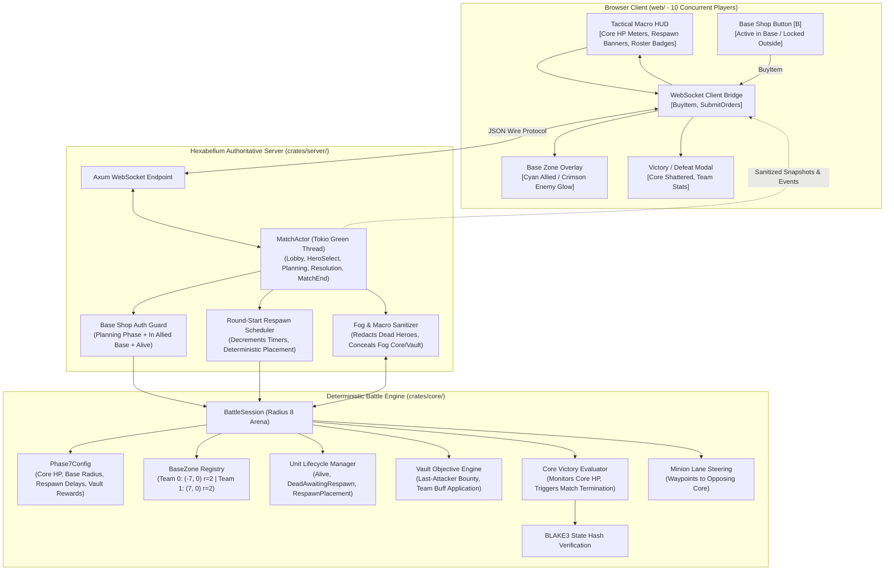
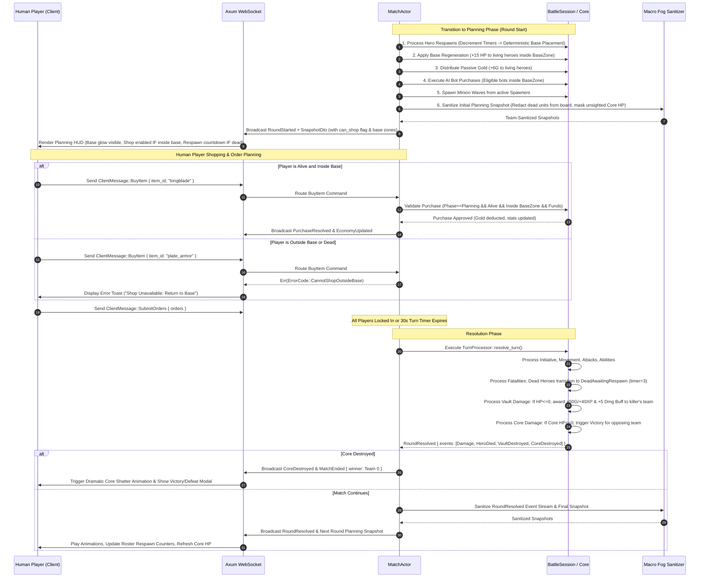
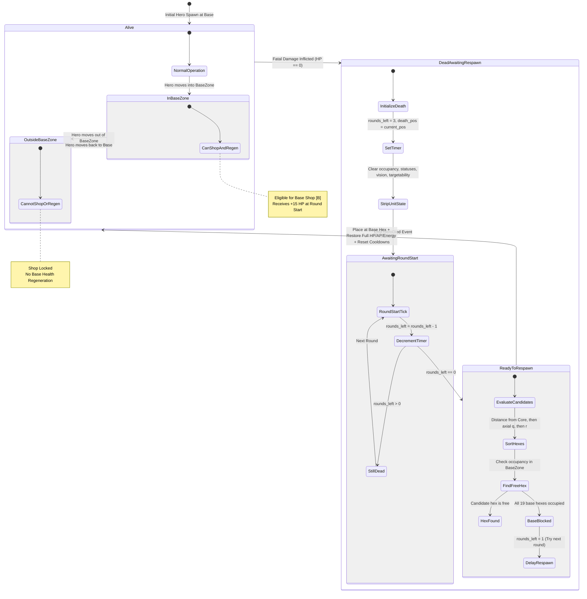

# Phase 7 Technical Spec — Base, Core, Respawn, Neutral Objective & Core Destruction Victory Slice

---

## Architectural Decision Record (ADR-008): Sovereign Core Structures, Base Zones, Hero Respawn Lifecycle, Neutral Objective (Vault) Mechanics, Base-Only Shopping, and Core Destruction Victory

### Context

Hexabellum Phases 1 through 6 established a fully server-authoritative, 5v5 multiplayer turn-based tactical foundation:
- **Phase 1 & 2**: Simultaneous deterministic turn resolution, 3v3 heroes, autonomous minion waves, defensive towers, and line-of-sight fog of war.
- **Phase 3**: Tokio actor-per-match architecture (`MatchActor`), WebSocket synchronization with 30s turn timers and 1.0s grace periods, and BLAKE3 cryptographic state verification.
- **Phase 4**: Hero active abilities (Cleave, Bolt, Mend), status effect pipelines, line-of-sight cube raycasting, structure repair, neutral objective camps with leash mechanics, and lane waypoint steering.
- **Phase 5**: Transitioned from a multi-unit "Team Commander" paradigm to a true per-player single-hero avatar model (up to 10 concurrent human players), expanded 5-hero roster (Vanguard, Ranger, Warden, Sniper, Berserker), team-shared line-of-sight fog-of-war union, dynamic AI backfill on disconnect, and a scaled radius 8 arena (217 hexes) with client pan/zoom.
- **Phase 6**: Added the fundamental progression layer: sovereign per-hero gold ledgers, deterministic last-attacker kill bounties, objective team bounties, linear XP scaling (Levels 1–5), base attribute growth (+12 Max HP, +3 Attack Damage, +1 Max Energy), and a minimal 3-slot passive item system with a planning-phase Field Shop.

However, despite these achievements, the match loop in Phase 6 still operated as an **arena skirmish deathmatch**:
1. **Permanent Hero Permadeath**: When a hero died in Phase 6, they remained dead for the rest of the match. In a 10-player match, players eliminated early lost agency for the remainder of the session, making accumulated gold, items, and XP meaningless after death.
2. **Abstract "Field" Shopping**: Items could be purchased anywhere on the board during planning, bypassing physical positioning, base defense, and macro rotation decisions.
3. **Absence of a Home Base**: The arena lacked designated team sanctuaries for respawning, staging defenses, or safe regrouping.
4. **Secondary Nature of Structures**: Towers and Spawners were tactical obstacles and economic bounties, but their destruction did not dictate the ultimate game outcome.
5. **Hero Elimination Win Condition**: Matches concluded solely when all enemy heroes were eliminated (`VictoryMode::HeroElimination`). This directly contradicts the core MOBA gameplay loop, where heroes die and return while teams fight to breach and destroy the enemy's heart structure.

Phase 7 introduces the **foundational MOBA macro loop**: sovereign team **Core structures**, a **Base Zone system**, a deterministic **Hero Death and Respawn engine**, a central neutral **Objective Vault**, **Base-Only Shopping**, and the primary victory condition of **Core Destruction**.

---

### Decisions

| System Area | Decision | Rationale & Trade-Offs |
|---|---|---|
| **Primary Win Condition** | **Sovereign Core Destruction (`VictoryMode::CoreDestruction`)** | Replaces hero elimination with Core destruction as the default, primary win condition. Matches end immediately upon the fatal blow to an enemy Core, regardless of living hero counts. Hero elimination is disabled by default to support the respawn economy. |
| **Core Structure Model** | **Stationary, High-HP, Non-Attacking, Non-Repairable Victory Anchor** | Each team possesses a single Core at the back of their base (Team 0: `(-7, 0)`, Team 1: `(7, 0)`) with 700 HP. Cores provide vision (range 5) but do not attack or regenerate in Phase 7, and cannot be targeted by the `Repair` action. This keeps Core defense dependent on living heroes and defensive towers. |
| **Hero Respawn Lifecycle** | **Deterministic Dead State with Fixed 3-Round Respawn Delay** | When a hero reaches 0 HP, they transition to `LifeState::DeadAwaitingRespawn { rounds_left: 3 }` instead of being removed from the simulation. Respawning heroes retain 100% of their accumulated gold, XP, levels, and item inventory. Full HP, AP, and energy are restored upon respawn, and active ability cooldowns are reset. |
| **Respawn Placement Algorithm** | **Deterministic Spiral Search around Core with Axial Tie-Breaking** | Heroes respawn at a walkable, unoccupied hex within their team's Base Zone. Hexes are evaluated deterministically: sorted by axial distance from the Core ascending, then by axial `q` ascending, then by axial `r` ascending. If the entire base zone is obstructed, respawn is deferred by 1 round. |
| **Base Zone Geometry** | **Axial Radius 2 Sanctuary Surrounding the Core** | Defines a 19-hex territory around each Core (`(-7, 0)` and `(7, 0)`). Hexes within this zone are recognized as sovereign team territory governing shopping rights, respawn candidate hexes, and base health regeneration. |
| **Shop Access Rule** | **Base-Only Shopping During Planning Phase** | Replaces the Phase 6 "Field Shop" (shop anywhere). Heroes can only execute the `BuyItem` command during the `Planning` phase if they are alive and physically located within their allied `BaseZone`. Dead heroes or heroes outside the base cannot purchase items. |
| **Base Regeneration** | **+15 HP Round-Start Sustained Recovery** | All living allied heroes inside their own base zone recover +15 HP at the start of each round (clamped to `max_hp`). This establishes a tangible sanctuary benefit without needing a continuous real-time fountain tick engine. |
| **Neutral Objective (Vault)** | **Central Neutral Structure at `(0, 0)` with Team-Wide Bounty & Buff** | Placed at the exact center of the map (`hp: 250`, non-attacking, impassable, non-vision-blocking). Destroyed by basic attacks or abilities. Last-hitting team receives +50 Gold and +40 XP for all living heroes, plus a 5-round `VaultBuff` (+5 Attack Damage). Does not respawn in Phase 7. |
| **Minion Macro Steering** | **Sequential Waypoint Pushing Toward Enemy Core** | Minion lane waypoints route through the central corridor directly to the opposing Core. Minions prioritize enemy minions, heroes, and towers, and attack the enemy Core when in range. Minions strictly ignore the neutral Vault. |
| **AI Macro Behaviors** | **Heuristic Core Defense & Base-Only AI Shopping** | AI heroes evaluate macro priorities: if an enemy unit is within 3 hexes of the allied Core, the AI immediately enters defense mode to eliminate intruders. AI heroes execute item purchases only when positioned inside their base zone at round start (naturally occurring at match start and upon respawn). |
| **Fog-of-War Zero Knowledge** | **Dead Hero Redaction & Objective Concealment** | Dead heroes provide 0 vision, occupy 0 tiles, and are stripped from board entity arrays for the enemy team (only reflected as a dead roster state with respawn timer). The enemy Core and the central Vault are only rendered with live HP meters if their hex is actively sighted by the team's line-of-sight union. |

---

### Consequences & System Impacts

- **Positive**:
  - Transforms Hexabellum into a genuine MOBA: player death is a temporary setback rather than a game-ending exclusion, enabling mid-to-late-game power scaling and strategic comebacks.
  - Base-only shopping introduces vital macro positioning trade-offs: players must balance pushing lane pressure versus returning to base to convert accumulated gold into item power spikes.
  - The neutral Objective Vault creates a high-stakes mid-map contest point, forcing teams to commit to vision control, timing, and decisive skirmishes.
  - The Core structure provides a definitive, exhilarating victory condition that rewards coordinated objective pushes rather than passive attrition.
  - Complete state determinism is maintained: respawn placement, bounty attribution, and win evaluation are 100% reproducible with BLAKE3 validation.
- **Negative / Constraints**:
  - Without a "Recall / Town Portal" ability in Phase 7 (deferred to Phase 8), heroes must physically walk back to base to shop unless they die and respawn there.
  - With a static 3-round respawn delay, late-game team wipes can leave the Core vulnerable to rapid destruction, requiring careful tuning of Core HP (700 HP) and tower defensive ranges.
  - Non-respawning Objective Vault means the mid-map objective is a one-time spike rather than a recurring objective loop in Phase 7.

---

## Phase 7 Goal

> **Transform Hexabellum from an arena elimination skirmish into a complete MOBA macro loop: heroes die and respawn at base with preserved progression, shopping is restricted to sovereign base zones, teams contest a central neutral objective vault for team-wide bounties and combat buffs, minions push to siege enemy fortifications, and the primary victory condition becomes destroying the enemy Core.**

Phase 6 delivered the economic foundation (gold, XP, leveling, and items).  
Phase 7 introduces the macro battlefield framework that gives those systems strategic purpose.

---

### What Phase 7 Adds

| Subsystem | Component | Description & Architectural Role |
|---|---|---|
| **Core Structures** | **Allied & Enemy Cores** | Sovereign team structures (700 HP) placed at `(-7, 0)` and `(7, 0)`. Stationary, non-attacking, non-repairable. Destruction immediately ends the match with victory for the opposing team. |
| **Hero Respawn Engine** | **`LifeState` & Respawn Manager** | Tracks living vs dead heroes. Decrements 3-round respawn timers at round start. Respawns heroes at base with full HP/AP/energy, reset cooldowns, and fully preserved gold, XP, levels, and items. |
| **Deterministic Base Spawning** | **Spiral Spawn Candidate Selector** | Selects free walkable hexes in the base zone sorted by distance to Core ascending, then axial `q`, then axial `r`. Guarantees 100% bitwise determinism across clients and server. |
| **Base Zone System** | **Axial Radius 2 Base Territories** | Defines 19-hex sovereign territories around each Core. Governs base-only shopping eligibility, respawn placement, base regeneration, and client visual overlays. |
| **Base Shop Enforcement** | **Spatial Purchase Guard** | Validates that `BuyItem` requests occur strictly while the hero is alive and located within their allied `BaseZone` during `Planning`. Enforces identical constraints on AI bots. |
| **Base Regeneration** | **Round-Start Sanctuary Healing** | Restores +15 HP at round start to all living allied heroes resting inside their base zone, providing vital sustain without requiring real-time fountain ticks. |
| **Neutral Objective Vault** | **The Ancient Vault at `(0, 0)`** | Destructible neutral structure (250 HP) in the arena center. Attributed via last-attacker. Grants +50G / +40XP to all living heroes on the destroying team, plus a 5-round +5 Attack Damage team buff. |
| **Core-Targeted Minion Steering**| **Terminal Lane Waypoints** | Minion pathfinding routes advance through the central corridor toward the opposing Core. Minions siege the enemy Core upon reaching attack range while ignoring the neutral Vault. |
| **AI Macro Heuristics** | **Core Defense & Base Shopping** | AI heroes detect threats within 3 hexes of their allied Core and intercept attackers. AI heroes execute greedy item purchases exclusively when inside their base zone. |
| **Zero-Knowledge Macro Fog** | **Dead Unit & Structure Redaction**| Conceals dead heroes from enemy board state. Masked enemy Core and neutral Vault HP meters unless actively revealed within team line-of-sight union. |
| **Tactical Macro HUD** | **Respawn & Base HUD Elements** | Displays screen desaturation and circular respawn countdown banner for dead players, base zone border highlights, prominent Core HP meters, and dynamic Base Shop button states. |
| **Victory & Defeat Screen** | **Core Destruction Celebration Modal** | Dramatic end-of-match celebration modal detailing match winner, Core destruction timestamp, team stats, and return-to-lobby controls. |

---

## Definition of Done (DoD)

### 1. Core Simulation (`crates/core`)
- [ ] `UnitKind` enum expanded with `Core` and `Objective` (Vault).
- [ ] `LifeState` enum implemented: `Alive`, `DeadAwaitingRespawn { rounds_left: u32, death_pos: HexCoord }`, and `PermanentlyRemoved`.
- [ ] `Unit` struct expanded with `life_state: LifeState`, `respawn_rounds: Option<u32>`, and `death_pos: Option<HexCoord>`.
- [ ] `Phase7Config` (or `MacroConfig`) defined with configurable Core HP (700), Vault HP (250), base radius (2), base regen (15), respawn delay (3 rounds), Vault gold reward (50), Vault XP reward (40), and Vault buff duration (5 rounds).
- [ ] `BaseZone` struct implemented with spatial containment check: `contains(coord: HexCoord) -> bool`.
- [ ] Core structures initialized for both teams at `(-7, 0)` (Team 0) and `(7, 0)` (Team 1) with 700 HP and 5 vision range.
- [ ] Cores marked non-repairable; `Repair` action on Core rejected by validation.
- [ ] Objective Vault initialized at `(0, 0)` with 250 HP, neutral ownership, impassable geometry, and non-vision-blocking terrain.
- [ ] Dead heroes transition to `LifeState::DeadAwaitingRespawn` on lethal damage (0 HP) rather than being deleted from the unit collection.
- [ ] Dead heroes cleared of board occupancy, active statuses, and vision contributions; cannot move, cast, attack, or be targeted.
- [ ] Round-start lifecycle decrements hero respawn counters and deterministically respawns ready heroes (`rounds_left == 0`).
- [ ] Respawn placement evaluates base candidate hexes sorted by Core distance, then axial `q`, then axial `r`. Fallback delays respawn if completely blocked.
- [ ] Respawnees receive 100% full HP, AP, and energy, with cooldowns reset to 0, retaining all accumulated gold, XP, levels, and items.
- [ ] Base regeneration restores +15 HP to living heroes inside their allied base zone at round start (clamped to `max_hp`).
- [ ] Destroying the neutral Vault grants +50 Gold and +40 XP to all living allied heroes on the destroying team, plus applies a 5-round +5 Attack Damage buff (`vault_buff`).
- [ ] Minions advance along updated waypoints toward the enemy Core, sieging it upon arrival, and strictly ignoring the neutral Vault.
- [ ] Towers prioritize enemy minions, then enemy heroes, then other attackable enemy units; towers never attack the neutral Vault.
- [ ] Hero AI evaluates Core defense priority: shifts orders to intercept enemies within 3 hexes of allied Core.
- [ ] `can_hero_shop` returns `true` only if phase is `Planning`, hero is `Alive`, and hero position is inside allied `BaseZone`.
- [ ] AI heroes execute greedy item purchases strictly when positioned inside their allied base zone.
- [ ] `VictoryMode::CoreDestruction` evaluates Core status after each resolution step; if a Core reaches 0 HP, the match terminates immediately with the opposing team declared victor.

### 2. Protocol & Wire Models (`crates/protocol`)
- [ ] `LifeStateDto` serialized as `"alive"`, `"dead_awaiting_respawn"`, or `"permanently_removed"`.
- [ ] `UnitDto` extended with `life_state: LifeStateDto`, `respawn_rounds: Option<u32>`, and `death_pos: Option<HexDto>`.
- [ ] `BaseZoneDto` defined with `team: TeamId`, `center: HexDto`, and `radius: u32`.
- [ ] `SnapshotDto` extended with:
  - `victory_mode: String`,
  - `base_zones: Vec<BaseZoneDto>`,
  - `can_shop: bool`,
  - `shop_disabled_reason: Option<ShopDisabledReasonDto>`,
  - `core_hp: HashMap<TeamId, (u32, u32)>`,
  - `objective_status: Option<ObjectiveStatusDto>`.
- [ ] Server messages & events defined:
  - `HeroDied { unit_id: UnitId, killed_by: UnitId, respawn_rounds: u32 }`,
  - `HeroRespawned { unit_id: UnitId, pos: HexDto }`,
  - `BaseRegenerationApplied { unit_id: UnitId, amount: u32 }`,
  - `ObjectiveDestroyed { objective_id: UnitId, destroyer_team: TeamId, last_attacker_id: UnitId }`,
  - `CoreDestroyed { core_id: UnitId, team: TeamId, destroyed_by: UnitId }`,
  - `MatchEnded { winner_team: TeamId, reason: VictoryReasonDto }`.
- [ ] Extended `ErrorCode` enum: `CannotShopOutsideBase`, `HeroDeadAwaitingRespawn`, `CannotOrderDeadHero`, `TargetUntargetable`, `CoreCannotBeRepaired`.
- [ ] Serde round-trip tests verify all new DTOs, events, and error codes serialize and deserialize without loss.

### 3. Server Authority & Actor Engine (`crates/server`)
- [ ] `MatchActor` validates `BuyItem` strictly against `can_hero_shop`: rejects with `ErrorCode::CannotShopOutsideBase` if outside base.
- [ ] `MatchActor` rejects movement, attack, or ability orders targeted at or issued by dead heroes awaiting respawn.
- [ ] Round-start pipeline executes in strict sequence:
  1. Decrement respawn timers & respawn ready heroes at base,
  2. Apply base regeneration to alive heroes in base,
  3. Distribute passive gold (+6G),
  4. Execute AI bot purchases for eligible heroes in base,
  5. Spawn minion waves from active spawners,
  6. Compute team-shared fog-of-war union,
  7. Broadcast sanitized `RoundStarted` and `SnapshotDto`.
- [ ] Fog-of-War sanitizer completely omits dead heroes from board entity arrays for the enemy; reveals them only in roster with dead state and timer.
- [ ] Fog-of-War sanitizer conceals enemy Core and neutral Vault HP if their hexes are outside the team's line-of-sight union.
- [ ] Reconnecting dead players receive full match state, spectator camera authorization, and accurate remaining respawn rounds.
- [ ] Core destruction halts the match timer immediately, transitions `MatchState` to `MatchEnd`, and broadcasts `MatchEnded`.

### 4. Browser Client & UI/UX (`web/`)
- [ ] PixiJS hex grid renders subtle tinted base zone overlays: allied base in soft cyan/azure glow, enemy base in faint crimson glow.
- [ ] Core structures rendered as prominent, monumental structures (distinguished faction obelisk/crystal) with permanent large segmented HP bars.
- [ ] Neutral Objective Vault rendered at `(0, 0)` with ancient runic stone aesthetic, neutral gold/amber accents, and floating health meter.
- [ ] When the player's controlled hero is dead:
  - Screen displays a subtle desaturation and darkening vignette.
  - Centered HUD banner displays: `HERO DEFEATED — RESPAWNING IN X ROUNDS` with animated progress circle.
  - Action bar controls are locked with lock icons and hover tooltip: `"Hero awaiting respawn at base"`.
  - Player can freely pan/zoom camera and inspect the board as a spectator.
- [ ] Team roster portraits indicate dead state with a red skull badge and a numeric round countdown badge.
- [ ] HUD Field Shop button (`[B]`) dynamically updates label and state:
  - `BASE SHOP [B]` (Emerald) when hero is alive and inside base during Planning.
  - `SHOP LOCKED: RETURN TO BASE` (Muted/Grey) when hero is alive outside base.
  - `SHOP LOCKED: HERO DEFEATED` (Dim Red) when hero is dead.
  - `SHOP LOCKED: RESOLUTION` when turn is resolving.
- [ ] Floating combat text engine displays:
  - `+15 HP BASE REGEN` (Emerald) at round start in base.
  - `VAULT REWARD: +50G +40XP` (Golden) when Vault falls.
  - `RESPAWNED!` (Radiant Cyan) over the hero upon emergence at base.
- [ ] Victory and Defeat end-of-match modal displays dramatic banners, Core destruction animation sequence, final match stats, and a `"Return to Lobby"` button.

### 5. Verification & Determinism Harness
- [ ] Comprehensive unit test suite covering:
  - Core destruction ends match with correct winning team.
  - Hero death transitions unit to `DeadAwaitingRespawn` without deletion.
  - Dead hero cannot move, attack, cast spells, or be targeted.
  - Hero respawns at base after exactly 3 rounds.
  - Respawnee retains 100% of gold, XP, level, and items.
  - Respawnee receives full HP, AP, and energy, with cooldowns reset.
  - Deterministic respawn candidate selection handles center blockage and prioritizes proximity to Core.
  - Base-only shopping permits purchases inside base and rejects purchases outside base.
  - Base regeneration heals alive heroes in base and ignores heroes outside base or dead heroes.
  - Vault destruction grants gold, XP, and attack buff to living allied heroes of the last attacker.
  - Minions route toward enemy Core and do not attack neutral Vault.
- [ ] Headless 100-round 5v5 simulation achieves 100% bitwise BLAKE3 state determinism across identical seeds with active respawns and Core sieges.

---

## Architecture Delta from Phase 6

```
Phase 6 (MOBA Economy & Field Shop)           Phase 7 (Base, Core, Respawn & Objective Victory)
─────────────────────────────────────────    ─────────────────────────────────────────
Win Condition: Hero Elimination              → Win Condition: Core Destruction (Primary; elimination disabled)
Core Structures: None                        → Core Structures: 700 HP per team at (-7, 0) and (7, 0)
Hero Death: Permanent permadeath             → Hero Death: 3-round respawn delay; progression fully preserved
Hero Respawn: None                           → Hero Respawn: Deterministic base placement; full resource restore
Home Base: None                              → Home Base: Radius 2 BaseZone around Core for both teams
Base Shop: Field Shop (buy anywhere)         → Base Shop: Base-Only Shop (must be alive & in BaseZone)
Base Sustain: None                           → Base Sustain: +15 HP round-start base regeneration
Neutral Objectives: Local jungle camps only  → Neutral Objectives: Central Objective Vault at (0, 0) with team buff
Minion Pathing: Lane skirmish waypoints      → Minion Pathing: Waypoint route terminating at enemy Core
Minion Targeting: Minions & Heroes           → Minion Targeting: Minions, Heroes, Towers, Spawners & enemy Core
AI Shopping: Round start from any tile       → AI Shopping: Round start strictly inside allied BaseZone
AI Macro: Local skirmish & lane push         → AI Macro: Core defense priority, Vault contest, Core siege
Fog of War: Hero LOS masking                 → Fog of War: Dead hero redaction + unrevealed Core/Vault HP masking
Client HUD: Field Shop drawer                → Client HUD: Base-aware shop, respawn countdown & Core HP meters
Match Termination: Last hero alive wins      → Match Termination: Core HP reaches 0 -> Immediate victory
```

---

## High-Level System Architecture & Flow

### Component Architecture



---

### Turn Lifecycle & Macro Execution Sequence



---

### Hero LifeState & Respawn State Machine



---

### Base Shopping Validation State Machine

```mermaid
stateDiagram-v2
    [*] --> Ingestion: ClientMessage::BuyItem Received
    
    state Ingestion {
        [*] --> CheckPhase
        CheckPhase --> RejectPhase: MatchPhase != Planning
        CheckPhase --> CheckAuth: MatchPhase == Planning
        CheckAuth --> RejectAuth: Sender does not own UnitId
        CheckAuth --> CheckLifeState: Sender owns UnitId
        CheckLifeState --> RejectDead: Unit life_state != Alive
        CheckLifeState --> CheckBaseLocation: Unit is Alive
        CheckBaseLocation --> RejectOutsideBase: !base_zone.contains(unit.pos)
        CheckBaseLocation --> CheckInventory: unit.pos is Inside Allied BaseZone
    }

    state CheckInventory {
        [*] --> CheckItemCatalog
        CheckItemCatalog --> RejectNoItem: ItemDef not found
        CheckItemCatalog --> CheckDuplicate: ItemDef exists
        CheckDuplicate --> RejectDuplicate: Already owns item
        CheckDuplicate --> CheckCapacity: No duplicate
        CheckCapacity --> RejectFull: items.len() >= 3
        CheckCapacity --> CheckGold: items.len() < 3
        CheckGold --> RejectFunds: gold < ItemDef.cost
        CheckGold --> ApprovePurchase: gold >= ItemDef.cost
    }

    state Execution {
        [*] --> DeductGold: gold = gold - cost
        DeductGold --> AddItem: items.push(item_id)
        AddItem --> ApplyItemStats: recalculate stats & apply HP bonus
        ApplyItemStats --> EmitEvents: Broadcast PurchaseResolved & EconomyUpdated
    }

    ApprovePurchase --> Execution: Commit Transaction
    Execution --> [*]: Success

    RejectPhase --> [*]: ErrorCode::CannotShopInPhase
    RejectAuth --> [*]: ErrorCode::NotYourUnit
    RejectDead --> [*]: ErrorCode::HeroDeadAwaitingRespawn
    RejectOutsideBase --> [*]: ErrorCode::CannotShopOutsideBase
    RejectNoItem --> [*]: ErrorCode::NoSuchItem
    RejectDuplicate --> [*]: ErrorCode::ItemAlreadyOwned
    RejectFull --> [*]: ErrorCode::InventoryFull
    RejectFunds --> [*]: ErrorCode::InsufficientGold
```

---

## 1. Core Engine Specifications (`crates/core`)

### 1.1 Macro & Victory Configuration

The simulation rules for Phase 7 are defined in `Phase7Config`, embedded within `BattleConfig`:

```rust
// crates/core/src/macro_config.rs

use serde::{Deserialize, Serialize};

#[derive(Debug, Clone, Copy, PartialEq, Eq, Serialize, Deserialize)]
pub enum VictoryMode {
    /// Match ends solely when an enemy Core is destroyed (Phase 7 Default).
    CoreDestruction,
    /// Match ends when all enemy heroes are eliminated (Phase 5/6 fallback).
    HeroElimination,
    /// Match ends if either Core is destroyed OR all enemy heroes are dead.
    CoreOrElimination,
}

#[derive(Debug, Clone, Serialize, Deserialize)]
pub struct Phase7Config {
    /// Active victory mode governing match termination (default: CoreDestruction).
    pub victory_mode: VictoryMode,
    /// Fixed rounds a dead hero must wait before respawning (default: 3).
    pub respawn_delay_rounds: u32,
    /// Radius of the sovereign base zone around each Core (default: 2 -> 19 hexes).
    pub base_zone_radius: u32,
    /// HP restored to alive allied heroes resting in base at round start (default: 15).
    pub base_regen_per_round: u32,
    /// Initial and maximum HP for each team's Core structure (default: 700).
    pub core_hp: u32,
    /// Vision range of each Core structure in axial hex distance (default: 5).
    pub core_vision_range: u32,
    /// Initial and maximum HP for the neutral Objective Vault (default: 250).
    pub objective_hp: u32,
    /// Flat gold bounty awarded to EACH living allied hero upon Vault destruction (default: 50).
    pub objective_gold_reward_per_hero: u32,
    /// Flat XP bounty awarded to EACH living allied hero upon Vault destruction (default: 40).
    pub objective_xp_reward_per_hero: u32,
    /// Bonus attack damage granted by the Vault destruction buff (default: 5).
    pub objective_buff_damage_bonus: u32,
    /// Duration in rounds of the Vault destruction buff (default: 5).
    pub objective_buff_duration_rounds: u32,
}

impl Default for Phase7Config {
    fn default() -> Self {
        Self {
            victory_mode: VictoryMode::CoreDestruction,
            respawn_delay_rounds: 3,
            base_zone_radius: 2,
            base_regen_per_round: 15,
            core_hp: 700,
            core_vision_range: 5,
            objective_hp: 250,
            objective_gold_reward_per_hero: 50,
            objective_xp_reward_per_hero: 40,
            objective_buff_damage_bonus: 5,
            objective_buff_duration_rounds: 5,
        }
    }
}
```

---

### 1.2 Unit Lifecycle & Entity Extensions

`UnitKind` and `Unit` in `crates/core/src/unit.rs` are extended to support the full macro entity lifecycle:

```rust
// crates/core/src/unit.rs

use crate::hex::HexCoord;
use crate::economy::ItemDefId;
use serde::{Deserialize, Serialize};

pub type UnitId = u64;
pub type TeamId = u8;

#[derive(Debug, Clone, Copy, PartialEq, Eq, Serialize, Deserialize)]
pub enum UnitKind {
    Hero,
    Minion,
    Tower,
    SpawnerTower,
    Core,
    Objective,
    Neutral,
}

impl UnitKind {
    pub fn is_structure(&self) -> bool {
        matches!(self, UnitKind::Tower | UnitKind::SpawnerTower | UnitKind::Core | UnitKind::Objective)
    }

    pub fn is_stationary(&self) -> bool {
        self.is_structure()
    }

    pub fn is_repairable(&self) -> bool {
        // Cores and neutral objectives CANNOT be repaired in Phase 7
        matches!(self, UnitKind::Tower | UnitKind::SpawnerTower)
    }
}

#[derive(Debug, Clone, PartialEq, Eq, Serialize, Deserialize)]
pub enum LifeState {
    Alive,
    DeadAwaitingRespawn {
        rounds_left: u32,
        death_pos: HexCoord,
    },
    PermanentlyRemoved,
}

#[derive(Debug, Clone, Serialize, Deserialize)]
pub struct Unit {
    pub id: UnitId,
    pub kind: UnitKind,
    pub team: TeamId,
    pub pos: HexCoord,
    pub hp: u32,
    pub max_hp: u32,
    pub ap: u32,
    pub max_ap: u32,
    pub initiative: u32,
    pub attack_damage: u32,
    pub attack_range: u32,
    pub vision_range: u32,
    pub energy: u32,
    pub max_energy: u32,
    pub energy_regen: u32,

    // Progression (Phase 6)
    pub gold: u32,
    pub xp: u32,
    pub level: u32,
    pub items: Vec<ItemDefId>,
    pub last_attacker: Option<UnitId>,

    // Macro Lifecycle (Phase 7)
    pub life_state: LifeState,
    pub respawn_rounds: Option<u32>,
    pub death_pos: Option<HexCoord>,
}

impl Unit {
    pub fn is_alive(&self) -> bool {
        matches!(self.life_state, LifeState::Alive) && self.hp > 0
    }

    pub fn is_dead_awaiting_respawn(&self) -> bool {
        matches!(self.life_state, LifeState::DeadAwaitingRespawn { .. })
    }

    /// Factory method for the team Core structure.
    pub fn new_core(id: UnitId, team: TeamId, pos: HexCoord, hp: u32, vision: u32) -> Self {
        Self {
            id,
            kind: UnitKind::Core,
            team,
            pos,
            hp,
            max_hp: hp,
            ap: 0,
            max_ap: 0,
            initiative: 0,
            attack_damage: 0,
            attack_range: 0,
            vision_range: vision,
            energy: 0,
            max_energy: 0,
            energy_regen: 0,
            gold: 0,
            xp: 0,
            level: 1,
            items: Vec::new(),
            last_attacker: None,
            life_state: LifeState::Alive,
            respawn_rounds: None,
            death_pos: None,
        }
    }

    /// Factory method for the neutral Objective Vault.
    pub fn new_vault(id: UnitId, pos: HexCoord, hp: u32) -> Self {
        Self {
            id,
            kind: UnitKind::Objective,
            team: 255, // Neutral faction identifier
            pos,
            hp,
            max_hp: hp,
            ap: 0,
            max_ap: 0,
            initiative: 0,
            attack_damage: 0,
            attack_range: 0,
            vision_range: 2,
            energy: 0,
            max_energy: 0,
            energy_regen: 0,
            gold: 0,
            xp: 0,
            level: 1,
            items: Vec::new(),
            last_attacker: None,
            life_state: LifeState::Alive,
            respawn_rounds: None,
            death_pos: None,
        }
    }
}
```

---

### 1.3 Base Zone Spatial Geometry & Containment

Each team's base is governed by a dedicated `BaseZone`:

```rust
// crates/core/src/base_zone.rs

use crate::hex::HexCoord;
use crate::unit::TeamId;
use serde::{Deserialize, Serialize};

#[derive(Debug, Clone, Copy, PartialEq, Eq, Serialize, Deserialize)]
pub struct BaseZone {
    pub team: TeamId,
    pub center: HexCoord,
    pub radius: u32,
}

impl BaseZone {
    pub fn new(team: TeamId, center: HexCoord, radius: u32) -> Self {
        Self { team, center, radius }
    }

    /// Verifies whether a given coordinate falls within this sovereign base territory.
    pub fn contains(&self, coord: HexCoord) -> bool {
        self.center.distance_to(coord) <= self.radius
    }

    /// Generates all valid candidate hexes in this base zone sorted deterministically
    /// for hero respawn placement:
    /// 1. Distance from Core ascending
    /// 2. Axial q ascending
    /// 3. Axial r ascending
    pub fn candidate_spawn_hexes(&self) -> Vec<HexCoord> {
        let mut candidates = Vec::new();
        let r = self.radius as i32;

        for q in -r..=r {
            let r1 = (-r).max(-q - r);
            let r2 = r.min(-q + r);
            for r_coord in r1..=r2 {
                candidates.push(HexCoord::new(self.center.q + q, self.center.r + r_coord));
            }
        }

        let center = self.center;
        candidates.sort_by(|a, b| {
            let dist_a = center.distance_to(*a);
            let dist_b = center.distance_to(*b);
            dist_a.cmp(&dist_b)
                .then_with(|| a.q.cmp(&b.q))
                .then_with(|| a.r.cmp(&b.r))
        });

        candidates
    }
}
```

---

### 1.4 Hero Respawn & Placement Engine

The respawn engine executes at the beginning of each round before human order planning:

```rust
// crates/core/src/respawn.rs

use crate::hex::HexCoord;
use crate::unit::{LifeState, Unit, UnitId};
use crate::state::BattleSession;
use crate::event::BattleEvent;

impl BattleSession {
    /// Processes all dead heroes at round start, decrementing timers and respawning ready units.
    pub fn process_round_start_respawns(&mut self) -> Vec<BattleEvent> {
        let mut events = Vec::new();
        let mut ready_hero_ids = Vec::new();

        // 1. Decrement timers for dead heroes
        for unit in self.units.values_mut() {
            if let LifeState::DeadAwaitingRespawn { ref mut rounds_left, .. } = unit.life_state {
                if *rounds_left > 0 {
                    *rounds_left -= 1;
                }
                unit.respawn_rounds = Some(*rounds_left);

                if *rounds_left == 0 {
                    ready_hero_ids.push(unit.id);
                }
            }
        }

        // Sort ready heroes by UnitId to ensure deterministic placement order
        ready_hero_ids.sort_unstable();

        // 2. Deterministically place respawned heroes
        for hero_id in ready_hero_ids {
            if let Some(event) = self.execute_hero_respawn(hero_id) {
                events.push(event);
            }
        }

        events
    }

    /// Executes the respawn transaction for an individual hero.
    pub fn execute_hero_respawn(&mut self, hero_id: UnitId) -> Option<BattleEvent> {
        let (team, hero_max_hp, hero_max_ap, hero_max_energy) = {
            let hero = self.units.get(&hero_id)?;
            (hero.team, hero.max_hp, hero.max_ap, hero.max_energy)
        };

        let base_zone = self.get_base_zone(team)?;
        let candidates = base_zone.candidate_spawn_hexes();

        // Find the first walkable hex that is not occupied by another unit or impassable obstacle
        let mut chosen_pos = None;
        for hex in candidates {
            if self.map.is_walkable(hex) && !self.is_hex_occupied(hex) {
                chosen_pos = Some(hex);
                break;
            }
        }

        let respawn_pos = match chosen_pos {
            Some(pos) => pos,
            None => {
                // If all hexes in the base zone are congested, defer respawn by 1 round
                if let Some(hero) = self.units.get_mut(&hero_id) {
                    hero.life_state = LifeState::DeadAwaitingRespawn {
                        rounds_left: 1,
                        death_pos: hero.pos,
                    };
                    hero.respawn_rounds = Some(1);
                }
                return None;
            }
        };

        // Mutate hero state back to LifeState::Alive
        if let Some(hero) = self.units.get_mut(&hero_id) {
            hero.life_state = LifeState::Alive;
            hero.respawn_rounds = None;
            hero.death_pos = None;
            hero.pos = respawn_pos;
            hero.hp = hero_max_hp;
            hero.ap = hero_max_ap;
            hero.energy = hero_max_energy;

            // Cooldowns are reset upon respawn
            self.reset_hero_cooldowns(hero_id);
            // Progression attributes (gold, xp, level, items) are strictly preserved!
        }

        Some(BattleEvent::HeroRespawned {
            unit_id: hero_id,
            team,
            pos: respawn_pos,
        })
    }
}
```

---

### 1.5 Base Regeneration Engine

```rust
// crates/core/src/base_regen.rs

use crate::state::BattleSession;
use crate::event::BattleEvent;
use crate::unit::{LifeState, UnitKind};

impl BattleSession {
    /// Applies the +15 HP sanctuary recovery to living allied heroes resting in their base zone.
    pub fn process_base_regeneration(&mut self) -> Vec<BattleEvent> {
        let mut events = Vec::new();
        let regen_amount = self.config.phase7.base_regen_per_round;

        for unit in self.units.values_mut() {
            if unit.kind == UnitKind::Hero && unit.life_state == LifeState::Alive {
                let in_base = self.base_zones.get(&unit.team)
                    .map(|bz| bz.contains(unit.pos))
                    .unwrap_or(false);

                if in_base && unit.hp < unit.max_hp {
                    let old_hp = unit.hp;
                    unit.hp = (unit.hp + regen_amount).min(unit.max_hp);
                    let healed = unit.hp - old_hp;

                    if healed > 0 {
                        events.push(BattleEvent::BaseRegenerationApplied {
                            unit_id: unit.id,
                            team: unit.team,
                            amount: healed,
                            new_hp: unit.hp,
                        });
                    }
                }
            }
        }

        events
    }
}
```

---

### 1.6 Neutral Objective (The Vault) Destruction & Team Buffs

When the neutral Objective Vault at `(0, 0)` is brought to 0 HP:

```rust
// crates/core/src/objective.rs

use crate::state::BattleSession;
use crate::event::BattleEvent;
use crate::unit::{LifeState, UnitId, UnitKind};
use crate::status::{StatusEffect, StatusInstance};

impl BattleSession {
    pub fn process_vault_destruction(&mut self, vault_id: UnitId, last_attacker_id: UnitId) -> Vec<BattleEvent> {
        let mut events = Vec::new();

        // 1. Identify the killing unit and its team
        let killer_team = match self.units.get(&last_attacker_id) {
            Some(u) if u.team == 0 || u.team == 1 => u.team,
            _ => return events, // Neutral or invalid last hit awards no team bounty
        };

        let gold_reward = self.config.phase7.objective_gold_reward_per_hero;
        let xp_reward = self.config.phase7.objective_xp_reward_per_hero;
        let buff_dmg = self.config.phase7.objective_buff_damage_bonus;
        let buff_dur = self.config.phase7.objective_buff_duration_rounds;

        // 2. Award bounties & attack damage buff to all LIVING allied heroes
        let mut living_allies = Vec::new();
        for hero in self.units.values_mut() {
            if hero.team == killer_team && hero.kind == UnitKind::Hero && hero.life_state == LifeState::Alive {
                hero.gold += gold_reward;
                living_allies.push(hero.id);
            }
        }

        // Apply XP and status effects
        for hero_id in &living_allies {
            self.grant_xp(*hero_id, xp_reward);

            self.apply_status_effect(*hero_id, StatusInstance {
                effect: StatusEffect::AttackDamageBuff(buff_dmg),
                duration_rounds: buff_dur,
                source_id: vault_id,
            });
        }

        // 3. Mark the Vault permanently removed from the match
        if let Some(vault) = self.units.get_mut(&vault_id) {
            vault.life_state = LifeState::PermanentlyRemoved;
            vault.hp = 0;
        }

        events.push(BattleEvent::ObjectiveDestroyed {
            objective_id: vault_id,
            destroyer_team: killer_team,
            last_attacker_id,
            gold_awarded_per_hero: gold_reward,
            xp_awarded_per_hero: xp_reward,
            affected_heroes: living_allies,
        });

        events
    }
}
```

---

### 1.7 Core Victory Condition Engine

```rust
// crates/core/src/victory.rs

use crate::state::BattleSession;
use crate::unit::{TeamId, UnitKind, UnitId};
use crate::event::BattleEvent;

#[derive(Debug, Clone, Copy, PartialEq, Eq, serde::Serialize, serde::Deserialize)]
pub enum VictoryReason {
    CoreDestroyed {
        destroyed_core_id: UnitId,
        destroyed_team: TeamId,
        destroyer_team: TeamId,
    },
    HeroElimination {
        eliminated_team: TeamId,
    },
}

impl BattleSession {
    /// Evaluates Core HP and declares match termination if a Core is destroyed.
    pub fn check_core_victory(&mut self) -> Option<BattleEvent> {
        let mut destroyed_core = None;

        for unit in self.units.values() {
            if unit.kind == UnitKind::Core && unit.hp == 0 {
                destroyed_core = Some((unit.id, unit.team, unit.last_attacker));
                break;
            }
        }

        if let Some((core_id, core_team, last_attacker)) = destroyed_core {
            let winning_team = if core_team == 0 { 1 } else { 0 };
            let destroyer_id = last_attacker.unwrap_or(0);

            self.is_match_over = true;
            self.winning_team = Some(winning_team);

            return Some(BattleEvent::MatchEnded {
                winner_team: winning_team,
                reason: VictoryReason::CoreDestroyed {
                    destroyed_core_id: core_id,
                    destroyed_team: core_team,
                    destroyer_team: winning_team,
                },
            });
        }

        None
    }
}
```

---

### 1.8 Map Topology, Lane Waypoints & Base Positioning

In the scaled radius 8 arena (217 hexes):

```
                       AZURE SANCTUARY (TEAM 0)                                   CRIMSON SANCTUARY (TEAM 1)
           North Spawner: (-6, -1) ── Outer Tower: (-4, -1)                 Outer Tower: (4, -1) ── North Spawner: (6, -1)
          /                                                \               /                                               \
Core: (-7, 0) [Base r=2 (19 Hexes)]                   ====== CENTRAL OBJECTIVE: VAULT (0, 0) ======               Core: (7, 0) [Base r=2 (19 Hexes)]
          \                                                /               \                                               /
           South Spawner: (-6,  1) ── Outer Tower: (-4,  1)                 Outer Tower: (4,  1) ── South Spawner: (6,  1)
```

- **Team 0 (Azure) Base Zone**: Centered at `(-7, 0)`, radius 2 (bounds: 19 hexes spanning $q$ from -9 to -5, $r$ from -2 to +2). Contains the Sovereign Core at `(-7, 0)`, flanked by Spawners at `(-6, -1)` and `(-6, 1)`, with outer defensive towers anchoring the perimeter at `(-4, -1)` and `(-4, 1)`.
- **Team 1 (Crimson) Base Zone**: Centered at `(7, 0)`, radius 2 (bounds: 19 hexes spanning $q$ from 5 to 9, $r$ from -2 to +2). Contains the Sovereign Core at `(7, 0)`, flanked by Spawners at `(6, -1)` and `(6, 1)`, with outer defensive towers anchoring the perimeter at `(4, -1)` and `(4, 1)`.
- **Minion Waypoints & Corridors**:
  - **Azure Waves**: Spawn at `(-6, -1)` and `(-6, 1)`, advance past outer towers `(-4, -1)` / `(-4, 1)` into the central river/Vault corridor toward opposing towers `(4, -1)` / `(4, 1)`, breaching through spawners `(6, -1)` / `(6, 1)` to siege the Crimson Core at `(7, 0)`.
  - **Crimson Waves**: Spawn at `(6, -1)` and `(6, 1)`, advance past outer towers `(4, -1)` / `(4, 1)` into the central river/Vault corridor toward Azure towers `(-4, -1)` / `(-4, 1)`, breaching through spawners `(-6, -1)` / `(-6, 1)` to siege the Azure Core at `(-7, 0)`.
  - When minions arrive within basic attack range of the opposing Core, they lock on and siege it. Minions strictly ignore the neutral Vault at `(0, 0)`.

---

### 1.9 Targeting & AI Macro Priorities

#### Minion Targeting Priority
1. Enemy Minion in basic attack range.
2. Enemy Hero in basic attack range.
3. Enemy Defensive Tower in range.
4. Enemy Spawner in range.
5. Enemy Core in range.
*(Neutral Objective Vault is strictly excluded from minion targeting).*

#### Tower Targeting Priority
1. Enemy Minion within attack range (Tower range = 3).
2. Enemy Hero attacking an allied hero under tower protection.
3. Enemy Hero within attack range.
4. Other enemy attackable structures.
*(Neutral Objective Vault is strictly excluded).*

#### Hero AI Macro Steering
1. **Core Defense**: If an enemy unit is within 3 hexes of the allied Core, the AI breaks from lane pushing, computes pathing toward its Core, and attacks the intruder.
2. **Core Siege**: If the enemy Core is visible and within 3 hexes with no immediate lethal threats, the AI focuses attacks on the enemy Core.
3. **Objective Vault Contest**: If no immediate Core threat exists, the Vault is at <= 50% HP or team has numerical advantage, AI shifts to attack the Vault.
4. **Lane Push & Hero Skirmish**: Standard Phase 4/5 tactical pathfinding and ability execution.
5. **Base-Only Shopping**: Evaluates greedy item tier purchases (`Plate Armor` -> `Longblade` -> `Focus Charm` -> `Scout Lens`) strictly when located inside the allied `BaseZone` at round start.

---

## 2. Protocol & Wire Models (`crates/protocol`)

### 2.1 Wire DTOs

```rust
// crates/protocol/src/macro_dto.rs

use serde::{Deserialize, Serialize};
use crate::dto::{HexDto, UnitId, TeamId};

#[derive(Debug, Clone, Serialize, Deserialize)]
pub struct BaseZoneDto {
    pub team: TeamId,
    pub center: HexDto,
    pub radius: u32,
}

#[derive(Debug, Clone, Serialize, Deserialize)]
pub struct ObjectiveStatusDto {
    pub unit_id: UnitId,
    pub pos: HexDto,
    pub hp: u32,
    pub max_hp: u32,
    pub is_alive: bool,
}

#[derive(Debug, Clone, Copy, PartialEq, Eq, Serialize, Deserialize)]
#[serde(rename_all = "snake_case")]
pub enum ShopDisabledReasonDto {
    NotPlanningPhase,
    HeroDead,
    OutsideBaseZone,
    InventoryFull,
    InsufficientGold,
}

#[derive(Debug, Clone, Serialize, Deserialize)]
pub struct SnapshotDto {
    // Existing Phase 5/6 fields...
    pub round: u32,
    pub phase: String,
    pub units: Vec<UnitDto>,

    // Phase 7 Macro additions
    pub victory_mode: String,
    pub base_zones: Vec<BaseZoneDto>,
    pub can_shop: bool,
    pub shop_disabled_reason: Option<ShopDisabledReasonDto>,
    pub core_hp: std::collections::HashMap<TeamId, (u32, u32)>, // team -> (current_hp, max_hp)
    pub objective: Option<ObjectiveStatusDto>,
}
```

---

### 2.2 Wire Events & Error Codes

```rust
// crates/protocol/src/events.rs

use serde::{Deserialize, Serialize};
use crate::dto::{HexDto, UnitId, TeamId};

#[derive(Debug, Clone, Serialize, Deserialize)]
#[serde(tag = "type")]
pub enum ServerEventDto {
    HeroDied {
        unit_id: UnitId,
        killed_by: UnitId,
        respawn_rounds: u32,
    },
    HeroRespawned {
        unit_id: UnitId,
        team: TeamId,
        pos: HexDto,
    },
    BaseRegenerationApplied {
        unit_id: UnitId,
        amount: u32,
        new_hp: u32,
    },
    ObjectiveDestroyed {
        objective_id: UnitId,
        destroyer_team: TeamId,
        last_attacker_id: UnitId,
    },
    CoreDestroyed {
        core_id: UnitId,
        team: TeamId,
        destroyed_by: UnitId,
    },
    MatchEnded {
        winner_team: TeamId,
        reason: String,
    },
}

#[derive(Debug, Clone, Copy, PartialEq, Eq, Serialize, Deserialize)]
#[serde(rename_all = "snake_case")]
pub enum ErrorCode {
    // Existing Phase 1-6 errors...
    NotYourUnit,
    CannotShopInPhase,
    InsufficientGold,
    InventoryFull,
    ItemAlreadyOwned,
    NoSuchItem,

    // Phase 7 Macro errors
    CannotShopOutsideBase,
    HeroDeadAwaitingRespawn,
    CannotOrderDeadHero,
    TargetUntargetable,
    CoreCannotBeRepaired,
}
```

---

### 2.3 Fog-of-War Zero-Knowledge Sanitization Matrix

| Entity / Property | In Allied Sightline | In Enemy Sightline | Concealed in Fog |
|---|---|---|---|
| **Living Hero (Board)** | Fully Visible with HP & items | Fully Visible with HP & items | Completely Redacted from JSON |
| **Dead Hero (Board)** | Removed (Occupies no hex) | Removed (Occupies no hex) | Removed (Occupies no hex) |
| **Dead Hero (Roster)** | Skull Icon + Exact Respawn Rounds | Skull Icon + Exact Respawn Rounds | Skull Icon + Exact Respawn Rounds |
| **Allied Core** | Always Visible + Live HP Meter | N/A | Always Visible + Live HP Meter |
| **Enemy Core** | N/A | Visible + Live HP Meter | Hex visible (Terrain); HP meter masked to last-known |
| **Neutral Vault `(0, 0)`**| Visible + Live HP Meter | Visible + Live HP Meter | Impassable terrain known; HP meter masked |
| **Base Zones** | Terrain Overlay Always Visible | Terrain Overlay Always Visible | Terrain Overlay Always Visible |

---

## 3. Server Authority & Actor Engine (`crates/server`)

### 3.1 `MatchActor` Macro State Pipeline

The Tokio green thread managing the match enforces the Macro loop:

```rust
// crates/server/src/match_actor.rs

impl MatchActor {
    /// Advances the match from Resolution into the next Planning round.
    pub async fn transition_to_next_planning_round(&mut self) {
        // 1. Core Simulation updates
        let respawn_events = self.session.process_round_start_respawns();
        let regen_events = self.session.process_base_regeneration();
        self.session.distribute_passive_gold(); // +6G from Phase 6

        // 2. AI Bot Shopping in Base
        self.execute_ai_bot_base_shopping();

        // 3. Spawner Tower wave spawning
        let spawn_events = self.session.spawn_minion_waves();

        // 4. Update Fog-of-War Union
        self.session.recompute_team_fog();

        // 5. Broadcast sanitized snapshots to all 10 players
        for (player_id, tx) in &self.connections {
            let team = self.session.get_player_team(*player_id);
            let snapshot = self.sanitizer.sanitize_snapshot(&self.session, team, *player_id);
            let _ = tx.send(ServerMessage::Snapshot(snapshot)).await;
        }

        // 6. Broadcast round lifecycle events
        self.broadcast_events(respawn_events).await;
        self.broadcast_events(regen_events).await;
        self.broadcast_events(spawn_events).await;

        self.state = MatchState::Planning {
            deadline: Instant::now() + Duration::from_secs(30),
        };
    }

    /// Validates an incoming BuyItem command.
    pub fn handle_buy_item(&mut self, player_id: PlayerId, item_id: ItemDefId) -> Result<(), ErrorCode> {
        let hero_id = self.controller_map.get_hero(player_id)
            .ok_or(ErrorCode::NotYourUnit)?;

        let (hero_pos, hero_team, is_alive) = {
            let hero = self.session.units.get(&hero_id).ok_or(ErrorCode::NoSuchUnit)?;
            (hero.pos, hero.team, hero.is_alive())
        };

        if !is_alive {
            return Err(ErrorCode::HeroDeadAwaitingRespawn);
        }

        let in_base = self.session.base_zones.get(&hero_team)
            .map(|bz| bz.contains(hero_pos))
            .unwrap_or(false);

        if !in_base {
            return Err(ErrorCode::CannotShopOutsideBase);
        }

        self.session.execute_purchase(hero_id, item_id)
    }
}
```

---

## 4. Browser Client & UI/UX Specifications (`web/`)

### 4.1 Base Zone Overlay & Grid Styling

```css
/* Base Zone Visual Styling */
.base-zone-overlay-team0 {
  fill: rgba(34, 211, 238, 0.12); /* Cyan / Azure glow */
  stroke: rgba(56, 189, 248, 0.45);
  stroke-dasharray: 4, 4;
}

.base-zone-overlay-team1 {
  fill: rgba(244, 63, 94, 0.12); /* Crimson / Rose glow */
  stroke: rgba(251, 113, 133, 0.45);
  stroke-dasharray: 4, 4;
}
```

- **Allied Base Zone**: Renders with an azure hex perimeter and subtle particle mist rising from the tiles.
- **Enemy Base Zone**: Renders with a faint warning crimson boundary.
- **Base Center**: Core structure is illuminated by a beacon column extending upward from the central tile.

---

### 4.2 Monumental Structures Visual Design

#### The Core
- **Sprite / Mesh**: 2.5x larger than standard hero sprites. Towering monolithic crystal pulsing with team energy.
- **HP Meter**: Permanently anchored above the Core. Large segmented bar (10 segments of 70 HP each) displaying current and max HP: `700 / 700`.
- **Destruction Effect**: When HP reaches 0, the crystal shatters into radiating energy shards with screen shake and an arena-wide shockwave.

#### The Objective Vault
- **Sprite / Mesh**: Ancient runic stone obelisk situated at `(0, 0)`.
- **Neutral Styling**: Amber runic carvings that glow brighter as health decreases.
- **Hover Card**: Tooltip displays: `"The Ancient Vault: Destroy to grant your entire living team +50 Gold, +40 XP, and +5 Attack Damage for 5 rounds"`.

---

### 4.3 Hero Defeat & Respawn HUD

When a player's hero is defeated:
1. **Screen Vignette**: A subtle desaturation filter applies across the viewport (CSS `filter: grayscale(0.55) brightness(0.85)`).
2. **Respawn Banner**: A centered translucent glass card displays:
   ```
   ┌──────────────────────────────────────────────────────────┐
   │                  💀 HERO FALLEN                          │
   │           RESPAWNING AT BASE IN 2 ROUNDS                 │
   │   Progression and items preserved. Spectate freely.      │
   └──────────────────────────────────────────────────────────┘
   ```
3. **Action Bar State**: All movement, attack, and ability buttons are overlaid with lock badges and tooltips: `"Hero is awaiting respawn at base"`.
4. **Spectator Camera**: Mouse drag, zoom, and WASD remain fully interactive, allowing the fallen player to survey allied tactical movements and scout sighted enemies.

---

### 4.4 Dynamic Base Shop Button HUD

The HUD Field Shop button (`[B]`) dynamically reflects spatial eligibility:

| Player State | Button Label | Button Color | Tooltip Feedback |
|---|---|---|---|
| **Alive & Inside Base (Planning)** | `BASE SHOP [B]` | Radiant Emerald | `"Base Shop Open: Buy passive items"` |
| **Alive & Outside Base (Planning)** | `SHOP (RETURN TO BASE)`| Dim Gray / Slate | `"Shop Unavailable: You must be inside your team base to purchase items"` |
| **Hero Dead Awaiting Respawn** | `HERO DEFEATED` | Subdued Red | `"Shop Unavailable: Awaiting respawn at base"` |
| **During Resolution Phase** | `RESOLVING...` | Translucent Black| `"Shop Unavailable: Orders currently resolving"` |

---

### 4.5 Victory & Defeat Celebration Screen

Upon Core destruction, a celebratory modal overlays the screen:
- **Victory (Enemy Core Destroyed)**:
  - Header: `"VICTORY — ENEMY CORE OBLITERATED"` in radiant gold and azure.
  - Subtitle: `"Decisive victory achieved in Round X"`.
  - Statistics Grid: Damage dealt, kills, objectives taken, total gold earned, final item build.
  - Button: `[Return to Lobby]`.
- **Defeat (Allied Core Destroyed)**:
  - Header: `"DEFEAT — ALLIED CORE COLLAPSED"` in deep crimson.
  - Subtitle: `"Your Core was destroyed in Round X"`.

---

## 5. Verification Catalog & Acceptance Matrix

### 5.1 Unit Test Specifications (`crates/core/tests/macro_tests.rs`)

```rust
#[test]
fn test_core_destruction_triggers_victory() {
    let mut session = BattleSession::new_test_session_5v5();
    let team1_core_id = session.get_core_id(1).unwrap();

    // Inflict lethal damage to Team 1 Core
    session.inflict_damage(team1_core_id, 700, 101); // 101 = Team 0 Vanguard

    let victory_event = session.check_core_victory();
    assert!(victory_event.is_some());
    assert_eq!(session.is_match_over, true);
    assert_eq!(session.winning_team, Some(0));
}

#[test]
fn test_hero_death_enters_respawn_state_instead_of_removal() {
    let mut session = BattleSession::new_test_session_5v5();
    let hero_id = 101; // Team 0 Hero

    session.inflict_damage(hero_id, 200, 201); // Inflict lethal damage

    let hero = session.units.get(&hero_id).unwrap();
    assert_eq!(hero.is_alive(), false);
    assert!(hero.is_dead_awaiting_respawn());
    assert_eq!(hero.respawn_rounds, Some(3));
    assert_eq!(session.is_hex_occupied(hero.pos), false); // Cleared board occupancy!
}

#[test]
fn test_hero_respawn_countdown_and_placement_at_base() {
    let mut session = BattleSession::new_test_session_5v5();
    let hero_id = 101;
    session.kill_hero_for_test(hero_id);

    // Round 1 Start: Timer drops 3 -> 2
    session.process_round_start_respawns();
    assert_eq!(session.units.get(&hero_id).unwrap().respawn_rounds, Some(2));

    // Round 2 Start: Timer drops 2 -> 1
    session.process_round_start_respawns();
    assert_eq!(session.units.get(&hero_id).unwrap().respawn_rounds, Some(1));

    // Round 3 Start: Timer drops 1 -> 0 -> Respawns!
    let events = session.process_round_start_respawns();
    let hero = session.units.get(&hero_id).unwrap();
    assert_eq!(hero.is_alive(), true);
    assert_eq!(hero.respawn_rounds, None);
    assert_eq!(hero.hp, hero.max_hp);
    assert_eq!(hero.ap, hero.max_ap);
    assert_eq!(hero.energy, hero.max_energy);

    // Verify placement is within Team 0 base zone
    let base_zone = session.get_base_zone(0).unwrap();
    assert!(base_zone.contains(hero.pos));
}

#[test]
fn test_hero_respawn_preserves_gold_xp_level_items() {
    let mut session = BattleSession::new_test_session_5v5();
    let hero_id = 101;

    // Give hero progression
    {
        let hero = session.units.get_mut(&hero_id).unwrap();
        hero.gold = 350;
        hero.xp = 180;
        hero.level = 3;
        hero.items = vec!["longblade".into(), "plate_armor".into()];
    }

    session.kill_hero_for_test(hero_id);
    session.fast_forward_respawn(hero_id);

    let hero = session.units.get(&hero_id).unwrap();
    assert_eq!(hero.gold, 350);
    assert_eq!(hero.xp, 180);
    assert_eq!(hero.level, 3);
    assert_eq!(hero.items.len(), 2);
}

#[test]
fn test_base_shop_enforces_base_zone_and_alive_state() {
    let mut session = BattleSession::new_test_session_5v5();
    let hero_id = 101; // In Team 0 base

    assert_eq!(session.can_hero_shop(hero_id), true);

    // Move hero outside base zone
    session.set_unit_pos(hero_id, HexCoord::new(0, 0));
    assert_eq!(session.can_hero_shop(hero_id), false);

    // Move back to base, then kill hero
    session.set_unit_pos(hero_id, HexCoord::new(-6, 0));
    session.kill_hero_for_test(hero_id);
    assert_eq!(session.can_hero_shop(hero_id), false);
}

#[test]
fn test_base_regeneration_applies_only_to_alive_heroes_in_base() {
    let mut session = BattleSession::new_test_session_5v5();
    let hero_in_base = 101;
    let hero_in_field = 102;

    session.set_unit_pos(hero_in_base, HexCoord::new(-6, 0)); // Inside base
    session.set_unit_pos(hero_in_field, HexCoord::new(0, 0));  // Outside base

    session.set_unit_hp(hero_in_base, 50);
    session.set_unit_hp(hero_in_field, 50);

    session.process_base_regeneration();

    assert_eq!(session.units.get(&hero_in_base).unwrap().hp, 65); // 50 + 15
    assert_eq!(session.units.get(&hero_in_field).unwrap().hp, 50); // Unchanged!
}

#[test]
fn test_objective_vault_destruction_awards_team_bounty_and_buff() {
    let mut session = BattleSession::new_test_session_5v5();
    let vault_id = session.get_vault_id().unwrap();
    let attacker_id = 101; // Team 0 hero

    let initial_gold = session.units.get(&attacker_id).unwrap().gold;
    session.destroy_vault(attacker_id);

    // All alive Team 0 heroes gain +50G, +40XP
    let hero = session.units.get(&attacker_id).unwrap();
    assert_eq!(hero.gold, initial_gold + 50);
    assert!(session.has_active_buff(attacker_id, "attack_damage_buff"));
}

#[test]
fn test_minions_route_to_enemy_core_and_ignore_vault() {
    let mut session = BattleSession::new_test_session_5v5();
    let minion_id = session.spawn_test_minion(0, HexCoord::new(0, 1));
    let targets = session.get_valid_attack_targets(minion_id);

    let vault_id = session.get_vault_id().unwrap();
    assert!(!targets.contains(&vault_id)); // Vault is strictly ignored by minions!
}
```

---

### 5.2 Acceptance Criteria Matrix

| # | Feature / System | Verification Method | Expected Pass Condition | Status |
|---|---|---|---|:---:|
| 1 | **Core Structures Exist** | Session init audit | Cores at `(-7, 0)` and `(7, 0)` with 700 HP & team assignment | ☐ |
| 2 | **Core Stationary & Immovable** | Move command validation | Core cannot be issued move orders; cannot be pushed | ☐ |
| 3 | **Core Non-Repairable** | Repair action validation | Repair command targeting Core is rejected with error | ☐ |
| 4 | **Core Destruction Victory** | Lethal damage to Core | Match ends immediately; opposing team declared winner | ☐ |
| 5 | **Victory Reason Broadcast** | WebSocket event stream | `MatchEnded` payload carries `VictoryReason::CoreDestroyed` | ☐ |
| 6 | **Hero Dead State** | Lethal damage to hero | Hero enters `DeadAwaitingRespawn`; NOT removed from hashmap | ☐ |
| 7 | **Dead Hero Untargetable** | Attack / Ability targeting | Dead hero cannot be targeted by attacks, spells, or repairs | ☐ |
| 8 | **Dead Hero No Orders** | Order submission ingestion | Orders for dead hero rejected with `CannotOrderDeadHero` | ☐ |
| 9 | **Dead Hero Clears Tile** | Board occupancy check | Dead hero's death hex immediately becomes free and walkable | ☐ |
| 10| **Dead Hero No Vision** | Line-of-sight union calc | Dead hero contributes 0 tiles to team fog-of-war union | ☐ |
| 11| **Respawn Timer Countdown** | Round start processing | Respawn timer decrements by 1 each round start | ☐ |
| 12| **Hero Respawn Placement** | 3-round elapsed test | Hero placed in free hex inside allied `BaseZone` | ☐ |
| 13| **Deterministic Hex Selection**| Multi-seed respawn test | Candidates selected by Core distance, then `q`, then `r` | ☐ |
| 14| **Progression Preserved** | Post-respawn state audit | Hero retains 100% of gold, XP, level, and 3-slot inventory | ☐ |
| 15| **Resources Restored** | Post-respawn state audit | Hero HP, AP, and energy restored to 100% max | ☐ |
| 16| **Cooldowns Reset** | Post-respawn state audit | All active ability cooldowns reset to 0 | ☐ |
| 17| **Base Zone Geometry** | Spatial math validation | Hex distance <= 2 from Core recognized as inside base | ☐ |
| 18| **Base-Only Shop Inside** | Purchase during Planning | Hero inside base can purchase item with sufficient gold | ☐ |
| 19| **Base-Only Shop Outside**| Purchase during Planning | Hero outside base rejected: `CannotShopOutsideBase` | ☐ |
| 20| **Dead Hero Shop Rejected**| Purchase while dead | Purchase rejected with `HeroDeadAwaitingRespawn` | ☐ |
| 21| **AI Base-Only Shopping** | Bot shopping routine | Bot only executes item purchases when inside base | ☐ |
| 22| **Base Regeneration** | Round start processing | Alive heroes in base recover +15 HP (clamped to max) | ☐ |
| 23| **Base Regen Exclusion** | Field hero state audit | Heroes outside base receive 0 base regeneration | ☐ |
| 24| **Objective Vault Exists** | Board map init audit | Neutral Vault initialized at `(0, 0)` with 250 HP | ☐ |
| 25| **Vault Impassable** | Pathfinding check | Vault hex blocks movement; does NOT block vision | ☐ |
| 26| **Vault Team Reward** | Vault destruction audit | Destroying team living heroes gain +50G and +40XP | ☐ |
| 27| **Vault Team Buff** | Status effect audit | Destroying team living heroes gain +5 Dmg for 5 rounds | ☐ |
| 28| **Minion Waypoints to Core**| Minion pathing test | Minions route to enemy Core and siege upon arrival | ☐ |
| 29| **Minions Ignore Vault** | Targeting evaluation | Minions never target the neutral Objective Vault | ☐ |
| 30| **Client Respawn Banner** | UI visual verification | Fallen player sees desaturation vignette & countdown | ☐ |
| 31| **Client Shop Button State**| UI visual verification | `[B]` button shows active emerald only inside base | ☐ |
| 32| **100-Round Determinism** | Headless soak harness | 100% bitwise BLAKE3 hash match across identical seeds | ☐ |

---

## 6. Implementation Roadmap

```
Stage 1: Core Entity & Data Model
  └── Add UnitKind::Core, UnitKind::Objective, LifeState enum, Phase7Config
Stage 2: Map & BaseZone Spatial Topography
  └── Place Cores at (-7, 0) and (7, 0), Vault at (0, 0), define BaseZones (r=2)
Stage 3: Hero Death & Respawn Engine
  └── DeadAwaitingRespawn lifecycle, round-start timer, deterministic placement
Stage 4: Base-Only Shopping & Regeneration
  └── can_hero_shop guard, BaseRegenerationApplied at round start
Stage 5: Neutral Objective Vault Mechanics
  └── Vault destructible entity, last-attacker attribution, +50G/+40XP & +5 Dmg Buff
Stage 6: Core Victory & Match Termination
  └── Core destruction evaluator, VictoryReason::CoreDestroyed, transition to MatchEnd
Stage 7: Minion & AI Macro Steering
  └── Minion waypoints to Core, tower/minion priority, AI Core defense & base shopping
Stage 8: Client UI/UX & Celebration Polish
  └── Base overlays, Core/Vault art, respawn countdown banner, victory modal
```

---

## 7. Risks, Mitigations & Out of Scope

### Technical Risks & Mitigations

| Risk | Impact | Mitigation Strategy |
|---|---|---|
| **Base Spawn Deadlock** | All 19 base hexes occupied by minions/allies; hero cannot respawn. | Algorithm defers respawn by 1 round (`rounds_left = 1`) until an occupied tile clears, preventing crashes or spatial overlaps. |
| **Premature Core Rush** | Coordinated team rushes enemy Core before towers fall. | Core possesses high HP (700). Defensive towers deal heavy damage to heroes without minion cover. Tower presence naturally deters early dives. |
| **AI Travel Delay to Base** | Without a recall ability, AI heroes take multiple turns to return to base to shop. | Accepted for Phase 7: AI naturally shops at match start and upon respawn. Dedicated Recall ability is slated for Phase 8. |
| **Dead Player Disengagement** | Player waiting 3 rounds feels inactive. | Full spectator camera enabled with live allied fog-of-war vision, combat log, and animated respawn countdown ring. |
| **Fog-of-War Memory Leaks** | Dead heroes accidentally leave ghost tiles or linger in enemy target lists. | Explicitly clear board occupancy and combat target caches upon transition to `DeadAwaitingRespawn`. |

---

### Out of Scope for Phase 7

To ensure a tight, verified vertical slice, the following features are explicitly deferred:
- **Town Portal / Recall Spell**: (Deferred to Phase 8).
- **Fountain Real-Time Rapid Healing**: (Phase 7 uses +15 HP round-start tick).
- **Multiple Lanes (Top / Mid / Bot)**: (Deferred to Phase 8).
- **Inhibitor Structures & Super Minions**: (Deferred to Phase 8).
- **Respawn Delay Scaling by Level**: (Phase 7 uses fixed 3-round delay).
- **Active Consumables & Item Selling**: (Deferred to Phase 9).
- **Surrender Voting & Ranked Matchmaking**: (Deferred to Phase 10).

---

## 8. Preview of Phase 8: Multi-Lane Topologies, Fountain Healing, Recall Spells & Dynamic Objectives

Following the completion of Phase 7, Hexabellum will possess the complete foundational MOBA loop. **Phase 8** expands the macro layer into a multi-lane competitive battleground:

1. **Multi-Lane Arena (Top, Mid, Bot)**:
   - Expansion from single corridor to classic 3-lane hexagonal map with distinct jungle lanes.
   - Lane-specific minion spawners and outer/inner defensive tower tiers.
2. **Recall Active Spell (`Town Portal`)**:
   - 1-round channeled spell allowing heroes anywhere on the map to teleport back to the allied Base Zone.
   - Interrupted by taking damage during resolution.
3. **Fountain Sanctuary**:
   - Upgraded base zone featuring rapid health and energy regeneration plus lethal defensive turrets protecting the spawn point against fountain camping.
4. **Dynamic Objective Respawn & Scaling Bosses**:
   - Central objective respawns every 10 rounds with escalating rewards (e.g., Elder Dragon / Baron-style global minion aura buffs).