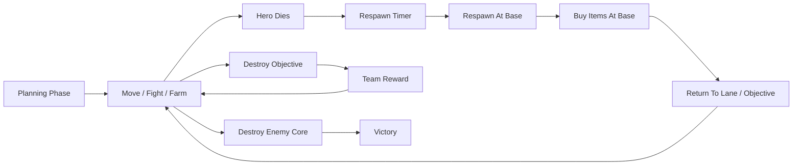

# Phase 7 Technical Spec  

## Base, Core, Respawn, and Objective Victory Slice

---

## 1. Phase 7 Goal

> **Transform the game from a hero-elimination battle into a true MOBA-style loop: heroes die and respawn, shopping happens at the base, teams fight over objectives, and the primary win condition becomes destroying the enemy Core.**

Phase 6 added progression.  
Phase 7 adds the MOBA macro loop.

---

## 2. Why This Slice Is Necessary

Up to Phase 6, the game still behaves like a tactical elimination battle:

- heroes stay dead forever
- there is no base
- shopping is abstract and not position-based
- objectives are secondary
- win condition is hero elimination

For a real MOBA feel, the game needs:

- respawn
- base
- base shop
- core
- objective pressure
- structure destruction as the primary victory path

This slice introduces those systems in the smallest stable way.

---

## 3. Phase 7 Definition of Done

Phase 7 is complete when:

- [ ] Each team has a Core structure.
- [ ] Destroying the enemy Core ends the match.
- [ ] Heroes respawn after a fixed delay.
- [ ] Dead heroes cannot be targeted or controlled.
- [ ] Respawned heroes keep gold, XP, level, and items.
- [ ] Respawn happens at the team base.
- [ ] The base zone is visible on the client.
- [ ] Shopping is only allowed while a hero is inside its team base.
- [ ] AI heroes only buy when inside base.
- [ ] A neutral objective structure exists.
- [ ] Destroying the objective grants team rewards.
- [ ] Minions push toward the enemy Core.
- [ ] Towers, Spawners, Core, and Objective are correctly handled by targeting.
- [ ] Client shows respawn timers, base zones, Core HP, and objective marker.
- [ ] The match remains stable in 5v5.

---

# 4. Phase 7 Scope

## Included

### Structures
- Core
- Objective Vault
- existing Towers
- existing Spawner Towers

### Hero Lifecycle
- hero death
- respawn timer
- respawn at base
- persistence of progression
- dead-state UI

### Base System
- team base zone
- base-only shopping
- optional small base regeneration

### Objectives
- one central neutral objective structure
- objective destruction rewards
- objective visibility in UI

### Win Conditions
- primary: destroy enemy Core
- optional fallback: hero elimination disabled by default

### AI Updates
- minions push toward Core
- heroes attack objectives/Core when appropriate
- AI buys only in base

---

## Excluded

Phase 7 does **not** include:

- multiple lanes
- inhibitor structures
- minion upgrades
- player recall / town portal
- fountain healing
- respawn time scaling by level
- active items
- consumables
- surrender
- matchmaking
- ranked
- spectator mode
- persistence
- cosmetics
- advanced objective respawn rules

---

# 5. Recommended Scope Adjustment

The earlier Phase 6 preview described Phase 7 as:

> Objectives, Base Shop, and Win Conditions

After Phase 6, I recommend one important addition:

> **Hero respawn must be part of Phase 7.**

Reason:
- permanent hero death conflicts with MOBA progression
- dead players would lose agency for the rest of the match
- gold and items become meaningless if heroes stay dead
- Core destruction and base shopping make much more sense with respawn

So Phase 7 becomes:

> **Base, Core, Respawn, and Objective Victory Slice**

---

# 6. High-Level MOBA Loop After Phase 7



---

# 7. New and Updated Structures

---

## 7.1 Structure Types

```rust
pub enum UnitKind {
    Hero,
    Minion,
    Tower,
    SpawnerTower,
    Core,
    Objective,
    Neutral,
}
```

Stationary kinds:
- Tower
- SpawnerTower
- Core
- Objective

---

## 7.2 Core

The Core is the main victory objective.

### Core Traits
- team-owned
- stationary
- high HP
- no attack in Phase 7
- large vision
- cannot be repaired?  
  Recommendation: **Core cannot be repaired** in Phase 7.
- destruction ends match

### Suggested Core Stats
```rust
hp: 700,
max_hp: 700,
vision_range: 5,
initiative: 0,
attack_damage: 0,
attack_range: 0,
```

---

## 7.3 Objective Vault

The Vault is a neutral destructible objective.

### Objective Traits
- neutral-owned
- stationary
- does not attack
- blocks movement
- does not block vision
- can be attacked by heroes
- grants team reward when destroyed
- does not respawn in Phase 7

### Suggested Objective Stats
```rust
hp: 250,
max_hp: 250,
vision_range: 2,
initiative: 0,
attack_damage: 0,
attack_range: 0,
```

---

## 7.4 Tower and Spawner Updates

### Tower
- remains attacking
- remains repairable
- priority defense structure

### Spawner
- remains minion source
- remains repairable
- destruction weakens minion pressure

---

# 8. Map Layout for Phase 7

Use the Phase 5 radius 8 map, updated for bases and objective.

---

## 8.1 Team 0 Base

```text
Core:       (-7, 0)
Spawner:    (-5, 0)
Tower:      (-3, 0)
Hero Spawn: around Core
```

Suggested hero spawn hexes:
```text
(-6, -1)
(-6, 0)
(-6, 1)
(-7, -1)
(-7, 1)
```

---

## 8.2 Team 1 Base

```text
Core:       (7, 0)
Spawner:    (5, 0)
Tower:      (3, 0)
Hero Spawn: around Core
```

Suggested hero spawn hexes:
```text
(6, -1)
(6, 0)
(6, 1)
(7, -1)
(7, 1)
```

---

## 8.3 Central Objective

```text
Objective Vault: (0, 0)
```

This creates a natural mid-map contest point.

---

## 8.4 Lane Waypoints

Update lane waypoints so minions eventually push to the enemy Core.

### Team 0 Lane Direction
```text
(-5, 0)
(-3, 0)
(0, 0)
(3, 0)
(5, 0)
(7, 0)
```

### Team 1 Lane Direction
Reversed:
```text
(5, 0)
(3, 0)
(0, 0)
(-3, 0)
(-5, 0)
(-7, 0)
```

If the final waypoint is occupied by the Core, minions should consider themselves “at waypoint” when within 1 hex and attack valid targets.

---

# 9. Base Zone System

---

## 9.1 Base Zone Definition

Each team has a base zone defined as all hexes within a radius around the Core.

```rust
pub struct BaseZone {
    pub team: TeamId,
    pub center: HexCoord,
    pub radius: u32,
}
```

Recommended:

```rust
radius: 2
```

---

## 9.2 Base Zone Uses

The base zone is used for:

1. shop access
2. respawn placement
3. optional base regeneration
4. client base overlay

---

## 9.3 Base Regeneration

Add a small healing effect to make base meaningful.

At round start:
- alive heroes inside their own base zone recover `+15 HP`

This is simple and avoids a full fountain system.

---

# 10. Hero Death and Respawn System

This is the biggest new system in Phase 7.

---

## 10.1 Death Handling Change

Before Phase 7:
- dead units were removed from state

After Phase 7:
- minions, towers, spawners, objectives, neutrals can still be removed
- heroes remain in state as dead entities with a respawn timer

---

## 10.2 Hero Death Fields

Add to `Unit`:

```rust
pub struct Unit {
    // Existing fields...

    // Phase 7 additions
    pub respawn_rounds: Option<u32>,
    pub death_pos: Option<HexCoord>,
}
```

For non-hero units:
```rust
respawn_rounds: None,
death_pos: None,
```

---

## 10.3 Death Rules

When a hero dies:

1. set HP to 0
2. mark dead
3. store death position
4. set respawn timer
5. clear active statuses
6. remove occupancy
7. make unit untargetable
8. emit `HeroDied`

Suggested respawn delay:

```rust
respawn_delay_rounds: 3
```

---

## 10.4 Respawn Rules

At round start, before planning:

1. decrement respawn timers for dead heroes
2. if timer reaches zero:
   - choose spawn hex in base zone
   - restore full HP
   - restore full AP
   - restore full energy
   - reset cooldowns
   - clear statuses
   - keep gold, XP, level, items
   - emit `HeroRespawned`

---

## 10.5 Spawn Placement

Respawn placement rules:

1. prefer hex adjacent to Core
2. choose a free walkable hex inside base zone
3. if all blocked, choose nearest free hex in base zone
4. if still blocked, delay respawn by 1 round

Deterministic selection:
- sort candidate hexes by distance to Core, then axial `q`, then `r`

---

## 10.6 Dead Hero Restrictions

A dead hero:
- cannot move
- cannot act
- cannot be targeted
- cannot buy items
- does not provide vision
- does not occupy a hex
- cannot receive orders

The player can still:
- watch the battle
- view team information
- wait for respawn

---

# 11. Win Conditions

---

## 11.1 Primary Win Condition

The default Phase 7 win condition is:

> **Destroy the enemy Core.**

When a Core is destroyed:
- match ends immediately
- winner is the opposing team
- emit `CoreDestroyed`
- emit `MatchEnded`

---

## 11.2 Hero Elimination Fallback

Hero elimination should be disabled by default.

Configuration:

```rust
pub enum VictoryMode {
    CoreDestruction,
    HeroElimination,
    CoreOrElimination,
}
```

Phase 7 default:

```rust
VictoryMode::CoreDestruction
```

---

## 11.3 Why Disable Elimination by Default?

With respawn enabled, hero elimination no longer makes sense as a primary win condition.

Heroes are expected to die and return.

---

# 12. Objective Vault Rewards

---

## 12.1 Destruction Reward

When the Vault is destroyed:

### Team Reward
Each alive hero on the destroying team receives:
```rust
+50 gold
+40 XP
```

### Optional Buff
Reuse the Phase 4 buff system:
```rust
+5 attack damage for 5 rounds
```

This makes the objective feel impactful.

---

## 12.2 Reward Attribution

For the Vault:
- reward goes to the team of the last attacker
- if last attacker is neutral or invalid, no reward
- if last attacker is a hero, minion, or tower, use that unit’s team

This is simpler than hero-only attribution because objectives are team objectives.

---

## 12.3 Objective Event

```rust
ObjectiveDestroyed {
    objective_id: UnitId,
    destroyer_team: TeamId,
    last_attacker_id: UnitId,
}
```

---

# 13. Base Shop System

---

## 13.1 Shop Access Rule

Phase 7 replaces Phase 6 “shop anywhere” with:

> **A hero may buy items only during planning if it is alive and inside its own base zone.**

---

## 13.2 Shop Availability Function

```rust
pub fn can_hero_shop(&self, unit_id: UnitId) -> bool {
    if phase != Planning { return false; }

    let unit = get_unit(unit_id);
    if unit.kind != Hero { return false; }
    if !unit.is_alive() { return false; }

    if !is_inside_base_zone(unit.team, unit.pos) {
        return false;
    }

    true
}
```

---

## 13.3 AI Shopping Rule

AI heroes follow the same rule:
- AI may buy only when inside its base zone

This means AI will naturally shop:
- at match start
- after respawn
- if it happens to return to base

Do not add recall behavior yet.

---

# 14. Core and Objective Targeting Rules

---

## 14.1 Minion Targeting

Updated minion priority:

1. enemy minion in range
2. enemy hero in range
3. enemy tower in range
4. enemy spawner in range
5. enemy Core in range

Minions should **not** attack the neutral Vault in Phase 7.

---

## 14.2 Tower Targeting

Tower priority remains:

1. enemy minion
2. enemy hero
3. other attackable enemy structures if in range

Towers do not attack neutral Vault.

---

## 14.3 Hero AI Targeting

Simple Phase 7 hero AI priorities:

1. defend own Core if enemies are near it
2. attack enemy heroes if favorable
3. attack enemy towers if safe
4. attack Vault if visible and no higher priority target
5. attack enemy Core if visible and no immediate threat
6. otherwise push lane

This does not need to be sophisticated. It only needs to make the macro loop visible.

---

# 15. Core Simulation Changes

---

## 15.1 Updated Unit Lifecycle

```rust
pub enum LifeState {
    Alive,
    DeadAwaitingRespawn,
    PermanentlyRemoved,
}
```

Heroes:
- `Alive`
- `DeadAwaitingRespawn`

Structures / minions / neutrals:
- usually removed when destroyed

---

## 15.2 Updated Round Start Sequence

At round start:

1. decrement hero respawn timers
2. respawn ready heroes
3. apply base regeneration
4. grant passive gold income
5. process spawners
6. update fog
7. send planning snapshot

---

## 15.3 Updated Resolution Sequence

For each actionable unit:
1. skip dead units
2. process movement
3. process action
4. apply damage/effects
5. handle deaths:
   - heroes enter respawn state
   - non-heroes are removed or destroyed
6. process objective destruction
7. process Core destruction
8. update fog
9. check victory

---

# 16. Protocol Updates

---

## 16.1 Updated Unit DTO

```rust
pub struct UnitDto {
    // Existing fields...

    pub life_state: String,
    pub respawn_rounds: Option<u32>,
}
```

---

## 16.2 Updated Snapshot DTO

```rust
pub struct SnapshotDto {
    // Existing fields...

    pub victory_mode: String,
    pub base_zones: Vec<BaseZoneDto>,
    pub can_shop: bool,
    pub shop_disabled_reason: Option<String>,
}
```

---

## 16.3 BaseZone DTO

```rust
pub struct BaseZoneDto {
    pub team: TeamId,
    pub center: HexDto,
    pub radius: u32,
}
```

---

## 16.4 New Event Types

```rust
HeroDied {
    unit_id: UnitId,
    killed_by: UnitId,
    respawn_rounds: u32,
}

HeroRespawned {
    unit_id: UnitId,
    pos: HexCoord,
}

CoreDestroyed {
    core_id: UnitId,
    team: TeamId,
    destroyed_by: UnitId,
}

ObjectiveDestroyed {
    objective_id: UnitId,
    destroyer_team: TeamId,
    last_attacker_id: UnitId,
}

BaseRegenerationApplied {
    unit_id: UnitId,
    amount: u32,
}
```

---

# 17. Client Updates

Phase 7 needs major UI clarity because the match state becomes richer.

---

## 17.1 Respawn UI

When the player’s hero is dead, show:

```text
Respawn in 2 rounds
```

Also show:
- darkened hero panel
- disabled order controls
- respawn countdown badge in roster

---

## 17.2 Base Zone Rendering

Show:
- allied base zone in team color
- enemy base zone in faint enemy color if visible
- base zone only during planning or always?  
  Recommendation: always visible as subtle overlay

---

## 17.3 Core Rendering

Core should be visually distinct:
- larger structure sprite/shape
- prominent HP bar
- team glow
- destruction animation

---

## 17.4 Objective Rendering

Vault should show:
- neutral color
- objective icon
- HP bar
- reward hint on hover

---

## 17.5 Shop UI Updates

The shop button must show state:

- enabled if hero is alive and in base
- disabled if dead
- disabled if outside base
- disabled if not planning phase

Suggested disabled labels:
```text
Shop unavailable: hero is dead
Shop unavailable: return to base
Shop unavailable: not in planning phase
```

---

## 17.6 Victory Screen

Victory message should reflect reason:

```text
Victory! Enemy Core destroyed.
```

or

```text
Defeat. Your Core was destroyed.
```

---

# 18. AI Updates

---

## 18.1 Minion AI

Update minion lane behavior:
- follow waypoints
- attack valid targets in range
- attack Core when in range
- ignore neutral Vault

---

## 18.2 Hero AI

Add simple macro rules:

### If own Core threatened
If an enemy unit is within 3 hexes of own Core:
- move toward Core
- attack nearest enemy near Core

### If no immediate threat
- push lane
- attack objective if near and visible
- attack enemy Core if near and safe

### If dead
- no AI order until respawned

---

## 18.3 AI Shopping

AI shopping rules:
- only buy if alive
- only buy if inside base
- use Phase 6 deterministic buy priority

---

# 19. Fog and Visibility Rules

---

## 19.1 Dead Heroes
Dead heroes:
- provide no vision
- are not rendered on board
- remain visible in roster with dead state

---

## 19.2 Core
Core is visible if:
- it belongs to your team, or
- its hex is visible to your team

---

## 19.3 Objective
Vault is visible only if its hex is visible.

If not visible:
- do not send its current HP
- do not render it

---

# 20. Server Validation Updates

---

## 20.1 Buy Item Validation

Reject purchase if:
- not planning phase
- hero is dead
- hero is outside base
- not enough gold
- no free slot
- duplicate item

---

## 20.2 Order Validation

Reject orders if:
- hero is dead
- hero is waiting to respawn
- unit is not controlled by player

---

## 20.3 Structure Attacks

Validate attacks on:
- enemy structures
- neutral objective
- Core

Do not allow attacking:
- allied structures
- allied heroes, unless future friendly-fire is added
- dead units

---

# 21. Configuration

```rust
pub struct Phase7Config {
    pub victory_mode: VictoryMode,
    pub respawn_delay_rounds: u32,
    pub base_zone_radius: u32,
    pub base_regen_per_round: u32,
    pub core_hp: u32,
    pub objective_hp: u32,
    pub objective_gold_reward_per_hero: u32,
    pub objective_xp_reward_per_hero: u32,
    pub objective_buff_duration_rounds: u32,
    pub objective_buff_damage_bonus: u32,
}
```

Suggested defaults:

```rust
Phase7Config {
    victory_mode: VictoryMode::CoreDestruction,
    respawn_delay_rounds: 3,
    base_zone_radius: 2,
    base_regen_per_round: 15,
    core_hp: 700,
    objective_hp: 250,
    objective_gold_reward_per_hero: 50,
    objective_xp_reward_per_hero: 40,
    objective_buff_duration_rounds: 5,
    objective_buff_damage_bonus: 5,
}
```

---

# 22. Implementation Order

To keep Phase 7 manageable, implement in this order:

---

## Step 1 — Structure Kinds
Add:
- Core
- Objective
- updated UnitKind behavior

---

## Step 2 — Map Update
Add:
- Core positions
- Objective position
- base zones
- updated lane waypoints

---

## Step 3 — Hero Respawn
Add:
- death state for heroes
- respawn timers
- respawn placement
- respawn events

---

## Step 4 — Core Victory
Add:
- Core destruction detection
- match end
- victory reason

---

## Step 5 — Base Shop
Add:
- base zone check
- shop availability
- UI disabled reasons

---

## Step 6 — Objective Rewards
Add:
- Vault destruction
- team rewards
- objective events

---

## Step 7 — AI Macro Update
Add:
- Core defense behavior
- objective targeting
- Core targeting
- base-only AI shopping

---

## Step 8 — Client Polish
Add:
- respawn overlay
- base zone rendering
- Core/objective visuals
- victory reason screen

---

# 23. Acceptance Criteria

| # | Criterion | Status |
|---|-----------|--------|
| 1 | Each team has a Core | ☐ |
| 2 | Core is stationary and attackable | ☐ |
| 3 | Destroying enemy Core ends match | ☐ |
| 4 | Match victory reason is shown | ☐ |
| 5 | Heroes enter dead state instead of being removed | ☐ |
| 6 | Dead heroes cannot be targeted | ☐ |
| 7 | Dead heroes cannot receive orders | ☐ |
| 8 | Dead heroes have respawn timers | ☐ |
| 9 | Heroes respawn after configured delay | ☐ |
| 10 | Respawn happens in team base | ☐ |
| 11 | Respawn keeps gold, XP, level, items | ☐ |
| 12 | Respawn restores HP/AP/energy | ☐ |
| 13 | Respawn resets cooldowns | ☐ |
| 14 | Base zone is defined per team | ☐ |
| 15 | Shop works only inside base | ☐ |
| 16 | Shop is unavailable while dead | ☐ |
| 17 | AI heroes buy only inside base | ☐ |
| 18 | Base regeneration applies to alive heroes in base | ☐ |
| 19 | Objective Vault exists | ☐ |
| 20 | Objective can be destroyed | ☐ |
| 21 | Objective grants team rewards | ☐ |
| 22 | Objective reward applies only to destroying team | ☐ |
| 23 | Minions push toward enemy Core | ☐ |
| 24 | Minions do not attack neutral Vault | ☐ |
| 25 | Towers defend against enemy units | ☐ |
| 26 | Dead heroes provide no vision | ☐ |
| 27 | Client shows respawn countdown | ☐ |
| 28 | Client shows base zones | ☐ |
| 29 | Client shows Core HP clearly | ☐ |
| 30 | 5v5 matches remain stable | ☐ |

---

# 24. Risks and Mitigations

---

## Risk 1: Respawn State Complicates Existing Code
### Mitigation
Treat hero death as a special lifecycle state and keep non-hero death behavior unchanged.

---

## Risk 2: Core Rush Becomes Too Strong
### Mitigation
Give Core high HP, strong tower defense, and base vision.

---

## Risk 3: AI Does Not Return To Base
### Mitigation
Accept that AI will mainly shop at spawn/respawn in Phase 7. Add recall behavior later.

---

## Risk 4: Objective Becomes Ignored
### Mitigation
Make objective reward strong enough and place it at central lane.

---

## Risk 5: Dead Players Feel Idle
### Mitigation
Show respawn timer, team roster, and spectating board state. Add pings/chat later.

---

# 25. Out of Scope

Do not add in Phase 7:

- recall
- fountain healing
- respawn scaling
- multiple lanes
- inhibitors
- minion upgrades
- active items
- consumables
- objective respawn
- surrender
- matchmaking
- ranked
- spectator mode
- persistence
- cosmetics

---

# 26. Phase 8 Preview

After Phase 7, the next slice should likely focus on:

## Phase 8 — Lanes, Recall, and Objective Evolution

Possible contents:
- multiple lanes
- lane-specific towers
- minion wave upgrades
- recall / town portal
- fountain healing
- objective respawn
- additional neutral camps
- stronger map control systems
- advanced team fight AI

Phase 7 creates the base MOBA loop that those systems can build on.

---

# 27. Final Recommendation

Phase 7 should be:

> **Base, Core, Respawn, and Objective Victory Slice**

This is the most important next step because it converts the project from a tactical battle prototype into a recognizable MOBA-style game loop.

If you want, the next document can be:

**“Phase 7 implementation task breakdown”**  
with ordered tasks for core, server, protocol, AI, and client.