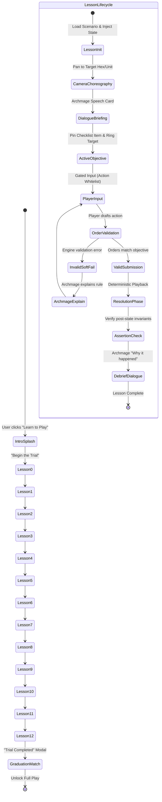
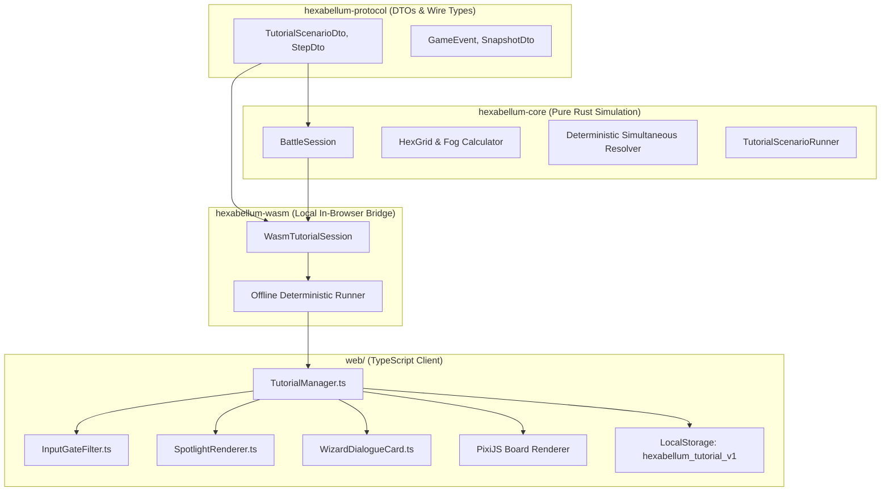
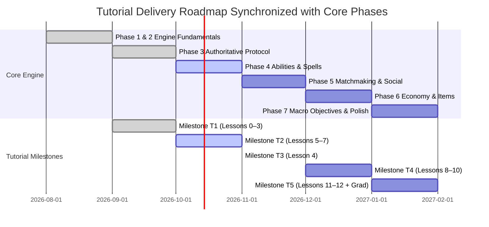
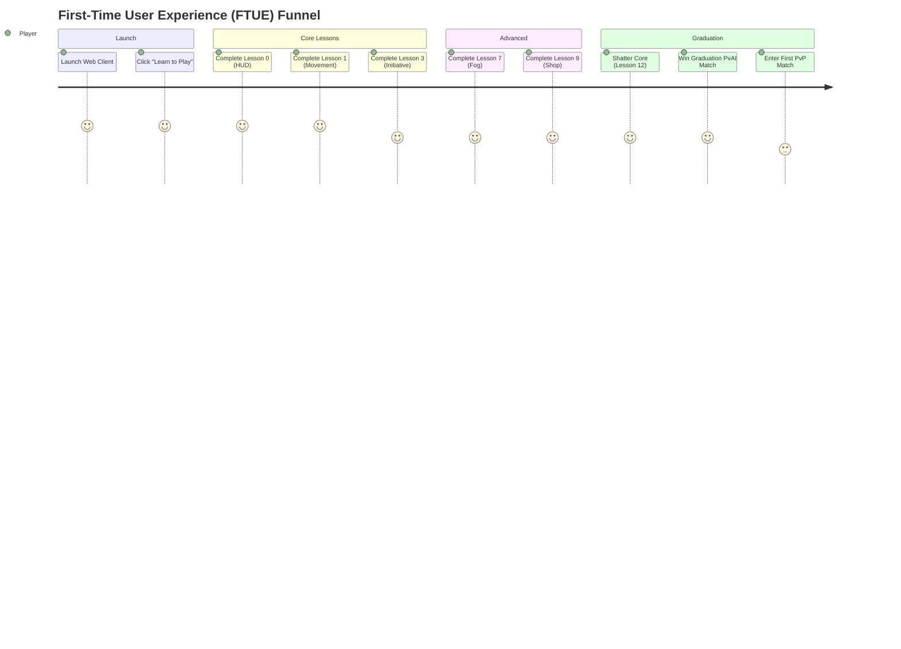

# HEXABELLUM

## Tutorial Level & Onboarding Wizard — Planning & Technical Specification

---

## Document Version

`Tutorial v1.0 — Planning & Technical Spec, Aligned with GDD v2.0, Architecture v2.0, Phase 1–7 Roadmaps, and UI/UX v2.0 (FTUE §10)`

---

## 1. Purpose & Document Scope

This document specifies **a guided, in-game tutorial level** — an interactive "wizard" flow starring a lore wizard (the **Archmage of the Convergence**) — that teaches brand-new players the complete rules of Hexabellum by doing, not reading.

It defines:

1. **The tutorial concept, learning objectives, and lesson breakdown** (Sections 3–4).
2. **The "wizard" presentation**: step-by-step guided flow, dialogue, objectives, and input gating (Section 5).
3. **The scenario scripting format** used to author lessons in a data-driven, declarative schema (Section 6).
4. **The technical architecture** across `hexabellum-core`, `hexabellum-wasm`, `hexabellum-protocol`, and the web client (Section 7).
5. **The delivery plan in milestones** with acceptance criteria, aligned with Phases 1 through 7 (Section 8).
6. **UX rules, the soft-fail system, and complete Archmage voice/copy direction** (Section 9).
7. **Telemetry, funnel metrics, and analytics** (Section 10).
8. **Testing, verification, and automated quality assurance** (Section 11).
9. **Risks, edge cases, and open design questions** (Section 12).

Rules of record remain in [`docs/gdd.md`](gdd.md). This document makes **no rule changes** — it teaches existing rules using the authoritative engine.

### 1.1 Relationship to Existing Onboarding (UI/UX §10)

| Surface | Audience | What it does |
|---|---|---|
| **Tutorial Level (this doc)** | First-time players | A self-contained, guided, single-player level: 13 short beats, ~10–15 min, ending in a "graduation" PvAI match. Skippable at any time, replayable. |
| **Contextual Coaching Assistant (ui-ux.md §10)** | All players, in-match | Dismissible round-by-round tips during real matches (Round 1: move, Round 2: engage, Round 3: economy). |
| **Codex (`[?]` help button)** | All players | Full static reference: rules manual, hero sheets, item database. |

The tutorial level is the **first entry point** on the FTUE (First-Time User Experience) funnel:
```
First Launch ──► "Learn to Play" Card ──► Guided Proving Grounds ──► Graduation PvAI Match ──► Ranked/Unranked PvP
                                                                           │
                                                                           └──► Contextual Coaching Assistant (in-match)
```

---

## 2. Design Principles

1. **Learn by doing.** Every lesson ends with the player *performing* the action being taught. No passive video walls of text; maximum 3 short dialogue lines per concept, always interruptible.
2. **Same engine, same rules.** The tutorial runs the real deterministic simulation from `hexabellum-core` via `hexabellum-wasm` — no "fake" tutorial rules. If a lesson teaches a rule, the engine enforces it identically to a competitive match.
3. **Zero pressure, zero ambiguity.** Relaxed timer (no 30s countdown), generous hint escalation (try → hint → auto-demo), input constrained to the current lesson's valid actions, and explicit success criteria shown at all times.
4. **Progressive disclosure.** 13 lessons, each teaching exactly one new rule or system. Earlier systems are never re-introduced from scratch; only *combined and referenced*.
5. **Deterministic & offline.** Runs 100% client-side in WebAssembly with a fixed scenario seed (`0x53CA1E00_u64`). No server, no account, no WebSocket connection — it must execute flawlessly from a single opened URL.
6. **Skip & replay.** Every lesson is individually skippable; the entire level is skippable to graduation; progress persists in `localStorage`; a "Restart tutorial" option lives in settings so returning players can refresh after balance patches.
7. **Lore-consistent voice.** The Archmage speaks in the GDD's established terminology (Section 13.1 of `docs/gdd.md`) — "Sovereign Core", "Bellum Sextum", "AP", "Initiative", "Sanctuary" — ensuring tutorial vocabulary perfectly matches competitive play.
8. **Soft-fail, never punish.** Invalid orders trigger calm, pedagogical explanations from the Archmage explaining *why* the order violates engine invariants, rather than harsh error buzzers or game-overs.

---

## 3. The Concept: "The Archmage's Trial"

> *"Every general was once a stranger to the grid. Six sides of war. Let me show you how the first side is conquered."*

The tutorial is framed as **the Archmage of the Convergence** — a lore-native wizard character of the Convergence realm (`docs/gdd.md` §3) — walking the player through a scaled-down training arena called **The Proving Grounds**. The Archmage:

- Appears as a sprite standing on an observation platform, with an animated **dialogue portrait** (bottom-left glassmorphic DOM card per `docs/ui-ux.md` §12).
- Narrates each rule *as the player encounters it* (moment-of-need teaching), not as an abstract preamble.
- Reacts to failure: if the player makes an invalid order, the Archmage calmly explains *why* it failed, utilizing the engine's validation error code as the single source of truth.
- Never punishes: mistakes are free retries. There is no tutorial "game over" — only "try again" and "watch me show you".

### 3.1 Why a Wizard Character (and Not a Silent Checklist)?

- **Narrative glue** across 13 otherwise mechanical rules. The Archmage is a named, quotable NPC consistent with the Convergence lore.
- **Perceived guidance, not UI clutter**: a character asking ("Where would you march?") reads as strategic mentorship rather than an intrusive checklist.
- **Localization-ready**: one authored voice per lesson maps cleanly to internationalized string tables and future voiceover assets.
- **Reusable brand asset**: the Archmage recurs in post-launch content (Season 1+ challenge scenarios, per `docs/gdd.md` §12), making tutorial development a lasting platform investment.

### 3.2 Alternative Considered: Silent Objective Checklist Only

Rejected as the primary mode — checklists teach *what* to click, but not *why* outcomes occur. Hexabellum's Core Pillar 1 (**Tactical Clarity**, `docs/gdd.md` §2) demands players understand *why* deterministic results unfold (e.g., "His Initiative is 4 while yours is 2; thus, his lethal blow resolved before your swing could connect"). 

However, a **Quiet Mode** (silent checklist only, no dialogue cards, Section 9.3) ships as a settings toggle for veterans who want to re-run the drills at maximum speed.

---

## 4. Learning Objectives & Lesson Breakdown

Each lesson teaches one rule or system. "Rules covered" links to the GDD section that is the authoritative source of truth.

| # | Lesson | Rules / Systems Covered (GDD ref.) | Player Must Do (success condition) |
|---|---|---|---|
| 0 | **The Convergence Calls** | Game identity, hero concept, hex grid, AP pips on HUD (§1, §13.1) | Dismiss intro; select own hero; inspect the HUD tour (AP pips, round counter, lock button). |
| 1 | **The Three Steps** | Hex movement, 1 AP per hex, 3 AP budget, tile occupancy (§6.2) | Move 1 hex, then 2 hexes, then a 3-hex path; attempt to walk through an occupied hex and observe rejection. |
| 2 | **A Strike Is a Promise** | Basic attack, HP bars, deterministic combat preview (§7.3, §11.2) | Attack the training dummy at range 1; inspect the hover preview and verify the exact damage dealt matches preview. |
| 3 | **The Round Resolves** | Planning → lock → resolution; initiative order; **death-before-acting** (§7.1, §7.2 stage 6, §7.3) | Lock orders where a dummy dies from a higher-initiative ally's strike; observe dummy's pending order cancel. Archmage narrates the initiative difference. |
| 4 | **Spells of the Convergence** | Abilities: AP cost, energy cost, cooldown, targeting, LOS (§5.1–5.5, §6.3) | Cast Ranger's `Bolt` (single target, range 3); attempt a second cast to observe cooldown block; attempt cast without energy. |
| 5 | **Clockwork Legions** | Minion spawning, lane spawners, automated march (§2, §8.1–8.2) | Watch a wave spawn from the spawner; last-hit an enemy minion; damage the spawner to observe waves stop. |
| 6 | **Towers Watch** | Tower auto-attack, target priority Minion → Hero, tower repair (§8.2) | Let an allied minion draw tower aggro; observe 25 DMG retaliation; repair the damaged tower (+25 HP / 1 AP). |
| 7 | **The Shadow Knows** | Fog of war, 3 visibility states, LOS raycasting, vision radius (§6.3) | Scout behind a crystal wall with Ranger (vision 4); observe Lit / Explored / Unexplored states; fire `Bolt` at revealed target; attempt blind fire into fog (blocked). |
| 8 | **Gold, Growth, Glory** | Gold economy (+6G passive, bounties), XP thresholds, levels 1–5 (§9.1, §9.2) | Collect gold via last-hits; watch XP bar cross Level 2; observe +12 HP / +3 DMG / +1 Energy applied. |
| 9 | **The Sanctuary** | Base Zone: +15 HP regen, Base-Only Shop, 3 item slots (§8.3, §9.3) | Retreat to allied Base Zone; open shop; purchase `Plate Armor` (120G); observe +35 Max HP and instant heal. |
| 10 | **Death Is Not the End** | Hero death, 3-round respawn countdown, progression preservation (§8.4) | Receive a scripted lethal blow; watch 3-round countdown on roster; respawn at base with HP restored and items preserved. |
| 11 | **The Ancient Vault** | Neutral objectives, contested last-hit, team-wide buff (+50G/+40XP, +5 AD for 5 rounds) (§8.2) | Attack the Vault at map center `(0, 0)`; last-hit to claim team buff; observe buff icon on HUD. |
| 12 | **Shatter the Core** | Primary win condition, Core HP (700), non-repairable, victory screen (§8.2, §10.3) | Lead a push against enemy Sovereign Core; block a counter-strike; shatter Core → victory banner and graduation trigger. |
| — | **Graduation Match** | Full standard 3v3 PvAI match with no input gating | Complete a full offline 3v3 match against beginner bot AI; unlocks "Enter the Bellum Sextum" card. |

**Total:** 13 lessons (0–12) + 1 graduation match.  
**Target Completion Time:** 10–15 minutes for new players; skippable directly to the graduation match in ~90 seconds.

---

## 5. The Wizard Flow: Presentation Specification

### 5.1 Flow Architecture



### 5.2 The Step Anatomy

Every moment inside a lesson is governed by a discrete **step** (Section 6 schema). Steps fall into seven specialized categories:

| Type | Visual Presentation | Input Behavior | Completion Trigger |
|---|---|---|---|
| `dialogue` | Glassmorphic portrait card with typewriter text; camera paused. | All board input blocked. `[Space]` or "Continue" button advances. | Player clicks "Continue" or presses `[Space]`. |
| `callout` | Glowing pointer arrow targeting a specific HUD element (e.g. AP pips, turn timer) with floating tooltip. | Board input blocked; element highlighted. | Player clicks tooltip or presses `[Space]`. |
| `objective` | Active task pinned to top-left checklist; glowing pulsing ring on target hexes. | Input gated to valid lesson actions. | Target action committed to order queue. |
| `input-gate` | Canvas click & drag interceptor whitelist; invalid clicks intercepted. | Rejects clicks outside whitelist; triggers soft-fail dialogue. | Valid order drafted. |
| `milestone` | Non-interactive resolution playback; scripted bot movements and attacks execute. | Interactive input disabled; speed toggle (1x / 2x) available. | Animation playback queue empties. |
| `cinematic-camera` | Smooth cubic-bezier camera translation and zoom toward coordinates `(q, r)`. | Input blocked during camera pan (~600ms). | Camera reaches destination frustum. |
| `assertion` | Invisible state verification check against the WASM simulation snapshot. | N/A | State condition evaluates to true. |

### 5.3 Hint Escalation (Anti-Stuck Ladder)

To prevent new players from abandoning the game when confused, each interactive objective runs an autonomous, client-side escalation timer:

```
[0s ──────────────────────── 45s ──────────────────────── 90s ────────────────────────►]
 Stage 1: Subtle Guidance       Stage 2: Explicit Instruction  Stage 3: Auto-Demo Assisted
 • Target ring pulses           • Archmage provides exact      • "Watch me show you" button
 • Objective checklist visible    hex coordinate & action      • Ghost cursor demonstrates
 • Silent board spotlight       • Compass hint ("North-East")  • Player executes step
```

1. **Stage 1 (0–45s) — Subtle Guidance:**
   - A pulsing emerald (`#00e676`) or crimson (`#ff1744`) ring highlights the target hex or unit.
   - The objective checklist displays the tactical goal (e.g., *"March your Ranger 2 hexes North-East"*).
2. **Stage 2 (45–90s) — Explicit Instruction:**
   - The Archmage dialogue card expands with an explicit hint: *"Look to the glowing hex at coordinate (1, -1). Select your Ranger, then left-click that hex to draft a 1 AP march."*
   - An animated directional arrow pulses between the hero and the destination hex.
3. **Stage 3 (90s+) — Auto-Demo Demonstration:**
   - A prominent button labeled **"Watch me show you"** appears on the Archmage card.
   - Clicking it executes a 5-second **ghost demonstration**: a semi-transparent cursor moves smoothly across the screen, selects the hero, clicks the target hex, and highlights the lock button.
   - The board resets immediately to the pre-demo state, allowing the player to perform the action themselves. Auto-demo **never silently completes** the step on behalf of the player.

### 5.4 Board & HUD Modifications During Tutorial

- **Planning Timer:** Paused indefinitely. No 30-second countdown. The round advances only when the active lesson objective is completed and confirmed by the player.
- **Objective Checklist (Top-Left Dock):** Displays current lesson title, step progress counter (e.g. `2/3`), and active task description with a glowing checkbox.
- **Board Spotlight:** Leverages a custom PixiJS rendering pass. The entire canvas is dimmed by 50% via a radial vignette shader, with dynamic cut-out apertures exposing only the active hero and valid destination hexes.
- **Archmage Portrait Card (Bottom-Left Dock):** Glassmorphic card (`rgba(18, 24, 38, 0.85)`, `backdrop-filter: blur(12px)`) featuring the Archmage animated avatar, speech bubble, and quick-action buttons (`[Skip Step]`, `[Settings]`).
- **Scripted Neutral Entities:** Training dummies and Archmage instructors feature a distinctive amber ring (`#ffb300`) with a Convergence Bell insignia, avoiding visual confusion with Team Azure (`#00e5ff`) or Team Crimson (`#ff1744`).

### 5.5 Player Controls, Camera Choreography & Pause/Menu Handling

- **Camera Choreography:** The camera automatically translates smoothly (`easeOutCubic`, 600ms) to frame relevant tactical events. When an objective moves from base to center, the camera pans to keep both the actor and target within the viewport.
- **Escape Menu (`[ESC]`):** Pressing `[ESC]` opens the Tutorial Navigation Drawer:
  - **Resume Trial:** Return to current step.
  - **Restart Lesson:** Reload initial lesson checkpoint state.
  - **Skip Lesson:** Advance to the next lesson immediately.
  - **Skip to Graduation Match:** Bypass remaining lessons and jump directly to the 3v3 PvAI trial.
  - **Toggle Quiet Mode:** Enable/disable Archmage dialogue text.
- **Keyboard Shortcuts:**
  - `[Space]` or `[Enter]`: Advance dialogue or lock orders.
  - `[1]`, `[2]`, `[3]`: Fast-select ability or action modes when enabled.
  - `[R]`: Reset orders for the active round.

---

## 6. Scenario Scripting Format & Data-Driven Authoring

Lessons are authored using a declarative, data-driven scenario format serialized in JSON/YAML and compiled directly into the WASM bundle.

### 6.1 Scenario Data Model (Rust / TypeScript Schema)

```rust
// crates/protocol/src/tutorial.rs

use crate::{HexDto, UnitDto, TeamId, ActionDto};
use serde::{Deserialize, Serialize};

#[derive(Debug, Clone, Serialize, Deserialize)]
pub struct TutorialScenario {
    pub id: String,
    pub lesson_index: u32,
    pub title: String,
    pub gdd_reference: String,
    pub map_radius: u32,
    pub initial_state: TutorialInitialState,
    pub steps: Vec<TutorialStep>,
}

#[derive(Debug, Clone, Serialize, Deserialize)]
pub struct TutorialInitialState {
    pub player_team: TeamId,
    pub player_hero_kind: String, // "Ranger", "Vanguard", etc.
    pub player_hero_pos: HexDto,
    pub player_gold: u32,
    pub player_xp: u32,
    pub player_energy: u32,
    pub board_units: Vec<TutorialUnitPreset>,
    pub fog_enabled: bool,
}

#[derive(Debug, Clone, Serialize, Deserialize)]
pub struct TutorialUnitPreset {
    pub id: u64,
    pub kind: String, // "Hero", "Minion", "Tower", "Spawner", "Dummy"
    pub team: TeamId,
    pub pos: HexDto,
    pub hp: u32,
    pub max_hp: u32,
    pub initiative: u32,
    pub attack_damage: u32,
    pub is_invulnerable: bool,
}

#[derive(Debug, Clone, Serialize, Deserialize)]
pub struct TutorialStep {
    pub step_id: String,
    pub step_type: TutorialStepType,
    pub dialogue: Option<ArchmageDialogue>,
    pub callout: Option<CalloutConfig>,
    pub input_gate: Option<InputGateConfig>,
    pub objective: Option<ObjectiveConfig>,
    pub camera_target: Option<HexDto>,
    pub completion_condition: StepCondition,
    pub failure_feedback: Vec<SoftFailRule>,
}

#[derive(Debug, Clone, Serialize, Deserialize)]
#[serde(tag = "type")]
pub enum TutorialStepType {
    Dialogue,
    Callout,
    Objective,
    ResolutionWatch,
    Milestone,
}

#[derive(Debug, Clone, Serialize, Deserialize)]
pub struct ArchmageDialogue {
    pub lines: Vec<String>,
    pub emotion: String, // "Neutral", "Pleased", "Stern", "Enlightened"
    pub auto_advance_ms: Option<u64>,
}

#[derive(Debug, Clone, Serialize, Deserialize)]
pub struct InputGateConfig {
    pub allowed_unit_ids: Vec<u64>,
    pub allowed_actions: Vec<String>, // "Move", "Attack", "Ability", "Lock"
    pub allowed_hex_targets: Vec<HexDto>,
    pub max_ap_spend: Option<u32>,
}

#[derive(Debug, Clone, Serialize, Deserialize)]
pub struct ObjectiveConfig {
    pub text: String,
    pub spotlight_hexes: Vec<HexDto>,
    pub ring_color: String, // "#00e676", "#ff1744", "#00e5ff"
}

#[derive(Debug, Clone, Serialize, Deserialize)]
pub struct SoftFailRule {
    pub error_code: String, // e.g. "ERR_OCCUPIED_HEX", "ERR_OUT_OF_RANGE"
    pub archmage_response: String,
}

#[derive(Debug, Clone, Serialize, Deserialize)]
#[serde(tag = "condition")]
pub enum StepCondition {
    DialogueDismissed,
    UnitMovedTo { unit_id: u64, target: HexDto },
    UnitDamaged { unit_id: u64, min_damage: u32 },
    UnitKilled { unit_id: u64 },
    AbilityCast { unit_id: u64, ability_id: String },
    ItemPurchased { item_id: String },
    RoundResolved { target_round: u32 },
}
```

### 6.2 Step Types & Behavioral Contracts

1. **`Dialogue`**: Displays modal conversation. Emits audio chime; keyboard focus locks to dialog button.
2. **`Callout`**: Computes bounding rect of DOM/Canvas element via CSS selector or anchor key; renders floating pointer card with backdrop scrim.
3. **`Objective`**: Activates canvas layer listener; checks incoming player intent against `allowed_hex_targets` and `completion_condition`.
4. **`ResolutionWatch`**: Triggers deterministic turn resolution in `hexabellum-core`; plays animation sequence at standard speed; pauses on completion.
5. **`Milestone`**: Signals completion of a major concept; triggers checkpoint write to browser storage.

### 6.3 Complete Lesson Scenario Definitions

#### Lesson 1: "The Three Steps" (Hex Movement & AP Budget)

```json
{
  "id": "lesson_01_movement",
  "lesson_index": 1,
  "title": "The Three Steps",
  "gdd_reference": "gdd.md §6.2",
  "map_radius": 4,
  "initial_state": {
    "player_team": 0,
    "player_hero_kind": "Ranger",
    "player_hero_pos": { "q": 0, "r": 0 },
    "player_gold": 0,
    "player_xp": 0,
    "player_energy": 5,
    "board_units": [
      {
        "id": 99,
        "kind": "Dummy",
        "team": 2,
        "pos": { "q": 0, "r": 2 },
        "hp": 100,
        "max_hp": 100,
        "initiative": 0,
        "attack_damage": 0,
        "is_invulnerable": true
      }
    ],
    "fog_enabled": false
  },
  "steps": [
    {
      "step_id": "l1_s1_intro",
      "step_type": "Dialogue",
      "dialogue": {
        "lines": [
          "Every march begins with a single step across the grid.",
          "Your hero possesses 3 Action Points each round. Each hex traversed consumes exactly 1 AP.",
          "Take your first step. March 1 hex East."
        ],
        "emotion": "Neutral"
      },
      "completion_condition": { "condition": "DialogueDismissed" }
    },
    {
      "step_id": "l1_s2_move_one",
      "step_type": "Objective",
      "objective": {
        "text": "Move 1 hex East to coordinate (1, 0)",
        "spotlight_hexes": [{ "q": 1, "r": 0 }],
        "ring_color": "#00e676"
      },
      "input_gate": {
        "allowed_unit_ids": [1],
        "allowed_actions": ["Move"],
        "allowed_hex_targets": [{ "q": 1, "r": 0 }],
        "max_ap_spend": 1
      },
      "failure_feedback": [
        {
          "error_code": "ERR_INVALID_TARGET",
          "archmage_response": "Look for the emerald ring to the East. Click that hex to plot your march."
        }
      ],
      "completion_condition": {
        "condition": "UnitMovedTo",
        "unit_id": 1,
        "target": { "q": 1, "r": 0 }
      }
    },
    {
      "step_id": "l1_s3_collision_test",
      "step_type": "Dialogue",
      "dialogue": {
        "lines": [
          "Well stepped. Now observe the training dummy stationed ahead at (0, 2).",
          "Two units may never occupy the same hex. Try to walk into the dummy's tile."
        ],
        "emotion": "Neutral"
      },
      "completion_condition": { "condition": "DialogueDismissed" }
    },
    {
      "step_id": "l1_s4_attempt_collision",
      "step_type": "Objective",
      "objective": {
        "text": "Attempt to move into the occupied hex at (0, 2)",
        "spotlight_hexes": [{ "q": 0, "r": 2 }],
        "ring_color": "#ff1744"
      },
      "input_gate": {
        "allowed_unit_ids": [1],
        "allowed_actions": ["Move"],
        "allowed_hex_targets": [{ "q": 0, "r": 2 }],
        "max_ap_spend": 2
      },
      "failure_feedback": [
        {
          "error_code": "ERR_OCCUPIED_HEX",
          "archmage_response": "Notice how the stone resists. The grid permits no shared space. When pathing, you must skirt around obstacles."
        }
      ],
      "completion_condition": {
        "condition": "UnitMovedTo",
        "unit_id": 1,
        "target": { "q": 0, "r": 1 }
      }
    }
  ]
}
```

#### Lesson 3: "The Round Resolves" (Initiative & Death-Before-Acting)

```json
{
  "id": "lesson_03_initiative",
  "lesson_index": 3,
  "title": "The Round Resolves",
  "gdd_reference": "gdd.md §7.1, §7.3",
  "map_radius": 4,
  "initial_state": {
    "player_team": 0,
    "player_hero_kind": "Ranger",
    "player_hero_pos": { "q": -1, "r": 0 },
    "player_gold": 0,
    "player_xp": 0,
    "player_energy": 5,
    "board_units": [
      {
        "id": 101,
        "kind": "Dummy",
        "team": 1,
        "pos": { "q": 0, "r": 0 },
        "hp": 15,
        "max_hp": 50,
        "initiative": 2,
        "attack_damage": 30,
        "is_invulnerable": false
      }
    ],
    "fog_enabled": false
  },
  "steps": [
    {
      "step_id": "l3_s1_briefing",
      "step_type": "Dialogue",
      "dialogue": {
        "lines": [
          "In Hexabellum, all commanders issue orders simultaneously. But resolution obeys the law of Initiative.",
          "Your Ranger possesses Initiative 4. The dummy possesses Initiative 2.",
          "If your attack destroys an enemy before their turn arrives, their pending orders are immediately extinguished: Death-Before-Acting."
        ],
        "emotion": "Enlightened"
      },
      "completion_condition": { "condition": "DialogueDismissed" }
    },
    {
      "step_id": "l3_s2_order_attack",
      "step_type": "Objective",
      "objective": {
        "text": "Order Ranger to attack the dummy at (0, 0), then lock round",
        "spotlight_hexes": [{ "q": 0, "r": 0 }],
        "ring_color": "#ff1744"
      },
      "input_gate": {
        "allowed_unit_ids": [1],
        "allowed_actions": ["Attack", "Lock"],
        "allowed_hex_targets": [{ "q": 0, "r": 0 }]
      },
      "completion_condition": {
        "condition": "RoundResolved",
        "target_round": 1
      }
    },
    {
      "step_id": "l3_s3_debrief",
      "step_type": "Dialogue",
      "dialogue": {
        "lines": [
          "Witness the outcome. The dummy prepared a 30 damage strike against you.",
          "Yet your photon arrow struck first at Initiative 4, dealing 16 lethal damage.",
          "The dummy perished instantly. Its queued strike dissolved into dust. Speed is life."
        ],
        "emotion": "Pleased"
      },
      "completion_condition": { "condition": "DialogueDismissed" }
    }
  ]
}
```

#### Lesson 7: "The Shadow Knows" (Fog of War & Vision Raycasting)

```json
{
  "id": "lesson_07_fog_of_war",
  "lesson_index": 7,
  "title": "The Shadow Knows",
  "gdd_reference": "gdd.md §6.3",
  "map_radius": 5,
  "initial_state": {
    "player_team": 0,
    "player_hero_kind": "Ranger",
    "player_hero_pos": { "q": -3, "r": 0 },
    "player_gold": 0,
    "player_xp": 0,
    "player_energy": 5,
    "board_units": [
      {
        "id": 201,
        "kind": "Dummy",
        "team": 1,
        "pos": { "q": 2, "r": 0 },
        "hp": 50,
        "max_hp": 50,
        "initiative": 1,
        "attack_damage": 0,
        "is_invulnerable": false
      }
    ],
    "fog_enabled": true
  },
  "steps": [
    {
      "step_id": "l7_s1_intro",
      "step_type": "Dialogue",
      "dialogue": {
        "lines": [
          "The battlefield is cloaked in the Mist of Convergence.",
          "Hexes exist in three states: Lit, Explored Memory, and Unexplored Darkness.",
          "Your Ranger has a superior vision radius of 4 hexes. Advance toward the crystal wall to dispel the veil."
        ],
        "emotion": "Neutral"
      },
      "completion_condition": { "condition": "DialogueDismissed" }
    },
    {
      "step_id": "l7_s2_scout_hex",
      "step_type": "Objective",
      "objective": {
        "text": "March 2 hexes East to reveal the hidden sector",
        "spotlight_hexes": [{ "q": -1, "r": 0 }],
        "ring_color": "#00e676"
      },
      "input_gate": {
        "allowed_unit_ids": [1],
        "allowed_actions": ["Move", "Lock"],
        "allowed_hex_targets": [{ "q": -1, "r": 0 }]
      },
      "completion_condition": {
        "condition": "UnitMovedTo",
        "unit_id": 1,
        "target": { "q": -1, "r": 0 }
      }
    },
    {
      "step_id": "l7_s3_reveal_dummy",
      "step_type": "Dialogue",
      "dialogue": {
        "lines": [
          "The mist clears! An enemy sentry dummy rests at (2, 0).",
          "You cannot target what you cannot see. Now that line-of-sight is established, loose your Bolt ability."
        ],
        "emotion": "Enlightened"
      },
      "completion_condition": { "condition": "DialogueDismissed" }
    },
    {
      "step_id": "l7_s4_fire_bolt",
      "step_type": "Objective",
      "objective": {
        "text": "Cast Bolt upon the revealed dummy at (2, 0)",
        "spotlight_hexes": [{ "q": 2, "r": 0 }],
        "ring_color": "#ff1744"
      },
      "input_gate": {
        "allowed_unit_ids": [1],
        "allowed_actions": ["Ability", "Lock"],
        "allowed_hex_targets": [{ "q": 2, "r": 0 }]
      },
      "completion_condition": {
        "condition": "AbilityCast",
        "unit_id": 1,
        "ability_id": "Bolt"
      }
    }
  ]
}
```

### 6.4 State Checkpointing, Soft-Validation Hooks & Retry Loops

- **Snapshot Checkpointing:** Upon entering a step, the engine creates an in-memory clone of the `BattleSession`.
- **Soft Validation Interception:** When the player submits an order, it is passed through `TutorialValidator`. If the order fails:
  1. The engine rejects the action without mutating state.
  2. The corresponding `SoftFailRule` is matched against the rejection code.
  3. The Archmage dialogue card displays the custom explanation text with an amber highlight.
  4. The player retains full AP and can immediately draft another order.
- **Rollback on Mis-click:** If the player clicks the `[Reset Step]` button, the engine restores the step's initial checkpoint snapshot in $< 2\text{ms}$.

---

## 7. Technical Architecture Across Repositories



### 7.1 Architectural Overview & Layer Separation

1. **`crates/core`**:
   - Houses the deterministic `BattleSession` and rules engine.
   - Provides `TutorialScenarioRunner`: a lightweight controller that initializes arbitrary board states, enforces scenario step conditions, and intercepts validation errors.
2. **`crates/protocol`**:
   - Defines shared `TutorialScenarioDto`, `TutorialStepDto`, and `SoftFailDto` structures for serializing scenarios.
   - Shares the exact same unit, hex, and event definitions used in competitive multiplayer (`SnapshotDto`, `OrderDto`).
3. **`crates/wasm`**:
   - Exposes `WasmTutorialSession` via `wasm-bindgen`.
   - Allows instant, synchronous evaluation of steps:
     `session.submit_tutorial_order(order_json)` returns `{ valid: bool, error_code: Option<String>, completed_step: bool }`.
4. **`web/src/game/tutorial/`**:
   - Manages DOM and PixiJS presentation layers.
   - Completely decoupled from the multiplayer WebSocket network stack; operates purely against the local WASM instance.

### 7.2 Offline-First & Deterministic WASM Execution

The tutorial level requires **zero network connectivity**:
- The scenario JSON definitions and unit templates are bundled into the static web build.
- The simulation runs inside `hexabellum-wasm` using a fixed initial seed: `const TUTORIAL_RNG_SEED = 0x53CA1E00n;`.
- There are no WebSocket connections, no authentication checks, and no server roundtrips. New players who load the web page can immediately play the entire tutorial on an airplane or unstable mobile connection.

### 7.3 Web Client Component Pipeline (`web/src/game/tutorial/`)

```
web/src/game/tutorial/
├── TutorialController.ts       # Master state machine, step advancement, anti-stuck timers
├── ScenarioLoader.ts           # Deserializes scenario definitions and loads assets
├── InputGateFilter.ts          # Intercepts canvas clicks, ActionConsole orders, drag events
├── SpotlightRenderer.ts        # PixiJS custom shader rendering dim vignette & ring cutouts
├── AutoDemoPlayer.ts           # Ghost cursor interpolation and simulated action playback
└── ui/
    ├── WizardDialogueCard.ts   # Glassmorphic portrait, text typewriter, dialogue buttons
    ├── ObjectiveChecklist.ts   # Dock widget tracking lesson progress and tasks
    └── CalloutOverlay.ts       # HUD pointer arrows and contextual tooltip cards
```

- **`SpotlightRenderer.ts`**: Subclasses a PixiJS container. Uses a screen-space vignette shader with uniform arrays:
  ```glsl
  uniform vec2 u_spotlight_centers[4];
  uniform float u_spotlight_radii[4];
  uniform vec3 u_ring_colors[4];
  ```
  This creates smooth, anti-aliased glowing rings around highlighted hexes while gently dimming the rest of the board.

- **`InputGateFilter.ts`**: Wraps the board event listener. Before passing a click to `ActionConsole`, it checks the step's `InputGateConfig`. If invalid, it blocks the event and triggers an immediate shake animation on the targeted hex.

### 7.4 Client Persistence & Local Storage Schema

Tutorial progress is stored locally in the browser's `localStorage` under the key `hexabellum_tutorial_v1`:

```typescript
export interface TutorialPersistenceSchema {
  version: 1;
  highest_completed_lesson: number; // 0 to 12
  is_graduation_completed: boolean;
  quiet_mode_enabled: boolean;
  lesson_records: {
    [lessonId: string]: {
      completed_at_unix: number;
      elapsed_seconds: number;
      auto_demo_used: boolean;
      retries_count: number;
    };
  };
}
```

- **Safety & Resilience:** If `localStorage` data is corrupted or fails JSON parsing, it gracefully resets to default (Lesson 0) without throwing unhandled exceptions.
- **Veteran Reset:** Settings menu provides a "Reset Tutorial Progress" button that clears this key and restores the "Learn to Play" prompt.

---

## 8. Delivery Plan Aligned to Project Phases

The tutorial level is built iteratively, shipping in five milestones synchronized with the engine phases defined in `docs/phase-0.md` through `docs/phase-7.md`.

### 8.1 Milestone Alignment Matrix



### 8.2 Milestones T1–T5: Scope, Deliverables & Acceptance Criteria

#### Milestone T1: Grid & Combat Fundamentals (Lessons 0–3)
- **Engine Dependency:** Phase 1 (Movement & Basic Attacks) and Phase 2 (Turn Resolution).
- **Lessons Delivered:**
  - Lesson 0: The Convergence Calls (Hero selection, HUD anatomy, AP pips).
  - Lesson 1: The Three Steps (Hex movement, 1 AP/hex, collision blocking).
  - Lesson 2: A Strike Is a Promise (Basic attacks, range 1, combat hover preview).
  - Lesson 3: The Round Resolves (Simultaneous resolution, Initiative ordering, Death-Before-Acting).
- **Acceptance Criteria:**
  - [x] Player can move hero across valid hexes and observe AP pip deductions.
  - [x] Pathing through dummy is rejected with Archmage explanation.
  - [x] Basic attack deals exact preview damage upon resolution.
  - [x] Faster hero destroys dummy at Initiative 4 before dummy's Initiative 2 strike executes.

#### Milestone T2: MOBA Battlefield Systems (Lessons 5–7)
- **Engine Dependency:** Phase 2 (Minions, Towers, Spawners, Fog of War).
- **Lessons Delivered:**
  - Lesson 5: Clockwork Legions (Autonomous minion waves, spawner mechanics, last-hitting).
  - Lesson 6: Towers Watch (Tower range 3, 25 DMG, Minion → Hero priority, 1 AP repair).
  - Lesson 7: The Shadow Knows (3-state Fog of War, Ranger 4-hex vision, line-of-sight raycasting).
- **Acceptance Criteria:**
  - [ ] Minion wave spawns predictably; killing minion awards visual bounty.
  - [ ] Tower auto-attacks minion first; redirects to hero when minion dies.
  - [ ] Tower repair action restores 25 HP and consumes 1 AP.
  - [ ] Unexplored hexes hide dummy until Ranger advances into vision range.

#### Milestone T3: Spells & Abilities (Lesson 4)
- **Engine Dependency:** Phase 4 (Ability Engine & Cooldowns).
- **Lessons Delivered:**
  - Lesson 4: Spells of the Convergence (Ranger's `Bolt`, AP & energy costs, cooldown management).
- **Acceptance Criteria:**
  - [ ] Casting `Bolt` consumes 1 AP and 2 Energy, dealing 25 damage at range 3.
  - [ ] Subsequent cast within 2 rounds is blocked by cooldown with Archmage explanation.
  - [ ] Attempting cast with < 2 energy triggers soft-fail explanation.

#### Milestone T4: Economy & Base Sanctuary (Lessons 8–10)
- **Engine Dependency:** Phase 6 (Gold Economy, Shop, Levels, Respawn Loop).
- **Lessons Delivered:**
  - Lesson 8: Gold, Growth, Glory (+6G passive income, XP milestones, Level 2 stat upgrades).
  - Lesson 9: The Sanctuary (Base Zone radius 2, +15 HP regen, base-only shop, `Plate Armor` purchase).
  - Lesson 10: Death Is Not the End (Lethal damage, 3-round respawn timer, item/stat preservation).
- **Acceptance Criteria:**
  - [ ] Last-hitting minions awards +15G; level-up visual banner triggers on XP threshold.
  - [ ] Shop drawer unlocks only inside Base Zone; purchasing `Plate Armor` (120G) applies +35 Max HP.
  - [ ] Hero respawns at base after 3 rounds with intact level and inventory.

#### Milestone T5: Macro Objectives & Graduation (Lessons 11–12 + Graduation Match)
- **Engine Dependency:** Phase 7 (The Ancient Vault, Sovereign Core, PvAI Bot Orchestration).
- **Lessons Delivered:**
  - Lesson 11: The Ancient Vault (Neutral objective, 250 HP, team-wide buff on last-hit).
  - Lesson 12: Shatter the Core (Sovereign Core 700 HP, non-repairable, victory sequence).
  - Graduation Match: Full 3v3 PvAI match on Fractured Meridian without input gating.
- **Acceptance Criteria:**
  - [ ] Destroying Ancient Vault grants 5-round +5 AD buff and team gold.
  - [ ] Shattering enemy Core triggers victory explosion and "Trial Completed" graduation modal.
  - [ ] Player successfully completes full 3v3 PvAI graduation match; multiplayer card unlocks.

---

## 9. UX Rules, Soft-Fail System & Voice/Copy Direction

### 9.1 The Soft-Fail Philosophy & Error Translation Table

Hexabellum strictly prohibits generic red buzzers or jarring modal errors during the onboarding experience. When a player attempts an invalid action, the engine's validation error is translated into constructive pedagogical feedback delivered by the Archmage:

| Engine Validation Code | Standard Rejection | Archmage Voice Guidance (Soft-Fail Response) |
|---|---|---|
| `ERR_OCCUPIED_HEX` | "Hex occupied" | *"The grid admits no crowding. Two units cannot occupy one stone; chart your course around."* |
| `ERR_INSUFFICIENT_AP` | "Not enough AP" | *"Your hero's breath is spent for this round. You have 3 AP each turn — pace your advance."* |
| `ERR_OUT_OF_RANGE` | "Target out of range" | *"Your bowstring cannot reach across such distances. Advance closer before drawing."* |
| `ERR_COOLDOWN_ACTIVE` | "Ability on cooldown" | *"The runes are still cooling. Inscribe your patience; the spell awakens in {N} turns."* |
| `ERR_INSUFFICIENT_ENERGY`| "Not enough energy"| *"Your spirit reservoir is dry. Conserve your energy; it restores +1 each round."* |
| `ERR_TARGET_IN_FOG` | "No line of sight" | *"You cannot strike what the mist conceals. Advance to reveal your quarry before attacking."* |
| `ERR_SHOP_OUTSIDE_BASE` | "Shop closed" | *"The Merchant of the Convergence trades only within the Sanctuary Base. Return to your Core."* |

### 9.2 Complete Archmage Script & Dialogue Bible

The Archmage speaks with ancient authority, warm patience, and tactical precision. He represents centuries of Convergence warfare and treats the player as an apprentice general.

#### Lesson 0: The Convergence Calls
- **Intro Briefing:** *"Welcome, traveler. You stand upon the Proving Grounds of the Convergence. Six sides to every stone, infinite paths to victory."*
- **HUD Callout:** *"Observe your HUD: top-left displays your command checklist; bottom-center holds your Action Points. Select your hero to begin."*
- **Success:** *"Good. A commander must always know where their champion stands."*

#### Lesson 1: The Three Steps
- **Intro Briefing:** *"Movement is the foundation of war. Your hero has 3 Action Points each round. 1 hex costs 1 AP."*
- **Action Prompt:** *"Plot your path to the glowing emerald hex to the East."*
- **Success:** *"Cleanly traversed. Remember: terrain is your ally, but congestion is your tomb."*

#### Lesson 2: A Strike Is a Promise
- **Intro Briefing:** *"When orders are locked, combat is deterministic. There is no chance, no critical roll, no evasion."*
- **Action Prompt:** *"Draw your recurve bow against the training dummy. Hover to read the exact damage promised."*
- **Success:** *"The stone shatter matches the calculation to the digit. When you strike in Hexabellum, you know the outcome before it lands."*

#### Lesson 3: The Round Resolves
- **Intro Briefing:** *"Simultaneous commands resolve in strict order of Initiative. High initiative strikes first."*
- **Action Prompt:** *"Lock your attack against the wounded dummy. Watch its pending blow extinguish as your arrow lands."*
- **Success:** *"Death-Before-Acting. If an enemy falls to a faster strike, their queued action dies with them. Never forget your Initiative."*

#### Lesson 4: Spells of the Convergence
- **Intro Briefing:** *"Weapons wound the flesh; spells reshape the board. Your Ranger wields Bolt — a lance of pure photon light."*
- **Action Prompt:** *"Spend 1 AP and 2 Energy to loose Bolt against the distant target."*
- **Success:** *"A devastating blow. But remember: power demands rest. Bolt requires 2 rounds to rekindle."*

#### Lesson 5: Clockwork Legions
- **Intro Briefing:** *"You do not fight alone. Every two rounds, your Spawner summons clockwork minions to march upon the lane."*
- **Action Prompt:** *"Let your minions absorb the front line, then strike the final blow to harvest the gold bounty."*
- **Success:** *"The bounty is yours! Gold flows only to those who claim the last hit."*

#### Lesson 6: Towers Watch
- **Intro Briefing:** *"Defensive Towers guard each approach with lethal 25 damage bolts. But their minds are simple: they prioritize minions over heroes."*
- **Action Prompt:** *"Advance behind your minion's shield, then channel 1 AP to repair your damaged tower."*
- **Success:** *"The masonry mends. Keep your towers fortified; when they fall, your Core lies exposed."*

#### Lesson 7: The Shadow Knows
- **Intro Briefing:** *"The Mist of Convergence conceals the enemy's movements. You are blind to what lies beyond your vision radius."*
- **Action Prompt:** *"Use Ranger's high vision to sweep the crystals. When the sentry appears, fire your shot."*
- **Success:** *"Information is the deadliest weapon on the grid. Reveal them before they reveal you."*

#### Lesson 8: Gold, Growth, Glory
- **Intro Briefing:** *"Gold buys armaments; experience elevates the soul. Every minion harvested brings you closer to your next tier."*
- **Action Prompt:** *"Harvest the final automaton to attain Level 2."*
- **Success:** *"Level 2 achieved! Your health swells by +12, attack by +3, and energy by +1. Growth is survival."*

#### Lesson 9: The Sanctuary
- **Intro Briefing:** *"When wounded, retreat to your Base Zone. The Sanctuary regenerates +15 Health each turn and opens the Armory."*
- **Action Prompt:** *"Return home, open the Merchant's drawer, and purchase Plate Armor for 120 Gold."*
- **Success:** *"Heavy plate encases your form: +35 Maximum Health, instantly restored. You are ready to return to the fray."*

#### Lesson 10: Death Is Not the End
- **Intro Briefing:** *"Even great commanders fall. Death is a setback, not defeat."*
- **Action Prompt:** *"Face the Archmage's strike. Allow your champion to fall."*
- **Success:** *"Notice your roster timer counting down: 3 rounds. When you re-emerge at the Core, your levels and armaments remain intact."*

#### Lesson 11: The Ancient Vault
- **Intro Briefing:** *"At the heart of the Fractured Meridian lies the Ancient Vault. A neutral beacon of immense power."*
- **Action Prompt:** *"Shatter the Vault's seal to claim the Convergence Blessing for your entire army."*
- **Success:** *"The Vault breaks! +5 Attack Damage surges through every ally for 5 rounds. Now, push to their gates!"*

#### Lesson 12: Shatter the Core
- **Intro Briefing:** *"The enemy Sovereign Core stands before you. 700 Health. Non-repairable. Shatter it, and the Bellum Sextum is won."*
- **Action Prompt:** *"Lead your minions into their sanctum and deliver the final ruin to their Core!"*
- **Success:** *"The Core splinters! Victory is yours, General of the Convergence!"*

#### Graduation Modal
- **Dialogue:** *"You have mastered the six sides of war. Movement, Initiative, Vision, Economy, and Conquest. The Proving Grounds hold no more lessons for you. The true battle begins now."*
- **Action Options:**
  - `[Enter the Bellum Sextum (3v3 PvAI)]`
  - `[Battle Real Players Online]`
  - `[Review Codex Reference]`

### 9.3 Quiet Mode ("Tactical Drill Mode")

For competitive players, speed-runners, and QA engineers, the settings drawer provides a toggle: **"Quiet Mode (Tactical Drills)"**.
- **Behavior:**
  - Suppresses all Archmage dialogue speech cards and audio voice cues.
  - Automatically advances steps upon objective completion without requiring `[Space]` or "Continue" clicks.
  - Retains the top-left objective checklist, spotlight rings, and input gating.
  - Reduces total tutorial completion time from 12 minutes to under 3 minutes.

### 9.4 Accessibility, Screen Readers & Ergonomics

1. **High-Contrast Board Highlights:**
   - Rings use luminance-boosted hex colors (`#00e676` emerald, `#ff1744` crimson, `#00e5ff` cyan) with dark 2px outer strokes, guaranteeing a contrast ratio $\ge 4.5:1$ against the dark terrain.
   - Fully distinct shape glyphs accompany ring colors: chevron arrows for movement, crossed swords for attack, and eye glyph for vision.
2. **Screen Reader Integration:**
   - The Archmage dialogue card uses an ARIA live region (`role="status"`, `aria-live="polite"`).
   - As new dialogue is typed, assistive tech automatically announces the instruction to visually impaired players.
3. **Ergonomic Keyboard Navigation:**
   - Entire tutorial can be operated using only `[Tab]`, `[Enter]`, `[Space]`, `[Arrow Keys]`, and `[ESC]`.

---

## 10. Telemetry, Metrics & FTUE Funnel Analytics

To ensure the tutorial is effective and identify drop-off bottlenecks, Hexabellum implements a privacy-first, opt-in telemetry pipeline.

### 10.1 Onboarding Funnel & Conversion Targets



### 10.2 Key Performance Indicators (KPIs)

| Metric | Target Goal | Warning Threshold | Remediation Plan |
|---|---|---|---|
| **Tutorial Completion Rate** | $\ge 75\%$ | $< 60\%$ | Simplify dialogue; reduce lesson count; enhance Stage 2 hints. |
| **Median Completion Time** | $10 - 14\text{ minutes}$ | $> 18\text{ minutes}$ | Shorten text copy; increase auto-advance speeds. |
| **Drop-off Per Lesson** | $\le 4\%$ | $> 8\%$ | Re-evaluate difficulty of offending lesson; add auto-demo. |
| **Stage 3 Auto-Demo Usage** | $\le 8\%$ | $> 15\%$ | Indicates lesson objective is poorly understood; redesign spotlight. |
| **First PvP Win Rate Correlation** | $> 40\%$ | $< 25\%$ | Tutorial is failing to teach tactical fundamentals; revise Lesson 3 & 7. |

### 10.3 Telemetry Event Schema & Local Buffering

Events are buffered locally in `sessionStorage` and flushed in batches of 10 or upon tutorial graduation:

```typescript
export interface TutorialTelemetryEvent {
  event_type: "step_start" | "step_complete" | "soft_fail" | "hint_escalation" | "skip_clicked";
  lesson_index: number;
  step_id: string;
  elapsed_step_ms: number;
  error_code?: string;
  hint_stage_reached?: 1 | 2 | 3;
  client_timestamp: number;
  viewport_dimensions: { width: number; height: number };
}
```

---

## 11. Testing, Verification & Quality Assurance

### 11.1 Headless Rust Simulation Tests

All 13 lessons are accompanied by deterministic regression tests in `crates/core/tests/tutorial_scenarios.rs`. These tests execute the golden-path order sequences without browser overhead:

```rust
// crates/core/tests/tutorial_scenarios.rs

#[test]
fn test_tutorial_lesson_01_movement_golden_path() {
    let mut session = TutorialScenarioRunner::load("lesson_01_movement");
    assert_eq!(session.current_step(), "l1_s1_intro");
    
    // Dismiss dialogue
    session.advance_dialogue().expect("Dialogue should advance");
    assert_eq!(session.current_step(), "l1_s2_move_one");
    
    // Execute valid 1 AP move to (1, 0)
    let order = UnitOrder {
        unit_id: 1,
        move_target: Some(HexCoord::new(1, 0)),
        action: Action::Wait,
    };
    let result = session.submit_order(order).expect("Order should succeed");
    assert!(result.step_completed);
    assert_eq!(session.current_step(), "l1_s3_collision_test");
}

#[test]
fn test_tutorial_lesson_03_initiative_death_before_acting() {
    let mut session = TutorialScenarioRunner::load("lesson_03_initiative");
    session.skip_to_step("l3_s2_order_attack");
    
    let order = UnitOrder {
        unit_id: 1,
        move_target: None,
        action: Action::Attack { target_id: 101 },
    };
    session.submit_order(order).expect("Attack order valid");
    
    // Resolve simultaneous round
    let resolution = session.resolve_round().expect("Round resolves");
    
    // Assert dummy died at initiative 4, and dummy's attack at initiative 2 was cancelled
    assert!(session.unit(101).is_none(), "Dummy should be dead");
    assert_eq!(session.unit(1).unwrap().hp, 90, "Hero should take 0 damage due to death-before-acting");
}
```

### 11.2 Negative & Soft-Fail Assertion Tests

Ensures that invalid inputs produce appropriate `SoftFailRule` error codes without panicking or mutating board state:

```rust
#[test]
fn test_tutorial_lesson_01_soft_fail_occupied_hex() {
    let mut session = TutorialScenarioRunner::load("lesson_01_movement");
    session.skip_to_step("l1_s4_attempt_collision");
    
    // Try to move into dummy at (0, 2)
    let order = UnitOrder {
        unit_id: 1,
        move_target: Some(HexCoord::new(0, 2)),
        action: Action::Wait,
    };
    let err = session.submit_order(order).unwrap_err();
    assert_eq!(err.code, "ERR_OCCUPIED_HEX");
    assert_eq!(session.unit(1).unwrap().pos, HexCoord::new(0, 0), "Hero must not move on error");
}
```

### 11.3 Playwright End-to-End Browser Tests

Playwright suites in `tests/e2e/tutorial-flow.spec.ts` validate DOM layers, PixiJS canvas interactions, and dialogue cards:

- **`test_full_tutorial_progression`**: Simulates user clicks through Lessons 0 to 12 and verifies the Graduation modal appears.
- **`test_anti_stuck_escalation_triggers`**: Advances mock clock by 90 seconds and verifies the "Watch me show you" button becomes visible.
- **`test_spotlight_alignment_on_window_resize`**: Resizes viewport from 1920x1080 to 1280x720 and asserts canvas cut-out coordinates realign to the hero's screen position within 1 pixel.
- **`test_quiet_mode_skips_dialogue`**: Toggles Quiet Mode in settings and verifies lessons proceed directly to interactive checklist objectives.

---

## 12. Risks, Edge Cases & Open Questions

### 12.1 Edge Cases & Mitigation Strategies

| Edge Case | Failure Mode | Mitigation Strategy |
|---|---|---|
| **Viewport Resize During Spotlight** | Spotlight ring drifts off-center from the hex. | Bind `window.resize` to `SpotlightRenderer.recalculateApertures()`, updating shader uniforms synchronously. |
| **Tab Unfocus / Backgrounding** | Browser throttles `requestAnimationFrame`, freezing animations. | Local WASM simulation is clock-independent; resolution animations catch up instantly via elapsed timestamp delta when tab regains focus. |
| **Corrupted Local Storage** | Crash on parse prevents client from booting. | Wrap `JSON.parse` in try/catch; if invalid, clear key, log error, and fall back to clean `TutorialPersistenceSchema` defaults. |
| **Rapid Double Clicking** | Player accidentally locks round twice or skips dialogue too quickly. | Debounce dialogue advance clicks by 200ms; disable button immediately upon first click. |
| **Browser Back Button** | Navigation away loses in-flight lesson progress. | Store active step ID in `sessionStorage`; re-hydrate exact step state upon navigation return. |

### 12.2 Balance Churn & Engine Decoupling Risk

- **The Risk:** When hero stats or ability cooldowns change in balance patches, hard-coded tutorial text might become inaccurate (e.g., if Ranger HP changes from 90 to 95).
- **The Mitigation:** Dynamic copy interpolation. The Archmage text parser supports string interpolation tokens derived directly from `hexabellum-core` definitions at runtime:
  - `"Your Ranger has {HERO_RANGER_HP} Health and {HERO_RANGER_INITIATIVE} Initiative."`
  - This guarantees that balance tweaks automatically update tutorial narration with zero desynchronization risk.

### 12.3 Open Design Questions

1. **Voiceover Audio Budget:**
   - *Question:* Should the Archmage feature full spoken voice acting or retro melodic chimes (Animal Crossing style)?
   - *Recommendation:* Launch Milestone T1 with procedural harmonic chimes (Web Audio API synth) to keep initial asset bundle $< 2.5\text{MB}$. Introduce full English voice acting in Milestone T5 post-launch.
2. **Multi-Hero Control Introduction:**
   - *Question:* In a real 3v3 match, each player commands all 3 heroes (or cooperatively in team modes). Does the 1-hero focus of the tutorial leave players unprepared?
   - *Recommendation:* Lessons 0–10 focus strictly on 1 hero (Ranger) to master fundamentals. Lessons 11–12 introduce Vanguard and Warden as AI-assisted allies, and the Graduation PvAI match provides full 3-hero command with contextual prompts.
3. **Mobile Touch Input Optimization:**
   - *Question:* Drag-and-drop pathing on small touchscreens can cause mis-clicks.
   - *Recommendation:* Implement a radial touch wheel for mobile viewports that pops up upon tapping a hero, showing valid adjacent hexes as large touch targets.
