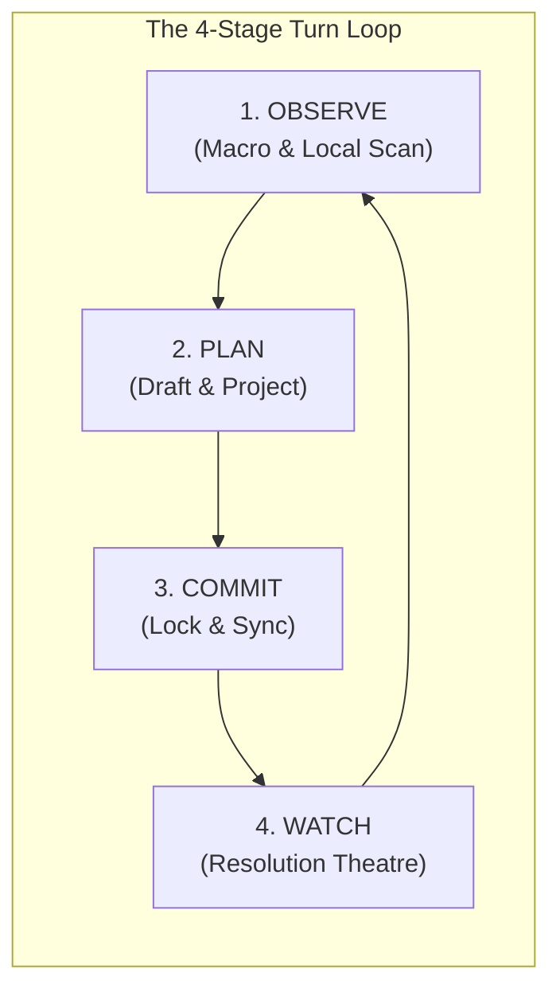
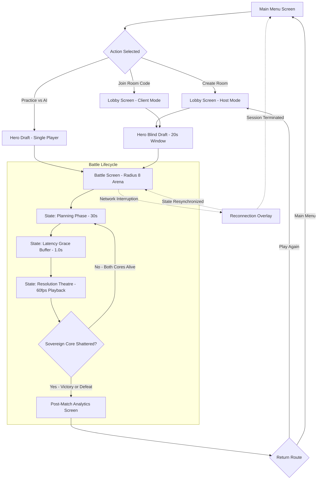
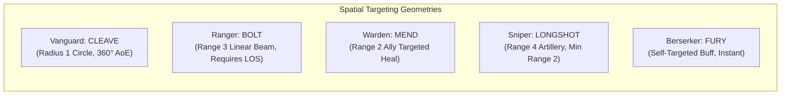
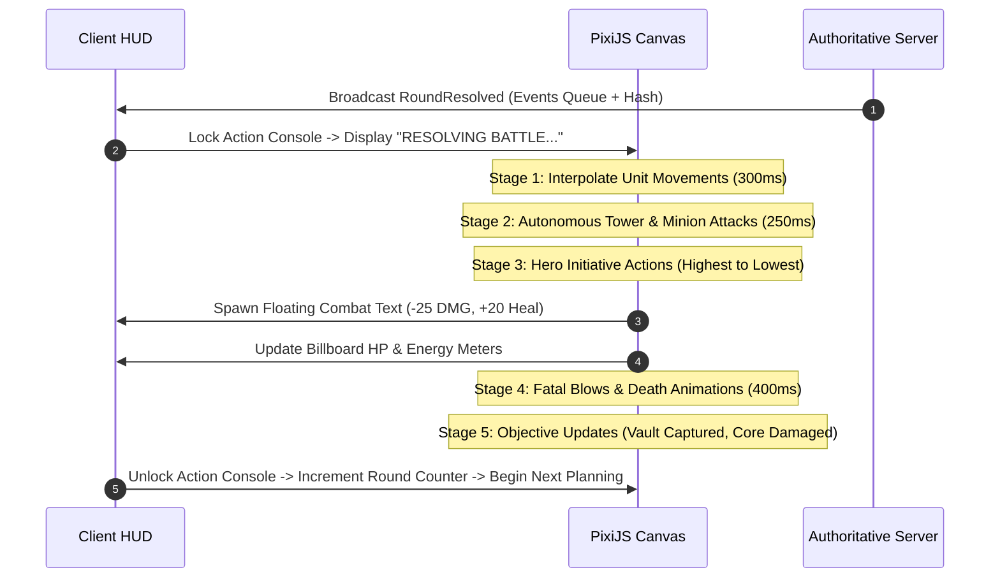
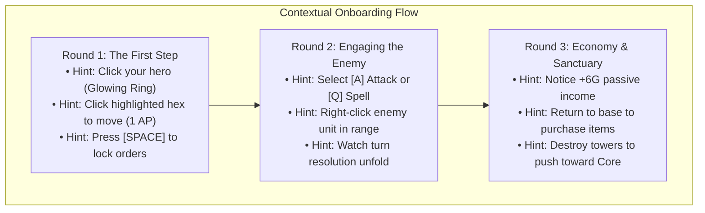

# HEXABELLUM

## UI/UX Blueprint — Master Interface Specification, Interaction Design & State Architecture

---

## Document Version
`UX v2.0 — Fully Aligned with GDD v2.0, Architecture v2.0, Phase 7 MOBA Macro Specification, and DevOps v1.0`

---

## 1. UX Philosophy & Core Design Principles

### 1.1 The Master Axiom
> **"The board is the interface. Everything else supports it."**

Hexabellum is a turn-based tactical MOBA played on contested hexagonal arenas. The player's focal point must remain anchored on the physical hex grid at all times. All HUD elements, character sheets, drawer modals, and notifications exist strictly to:
1. **Read** the operational battlefield state without cognitive friction or ambiguity.
2. **Predict** enemy trajectories and teammate intentions across simultaneous fog-of-war turns.
3. **Draft & Modify** orders fluidly within the 30-second secret planning window.
4. **Inspect** complex macro dependencies (Core health, Tower integrity, Vault contests, Minion paths).
5. **Understand** deterministic resolution outcomes clearly through transparent event playback.

### 1.2 The Five Pillars of Hexabellum Interaction Design

| Pillar | Operational Definition | Tangible Design Manifestation |
|---|---|---|
| **1. Information Transparency without Sensory Overload** | Critical tactical data is visible at a glance without requiring multi-layer menu navigation. | Hex ranges, line of sight, and AP costs are rendered directly as grid overlays; hero stats and item icons are summarized in fixed, unclipped dock panels. |
| **2. Zero Mechanical Stress (No Twitch Reflexes)** | Execution skill in Hexabellum is 100% cognitive, 0% physical dexterity. | Turn duration is a generous 30 seconds; actions require zero reflex timing or pixel-perfect dragging; all commands are executed via deliberate clicks or keyboard hotkeys. |
| **3. Fluid Drafting & Frictionless Revision** | Player orders are tentative drafts until confirmed or until the turn timer reaches expiration. | Every movement, attack, spell, or item purchase can be modified, re-routed, or cleared at zero cost during the planning window; full visual ghost projections preview future turns. |
| **4. High-Clarity Resolution Theatre** | The resolution phase must clearly communicate the cause-and-effect chain of deterministic interactions. | Discrete 8-stage playback sequentializes initiative, combat damage numbers, status ticks, and structure destruction at 60fps with available 2x and skip options. |
| **5. Universal Readability & Dual-Coded Accessibility** | Critical tactical states must never rely solely on color or transient animations. | Team identities are dual-coded by color (Azure Blue vs Crimson Red) and geometric silhouette (Azure Hexagons vs Crimson Diamonds); WCAG 2.1 AA contrast standards are strictly enforced. |

---

## 2. Player Mental Model & The 4-Mode Cognitive Loop

During each round of Hexabellum, players cycle through a continuous four-stage cognitive loop. The user interface dynamically shifts emphasis, interaction affordances, and visual hierarchy to match each mode:



### 2.1 UI Priorities per Mental Mode

| Mode | Cognitive Objective | Dominant Visual Focus | Primary UI Controls & Overlays |
|---|---|---|---|
| **1. OBSERVE** | *"Where are my allies? Where are the enemies? What objectives are threatened?"* | Hex battlefield, Fog of War contours, Minimap, Macro Objective bar. | Free camera pan/zoom (`Mouse Drag`, `Wheel`), Vision range rings, Minimap click-pan, Unit hover tooltips. |
| **2. PLAN** | *"Can I reach the Tower? Can Sniper fire at the Vault? Should I purchase an item?"* | Controlled hero, AP cost pips, movement highlights, attack targeting cones. | Hex movement click, Action bar hotkeys (`[M]`, `[A]`, `[Q]`, `[R]`, `[B]`), Ghost destination preview, Damage calculator preview. |
| **3. COMMIT** | *"Are my orders optimal? Is my team synchronized?"* | Turn countdown timer, Order queue summary, Team ready badges. | `[SPACE]` / `[ENTER]` Submit Orders button, Order queue inspector, Undo button `[Z]`, Team roster order status dots. |
| **4. WATCH** | *"Who acted first? Did our burst kill the Berserker? Did our Core take damage?"* | Center canvas combat animations, floating combat text, combat log ticker. | Playback speed toggle (`1x` / `2x`), `[SKIP]` to end-state button, Floating damage/heal numbers, Kill feed banners. |

---

## 3. Screen Flow Architecture & Lifecycle Finite State Machine (FSM)

The client application operates as a deterministic, reactive state machine synchronized with the authoritative `hexabellum-server` WebSocket stream:



---

## 4. Screen-by-Screen Blueprint & Interaction Wireframes

---

### 4.1 Main Menu & Match Entry

**Purpose:** Rapid, frictionless gateway to competitive or practice matches with zero nested sub-menus.

```
┌─────────────────────────────────────────────────────────────────────────────┐
│                                                                             │
│                               H E X A B E L L U M                           │
│                      "Six sides of war. One victor."                         │
│                                                                             │
│                        ┌───────────────────────────┐                        │
│                        │       CREATE MATCH        │                        │
│                        └───────────────────────────┘                        │
│                        ┌───────────────────────────┐                        │
│                        │        JOIN MATCH         │                        │
│                        │   [ Enter Room Code... ]  │                        │
│                        └───────────────────────────┘                        │
│                        ┌───────────────────────────┐                        │
│                        │      PRACTICE VS AI       │                        │
│                        └───────────────────────────┘                        │
│                                                                             │
│   [⚙ Settings]         [📖 Codex & How to Play]         [🏆 Leaderboards]    │
│                                                               v2.0.0-WASM   │
└─────────────────────────────────────────────────────────────────────────────┘
```

#### Detailed Interactions & Behavior
- **CREATE MATCH**: Generates a cryptographically random 6-character room token (e.g., `HEX-7X2K`) via server API, navigates directly to Match Lobby as room host.
- **JOIN MATCH**: Focuses an inline 6-character input field formatted with automatic uppercase masking (`[A-Z0-9]{3}-[A-Z0-9]{3}`); pressing `[ENTER]` triggers room validation.
- **PRACTICE VS AI**: Spawns an instant local WebAssembly single-player match with 9 client-side heuristic bot avatars.
- **Codex & How to Play**: Slides out a non-blocking modal overlay explaining grid coordinates, initiative rules, the 5 hero classes, and win conditions.
- **Settings**: Drawer for Master/SFX/Music audio sliders, Display resolution scaling, and Colorblind accessibility filters.

---

### 4.2 Match Lobby & Host Configuration

**Purpose:** Gathering hub for up to 10 human players across Team Azure and Team Crimson, managing bot backfill, and launching matches.

```
┌─────────────────────────────────────────────────────────────────────────────┐
│ ROOM CODE: HEX-7X2K            [📋 Copy Invite Link]             [🚪 Leave] │
├─────────────────────────────────────────────────────────────────────────────┤
│                                                                             │
│   TEAM AZURE (Team 0)                          TEAM CRIMSON (Team 1)        │
│   ┌───────────────────────────────┐            ┌──────────────────────────┐ │
│   │ [1] Player1 (Host)        👑  │            │ [6] Player6           ✓  │ │
│   │ [2] Player2               ✓   │            │ [7] Player7           ✓  │ │
│   │ [3] Player3               ●   │            │ [8] Player8           ●  │ │
│   │ [4] [Bot Backfill: Tank]  🤖  │            │ [9] [Bot Backfill]    🤖 │ │
│   │ [5] [Bot Backfill: Scout] 🤖  │            │ [10] [Bot Backfill]   🤖 │ │
│   └───────────────────────────────┘            └──────────────────────────┘ │
│                                                                             │
│   Status: 5 Players Connected, 5 AI Fill Slots Allocated                    │
│   Match Settings:                                                           │
│   • Map: The Fractured Meridian (Radius 8, 217 Hexes)                       │
│   • Mode: Standard 5v5 MOBA Macro (Cores: 700 HP, Towers: 100 HP)          │
│   • Planning Window: 30 Seconds • Latency Buffer: 1.0s • Respawns: 3 Rounds │
│                                                                             │
│                     ┌───────────────────────────────────┐                   │
│                     │       START MATCH COUNTDOWN       │                   │
│                     │    (Host Only - Enabled ≥ 1v1)    │                   │
│                     └───────────────────────────────────┘                   │
│                                                                             │
└─────────────────────────────────────────────────────────────────────────────┘
```

#### Detailed Interactions & Behavior
- **Real-Time WebSocket Sync**: Slot occupants update instantaneously when players connect, disconnect, or swap teams.
- **Bot Backfill Toggles**: Host can manually toggle empty slots between "Open for Humans" and "AI Bot Fill". When the host clicks "Start Match", any open unassigned slots automatically convert to heuristic AI bots.
- **Copy Invite Link**: Copies direct URL `https://hexabellum.gg/join/HEX-7X2K` to system clipboard with a green confirmation toast.

---

### 4.3 Hero Selection & 20-Second Blind Draft

**Purpose:** High-intensity strategic phase where each player locks their hero archetype. Unique locks within the same team; mirror picks across opposing teams are permitted.

```
┌─────────────────────────────────────────────────────────────────────────────┐
│ HERO SELECTION                                         ⏱ DRAFT TIMER: 0:14 │
├─────────────────────────────────────────────────────────────────────────────┤
│                                                                             │
│ YOUR TEAM ROSTER (AZURE):                                                   │
│ ┌───────────────┐ ┌───────────────┐ ┌───────────────┐ ┌───────────┐ ┌─────┐ │
│ │ Player 1      │ │ Player 2      │ │ YOU           │ │ Player 4  │ │ P5  │ │
│ │ VANGUARD [✓]  │ │ RANGER   [✓]  │ │ HOVERING...   │ │ [Waiting] │ │ [W] │ │
│ └───────────────┘ └───────────────┘ └───────────────┘ └───────────┘ └─────┘ │
│                                                                             │
│ SELECT YOUR HERO (Unique per team):                                         │
│ ┌──────────┐ ┌──────────┐ ┌──────────┐ ┌──────────┐ ┌──────────┐            │
│ │ VANGUARD │ │  RANGER  │ │  WARDEN  │ │  SNIPER  │ │BERSERKER│            │
│ │  [TAKEN] │ │  [TAKEN] │ │          │ │          │ │          │            │
│ │    🛡    │ │    🏹    │ │    ✚     │ │    🎯    │ │    ⚔     │            │
│ │   Tank   │ │  Scout   │ │ Support  │ │Artillery │ │ Bruiser  │            │
│ │  HP: 140 │ │  HP: 90  │ │ HP: 100  │ │  HP: 80  │ │ HP: 120  │            │
│ │  AP: 3   │ │  AP: 3   │ │ AP: 3    │ │  AP: 3   │ │ AP: 3    │            │
│ │  DMG: 18 │ │  DMG: 16 │ │ DMG: 12  │ │  DMG: 14 │ │ DMG: 20  │            │
│ │  INIT: 3 │ │  INIT: 4 │ │ INIT: 2  │ │  INIT: 4 │ │ INIT: 3  │            │
│ │  Cleave  │ │   Bolt   │ │   Mend   │ │ Longshot │ │   Fury   │            │
│ └──────────┘ └──────────┘ └──────────┘ └──────────┘ └──────────┘            │
│                                                                             │
│ SELECTED: [ WARDEN — The Mending Light ]                                    │
│ Signature Ability: MEND (1 AP, 2 Energy, 2 CD) — Restores 20 HP to ally.    │
│ Passive Synergies: Focus Charm (+1 Energy Regen), Vanguard Pocket Pair.     │
│                                                                             │
│                      ┌────────────────────────────┐                         │
│                      │    LOCK IN HERO CHOICE     │                         │
│                      └────────────────────────────┘                         │
│                                                                             │
└─────────────────────────────────────────────────────────────────────────────┘
```

#### Hero Draft Rules & Constraints
- **Team-Unique Pool**: When an ally locks a hero, that card immediately displays a greyed-out `[TAKEN BY ALLY]` banner and becomes unclickable.
- **Hover Broadcasting**: Clicking a hero card previews it for teammates in real time (`HOVERING...`), allowing tactical coordination before committing.
- **Auto-Lock Timeout**: If a player fails to click "Lock In" before the 20-second timer hits 0:00, the server deterministically assigns the lowest-index available hero remaining for their team.

---

### 4.4 Battle Screen — Master Interface Architecture

The Battle Screen is the primary operating canvas of Hexabellum. It uses a three-tier spatial layout with crisp separation between rendering canvas and HUD overlays:

```
┌─────────────────────────────────────────────────────────────────────────────┐
│ 1. TOP BAR: Match Time, Round #, Turn Timer, Core/Structure Status, Settings │
├─────────────────────────────────────────────────────────────────────────────┤
│                                                                             │
│                                                                             │
│                                                                             │
│                                                                             │
│                          2. HEX BATTLEFIELD                                 │
│                     (Authoritative WebGL / PixiJS Canvas)                   │
│                                                                             │
│                       • Pointy-topped grid (R = 8)                          │
│                       • Three-tier Fog of War                               │
│                       • Pan: Mouse Drag / WASD                              │
│                       • Zoom: Scroll Wheel / Pinch                          │
│                       • Center Hero: [C] Key                                │
│                                                                             │
│                                                     ┌─────────────────────┐ │
│                                                     │ 3. TACTICAL MINIMAP │ │
│                                                     │ & PING SYSTEM       │ │
│                                                     │ [Radar Overview]    │ │
│                                                     └─────────────────────┘ │
├─────────────────────────────────────────────────────────────────────────────┤
│ 4. BOTTOM DOCK:                                                             │
│ ┌───────────────────┬───────────────────────────┬─────────────────────────┐ │
│ │ 4.1 TEAM ROSTER   │ 4.2 SELECTED ENTITY SHEET │ 4.3 ORDER ACTION BAR    │ │
│ │ (Allied Status,   │ (Stats, Items, Buffs,     │ (AP Budget, Moves,      │ │
│ │  HP/EN, Respawns) │  XP Level Progress)       │  Abilities, Shop, Ready)│ │
│ └───────────────────┴───────────────────────────┴─────────────────────────┘ │
└─────────────────────────────────────────────────────────────────────────────┘
```

---

### 4.5 Top Bar, Planning Countdown & Macro Objective Tracker

**Purpose:** Provides immediate macro awareness of both teams' Sovereign Cores, Tower defenses, turn timer, and sanctuary status.

```
┌─────────────────────────────────────────────────────────────────────────────┐
│ AZURE CORE [██████████] 700/700  │ ⏱ 0:21 │ ROUND 8 │ CRIMSON CORE 620/700 [████████░░] │
│ 🛡 Towers: 2/2  ⚔ Spawners: 2/2  │ PLAN  │ GRACE: 1s│ 🛡 Towers: 1/2  ⚔ Spawners: 2/2  │
│ [★ VAULT: CONTESTED (180/250 HP)]│ PHASE │ PING: 24ms│ [SANCTUARY: +15 HP | SHOP OPEN] │
└─────────────────────────────────────────────────────────────────────────────┘
```

#### Detailed Top Bar Components
1. **Sovereign Core Health Bars**: High-contrast proportional meters flanked by raw numerical HP (`700/700`). Flashes red when taking damage during resolution.
2. **Defensive Structure Tally**: Real-time counter of remaining Towers (`2/2`) and Minion Spawners (`2/2`) per faction.
3. **Turn Countdown Clock**:
   - `0:30 – 0:11`: Cool Cyan text with subtle circular progress ring.
   - `0:10 – 0:06`: Warning Amber text; soft audio tic each second.
   - `0:05 – 0:00`: Urgent Crimson text with pulsing animation; heartbeat audio stinger.
4. **Phase Status Pill**: Displays current server phase (`PLANNING PHASE`, `NETWORK GRACE`, `RESOLVING BATTLE`, or `MATCH OVER`).
5. **The Ancient Vault Tracker**: Central objective badge showing real-time health, contested state, or active team buff duration (`★ AZURE BUFF: +5 AD (3 RNDS)`).
6. **Sanctuary Indicator**: Illuminates in emerald green with a shopping cart icon whenever the player's controlled hero is located within their 19-hex allied Base Zone.

---

### 4.6 Hex Battlefield Canvas & WebGL Rendering Hierarchy

The battlefield represents the radius $R=8$ (217 hexes) arena called **The Fractured Meridian**. To guarantee crisp performance at 60fps, PixiJS structures the canvas into an 11-layer z-index container hierarchy:

```
[Layer 11] UI Reticles & Combat Floating Text (Damage, Heals, Criticals, Misses)
[Layer 10] VFX & Particles (Photon laser beams, Cleave arcs, Runic heals, Sparks)
[Layer  9] Entity Overlays (Billboard health bars, energy pips, selection rings)
[Layer  8] Dynamic Entities (Heroes, Minions, Towers, Spawners, Vault, Guardians)
[Layer  7] Ghost Projections & Order Splines (Planned paths, queued attack rays)
[Layer  6] Targeting & Range Highlights (Movement radius, attack cones, ability AoE)
[Layer  5] Fog of War Shroud (Three-tier: Visible, Explored/Shroud, Unexplored)
[Layer  4] Terrain Obstacles & Line-of-Sight Walls (Pillars, crystal ruins, rocks)
[Layer  3] Base Zone Sanctuaries (19-hex tinted perimeter around Azure/Crimson Cores)
[Layer  2] Base Hex Grid (Pointy-topped axial grid lines, axial coordinates on debug)
[Layer  1] Arena Void Canvas (Dark starry nebula backdrop, ambient parallax dust)
```

#### Camera Navigation & Viewport Math

| Interaction | Input Binding | Operational Behavior |
|---|---|---|
| **Pan Camera** | `Mouse Left-Drag on Board` / `Middle-Drag` / `W, A, S, D` / `Arrow Keys` | Moves camera center; clamped to arena bounds radius $R = 9$. |
| **Zoom Viewport** | `Mouse Scroll Wheel` / `Pinch Gesture` / `[+]` and `[-]` Keys | Smooth logarithmic zoom between 0.5x (whole map) and 2.5x (hero close-up). |
| **Center on Controlled Hero** | `[C]` Key / Double Click Own Hero on Roster | Instantly animates camera center to player's controlled avatar. |
| **Center on Last Event** | `[SPACE]` Key (during Resolution) | Snaps camera to the active entity executing an attack or ability. |
| **Edge Panning** | Mouse within 20px of screen boundary (Configurable) | Panning speed scales proportionally to cursor edge proximity. |

---

### 4.7 Bottom Control Dock Architecture

The bottom control dock houses all operational controls required to inspect entities, draft sequential orders, and manage economy.

```
┌─────────────────────────────────────────────────────────────────────────────────────────────┐
│ 4.7.1 TEAM ROSTER       │ 4.7.2 ACTIVE ENTITY INSPECTOR      │ 4.7.3 ACTION & ORDER CONSOLE │
│                         │                                    │                              │
│ AZURE FORCES (5v5)      │ RANGER (You)          Level 3      │ AP BUDGET:  ●  ●  ○ (2/3 AP) │
│                         │ HP  ████████░░░░  72 / 90          │ ┌──────────────────────────┐ │
│ ● Vanguard       Lv.3   │ EN  ●●●●○         4 / 5 (+1/rnd)   │ │ 1. Move to (2, -1)  1 AP │ │
│   HP █████░ 120/140 [✓] │ DMG: 16 (Rng 2)   VIS: 4  INIT: 4  │ │ 2. Bolt on Sniper   1 AP │ │
│                         │ Items: [Longblade] [Scout Lens] [ ]│ └──────────────────────────┘ │
│ ● Ranger (You)   Lv.3   │ Status: +5 AD Vault Buff (3 rnds)  │ [M] MOVE   [A] ATTACK (1 AP) │
│   HP ████░░  72/90  […] │ Gold: 145G         XP: 85/120      │ [Q] BOLT   [R] REPAIR (1 AP) │
│                         ├────────────────────────────────────┤ [W] WAIT   [B] SHOP (Base)   │
│ ☠ Warden (Dead)  Lv.2   │ TARGET: Enemy Sniper (Crimson)     │ ┌──────────────────────────┐ │
│   Respawn in: 2 rnds    │ HP ██████░░░░ 50/80  Range: 3 hex  │ │   [✓] SUBMIT ORDERS (2AP)│ │
│                         │ Predicted Outcome: -25 DMG (Death) │ └──────────────────────────┘ │
└─────────────────────────┴────────────────────────────────────┴──────────────────────────────┘
```

---

#### 4.7.1 Left Section: 5v5 Team Roster & Ally Inspector

Displays high-density vital telemetry for all 5 allied heroes:
- **Hero Identity & Role Silhouette**: Class icon (Shield, Bow, Cross, Crosshair, Axes) and player nickname.
- **Health Bar**: Proportional color-coded meter (Green $>50\%$, Yellow $25-50\%$, Red $<25\%$).
- **Energy Meter**: Pip indicators representing current spell energy vs maximum pool.
- **Level & Item Badges**: Displays current hero level (`Lv.1` through `Lv.5`) and up to 3 micro-badges representing held items.
- **Secret Draft Status Badge**:
  - `[…] Planning`: Ally is actively editing move paths or ability targets.
  - `[✓] Locked`: Ally has confirmed orders and is awaiting round resolution.
  - `[🤖] AI Fallback`: Player is disconnected; server-side heuristic bot is controlling unit.
  - `[☠] Dead`: Hero is eliminated; displays round countdown until sanctuary respawn (`(2 rnds)`).

---

#### 4.7.2 Center Section: Hero Character Sheet & Entity Inspector

**When Controlled Hero is Selected:**
- Displays exact numerical combat attributes:
  - **HP (Current / Max)**: Accompanied by base regen indicators (`+15 HP/rnd in Base`).
  - **Energy (Current / Max)**: Current reserve and passive regeneration rate (`+1` base, `+2` with Focus Charm).
  - **Attack Damage & Range**: Displays base damage plus item/buff modifiers (`16 + 6 [Longblade] + 5 [Vault] = 27 DMG`).
  - **Vision Radius**: Sight range in hexes (e.g., `4 hexes`, or `5 hexes` with Scout Lens).
  - **Initiative**: Deterministic sequence rank (`4 = Fast`, `3 = Average`, `2 = Slow`).
  - **Progression Bar**: Current XP progress toward next level milestone (`85 / 120 XP [Lv. 3]`).
  - **Wallet**: Accumulated match currency (`145 Gold`).
  - **Status Buff Tray**: Micro-badges detailing active buffs with remaining durations.

**When Inspecting Other Entities (Allies, Enemies, Structures, Neutral Vault):**
- Dynamic inspection card slides into view:
  - **Visible Enemies**: Displays real-time HP, Level, equipped items, and visible threat assessment.
  - **Towers & Spawners**: Shows structure health (`100/100`), repairability state (`Repairable for 1 AP`), and threat range.
  - **The Ancient Vault**: Shows neutral objective HP (`180/250`), current lock status, and last-hit reward summary.
  - **Guardian Sentinels**: Shows camp health (`60/60`), 2-hex leash circle, and kill bounty.

---

#### 4.7.3 Right Section: Action Console, 3 AP Economy & Order Drafter

Every hero receives exactly **3 Action Points (AP)** at round start. The Action Console manages sequential drafting:

```
AP BUDGET METER:  [●] [●] [○]  (2 AP Committed, 1 AP Free)
```

| Action | Hotkey | AP Cost | Requirements | Operational Behavior |
|---|---|---|---|---|
| **MOVE** | `[M]` / `Left-Click Hex` | 1 AP / Hex | Path $\le$ remaining AP; destination unblocked | Draws animated dashed spline to target; previews ghost hero at destination. |
| **ATTACK** | `[A]` / `Right-Click Unit` | 1 AP | Target within hero range; Line of Sight confirmed | Highlights valid target in red reticle; previews estimated damage number. |
| **SIGNATURE ABILITY** | `[Q]` Key | 1 AP | Energy $\ge$ cost; Cooldown $= 0$; valid target in range | Activates ability targeting overlay (AoE cone, ranged beam, self-buff, or ally heal). |
| **REPAIR** | `[R]` Key | 1 AP | Adjacent to allied Tower or Spawner (Range 1) | Restores $+25\text{ HP}$ to damaged allied structure (clamped to max HP). |
| **WAIT / PASS** | `[W]` Key | 0 AP | Always available | Preserves hero position without spending AP; holds position. |
| **BASE SHOP** | `[B]` Key | 0 AP | Hero located inside allied Base Zone (19 hexes) | Opens the Base Shop modal drawer to purchase passive items. |
| **SUBMIT ORDERS** | `[SPACE]` / `[ENTER]` | — | Valid order sequence drafted | Confirms drafted orders with server; turns button green. Can be unlocked until timer ends. |

---

### 4.8 Planning Phase Interaction Flow & Ghost Projection

Simultaneous turn-based tactics require players to anticipate future board states. Hexabellum implements **Ghost Destination Projection**:

```
Step 1: SELECT HERO
  └─ Click own hero on board or roster panel.
  └─ Range ring illuminates showing maximum 3-hex movement radius (1 AP per hex).

Step 2: DRAFT MOVEMENT (1–3 AP)
  └─ Hovering over reachable hexes displays exact AP cost badge (e.g., "[2 AP]").
  └─ Clicking a hex anchors a semi-transparent "Ghost Hero" at that destination tile.
  └─ A bright directional dashed spline links the starting tile to the ghost.

Step 3: DRAFT SUBSEQUENT COMBAT ACTION (From Ghost Perspective)
  └─ With the ghost anchored at `(2, -1)`, the player clicks `[Q] (Bolt)` or `[A] (Attack)`.
  └─ The targeting range ring originates from the GHOST'S destination tile, NOT the origin!
  └─ Player selects enemy target in range of the planned destination.
  └─ The UI verifies: `Move (2 AP) + Bolt (1 AP) = 3 AP total`. Valid sequence!

Step 4: REVISION OR CLEARING
  └─ Pressing `[Z]` or clicking "Undo" removes the last drafted action.
  └─ Clicking a different hex recalculates pathing and updates ghost position instantly.
  └─ Dragging the ghost back to origin cancels movement.
```

---

### 4.9 Movement & Pathfinding UX

```
Hex Visual States during Movement Drafting:
• Green Outline Hexes: Reachable within remaining AP (1–3 hexes).
• Numerals on Hexes: AP cost required to step onto that tile (`1`, `2`, `3`).
• Red Striped Hexes: Blocked tiles (occupied by other units, impassable crystal pillars).
• Pulsing Blue Ghost: Projected destination tile.
• White Dashed Spline: Optimal path calculated by client A* pathfinder.
```

#### Hover & Click Feedback Rules
- **Hovering Walkable Hex**: Animates dashed marching ants along path; displays floating cost tooltip: `Move: 2 AP (1 AP Remaining)`.
- **Hovering Blocked Hex**: Cursor changes to slashed circle; tooltip displays reason: `Tile Occupied by Vanguard` or `Impassable Obstacle`.
- **Exceeding AP Limit**: Clicking a hex 4 or more tiles away displays a gentle red pulse and audio error buzz with toast: `Cannot reach: Maximum 3 AP per round`.

---

### 4.10 Combat, Ability Targeting & Range Constraints

Each of the 5 canonical hero archetypes features distinct spatial targeting rules:



#### 4.10.1 Vanguard: CLEAVE (1 AP, 3 Energy, 3 CD)
- **Targeting Visual**: Radius 1 circular amber zone around Vanguard's planned position (all 6 adjacent hexes).
- **Target Validation**: All adjacent enemy units and structures highlight with a red skull reticle.
- **Feedback**: Displays estimated total damage across all targets (`15 DMG x 3 Targets = 45 Total Damage`).

#### 4.10.2 Ranger: BOLT (1 AP, 2 Energy, 2 CD)
- **Targeting Visual**: Range 3 cyan targeting circle around Ranger.
- **LOS Verification**: Raycast from Ranger to target hex. If obstructed by an obstacle or fog, ray breaks with a red cross: `Obstruction: Pillar at (0, 1) blocks Line of Sight`.
- **Target Validation**: Single valid enemy unit or structure highlights with a locked photon beam.

#### 4.10.3 Warden: MEND (1 AP, 2 Energy, 2 CD)
- **Targeting Visual**: Range 2 emerald green targeting circle.
- **Target Validation**: Damaged allied heroes within range highlight with green cross reticles.
- **Feedback**: Tooltip confirms heal amount: `Mend: Restores +20 HP (Capped at Max HP)`. Cannot target full-health allies or enemies.

#### 4.10.4 Sniper: LONGSHOT (1 AP, 3 Energy, 3 CD)
- **Targeting Visual**: Donut-shaped targeting reticle: Maximum Range 4, **Minimum Range 2**.
- **Minimum Range Constraint**: The 6 immediately adjacent tiles (Range 1) are hatched in diagonal red hazard stripes.
- **Hover Feedback on Adjacent Hex**: Tooltip explains restriction: `Blind Spot: Longshot requires minimum range of 2 hexes`.

#### 4.10.5 Berserker: FURY (1 AP, 2 Energy, 3 CD)
- **Targeting Visual**: Self-centering fiery aura around Berserker's model.
- **Target Validation**: Requires no external target click. Clicking `[Q]` immediately queues the self-buff.
- **Feedback**: Character sheet highlights attack stat in flaming orange: `20 -> 28 DMG (+8 Fury for 2 rounds)`.

---

### 4.11 Base Zone Sanctuary & The 4-Item Base Shop

The allied Base Zone spans an axial radius of 2 hexes (19 hexes total) centered on the team's Sovereign Core.

```
┌─────────────────────────────────────────────────────────────────────────────┐
│ BASE SANCTUARY SHOP                     Gold: 145G     [X Close / Press B]  │
├─────────────────────────────────────────────────────────────────────────────┤
│ INVENTORY SLOTS: [ 🗡 Longblade ]  [ 🔍 Scout Lens ]  [ (Empty Slot) ]       │
├─────────────────────────────────────────────────────────────────────────────┤
│                                                                             │
│ ┌─────────────────────────────────────────────────────────────────────────┐ │
│ │ 🗡 LONGBLADE                           Cost: 100G          [ OWNED ]    │ │
│ │ Passive: +6 Attack Damage                                               │ │
│ │ Current Impact: Weapon Damage 16 ──▶ 22 DMG                             │ │
│ └─────────────────────────────────────────────────────────────────────────┘ │
│                                                                             │
│ ┌─────────────────────────────────────────────────────────────────────────┐ │
│ │ 🛡 PLATE ARMOR                         Cost: 120G          [ BUY NOW ]  │ │
│ │ Passive: +35 Max Health, +35 Instant Heal on Purchase                   │ │
│ │ Current Impact: Max HP 90 ──▶ 125 HP (Affordable: 145G available)       │ │
│ └─────────────────────────────────────────────────────────────────────────┘ │
│                                                                             │
│ ┌─────────────────────────────────────────────────────────────────────────┐ │
│ │ 🔍 SCOUT LENS                          Cost: 80G           [ OWNED ]    │ │
│ │ Passive: +1 Vision Radius                                               │ │
│ │ Current Impact: Vision 4 ──▶ 5 Hexes                                    │ │
│ └─────────────────────────────────────────────────────────────────────────┘ │
│                                                                             │
│ ┌─────────────────────────────────────────────────────────────────────────┐ │
│ │ 🧿 FOCUS CHARM                         Cost: 100G          [ BUY NOW ]  │ │
│ │ Passive: +1 Energy Regeneration per Round                               │ │
│ │ Current Impact: Energy Regen +1 ──▶ +2 Energy / Round                   │ │
│ └─────────────────────────────────────────────────────────────────────────┘ │
│                                                                             │
│ ⚠ SHOP ACCESS CONSTRAINT: Purchases are permitted exclusively while your   │
│   hero is physically positioned inside the allied Base Sanctuary Zone.    │
│   Items may be sold back for 100% refund during the same planning phase.  │
└─────────────────────────────────────────────────────────────────────────────┘
```

#### Shop Interaction Guardrails
- **Position Lock**: If the hero is outside the 19-hex Base Zone, pressing `[B]` or clicking the Shop button displays a lock icon with toast: `Base Shop Unavailable: Return to allied Base Sanctuary`.
- **Instant Refund During Planning**: Because planning is fluid and secret, clicking "Undo" or "Sell" on an item purchased during the *current* planning phase restores 100% of gold spent. Once orders lock, items are permanent.
- **Inventory Capping**: Exactly 3 item slots. Attempting to purchase a 4th item shows a disabled button: `Inventory Full (3/3)`.
- **Unique Item Constraint**: Duplicate items cannot be purchased; buttons display `[ ALREADY EQUIPPED ]`.

---

### 4.12 Macro Battlefield Objectives

The HUD provides dedicated visual treatment for all sovereign and neutral structures across the $R=8$ battlefield:

| Structure | Grid Location | HP & Defense | Visual Representation & HUD Indicators |
|---|---|---|---|
| **Sovereign Core** | Azure: `(-7, 0)`<br/>Crimson: `(7, 0)` | **700 HP**<br/>Non-Repairable | Massive glowing crystal spire. Generates True Sight (5 hexes). Core health is permanently anchored in the Top Bar. Below 30% HP, emits red emergency warning beams and sirens. |
| **Defensive Towers** | Azure: `(-4, ±1)`<br/>Crimson: `(4, ±1)` | **100 HP**<br/>Repairable (+25 HP / 1 AP) | Automated bastion turret. Highlights target with red tracking laser. Shows floating repair icon `[🔧]` when damaged and an allied hero is adjacent. |
| **Minion Spawners** | Azure: `(-6, ±1)`<br/>Crimson: `(6, ±1)` | **150 HP**<br/>Repairable (+25 HP / 1 AP) | Heavy runic portal. Shows floating wave countdown badge (`Wave in: 1 rnd`). Spawns 2 clockwork minions every 2 rounds until destroyed. |
| **The Ancient Vault** | Neutral Center: `(0, 0)` | **250 HP**<br/>Non-Repairable | Ancient hexagonal reliquary. Neutral health bar visible to all players. Contested last-hit triggers golden shockwave, team banner reveal, and $+5\text{ AD}$ combat buff aura. |
| **Guardian Sentinels** | Neutral Jungle: `(0, -4)` / `(0, 4)` | **60 HP**<br/>Leash: 2 Hexes | Golem construct sleeping in alcove. Approaching unit displays faint amber leash circle. Defeat grants $+40\text{G} / +25\text{XP}$ to the killer. |

---

### 4.13 Tactical Minimap, Radar & Ping Communications

Positioned in the bottom-right corner of the viewport, the Tactical Minimap maintains global battlefield awareness:

```
┌──────────────────────────────────────┐
│ TACTICAL MINIMAP            [ ⊙ C ]  │
│ ┌──────────────────────────────────┐ │
│ │            Crimson Base          │ │
│ │                [▲]               │ │
│ │             /       \            │ │
│ │        [T]             [T]       │ │
│ │          \    (★)    /           │ │
│ │           \  Vault  /   [Cam Box]│ │
│ │        [T]     │       [T]       │ │
│ │             \  │  /              │ │
│ │                [▼]               │ │
│ │            Azure Base            │ │
│ └──────────────────────────────────┘ │
│ PING: [⚠️ Danger] [🚩 Assist] [👁 Sight]│
└──────────────────────────────────────┘
```

#### Minimap Features & Behaviors
- **Camera Frustum Viewport**: A bright rectangular box indicates the current camera zoom and pan boundaries. Clicking or dragging anywhere on the minimap instantly centers the main camera.
- **Unit Blips**:
  - Allied Heroes: Solid blue dots with hero role initials (`V`, `R`, `W`, `S`, `B`).
  - Enemy Heroes: Solid red dots when within allied line of sight; hidden when shrouded in Fog of War.
  - Minions: Small white/red circular pips advancing along lane corridors.
  - Neutral Objectives: Gold star for Vault; grey diamonds for Guardian camps.
- **Quick Tactical Ping System**:
  - Holding `[ALT]` or `[G]` and dragging mouse triggers an 8-way radial ping wheel:
    1. **Danger / Fall Back** (Red exclamation mark)
    2. **On My Way** (Cyan arrow)
    3. **Assist / Attack Here** (Gold crossed swords)
    4. **Enemy Missing / Need Vision** (Yellow eye)
  - Pings project an audio chirp and 3-second animated beacon on both the minimap and battlefield canvas.

---

### 4.14 Resolution Phase & Playback Theatre (8-Stage Execution)

When the 30-second planning timer reaches 0, the client locks input, absorbs the 1.0-second network latency buffer, and transitions to the Authoritative Resolution Playback:



#### Playback Velocity & Skip Controls
- **Playback Speed Selector**: Players can toggle between `1.0x` (standard 3-second animation sequence) and `2.0x` speed via a floating widget above the action bar.
- **"Skip to End" Button**: Experienced players can press `[SPACE]` or click `[SKIP]` to bypass tween animations and instantly apply final unit positions, health values, and death states.

---

### 4.15 Hero Death, Spectator Mode & Respawn Lifecycle

When a hero's health reaches 0 during resolution:

```
┌─────────────────────────────────────────────────────────────────────────────┐
│ ☠ YOU HAVE FALLEN IN BATTLE                                                 │
│ Eliminated by: Crimson Sniper (Longshot)                                    │
│ Respawning at Allied Base Sanctuary in: 3 ROUNDS                            │
│                                                                             │
│ SPECTATOR HUD ACTIVE:                                                       │
│ • Press [TAB] or click Roster to spectate allied heroes.                    │
│ • Free camera pan and minimap radar remain fully functional.                │
│ • Press [B] to browse Base Shop items and formulate upcoming builds.        │
│ • Accumulated Gold (145G) and XP Level (Lv. 3) are 100% PRESERVED.          │
└─────────────────────────────────────────────────────────────────────────────┘
```

#### Respawn Transition Flow
1. **Death Trigger**: Hero sprite plays collapse/shatter animation (400ms); screen edges vignette in subtle monochromatic tone; combat log posts: `☠ Ranger eliminated by Sniper`.
2. **Spectator Mode**: Action console converts to spectator mode. Player can pan, zoom, inspect teammates, ping objectives, and pre-browse the Base Shop.
3. **Countdown Ticker**: Round start decrements respawn counter: `3` $\to$ `2` $\to$ `1` $\to$ `0`.
4. **Sanctuary Respawn**: Hero reconstitutes at an available tile in the allied Base Zone with **100% HP, full AP (3), full Energy, and all cooldowns reset**. The camera centers on the hero with an emerald welcoming glow.

---

### 4.16 Match Conclusion: Victory, Defeat & Post-Match Analytics

The match terminates deterministically the moment either team's 700 HP Sovereign Core reaches 0 HP.

```
┌─────────────────────────────────────────────────────────────────────────────┐
│                                                                             │
│                               V I C T O R Y                                 │
│                   The Crimson Core has been shattered!                      │
│                    Glory to the Azure Convergence!                          │
│                                                                             │
│  Match Duration: 18 Rounds (9m 24s)                Room Code: HEX-7X2K      │
├─────────────────────────────────────────────────────────────────────────────┤
│  POST-MATCH COMBAT TELEMETRY:                                               │
│                                                                             │
│  HERO (PLAYER)      K / D / A    DAMAGE    HEALING    GOLD    CS (MINIONS)  │
│  ─────────────────────────────────────────────────────────────────────────  │
│  Vanguard (P1)      2 / 1 / 8    1,240      —          580    14            │
│  Ranger (You)       4 / 1 / 4    1,680      —          640    18            │
│  Warden (P3)        0 / 2 / 9      320    1,450        490     4            │
│  Sniper (P4)        6 / 0 / 3    2,100      —          720    22            │
│  Berserker (P5)     3 / 3 / 2    1,420      —          550    11            │
│                                                                             │
│  OBJECTIVES SECURED:                                                        │
│  • Towers Destroyed: 2/2      • Ancient Vault Contests Won: 2               │
│  • Spawners Destroyed: 2/2    • BLAKE3 Replay Hash: `a9f4...7c2e`           │
│                                                                             │
│         ┌───────────────────────┐       ┌───────────────────────┐           │
│         │      PLAY AGAIN       │       │    MAIN MENU CODEX    │           │
│         └───────────────────────┘       └───────────────────────┘           │
│                                                                             │
└─────────────────────────────────────────────────────────────────────────────┘
```

#### Post-Match Analytics Features
- **Comprehensive Scoreboard**: Tracks Kills, Deaths, Assists, Total Hero Damage, Total Healing Done, Net Gold Earned, and Minion Creep Score (CS).
- **Match Replay Verification**: Displays BLAKE3 verification hash validating that client simulation exactly matched server authority.
- **Export Replay**: Button allowing players to download full JSON round log for community sharing or spectator playback.

---

### 4.17 Disconnection, Reconnection & Latency Buffer UX

Network resilience is critical in turn-based competitive MOBAs:

```
┌─────────────────────────────────────────────────────────────────────────────┐
│ ⚠️ CONNECTION INTERRUPTED                                                   │
│ Attempting to restore WebSocket session with authoritative server...        │
│ Reconnect Attempt: [ 3 / 5 ]                     Countdown: 4s              │
│                                                                             │
│ Note: Your hero is temporarily protected by server-side AI fallback.       │
│ Accumulated Gold, Items, and Match State are safe.                          │
│                                                                             │
│               [ RETRY CONNECTION ]       [ QUIT TO MENU ]                   │
└─────────────────────────────────────────────────────────────────────────────┘
```

#### Reconnection State Hydration
1. **Authoritative State Ingestion**: Upon reconnecting, client receives compressed `GameStateSnapshot` matching current round.
2. **Fast-Forward Sync**: If reconnection occurs during a resolution phase, client immediately fast-forwards animations to display the latest active planning state.
3. **Seamless Control Return**: Control switches instantly from background AI fallback back to human player.

---

## 5. Feedback, Notification & Audio-Visual Systems

---

### 5.1 Toast Notification Matrix

Toasts are lightweight, non-blocking telemetry banners anchored at top-center (below Top Bar) that auto-dismiss after 3.0 seconds:

| Event Type | Visual Theme | Icon | Toast Message Template | Audio Stinger |
|---|---|---|---|---|
| **Round Start** | Cyan Glow | `⏱` | `"Round {N} — 30 Seconds to Plan Orders"` | Soft Gong |
| **Timer Urgency** | Crimson Pulse | `⚠️` | `"5 Seconds Remaining — Lock In Your Orders!"` | Heartbeat |
| **Orders Locked** | Green Accent | `✓` | `"Orders Submitted — Waiting for Resolution"` | Affirm Chime |
| **Hero Defeated** | Crimson Banner | `☠` | `"{Hero} was eliminated by {Killer}!"` | Death Horn |
| **Hero Respawned**| Emerald Banner | `⚡` | `"{Hero} has respawned at the Base Sanctuary"`| Resurrect Chime|
| **Tower Fallen** | Amber Accent | `⚔` | `"{Team} Tower has been destroyed! (+25G)"` | Stone Collapse |
| **Vault Captured** | Gold Crest | `★` | `"{Team} secured The Ancient Vault! (+5 AD)"`| Fanfare Sting |
| **Invalid Action** | Red Border | `🚫` | `"Cannot execute: {Specific reason}"` | Low Error Thud |
| **Shop Error** | Orange Accent | `🛒` | `"Shop Locked: Hero must be in Base Sanctuary"`| Key Clink |

---

### 5.2 Floating Combat Text (FCT)

Rendered directly above impacted units on Layer 11, drifting upward by 40 pixels while fading out over 1.0 second:

```
-25 DMG      (Standard Damage: Bold Crimson with black outline)
-45 CRIT!    (Burst / Lethal Strike: Scaled 1.5x with orange flare)
+20 HP       (Restorative Healing: Emerald Green with sparkle cross)
+10G         (Bounty Earned: Bright Gold with coin glyph)
+15 XP       (Experience Milestone: Indigo Violet with star glyph)
BLOCKED      (Terrain / Armor Absorption: Cool Slate Grey)
IMMUNE       (Sanctuary Protection: Shimmering Cyan)
```

---

### 5.3 Audio Direction & Sound Feedback Matrix

Every tactical interaction provides distinctive acoustic feedback:

| Action / Event | Sound Asset Archetype | Frequency & Envelope |
|---|---|---|
| **Hex Selection** | Clean crystalline click | High pitch, 40ms attack, zero decay |
| **Move Tile Assigned** | Heavy tactical leather thud | Low-mid frequency, 80ms duration |
| **Basic Attack Swing** | Sharp metallic cleave or bow twang | Crisp transient, 120ms |
| **Cleave Impact** | Heavy sweeping metal crash | Low resonance, wide stereo spread |
| **Bolt Beam Cast** | Focused laser ionization charge | Rising sweep followed by sharp crack |
| **Mend Healing** | Warm harmonic crystal chime | Soothing chord, 400ms gentle fade |
| **Longshot Railgun** | Distant supersonic thunderclap | Sharp crack followed by sub-bass rumble |
| **Fury Ignition** | Savage guttural flame roar | Deep resonant growl, 300ms |
| **Turn Timer Pulse** | Muffled heartbeat resonator | 60 BPM rhythm at $\le 5$ seconds |
| **Core Shatter** | Cataclysmic crystal implosion | Deep tectonic bass collapse, 1500ms |

---

## 6. Visual Design System & UI Design Tokens

---

### 6.1 Color Palette & Semantic Color Tokens

Hexabellum employs a sleek, sci-fi tactical palette designed for high contrast over dark void backgrounds:

```css
:root {
  /* Canvas & Background Surfaces */
  --surface-void:       #070A13; /* Primary canvas background */
  --surface-ground:     #0D1322; /* Hex grid base tile */
  --surface-panel:      #121A2D; /* HUD dock & character sheets */
  --surface-elevated:   #1A253F; /* Modals, cards, floating drawers */
  --border-subtle:      rgba(255, 255, 255, 0.08);
  --border-strong:      rgba(255, 255, 255, 0.18);

  /* Team Azure (Faction 0 - Order of the Dawn) */
  --azure-primary:      #2563EB; /* Core blue identity */
  --azure-bright:       #38BDF8; /* Active hover & selection glow */
  --azure-glow:         rgba(56, 189, 248, 0.25);
  --azure-contrast:     #EFF6FF;

  /* Team Crimson (Faction 1 - Sovereign Pyre) */
  --crimson-primary:    #DC2626; /* Core red identity */
  --crimson-bright:     #F87171; /* Active threat & attack reticle */
  --crimson-glow:       rgba(248, 113, 113, 0.25);
  --crimson-contrast:   #FEF2F2;

  /* Tactical & Vital Telemetry */
  --vital-health:       #10B981; /* Emerald Green (Health Bar) */
  --vital-energy:       #6366F1; /* Indigo Violet (Energy Pips) */
  --vital-ap:           #F59E0B; /* Amber Gold (Action Points) */
  --vital-gold:         #FBBF24; /* Sunburst Yellow (In-Match Currency) */
  --vital-xp:           #A855F7; /* Cosmic Purple (Progression) */

  /* Fog of War & Obstacles */
  --fog-deep:           #030509; /* 100% Unexplored blackness */
  --fog-shroud:         rgba(7, 10, 19, 0.65); /* Explored memory */
  --obstacle-barrier:   #2A364F; /* Impassable crystal pillar */
}
```

---

### 6.2 Typography Hierarchy & Numerical Display

```
Display & Titles:   'Cinzel' / 'Outfit', sans-serif (Geometric, authoritative)
UI Body & Labels:   'Inter', -apple-system, sans-serif (High legibility at 12–14px)
Telemetry & Math:   'JetBrains Mono', monospace (Fixed tabular figures for HP, AP, coordinates)
```

| Type Scale | Size / Line-Height | Weight | Applied UI Context |
|---|---|---|---|
| **Display Header** | 28px / 34px | Bold (700) | Victory / Defeat Banners, Hero Selection Titles |
| **Section Header** | 18px / 24px | Semi-Bold (600) | Character Sheet Names, Shop Item Titles |
| **Body Primary** | 14px / 20px | Regular (400) | Ability descriptions, Codex rules, Chat |
| **Telemetry Mono** | 13px / 16px | Medium (500) | HP meters (`72/90`), AP badges (`[2 AP]`), Timers |
| **Micro Caption** | 11px / 14px | Semi-Bold (600) | Hotkey badges (`[Q]`, `[M]`), Cooldown counters |

---

### 6.3 Glassmorphism, Elevation & Z-Index Architecture

All HUD overlays feature a modern glassmorphism aesthetic (`backdrop-filter: blur(12px)`) with subtle inset borders to blend seamlessly over the active WebGL canvas:

```
z-index: 1000  ── Disconnection & Reconnection Modal
z-index:  800  ── Fullscreen Post-Match Analytics & Victory Canvas
z-index:  600  ── Base Shop Drawer Modal & Codex Overlay
z-index:  400  ── Top Bar & Bottom Action Dock Panels
z-index:  200  ── Tactical Minimap & Floating Ping Markers
z-index:  100  ── Toast Notification System
z-index:    0  ── Authoritative PixiJS WebGL Canvas (Layers 1–11)
```

---

## 7. Accessibility, Responsive Layout & Controls

---

### 7.1 Colorblindness & Shape Dual-Coding

Never rely on color alone to differentiate team allegiance or entity status:

```
┌─────────────────────────────────────────────────────────────┐
│ FACTION DUAL-CODING:                                        │
│ • Team Azure:   Circular unit base ring + Hexagonal Icon    │
│ • Team Crimson: Diamond unit base ring + Triangular Icon    │
│                                                             │
│ TARGET RETICLE DUAL-CODING:                                 │
│ • Move Destination:   Solid White Circle + AP Dot Badge     │
│ • Attack Enemy Target: Spiked Crosshair + Red Pulsing Ring  │
│ • Heal Ally Target:   Emerald Cross + Rounded Corner Box    │
│ • Repair Structure:   Yellow Wrench + Hexagonal Frame       │
└─────────────────────────────────────────────────────────────┘
```

Colorblind modes (Deuteranopia, Protanopia, Tritanopia) accessible in Settings shift the primary faction palette to high-contrast **Cobalt Blue vs Vibrant Amber/Orange**.

---

### 7.2 Text Readability & Contrast
- All text labels adhere to **WCAG 2.1 AA** minimum contrast ratios ($> 4.5:1$ for normal text, $> 3:1$ for large headers).
- Floating damage numbers on the battlefield include a 2px dark outer stroke to preserve legibility against varied terrain textures.

---

### 7.3 Viewport Scaling & Mobile/Tablet Adaptation

Hexabellum targets desktop and tablet landscape viewports with adaptive docking:

| Viewport Profile | Resolution | Layout Behavior & Adaptation |
|---|---|---|
| **Ultra-Wide / 4K** | 2560x1440+ | Uncompressed 3-column bottom dock, full minimap, high-res canvas scaling. |
| **Standard Desktop** | 1920x1080 | Canonical baseline reference layout. |
| **Compact Laptop** | 1366x768 | Bottom dock scales to 90%; minimap collapses slightly; font sizes clamped. |
| **Tablet Landscape** | 1024x768 | Touch controls enabled; touch targets expanded to minimum 48x48px; radial action wheel replaces keyboard shortcuts. |
| **Mobile Portrait** | $< 1024\text{px}$ | Not supported for tactical play. Displays prompt: *"Please rotate device to landscape or play on desktop."* |

---

### 7.4 Master Keyboard Shortcut Reference

All critical commands can be executed via keyboard for lightning-fast competitive drafting:

```
┌─────────────────────────────────────────────────────────────┐
│ MASTER KEYBOARD SHORTCUTS                                   │
├─────────────────────────────────────────────────────────────┤
│ NAVIGATION:                                                 │
│   [W] [A] [S] [D] / Arrows ── Pan Camera Viewport           │
│   [C]                      ── Center Camera on Hero         │
│   [SPACE]                  ── Center on Active Event        │
│   [+] / [-]                ── Zoom Viewport In / Out        │
│                                                             │
│ COMBAT & ACTIONS:                                           │
│   [M]                      ── Toggle Movement Mode          │
│   [A]                      ── Toggle Basic Attack Mode      │
│   [Q]                      ── Activate Signature Ability    │
│   [R]                      ── Activate Repair Action        │
│   [W]                      ── Pass / Wait (0 AP)            │
│   [B]                      ── Open Base Shop (In Base)      │
│   [Z] / [Ctrl+Z]           ── Undo Last Drafted Order       │
│   [ENTER] / [SPACE]        ── Submit / Lock In Orders       │
│   [ESC]                    ── Cancel Targeting / Close Modal│
│                                                             │
│ INSPECTION & ROSTER:                                        │
│   [1] – [5]                ── Select Allied Hero 1 through 5│
│   [TAB]                    ── Cycle Allied Spectator Target │
│   [ALT] + Drag             ── Open Tactical Ping Wheel      │
└─────────────────────────────────────────────────────────────┘
```

---

## 8. Animation & Motion Design Guidelines

### 8.1 Motion Timings & Interpolation Easing

| Animation Sequence | Duration | Easing Curve | Operational Purpose |
|---|---|---|---|
| **Hero Hex Walk** | 350ms / hex | `cubic-bezier(0.25, 1, 0.5, 1)` | Smooth slide along A* path spline without snapping. |
| **Basic Attack Swing** | 200ms | `ease-in-out` | Lunge toward target followed by recoil to tile center. |
| **Bolt Laser Ray** | 250ms | `linear` | Instantaneous ionized beam with lingering glow decay. |
| **Cleave Whirlwind** | 300ms | `ease-out` | 360-degree radial particle sweep across all 6 neighbors. |
| **Floating Combat Text**| 1000ms | `ease-out` | Vertical drift with progressive alpha fade. |
| **Toast Slide In** | 200ms | `cubic-bezier(0.16, 1, 0.3, 1)` | Downward slide from top border with gentle settle. |
| **Turn Pulse Heartbeat**| 500ms loop | `ease-in-out` | Urgent throbbing red glow when turn timer $\le 5$s. |

### 8.2 The Non-Blocking Input Invariant
- **Animations never block user input during planning.** The player can queue, modify, or cancel orders instantly without waiting for UI transition tweens to complete.
- **Resolution Playback can be interrupted or skipped.** A persistent `[SKIP]` button allows players to bypass playback animations and jump directly to final resolved game states.

---

## 9. Error Prevention, Guardrails & Edge Cases

| User Error Scenario | Visual Warning & Feedback | System Prevention Guardrail |
|---|---|---|
| **Clicking Unreachable Hex** | Hex flashes red outline; displays floating text: `"Exceeds 3 AP limit"`. | Order is rejected; previous valid move path remains intact. |
| **Targeting Obstructed Enemy** | Line-of-sight ray turns dashed red with an obstruction icon at blocking tile. | Attack action cannot be confirmed; displays toast: `"Target obscured by obstacle"`. |
| **Casting Ability on Cooldown** | Ability button shakes horizontally; tooltip indicates: `"Cooldown: {N} rounds remaining"`. | Click is ignored; audio error buzz plays. |
| **Casting Ability with Insufficient Energy** | Button displays blue energy deficit warning: `"Needs {N} Energy (Have {M})"`. | Click is ignored; prevents invalid order submission. |
| **Attempting Shop Purchase Outside Base** | Shop button shows padlock; hovering displays: `"Must be inside allied Base Sanctuary"`. | Shop drawer cannot be opened while in contested lanes. |
| **Purchasing with Insufficient Gold** | Cost font turns red; button displays `"Need {N} More Gold"`. | Purchase transaction is blocked by client and server validator. |
| **Timer Expiration with Incomplete Orders** | Server locks state at 0:00; 1.0s grace period absorbs inflight packets. | Any hero lacking orders automatically executes `TimeoutFallbackAI`. |

---

## 10. First-Time User Experience (FTUE) & Contextual Onboarding

Rather than forcing new players through a lengthy, non-interactive tutorial video, Hexabellum provides an **In-Match Contextual Coaching Assistant**:



- **Dismissible Tips**: Every contextual tooltip includes a small `[×]` close button and an option: `"Don't show tactical hints again"`.
- **Codex Access**: The full game manual, character sheets, and item database are permanently accessible via the `[?]` help button in the Top Bar.

---

## 11. Performance Budgets & Technical Rendering Targets

To guarantee smooth operation on standard laptops and mobile hardware, the frontend client adheres to strict technical performance budgets:

| Metric | Budget Target | Optimization Mechanism |
|---|---|---|
| **Frame Rate** | Constant 60 FPS | PixiJS WebGL batch rendering; zero DOM thrashing during combat animations. |
| **Turn State Update Latency** | $< 50\text{ ms}$ | Efficient binary/JSON deserialization from server WebSocket stream. |
| **WASM Core Execution** | $< 5\text{ ms}$ | Heuristic bot calculations and local pathfinding compiled via `wasm-opt -O3`. |
| **Initial Bundle Size** | $< 2.5\text{ MB}$ | Lazy-loaded sound assets, tree-shaken PixiJS v8 modules, compressed WASM binary. |
| **Memory Footprint** | $< 180\text{ MB}$ | Texture pooling for particle VFX; static hex grid cached to offscreen render texture. |

---

## 12. UI Component Library Specification

The UI is constructed from reusable, modular CSS/TypeScript components:

```
web/src/ui/
├── components/
│   ├── Button/           # Primary, Secondary, Action, Danger, Disabled states
│   ├── Meter/            # HP Bar, Energy Pips, AP Budget Pips, XP Progress Bar
│   ├── Card/             # Hero Select Card, Shop Item Card, Roster Unit Card
│   ├── Modal/            # Base Shop Drawer, Settings Modal, Match Analytics
│   ├── Toast/            # Auto-dismissing telemetry notifications
│   ├── Tooltip/          # Hover stats comparison, ability range/cost breakdown
│   └── Minimap/          # Radar canvas, camera frustum box, ping markers
├── dock/
│   ├── TopBar.ts         # Macro Core HP, Timer, Phase Pill, Objectives
│   ├── TeamRoster.ts     # 5v5 Allied vital meters, item badges, draft status
│   ├── EntitySheet.ts    # Selected hero/structure stats, buffs, level-up milestones
│   └── ActionConsole.ts  # AP pip budget, sequential order queue, submit button
└── styles/
    ├── tokens.css        # Color palette, spacing, z-index, typography
    ├── glass.css         # Glassmorphism backdrop-filters and borders
    └── animations.css    # Keyframe transitions, pulse rings, floating combat text
```

---

## 13. UX Success Criteria & Verification Checklist

The user experience of Hexabellum is deemed successful when all verification criteria pass:

- [ ] **First-Round Competency**: A first-time player can draft movement and lock orders within 20 seconds without reading an external manual.
- [ ] **Turn Phase Clarity**: Players instantly identify the current phase (`Planning`, `Grace`, `Resolving`, `Victory`) within 100ms of visual inspection.
- [ ] **Zero Ambiguity in Costs**: The AP cost, Energy requirement, and Cooldown of every action are visible before clicking.
- [ ] **Ghost Projection Parity**: Ghost hero projections accurately originate ability targeting ranges from the planned destination tile.
- [ ] **Base Sanctuary Awareness**: Players immediately recognize whether they are eligible to purchase items based on Base Zone perimeter lighting.
- [ ] **Resolution Readability**: Spectating a round resolution clearly explains which entity dealt damage, which entity died first, and why.
- [ ] **Performance Stability**: The WebGL canvas maintains 60 FPS during simultaneous 5v5 ability animations and particle explosions.
- [ ] **Accessibility Compliance**: Colorblind players can effortlessly distinguish between Team Azure and Team Crimson units via distinct geometric silhouettes.
- [ ] **Input Parity**: 100% of game actions can be performed seamlessly via mouse-only or keyboard-only workflows.

---

## 14. Cross-Document Sitemap & Reference Index

To cross-reference UI/UX designs with system architecture, game design rules, and infrastructure blueprints, navigate the complete documentation suite:

### Core Architectural & System Blueprints
- **System Architecture & Technical Master Plan**: [`docs/overview.md`](file:///home/user/Code/garnizeh/hexabellum/docs/overview.md)
- **Game Design Document (Master Gameplay & Systems)**: [`docs/gdd.md`](file:///home/user/Code/garnizeh/hexabellum/docs/gdd.md)
- **UI/UX Blueprint (This Document)**: [`docs/ui-ux.md`](file:///home/user/Code/garnizeh/hexabellum/docs/ui-ux.md)
- **DevOps & Infrastructure Guide (Docker, Cloud & CI/CD)**: [`docs/devops.md`](file:///home/user/Code/garnizeh/hexabellum/docs/devops.md)

### Vertical Slice Phase Specifications
- **Phase 0 — Foundation / First Playable Browser Slice**: [`docs/phase-0.md`](file:///home/user/Code/garnizeh/hexabellum/docs/phase-0.md)
- **Phase 1 — Tactical Combat & AI Opponent**: [`docs/phase-1.md`](file:///home/user/Code/garnizeh/hexabellum/docs/phase-1.md)
- **Phase 2 — MOBA Autonomous Entities & Fog of War**: [`docs/phase-2.md`](file:///home/user/Code/garnizeh/hexabellum/docs/phase-2.md)
- **Phase 3 — Authoritative Rust Server & WebSocket Synchronization**: [`docs/phase-3.md`](file:///home/user/Code/garnizeh/hexabellum/docs/phase-3.md)
- **Phase 4 — Hero Abilities, Status Effects & Micro-Macro Tactics**: [`docs/phase-4.md`](file:///home/user/Code/garnizeh/hexabellum/docs/phase-4.md)
- **Phase 5 — 5v5 Scale & True Multi-Avatar Multiplayer**: [`docs/phase-5.md`](file:///home/user/Code/garnizeh/hexabellum/docs/phase-5.md)
- **Phase 6 — In-Match Progression & Item Economy**: [`docs/phase-6.md`](file:///home/user/Code/garnizeh/hexabellum/docs/phase-6.md)
- **Phase 7 — MOBA Macro Loop, Base Zones, Respawn & Core Destruction Victory**: [`docs/phase-7.md`](file:///home/user/Code/garnizeh/hexabellum/docs/phase-7.md)

---

## 15. Document Revision History

| Version | Date | Architectural & UX Upgrades Applied |
|---|---|---|
| `1.0` | Initial | Initial draft outlining high-level screen sketches and simple turn steps. |
| `2.0` | Current | Complete overhaul: Comprehensive interface specification synchronized with GDD v2.0, Architecture v2.0, and Phase 7 Macro Specification. Introduced 4-stage cognitive loop, 20-second blind draft, 11-layer WebGL rendering hierarchy, 3 AP action console, Ghost Destination Projection, Base Sanctuary Shop with item comparison tooltips, Tactical Minimap with radial ping wheel, 8-stage resolution sequence theatre, floating combat text system, complete design tokens, colorblind dual-coding, and master keyboard shortcut reference. |

---

*HEXABELLUM — Six sides of war. One victor.*