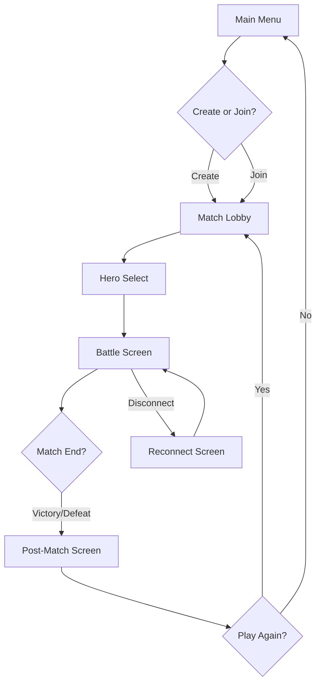

# HEXABELLUM

## UI/UX Blueprint — Interaction Design & Screen Architecture

---

## Document Version
`UX v1.0 — Aligned with Phase 7 Technical Spec`

---

## 1. UX Philosophy

### Core Principle
> **"The board is the interface. Everything else supports it."**

Hexabellum is a tactical game. The player's primary interaction is with the hex grid. All UI elements exist to:
1. Help the player **read** the board state
2. Help the player **decide** on orders
3. Help the player **submit** those orders
4. Help the player **understand** what happened

### UX Design Rules

| Rule | Explanation |
|------|-------------|
| No hidden information during planning | All stats, ranges, and costs visible without clicking |
| One primary action at a time | Player is never overwhelmed with simultaneous decisions |
| Undo is always possible | Orders can be changed until the round resolves |
| Feedback is immediate | Every click produces visible response within 100ms |
| Errors are educational | Invalid actions explain WHY they're invalid |
| Timer creates tension, not panic | Timer is always visible but never obstructs gameplay |

---

## 2. Player Mental Model

The player cycles through four distinct mental modes each round:

```
┌─────────────────────────────────────────────────────┐
│                                                     │
│   1. OBSERVE        →  "What's the board state?"    │
│   2. PLAN           →  "What should my hero do?"   │
│   3. COMMIT         →  "Lock in my orders."        │
│   4. WATCH          →  "What happened?"             │
│                                                     │
│   Then repeat.                                      │
│                                                     │
└─────────────────────────────────────────────────────┘
```

Each mode requires different UI emphasis:

| Mode | Primary Focus | UI Priority |
|------|--------------|-------------|
| Observe | Board, fog, enemy positions | Pan/zoom, hover tooltips, vision overlay |
| Plan | Movement range, targets, AP | Highlights, cost labels, ability buttons |
| Commit | Order summary, timer, submit button | Confirmation, countdown |
| Watch | Animation, events, damage | Event playback, damage numbers, log |

---

## 3. Screen Flow Architecture



---

## 4. Screen-by-Screen Blueprint

---

### 4.1 Main Menu Screen

**Purpose:** Entry point. Minimal. Get to game fast.

```
┌─────────────────────────────────────────────────────┐
│                                                     │
│              H E X A B E L L U M                    │
│           "Six sides of war. One victor."           │
│                                                     │
│                                                     │
│              ┌─────────────────────┐                │
│              │    CREATE MATCH     │                │
│              └─────────────────────┘                │
│              ┌─────────────────────┐                │
│              │     JOIN MATCH      │                │
│              └─────────────────────┘                │
│                                                     │
│                                                     │
│    Settings    │    How to Play    │    Credits     │
│                                                     │
└─────────────────────────────────────────────────────┘
```

**Interactions:**
- `CREATE MATCH` → Opens lobby as host
- `JOIN MATCH` → Prompts for match code or shows open matches
- `Settings` → Audio, display, accessibility
- `How to Play` → Tutorial overlay (first time only)

**Design Notes:**
- Dark background with subtle animated hex grid
- Title uses bold geometric font
- Buttons are large, high-contrast
- No clutter. Player should be in a match within 2 clicks.

---

### 4.2 Match Lobby Screen

**Purpose:** Players gather, teams fill, match config visible.

```
┌─────────────────────────────────────────────────────┐
│  MATCH: HEX-7X2K          [Copy Code]  [Leave]     │
├─────────────────────────────────────────────────────┤
│                                                     │
│  TEAM AZURE                TEAM CRIMSON             │
│  ┌──────────────┐         ┌──────────────┐         │
│  │ Player 1  ✓  │         │ Player 6  ✓  │         │
│  │ Player 2  ✓  │         │ Player 7  ✓  │         │
│  │ Player 3  ●  │         │ Player 8  ●  │         │
│  │ [AI]      ○  │         │ [AI]      ○  │         │
│  │ [AI]      ○  │         │ [AI]      ○  │         │
│  └──────────────┘         └──────────────┘         │
│                                                     │
│  ✓ = Connected   ● = In Lobby   ○ = AI Slot        │
│                                                     │
│  Match Config:                                      │
│  • 5v5  • 30s turns  • Fog: ON  • Respawn: 3       │
│                                                     │
│              [ START MATCH ]                        │
│              (Enabled when ≥1 per team)             │
│                                                     │
└─────────────────────────────────────────────────────┘
```

**Interactions:**
- Players see real-time join/leave updates
- Host can start match when minimum players present
- Empty slots show as AI (auto-fill)
- Match code is copyable for sharing

**Design Notes:**
- Team columns are color-coded (blue left, red right)
- Connected players show green checkmark
- AI slots are dimmed/ghosted
- Start button pulses gently when ready

---

### 4.3 Hero Select Screen

**Purpose:** Each player chooses their hero. Strategic decision point.

```
┌─────────────────────────────────────────────────────┐
│  HERO SELECT                    Timer: 0:18         │
├─────────────────────────────────────────────────────┤
│                                                     │
│  YOUR TEAM:                                         │
│  [Player1: Vanguard] [Player2: Ranger] [You: ???]   │
│  [Player4: ---] [Player5: ---]                      │
│                                                     │
│  ┌───────────────────────────────────────────────┐  │
│  │  SELECT YOUR HERO                             │  │
│  │                                               │  │
│  │  ┌─────┐ ┌─────┐ ┌─────┐ ┌─────┐ ┌─────┐   │  │
│  │  │VAN- │ │RAN- │ │WAR- │ │SNIP-│ │BER- │   │  │
│  │  │GUARD│ │GER  │ │DEN  │ │ER   │ │SERK-│   │  │
│  │  │     │ │     │ │     │ │     │ │ER   │   │  │
│  │  │ 🛡  │ │ 🏹  │ │ ✚  │ │ 🎯  │ │ ⚔  │   │  │
│  │  │     │ │     │ │     │ │     │ │     │   │  │
│  │  │Tank │ │Scout│ │Heal │ │Burst│ │DPS  │   │  │
│  │  │HP140│ │HP90 │ │HP100│ │HP80 │ │HP120│   │  │
│  │  └─────┘ └─────┘ └─────┘ └─────┘ └─────┘   │  │
│  │                                               │  │
│  └───────────────────────────────────────────────┘  │
│                                                     │
│  SELECTED: None                                     │
│                                                     │
│  [ CONFIRM SELECTION ]                              │
│                                                     │
└─────────────────────────────────────────────────────┘
```

**Interactions:**
- Click hero card to preview (shows detailed stats + ability description)
- Click again or press CONFIRM to lock selection
- Already-selected heroes are dimmed for other players
- Timer auto-assigns random hero if time expires
- Team composition visible at top (who picked what)

**Design Notes:**
- Hero cards are large, readable at a glance
- Role icon and key stat visible without hovering
- Selected hero gets team-colored border glow
- Locked selections show a checkmark and cannot be changed
- If teammate already picked a hero, that card is greyed with "Taken" label

---

### 4.4 Battle Screen — MASTER LAYOUT

This is the primary game screen. It has three layers:

```
┌─────────────────────────────────────────────────────────────┐
│ TOP BAR: Round info, timer, phase indicator                 │
├─────────────────────────────────────────────────────────────┤
│                                                             │
│                                                             │
│                    HEX BATTLEFIELD                          │
│                  (Canvas / WebGL render)                    │
│                                                             │
│                    [Pan: drag]                              │
│                    [Zoom: scroll]                           │
│                    [Center: C key]                          │
│                                                             │
│                                                             │
├─────────────────────────────────────────────────────────────┤
│ BOTTOM PANEL: Unit info, actions, team roster, shop        │
└─────────────────────────────────────────────────────────────┘
```

---

### 4.5 Top Bar (Always Visible)

```
┌─────────────────────────────────────────────────────────────┐
│  Round 7  │  ⏱ 0:23  │  PLANNING PHASE  │  [Settings] [?] │
└─────────────────────────────────────────────────────────────┘
```

**Elements:**
- **Round counter:** "Round 7" — always visible, updates each round
- **Timer:** Countdown "0:23" — turns red at 10s, pulses at 5s
- **Phase indicator:** "PLANNING" or "RESOLVING" or "MATCH END"
- **Settings gear:** Audio, disconnect, surrender (future)
- **Help button:** Opens quick reference overlay

**Design Notes:**
- Timer is the most prominent element (largest font)
- Phase indicator changes color:
  - PLANNING = Blue
  - RESOLVING = Orange
  - MATCH END = Gold
- Top bar is semi-transparent, does not obscure board edges

---

### 4.6 Hex Battlefield (Center Canvas)

**Rendering Layers (bottom to top):**

```
Layer 1: Base hex grid (static, dark)
Layer 2: Base zone overlays (team-colored, subtle)
Layer 3: Obstacles and terrain features
Layer 4: Fog of war (black overlay for hidden areas)
Layer 5: Movement highlights (valid move targets)
Layer 6: Range indicators (attack/spell ranges)
Layer 7: Path preview (planned movement line)
Layer 8: Units (heroes, minions, towers, etc.)
Layer 9: Health bars, status icons, selection rings
Layer 10: Floating damage numbers, effects
Layer 11: UI overlays (targeting reticles, invalid markers)
```

**Camera Controls:**

| Input | Action |
|-------|--------|
| Mouse drag / Touch drag | Pan camera |
| Scroll wheel / Pinch | Zoom in/out |
| Double-click hero | Center camera on hero |
| `C` key | Center on controlled hero |
| `Space` key | Center on last event |
| Edge pan (optional) | Move camera when cursor near screen edge |

**Zoom Levels:**
- Min zoom: See entire map (for overview)
- Default zoom: See ~30 hexes width (tactical view)
- Max zoom: See ~8 hexes width (detail view)

---

### 4.7 Bottom Panel — Layout

The bottom panel is divided into sections:

```
┌─────────────────────────────────────────────────────────────┐
│ LEFT: Team Roster │ CENTER: Selected Unit │ RIGHT: Actions  │
└─────────────────────────────────────────────────────────────┘
```

---

### 4.7.1 Left Section: Team Roster

```
┌──────────────────┐
│  TEAM AZURE      │
│                  │
│  ● Vanguard      │  ← Alive, has orders submitted
│    HP ████░ 85%  │
│    Lv.3  🗡🛡    │  ← Level, item icons
│                  │
│  ● Ranger        │  ← Alive, planning orders
│    HP █████ 100% │
│    Lv.2  🗡      │
│                  │
│  ☠ Warden  (2)  │  ← Dead, respawns in 2 rounds
│                  │
│  ● Sniper        │  ← Alive, no orders yet
│    HP ███░░ 60%  │
│    Lv.4  🗡🔍🧿  │
│                  │
│  ● Berserker     │  ← Alive (AI controlled)
│    HP █████ 100% │
│    Lv.1          │
└──────────────────┘
```

**Information per hero:**
- Status icon: ● alive, ☠ dead, ◌ disconnected
- Hero name
- HP bar (color-coded)
- Level number
- Item icons (small, up to 3)
- Order status: ✓ submitted, … planning, ○ no orders
- Respawn timer if dead: "(2)" means 2 rounds

**Interactions:**
- Click ally hero → Inspect (shows their stats, no control)
- Click own hero → Select for orders
- Dead heroes are dimmed, show respawn countdown

---

### 4.7.2 Center Section: Selected Unit Panel

This panel shows details for whatever is currently selected.

**When own hero is selected:**

```
┌─────────────────────────────────────┐
│  RANGER (You)          Lv.3        │
│                                     │
│  HP  ████████░░  72/90             │
│  AP  ●●●○○  (3/5 remaining)        │
│  EN  ●●●●○  (4/5)                  │
│                                     │
│  DMG: 22  │  RNG: 2  │  VIS: 4    │
│  INIT: 4  │  SPD: 3               │
│                                     │
│  Items: [Longblade] [Scout Lens]    │
│         [  empty  ]                 │
│                                     │
│  Status: +5 DMG (2 rounds)         │
│                                     │
│  Gold: 145    XP: 85/120           │
└─────────────────────────────────────┘
```

**When enemy unit is selected (if visible):**

```
┌─────────────────────────────────────┐
│  ENEMY BERSERKER       Lv.2        │
│                                     │
│  HP  ██████░░░░  95/120            │
│                                     │
│  DMG: 28  │  RNG: 1  │  VIS: 3    │
│                                     │
│  Status: Fury (+8 DMG, 1 round)    │
│                                     │
│  ⚠ THREAT: High damage melee       │
└─────────────────────────────────────┘
```

**When structure is selected:**

```
┌─────────────────────────────────────┐
│  ALLIED TOWER                       │
│                                     │
│  HP  ██████████  200/200           │
│                                     │
│  DMG: 30  │  RNG: 3  │  VIS: 4    │
│                                     │
│  Status: Repairable                 │
│  [ REPAIR ] (1 AP)                 │
└─────────────────────────────────────┘
```

---

### 4.7.3 Right Section: Action Panel

This is where the player gives orders to their controlled hero.

**Default state (no action selected):**

```
┌─────────────────────────────────────┐
│  ACTIONS                            │
│                                     │
│  ┌─────────────────────────────┐   │
│  │  🗡 ATTACK                  │   │
│  │     Range: 2  │  Cost: 1 AP │   │
│  └─────────────────────────────┘   │
│                                     │
│  ┌─────────────────────────────┐   │
│  │  ✦ BOLT  (Spell)           │   │
│  │     Range: 3  │  Cost: 1 AP │   │
│  │     Energy: 2 │  CD: 0/2   │   │
│  └─────────────────────────────┘   │
│                                     │
│  ┌─────────────────────────────┐   │
│  │  🔧 REPAIR                  │   │
│  │     Range: 1  │  Cost: 1 AP │   │
│  └─────────────────────────────┘   │
│                                     │
│  ┌─────────────────────────────┐   │
│  │  ⏸ WAIT                     │   │
│  │     Cost: 0 AP              │   │
│  └─────────────────────────────┘   │
│                                     │
│  ┌─────────────────────────────┐   │
│  │  🛒 SHOP  (145g)           │   │
│  │     ⚠ Return to base       │   │
│  └─────────────────────────────┘   │
│                                     │
│  ┌─────────────────────────────┐   │
│  │  ✓ SUBMIT ORDERS            │   │
│  └─────────────────────────────┘   │
│                                     │
└─────────────────────────────────────┘
```

**Button States:**

| State | Visual |
|-------|--------|
| Available | Full color, clickable |
| Disabled (no AP) | Greyed, shows "Not enough AP" |
| Disabled (cooldown) | Greyed, shows "CD: 2 rounds" |
| Disabled (no energy) | Greyed, shows "Not enough energy" |
| Disabled (dead) | Entire panel hidden |
| Selected | Highlighted border, shows targeting mode |

---

### 4.8 Planning Phase — Interaction Flow

This is the core gameplay loop. The player plans orders for their hero.

**Step-by-step flow:**

```
1. SELECT HERO
   └→ Click your hero on the board or roster
   └→ Hero gets selection ring
   └→ Movement range highlights appear

2. CHOOSE MOVEMENT (Optional)
   └→ Click a highlighted hex
   └→ Path preview draws from hero to target
   └→ AP cost label appears on target hex
   └→ Hero sprite shows "ghost" at destination
   └→ Can click different hex to change
   └→ Can click hero's current hex to skip movement

3. CHOOSE ACTION
   └→ Click an action button (Attack / Spell / Repair / Wait)
   └→ If Attack/Spell: valid targets highlight
   └→ Click a valid target
   └→ Target gets targeting reticle
   └→ If Wait: no target needed, order is set

4. CONFIRM ORDER
   └→ Order summary appears near hero
   └→ "Move to (3,2) → Attack Enemy Vanguard"
   └→ Click SUBMIT ORDERS button
   └→ Or click another hero to plan their orders (if controlling multiple)

5. WAIT FOR RESOLUTION
   └→ Timer counts down
   └→ Can change orders until timer expires
   └→ "Waiting for other players..." indicator
```

---

### 4.9 Movement Targeting UX

**When hero is selected and in movement mode:**

```
Board shows:
- Blue/green hexes: reachable within AP
- Number on each hex: AP cost to reach
- Yellow path line: from hero to hovered hex
- Red hexes: blocked (obstacles, units)
- Grey hexes: out of range
```

**Hover behavior:**
- Hovering a reachable hex shows path preview
- Path preview is animated (dashes moving along path)
- AP cost tooltip: "Cost: 2 AP"
- If not enough AP for full path, hex shows red tint

**Click behavior:**
- Click reachable hex → sets move target
- Click unreachable hex → brief shake animation + "Out of range" toast
- Click obstacle → "Blocked" toast
- Click own hero's current hex → cancels movement (stays in place)

---

### 4.10 Attack / Spell Targeting UX

**When Attack is selected:**

```
Board shows:
- Red outlines on valid enemy targets in range
- Grey/red X on enemies out of range
- Range circle around hero (or planned destination)
```

**When Spell is selected:**

```
Board shows:
- Cyan outlines on valid targets
- Spell-specific targeting:
  • Bolt: single enemy highlight
  • Cleave: AoE circle around hero
  • Mend: green outline on damaged allies
- Invalid targets show reason on hover:
  • "Out of range"
  • "No line of sight"
  • "Invalid target type"
```

**Target Confirmation:**
- Click valid target → targeting reticle locks on
- Click invalid target → error toast + brief red flash
- Right-click or ESC → cancel targeting mode

---

### 4.11 Resolution Phase — Watching the Round

**When planning ends and resolution begins:**

```
UI Changes:
- Action panel becomes read-only (greyed)
- "RESOLVING..." banner appears briefly
- Timer hidden or shows "Resolving..."
- Input disabled (no clicking units)
- Camera may auto-follow action (optional)
```

**Event Playback:**

Events play sequentially with brief delays:

```
Event 1: Unit Moved
  → Unit slides along path (300-500ms)
  → AP cost floats up from unit

Event 2: Unit Attacked
  → Attacker flashes/lunges (200ms)
  → Damage number appears on target (-25)
  → Target HP bar updates
  → Brief hit flash on target

Event 3: Spell Cast
  → Caster glows (200ms)
  → Projectile/effect travels (300ms)
  → Impact effect on target
  → Damage/heal number

Event 4: Unit Died
  → Death animation (400ms)
  → Unit fades/shatters
  → "☠ Vanguard has fallen" toast
  → Respawn timer appears in roster

Event 5: Round End
  → Brief pause
  → "Round 8" banner
  → Fog updates (areas reveal/hide)
  → Planning phase begins
```

**Speed Control:**
- Default: 1x speed
- Optional: 2x speed toggle (for experienced players)
- Skip button: Jump to end state (for impatient players)

---

### 4.12 Shop Screen (Overlay)

**Accessed by clicking SHOP button when in base.**

```
┌─────────────────────────────────────────────────────┐
│  SHOP                           Gold: 145    [X]    │
├─────────────────────────────────────────────────────┤
│                                                     │
│  YOUR ITEMS: [Longblade] [Scout Lens] [  empty  ]  │
│                                                     │
│  ┌─────────────────────────────────────────────┐   │
│  │  LONGBLADE          100g        [OWNED]     │   │
│  │  +6 Attack Damage                           │   │
│  └─────────────────────────────────────────────┘   │
│                                                     │
│  ┌─────────────────────────────────────────────┐   │
│  │  PLATE ARMOR        120g        [BUY]       │   │
│  │  +35 Max HP                                 │   │
│  └─────────────────────────────────────────────┘   │
│                                                     │
│  ┌─────────────────────────────────────────────┐   │
│  │  SCOUT LENS          80g        [OWNED]     │   │
│  │  +1 Vision Range                            │   │
│  └─────────────────────────────────────────────┘   │
│                                                     │
│  ┌─────────────────────────────────────────────┐   │
│  │  FOCUS CHARM        100g        [BUY]       │   │
│  │  +1 Energy Regen                            │   │
│  └─────────────────────────────────────────────┘   │
│                                                     │
│  ⚠ Shop only available while in base zone.         │
│                                                     │
└─────────────────────────────────────────────────────┘
```

**Interactions:**
- Click BUY → Purchases item if affordable and slot available
- Click BUY with insufficient gold → Button shakes, "Not enough gold" toast
- Click BUY with no slots → "Inventory full" toast
- OWNED items are dimmed, show checkmark
- Close button returns to battle view

**Design Notes:**
- Shop is a modal overlay (board visible but dimmed behind)
- Game timer continues while shopping (creates urgency)
- Items show clear stat comparison
- Future: hover shows "current stat → new stat" comparison

---

### 4.13 Death & Respawn UX

**When your hero dies:**

```
Immediate:
- Death animation plays
- Screen briefly desaturates (subtle, not full grey)
- Toast: "Ranger has fallen. Respawning in 3 rounds."
- Action panel shows: "Hero is dead. Respawning in 3 rounds."
- Roster shows skull icon with countdown

During death:
- Player can still pan/zoom the board
- Player can observe teammates and enemies
- Player can open shop (but cannot buy)
- Player can see team roster and chat (future)
- Respawn countdown ticks down each round

On respawn:
- Respawn animation at base
- Toast: "Ranger has respawned!"
- Action panel re-enables
- Brief invulnerability glow (visual only, no mechanical invuln)
```

---

### 4.14 Victory / Defeat Screen

**Victory:**

```
┌─────────────────────────────────────────────────────┐
│                                                     │
│              V I C T O R Y                          │
│                                                     │
│         The Crimson Core shatters.                  │
│         Team Azure claims the Convergence.          │
│                                                     │
│  ─────────────────────────────────────────────────  │
│                                                     │
│  Match Summary:                                     │
│  • Rounds played: 18                                │
│  • Your hero: Ranger (Level 4)                      │
│  • Kills: 3  │  Deaths: 1  │  Damage: 485          │
│  • Gold earned: 420  │  Items: 3                   │
│                                                     │
│  ─────────────────────────────────────────────────  │
│                                                     │
│         [ PLAY AGAIN ]    [ MAIN MENU ]             │
│                                                     │
└─────────────────────────────────────────────────────┘
```

**Defeat:**

```
┌─────────────────────────────────────────────────────┐
│                                                     │
│              D E F E A T                            │
│                                                     │
│         Your Core has been destroyed.               │
│         The Convergence slips from your grasp.      │
│                                                     │
│  ─────────────────────────────────────────────────  │
│                                                     │
│  Match Summary:                                     │
│  • Rounds played: 22                                │
│  • Your hero: Ranger (Level 5)                      │
│  • Kills: 5  │  Deaths: 2  │  Damage: 720          │
│  • Gold earned: 580  │  Items: 3                   │
│                                                     │
│  ─────────────────────────────────────────────────  │
│                                                     │
│         [ PLAY AGAIN ]    [ MAIN MENU ]             │
│                                                     │
└─────────────────────────────────────────────────────┘
```

---

### 4.15 Reconnection Screen

**When connection is lost:**

```
┌─────────────────────────────────────────────────────┐
│                                                     │
│              ⚠ CONNECTION LOST                      │
│                                                     │
│         Attempting to reconnect...                  │
│                                                     │
│         Retry in: 3s                                │
│                                                     │
│         [ RETRY NOW ]    [ LEAVE MATCH ]            │
│                                                     │
└─────────────────────────────────────────────────────┘
```

**On successful reconnect:**
- Brief "Reconnected!" toast
- Board state updates to current round
- If hero is alive and planning phase: can immediately submit orders
- If hero is dead: sees respawn countdown
- If match ended: sees victory/defeat screen

---

## 5. Feedback & Notification System

### 5.1 Toast Notifications

Small, non-intrusive messages that appear at top-center and fade after 3 seconds.

| Event | Toast Message | Color |
|-------|---------------|-------|
| Round start | "Round 7 — Plan your moves" | Blue |
| Hero killed | "Ranger has fallen" | Red |
| Hero respawned | "Ranger has respawned" | Green |
| Level up | "Level Up! Ranger is now Level 3" | Gold |
| Item purchased | "Longblade acquired" | Green |
| Not enough gold | "Not enough gold" | Red |
| Invalid target | "Target out of range" | Orange |
| No line of sight | "No line of sight" | Orange |
| Order submitted | "Orders locked in" | Green |
| Timer warning | "5 seconds remaining!" | Red |

### 5.2 Floating Combat Text

Appears on the board, floats upward, fades out.

| Type | Style |
|------|-------|
| Damage dealt | Red number, bold: "-25" |
| Damage taken | White number on red flash: "-25" |
| Healing | Green number: "+20" |
| Gold gained | Gold text: "+10g" |
| XP gained | Purple text: "+15 XP" |
| Miss / Blocked | Grey text: "Blocked" |

### 5.3 Sound Feedback

Every interaction should have audio confirmation:

| Action | Sound |
|--------|-------|
| Select unit | Soft click / chime |
| Move target set | Soft thud |
| Attack target set | Sharp click |
| Spell cast | Whoosh / charge |
| Order submitted | Confirm chime |
| Invalid action | Error buzz |
| Round start | Drum beat |
| Resolution start | Tension sting |
| Victory | Triumphant chord |
| Defeat | Somber tone |

---

## 6. Accessibility Considerations

### 6.1 Color Blindness

**Problem:** Red vs Blue team colors may be indistinguishable for some players.

**Solution:**
- Teams also differentiated by shape:
  - Team Azure: Circle-based unit icons
  - Team Crimson: Diamond-based unit icons
- Optional: Color-blind mode shifts palette to Blue vs Orange
- All team-colored elements also have team icon/symbol

### 6.2 Text Readability

- Minimum font size: 14px for body, 18px for important info
- High contrast ratios (WCAG AA minimum)
- No text over busy backgrounds without backdrop
- Damage numbers have dark outline for readability

### 6.3 Input Accessibility

- All actions achievable via mouse only
- Keyboard shortcuts for common actions (optional, not required)
- No time-critical actions requiring precise timing (turn-based!)
- Timer is generous (30s default, configurable)

### 6.4 Screen Reader Support (Stretch Goal)

- All UI elements have ARIA labels
- Game state changes announced
- Board state describable in text (future)

---

## 7. Responsive Design

### 7.1 Target Viewports

| Device | Priority | Notes |
|--------|----------|-------|
| Desktop (1920x1080) | Primary | Full experience |
| Laptop (1366x768) | Primary | Slightly compressed panels |
| Tablet landscape (1024x768) | Secondary | Touch controls, larger buttons |
| Tablet portrait | Not supported | Too narrow for tactical view |
| Mobile phone | Not supported (MVP) | Future consideration |

### 7.2 Minimum Supported Resolution

```
1280 x 720
```

Below this, show warning: "Hexabellum requires a minimum screen width of 1280px."

### 7.3 Panel Scaling

At smaller viewports:
- Team roster collapses to icons only
- Unit panel becomes a tooltip on hover
- Action buttons remain full-size (touch targets)
- Board zoom defaults to closer view

---

## 8. Keyboard Shortcuts (Optional)

| Key | Action |
|-----|--------|
| `C` | Center camera on controlled hero |
| `Space` | Center on last event |
| `A` | Select Attack action |
| `S` | Select Spell action |
| `R` | Select Repair action |
| `W` | Select Wait action |
| `B` | Open Shop (if in base) |
| `Enter` | Submit Orders |
| `Escape` | Cancel current selection / targeting |
| `Tab` | Cycle through allied heroes |
| `1-5` | Select hero by roster position |
| `+` / `-` | Zoom in / out |

---

## 9. Animation & Transition Guidelines

### 9.1 Timing

| Element | Duration | Easing |
|---------|----------|--------|
| UI panel open/close | 200ms | Ease-out |
| Toast appear | 150ms | Ease-out |
| Toast disappear | 300ms | Ease-in |
| Unit movement | 300-500ms | Linear (follows path) |
| Attack flash | 200ms | Ease-in-out |
| Death animation | 400ms | Ease-in |
| Respawn animation | 500ms | Ease-out |
| Damage number float | 1000ms | Ease-out (rises, fades) |
| Selection ring pulse | 1500ms loop | Sine wave |
| Timer warning pulse | 500ms loop | Sharp |

### 9.2 Principles

- **Never block input with animation.** Player can always click next action.
- **Animations inform, not decorate.** Every animation communicates state change.
- **Resolution playback can be skipped.** Always provide "Skip to end" option.
- **Subtle > Flashy.** This is a thinking game, not an action game.

---

## 10. Error Handling UX

### 10.1 Invalid Actions

| Error | Feedback |
|-------|----------|
| Click enemy out of range | Target flashes red, toast: "Out of range" |
| Click hex not reachable | Hex flashes red, toast: "Cannot reach — not enough AP" |
| Cast spell on cooldown | Button shakes, tooltip: "Cooldown: 2 rounds" |
| Cast spell without energy | Button shakes, tooltip: "Not enough energy" |
| Buy item without gold | Button shakes, toast: "Not enough gold" |
| Buy item with full inventory | Toast: "Inventory full (3/3)" |
| Submit order for dead hero | Toast: "Hero is dead — waiting for respawn" |
| Order after timer expired | Toast: "Round already resolving" |

### 10.2 Disconnection Handling

| State | UX |
|-------|-----|
| Connection lost | Overlay: "Connection lost. Reconnecting..." |
| Reconnecting | Spinner + retry countdown |
| Reconnected | Toast: "Reconnected!" + state sync |
| Failed to reconnect | Dialog: "Cannot reach server. Return to menu?" |
| Server shutdown | Dialog: "Server is shutting down. Match ended." |

---

## 11. First-Time User Experience (FTUE)

### 11.1 Tutorial Approach

For first-time players, show contextual hints (not a blocking tutorial):

**Round 1 Hints:**
1. "Click your hero (blue circle) to select them."
2. "Click a highlighted hex to plan movement."
3. "Click ATTACK, then click an enemy in range."
4. "Click SUBMIT ORDERS when ready."

**Round 2 Hints:**
1. "Your hero has energy. Try using a spell!"
2. "Watch the fog of war — enemies hide in darkness."

**Round 3 Hints:**
1. "Earn gold by defeating enemies. Visit the shop at your base."

After Round 3, hints stop permanently.

### 11.2 "How to Play" Overlay

Accessible from main menu and in-game help button:

```
┌─────────────────────────────────────────────────────┐
│  HOW TO PLAY                                    [X] │
├─────────────────────────────────────────────────────┤
│                                                     │
│  1. SELECT your hero by clicking it.                │
│  2. PLAN movement by clicking a highlighted hex.    │
│  3. CHOOSE an action: Attack, Spell, Repair, Wait.  │
│  4. SUBMIT your orders before the timer runs out.   │
│  5. WATCH the round resolve.                        │
│  6. Destroy the enemy Core to win!                  │
│                                                     │
│  TIPS:                                              │
│  • Both teams plan simultaneously. Predict!         │
│  • Use fog of war to hide your movements.           │
│  • Buy items at your base to grow stronger.         │
│  • Protect your Core. If it falls, you lose.        │
│                                                     │
│  [ GOT IT ]                                         │
│                                                     │
└─────────────────────────────────────────────────────┘
```

---

## 12. Performance Considerations

### 12.1 Rendering Budget

| Element | Target |
|---------|--------|
| Hex grid render | < 16ms (60fps) |
| Unit render (10 heroes + 20 minions) | < 8ms |
| Fog overlay update | < 4ms |
| Animation frame | < 16ms total |
| UI panel updates | < 2ms |

### 12.2 Optimization Strategies

- Hex grid is rendered once to an offscreen canvas, only redrawn on zoom/pan
- Fog of war is a single overlay layer, not per-hex objects
- Units are pooled and reused (no garbage collection spikes)
- Damage numbers are pooled
- UI updates are batched (React/Vue state batching)

### 12.3 Loading Budget

| Asset | Target Size |
|-------|-------------|
| WASM core module | < 2 MB |
| JavaScript bundle | < 500 KB |
| Total initial load | < 3 MB |
| Time to interactive | < 3 seconds on 4G |

---

## 13. UI Component Inventory

### 13.1 Buttons

| Type | Use Case | Style |
|------|----------|-------|
| Primary | Submit Orders, Start Match | Team color, large, bold |
| Secondary | Cancel, Close | Grey outline, medium |
| Action | Attack, Spell, Repair, Wait | Icon + label, medium |
| Disabled | Unavailable actions | Grey, 50% opacity |
| Danger | Leave Match, Surrender | Red outline |

### 13.2 Panels

| Type | Use Case | Style |
|------|----------|-------|
| Unit Panel | Selected unit info | Dark bg, border, compact |
| Roster Panel | Team status | Vertical list, left-aligned |
| Shop Panel | Item purchase | Modal overlay, scrollable |
| Toast | Notifications | Top-center, auto-dismiss |
| Tooltip | Hover info | Small, follows cursor |

### 13.3 Indicators

| Type | Use Case | Style |
|------|----------|-------|
| HP Bar | Unit health | Horizontal bar, color-coded |
| AP Pips | Action points | Circles, filled/empty |
| Energy Pips | Spell resource | Circles, filled/empty |
| Cooldown | Ability readiness | Number overlay on icon |
| Timer | Round countdown | Large number, color changes |
| Selection Ring | Selected unit | Pulsing circle around unit |
| Move Range | Reachable hexes | Colored hex overlay |
| Path Preview | Planned movement | Animated dashed line |

---

## 14. Summary: UX Success Criteria

The UI/UX is successful if:

- [ ] A new player can complete their first round without reading a manual
- [ ] The player always knows whose turn it is and what phase they're in
- [ ] The player can see all information needed to make a decision within 2 seconds
- [ ] Invalid actions are immediately obvious and explained
- [ ] The resolution phase is readable — player understands what happened
- [ ] Timer pressure creates excitement, not frustration
- [ ] Dead players still feel engaged (watching, planning for respawn)
- [ ] The game runs at 60fps during resolution playback
- [ ] All text is readable at 1280x720 resolution
- [ ] Color-blind players can distinguish teams and states

---

*End of UI/UX Blueprint*

---

*HEXABELLUM — Six sides of war. One victor.*